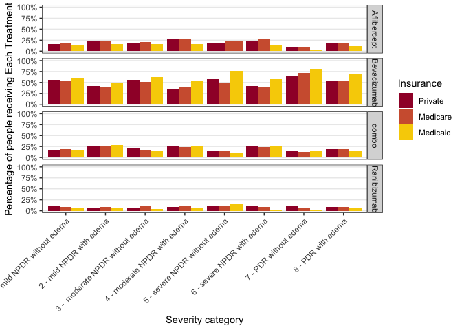
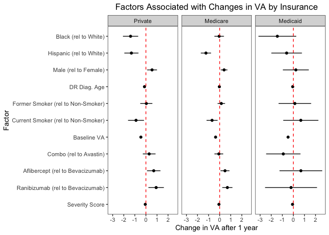
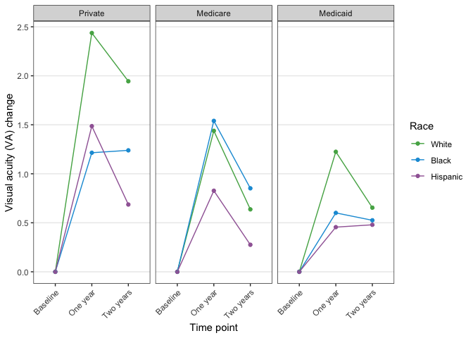
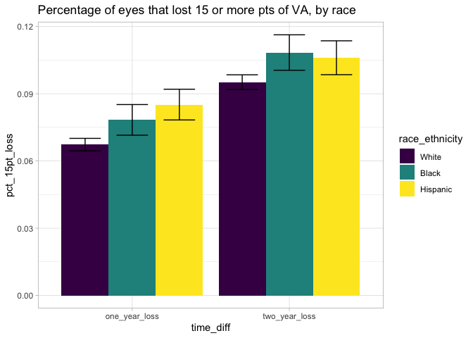
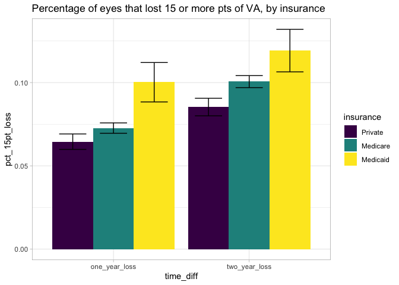
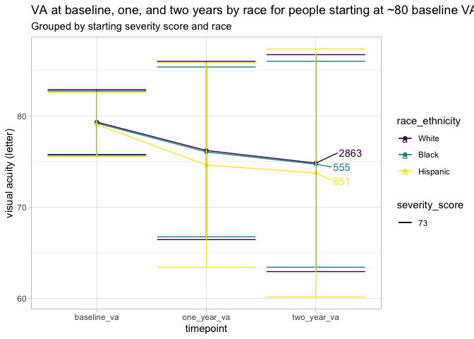
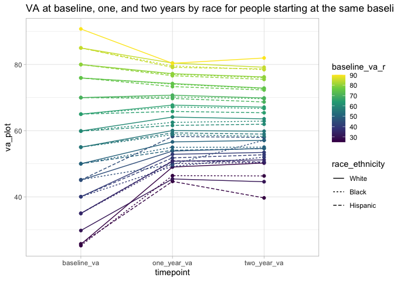
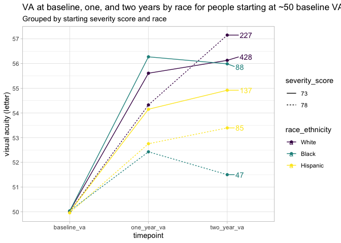
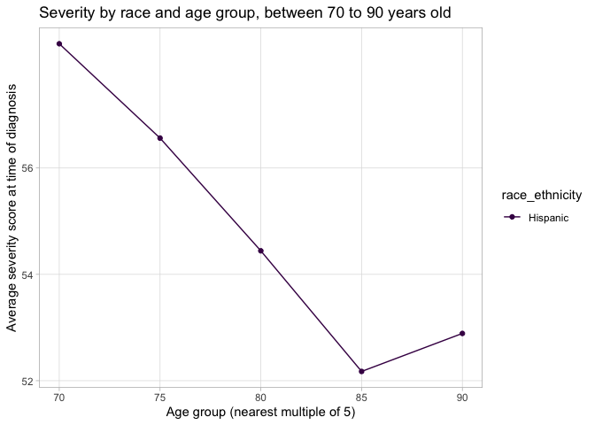
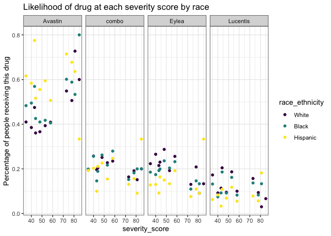

DR_Analysis_Main
================
Vikas Maturi
2021-07-07

-   [Setup & import](#setup--import)
    -   [Libraries and parameters](#libraries-and-parameters)
    -   [Data import](#data-import)
-   [Clean main data](#clean-main-data)
    -   [Merge Data](#merge-data)
-   [Clean VA data](#clean-va-data)
    -   [Get VA data by time of visit for each
        patient/eye](#get-va-data-by-time-of-visit-for-each-patienteye)
    -   [Bring the data back together](#bring-the-data-back-together)
-   [Clean injection data](#clean-injection-data)
-   [Cleaned datasets for analysis](#cleaned-datasets-for-analysis)
-   [Sample statistics and tables](#sample-statistics-and-tables)
    -   [Gender by race and insurance](#gender-by-race-and-insurance)
    -   [Age by race and insurance](#age-by-race-and-insurance)
    -   [Baseline VA by race and
        insurance](#baseline-va-by-race-and-insurance)
    -   [Smoke status by race and
        insurance](#smoke-status-by-race-and-insurance)
    -   [VEGF drug by race and
        insurance](#vegf-drug-by-race-and-insurance)
    -   [Insurance by race](#insurance-by-race)
-   [Timeseries analysis of visual
    acuity](#timeseries-analysis-of-visual-acuity)
    -   [Distribution of VA by race](#distribution-of-va-by-race)
    -   [Timeseries VA by race and
        severity](#timeseries-va-by-race-and-severity)
    -   [Timeseries VA by insurance](#timeseries-va-by-insurance)
    -   [Percentage with 15 letter loss by
        race](#percentage-with-15-letter-loss-by-race)
    -   [Percentage with 15 letter loss by
        insurance](#percentage-with-15-letter-loss-by-insurance)
    -   [Timeseries VA by insurance and
        race](#timeseries-va-by-insurance-and-race)
    -   [Timeseries VA by smoking and
        race](#timeseries-va-by-smoking-and-race)
    -   [Timeseries VA by gender and
        race](#timeseries-va-by-gender-and-race)
    -   [Race VA timeseries](#race-va-timeseries)
    -   [Race VA timeseries bucketed by
        10](#race-va-timeseries-bucketed-by-10)
    -   [Severity race VA timeseries](#severity-race-va-timeseries)
    -   [Severity insurance race VA
        timeseries](#severity-insurance-race-va-timeseries)
-   [Injections by VA analysis](#injections-by-va-analysis)
-   [Baseline analysis](#baseline-analysis)
    -   [Severity by race](#severity-by-race)
    -   [Severity by race and region](#severity-by-race-and-region)
    -   [Severity by race and age](#severity-by-race-and-age)
    -   [Severity by region](#severity-by-region)
    -   [Severity by race and
        insurance](#severity-by-race-and-insurance)
    -   [Severity by race and sex](#severity-by-race-and-sex)
    -   [Severity by type of treatment](#severity-by-type-of-treatment)
    -   [Likelihood of drug received by severity score and race (given
        that patient recieved anti-vegf
        treatment)](#likelihood-of-drug-received-by-severity-score-and-race-given-that-patient-recieved-anti-vegf-treatment)
    -   [Likelihood of drug received by severity score CATEGORY and race
        (given that patient recieved anti-vegf
        treatment)](#likelihood-of-drug-received-by-severity-score-category-and-race-given-that-patient-recieved-anti-vegf-treatment)
    -   [Likelihood of drug received by baseline VA and race (given that
        patient recieved anti-vegf
        treatment)](#likelihood-of-drug-received-by-baseline-va-and-race-given-that-patient-recieved-anti-vegf-treatment)
    -   [Likelihood of drug received by severity score CATEGORY and
        insurance (given that patient recieved anti-vegf
        treatment)](#likelihood-of-drug-received-by-severity-score-category-and-insurance-given-that-patient-recieved-anti-vegf-treatment)
    -   [Drug received by race and
        insurance](#drug-received-by-race-and-insurance)
    -   [Severity vs. vision](#severity-vs-vision)
-   [Regression](#regression)
    -   [Linear regression](#linear-regression)
    -   [Quantile regressionn](#quantile-regressionn)

## Setup & import

#### Libraries and parameters

``` r
# load libraries
library(tidyverse)
library(readxl)
library(lubridate)
library(knitr)
library(googlesheets4)

# Data files

# maturi universe file
universe_file <- "~/Documents/R_Projects/DR Analysis/dr_data/maturi_universe_ultimate.xlsx"

# severity scale file
severity_file <- "~/Documents/R_Projects/DR Analysis/dr_data/DR_severity_scale.xlsx"

# va file
va_file <- "~/Documents/R_Projects/DR Analysis/dr_data/maturi_va_combine_20210508.csv"

# va scale file
va_scale_file <- "~/Documents/R_Projects/DR Analysis/dr_data/visual_acuity_conversion.xlsx"

# injection file
injection_file <- "~/Documents/R_Projects/DR Analysis/dr_data/maturi_antivegf_table_20210508.csv"

# clean injection file 
injection_clean_file <- "~/Documents/R_Projects/DR Analysis/dr_data/injection_clean_file.csv"

# va_progression_file
va_progression_file <- "~/Documents/R_Projects/DR Analysis/dr_data/va_progression.csv"


# Data output files

# path for cleaned, joined data file (all data)
all_cleaned_path <- "~/Documents/R_Projects/DR Analysis/dr_data/maturi_all_cleaned.csv"

# path for cleaned, joined data file (top conditions)
top_conditions_cleaned_path <- "~/Documents/R_Projects/DR Analysis/dr_data/maturi_top_cleaned.csv"

# bottom conditions - to be coded
bottom_codes_path <- "~/Documents/R_Projects/DR Analysis/dr_data/bottom_codes.csv"

# va_basedate_by_pt 
va_basedate_path <- "~/Documents/R_Projects/DR Analysis/dr_data/va_basedate.csv"

# universe of data with timeseries added
clean_universe_path <- "~/Documents/R_Projects/DR Analysis/dr_data/clean_universe.csv" 

# va_progression
va_progression_path <- "~/Documents/R_Projects/DR Analysis/dr_data/va_progression.csv" 

# clean injection data path 
injection_clean_path <- "~/Documents/R_Projects/DR Analysis/dr_data/injection_clean_file.csv"
```

#### Data import

``` r
# read in data

raw_universe <- read_excel(path = universe_file, sheet = 1, col_names = TRUE, .name_repair = "universal")

# raw_severity <- read_excel(path = severity_file, sheet = 2, col_names = TRUE, .name_repair = "universal")

raw_severity <- read_sheet("https://docs.google.com/spreadsheets/d/10L6bIxXOIw8xDi2fESXdJxE6EncNsCjm6XfVd4DtuJE/edit#gid=1224292389")

raw_va <- read_csv(file = va_file)

raw_va_scale <- read_excel(path = va_scale_file)

raw_injection <- read_csv(injection_file)
```

## Clean main data

``` r
# Clean the raw data and save into new datasets
universe <-
  raw_universe %>% 
  rename(
    pt_code_name = Pt.code.name,
    eye = Eye.OD.1..OS.2,
    diagnosis_date = DR.diag.date
  ) %>% 
  mutate(
    diagnosis_date = ymd(diagnosis_date),
    index_date = ymd(index_date),
    baseline_va_letter = (1.7 - baseline_va) * 50
  ) %>% 
  select(-FIND, -REPLACE, -...26, -...27, -...30, -...31)
  
severity <-
  raw_severity %>% 
  select(
    diabetes_diag,
    description,
    icd_10_equiv,
    severity_score,
    new_class,
    valid_class,
    vision_category,
    vision_threatening,
    include_given_code
  ) %>% 
  mutate(
    diabetes_diag = as.character(diabetes_diag),
    severity_score = if_else(severity_score == "NA", as.integer(NA), as.integer(severity_score)),
    vision_threatening = if_else(vision_threatening == "NA", as.integer(NA), as.integer(vision_threatening)),
  )
```

    ## Warning in replace_with(out, !condition, false, fmt_args(~false),
    ## glue("length of {fmt_args(~condition)}")): NAs introduced by coercion

    ## Warning in replace_with(out, !condition, false, fmt_args(~false),
    ## glue("length of {fmt_args(~condition)}")): NAs introduced by coercion

    ## Warning in replace_with(out, !condition, false, fmt_args(~false),
    ## glue("length of {fmt_args(~condition)}")): NAs introduced by coercion

    ## Warning in replace_with(out, !condition, false, fmt_args(~false),
    ## glue("length of {fmt_args(~condition)}")): NAs introduced by coercion

    ## Warning in replace_with(out, !condition, false, fmt_args(~false),
    ## glue("length of {fmt_args(~condition)}")): NAs introduced by coercion

    ## Warning in replace_with(out, !condition, false, fmt_args(~false),
    ## glue("length of {fmt_args(~condition)}")): NAs introduced by coercion

    ## Warning in replace_with(out, !condition, false, fmt_args(~false),
    ## glue("length of {fmt_args(~condition)}")): NAs introduced by coercion

    ## Warning in replace_with(out, !condition, false, fmt_args(~false),
    ## glue("length of {fmt_args(~condition)}")): NAs introduced by coercion

    ## Warning in replace_with(out, !condition, false, fmt_args(~false),
    ## glue("length of {fmt_args(~condition)}")): NAs introduced by coercion

    ## Warning in replace_with(out, !condition, false, fmt_args(~false),
    ## glue("length of {fmt_args(~condition)}")): NAs introduced by coercion

    ## Warning in replace_with(out, !condition, false, fmt_args(~false),
    ## glue("length of {fmt_args(~condition)}")): NAs introduced by coercion

    ## Warning in replace_with(out, !condition, false, fmt_args(~false),
    ## glue("length of {fmt_args(~condition)}")): NAs introduced by coercion

    ## Warning in replace_with(out, !condition, false, fmt_args(~false),
    ## glue("length of {fmt_args(~condition)}")): NAs introduced by coercion

    ## Warning in replace_with(out, !condition, false, fmt_args(~false),
    ## glue("length of {fmt_args(~condition)}")): NAs introduced by coercion

    ## Warning in replace_with(out, !condition, false, fmt_args(~false),
    ## glue("length of {fmt_args(~condition)}")): NAs introduced by coercion

#### Merge Data

``` r
# merge patient data with severity data
all <-
  universe %>% 
  left_join(severity, by = c("first_problem_code" = "diabetes_diag")) %>% 
  mutate(age_group = plyr::round_any(first_dr_age, 5))

# filter out data with less common conditions (~20k entries) if keeping all code types
# if fillter(code_type == New) is included, filter out data with less common conditions and classified under old system (~120k entries removed)
```

## Clean VA data

#### Get VA data by time of visit for each patient/eye

``` r
va_basedate <-
  raw_va %>% 
  # add in the baseline date to the va data, by patient id and eye
  left_join(all %>% select(pt_code_name, eye, index_date), by = c("patient_guid" = "pt_code_name", "va_eye" = "eye")) %>% 
  # we find that half of the va data is not linked to the baseline patient/eye data that we have
  # filter entries where there is not linked baseline date
  filter(!is.na(index_date)) %>% 
  mutate(
    # change va to letter score
    va_letter = (1.7-va)*50,
    # determine if the va measurement is within 1 month +/- 3 weeks of the baseline date
    one_month = if_else(va_result_date > (index_date %m+% months(1) %m-% weeks(3)) & va_result_date < (index_date %m+% months(1) %m+% weeks(3)), 1, 0),
    # if the measurement is within 1 month +/- 3 weeks of the baseline date, then calculate the distance between the measurement date and 1 month past the index date
    one_mo_diff = if_else(one_month == 1, abs(index_date %m+% months(1) - va_result_date), make_difftime(NA)),
    six_month = if_else(va_result_date > (index_date %m+% months(6) %m-% weeks(8)) & va_result_date < (index_date %m+% months(6) %m+% weeks(8)), 1, 0),
    six_mo_diff = if_else(six_month == 1, abs(index_date %m+% months(6) - va_result_date), make_difftime(NA)),
    one_year = if_else(va_result_date > (index_date %m+% years(1) %m-% months(2)) & va_result_date < (index_date %m+% years(1) %m+% months(2)), 1, 0),
    one_yr_diff = if_else(one_year == 1, abs(index_date %m+% months(12) - va_result_date), make_difftime(NA)),
    two_year = if_else(va_result_date > (index_date %m+% years(2) %m-% months(4)) & va_result_date < (index_date %m+% years(2) %m+% months(4)), 1, 0),
    two_yr_diff = if_else(two_year == 1, abs(index_date %m+% months(24) - va_result_date), make_difftime(NA)),
  )

#write_csv(va_basedate, path = va_basedate_path)

index_date_results <-
  va_basedate %>% 
  summarize(
    sum_one_mo = sum(one_month),
    sum_six_mo = sum(six_month),
    sum_one_yr = sum(one_year),
    sum_two_yr = sum(two_year)
  )
```

It appears that using diagnosis date and index date result in a similar
amount of visits being identified, except for two-year later - \~100K
more visits are identified with diagnosis data.

``` r
# create a cleaned dataset with each entry categorized as a one month, six month, one year, or two-year measurement, and the difference in days between the injection date and the "ideal' date (e.g., exactly one month after the index date for a one-month injection)

va_clean <-
  va_basedate %>% 
  mutate(
    # create consolidated column
    timeframe = case_when(
      one_month == 1 ~ "one_month",
      six_month == 1 ~ "six_month",
      one_year == 1 ~ "one_year",
      two_year == 1 ~ "two_year",
      TRUE ~ NA_character_
    )
  ) %>% 
  filter(!is.na(timeframe)) %>%
  rowwise() %>% 
  mutate(diff = sum(one_mo_diff, six_mo_diff, one_yr_diff, two_yr_diff, na.rm = TRUE)) %>% 
  ungroup()
```

``` r
# if there is more than one measurement within the timeframe, select the measurement closest to the ideal date (e.g., exactly one month, six months, etc. from the index date). If more than onne measurement at the same distance, select randomly.

va_to_join <-
  va_clean %>% 
  dplyr::select(-one_month, -one_mo_diff, -six_month, -six_mo_diff, -one_year, -one_yr_diff, -two_year, -two_yr_diff) %>% 
  group_by(patient_guid, va_eye, timeframe) %>% 
  top_n(n = -1, wt = diff) %>% 
  # for ties, select one of the rows at random
  sample_n(1) %>% 
  ungroup()

# completed va data
va_progression <- 
  va_to_join %>% 
  select(patient_guid, va_eye, index_date, va_letter, timeframe) %>% 
  spread(timeframe, va_letter) %>% 
  select(patient_guid, va_eye, index_date, one_month, six_month, one_year, two_year) 
```

``` r
# read in VA progression file from desktop
va_progression <- read_csv(va_progression_file)
```

    ## Parsed with column specification:
    ## cols(
    ##   patient_guid = col_character(),
    ##   va_eye = col_double(),
    ##   index_date = col_date(format = ""),
    ##   one_month = col_double(),
    ##   six_month = col_double(),
    ##   one_year = col_double(),
    ##   two_year = col_double()
    ## )

``` r
va_prog_test <-
  va_progression %>%
  mutate(
    all_four = if_else((!is.na(six_month) & !is.na(one_year) & !is.na(two_year)), 1, 0),
    six_and_oneyear = if_else((!is.na(six_month) & !is.na(one_year)), 1, 0),
    one_two_year = if_else((!is.na(one_year) & !is.na(two_year)), 1, 0)
  )

va_prog_test %>% 
  count(all_four) %>% 
  mutate(prop = n / sum(n))
```

    ## # A tibble: 2 × 3
    ##   all_four      n  prop
    ##      <dbl>  <int> <dbl>
    ## 1        0 126082 0.565
    ## 2        1  96967 0.435

``` r
va_prog_test %>% 
  count(six_and_oneyear) %>% 
  mutate(prop = n / sum(n))
```

    ## # A tibble: 2 × 3
    ##   six_and_oneyear      n  prop
    ##             <dbl>  <int> <dbl>
    ## 1               0  80375 0.360
    ## 2               1 142674 0.640

``` r
va_prog_test %>% 
  count(one_two_year) %>% 
  mutate(prop = n / sum(n))
```

    ## # A tibble: 2 × 3
    ##   one_two_year      n  prop
    ##          <dbl>  <int> <dbl>
    ## 1            0 112360 0.504
    ## 2            1 110689 0.496

#### Bring the data back together

``` r
all_va_prog <- 
  all %>% 
  select(pt_code_name, eye, first_problem_code, severity_score, gender, race_ethnicity, first_dr_age, age_group, insurance, region, smoke_status, new_class, valid_class, include_given_code, vision_category, vision_threatening, pt_code_name, eye, index_date, baseline_va_letter, proc_group_28, proc_group_365, proc_group_any, vegf_group_28, vegf_group_365, vegf_group_any, retina_speciality, baseline_iop, pdr_group, cat_eyes) %>% 
  left_join(va_progression, by = c("pt_code_name" = "patient_guid", "eye" = "va_eye", "index_date"))
```

## Clean injection data

``` r
# for testing - do not evaluation

raw_injection %>% 
  filter(patient_guid == "000bb3881e3a40e28324582e5c8bfe1d") %>% 
  arrange(desc(injection_date))

all %>%
  filter(pt_code_name == "0019c0027b5e409b94c5870ae902737c") %>% 
  arrange(desc(index_date))
```

``` r
# identify injections for patient/eye pairs in the study
in_study <-
  all %>% 
  mutate(
    eye1 = if_else(eye == 1, 1, 0),
    eye2 = if_else(eye == 2, 1, 0)
  )  %>%
  group_by(pt_code_name) %>% 
  summarize(eye1 = sum(eye1), eye2 = sum(eye2))

# for each patient/eye/injection date group, identify whether there is at least one injection entry marked in eye 1, eye 2, or eye 4 (not defined)
eye_match <-
  raw_injection %>% 
  # some people have multiple injections for the same eye on the same date listed - remove those injections
  select(patient_guid, eye, injection_date) %>%
  group_by(patient_guid, eye, injection_date) %>% 
  sample_n(1) %>% 
  group_by(patient_guid, injection_date) %>% 
  add_count(eye) %>% 
  ungroup() %>% 
  arrange(desc(n)) %>% 
  # for each patient/injection date, determine whether they are listed as receiving an injection in eye 1, 2, and/or 4
  spread(eye, n) %>% 
  rename(
    "one" = `1`, 
    "two" = `2`,
    "four" = `4`
  )


# flag each patient/eye/injection date grouping based on the 1/2/4 eye specification AND which patient/eyes pairs are in the dataset, if any
# injection data actions: https://docs.google.com/spreadsheets/d/1Sg7CWuF5Bp-p76gc5IliIxdquiZlx3KAkVvKiHGjWvE/edit#gid=0
injection_clean <-
  eye_match %>% 
  left_join(in_study, by = c("patient_guid" = "pt_code_name")) %>% 
  # join in index date, to calculate injections within the first year. 
  left_join(all %>% dplyr::select(pt_code_name, index_date), by = c("patient_guid" = "pt_code_name")) %>% 
  # calculate days past index date of injection
  mutate(
    days_past_first_injection = injection_date - index_date
  ) %>% 
  # only keep injection data in first year
  filter(days_past_first_injection > -1L, days_past_first_injection < 367) %>% 
  mutate(
    new_eye = case_when(
      (one == 1 & is.na(two) & is.na(four)) ~ 1, # keep entry
      (is.na(one) & two == 1 & is.na(four)) ~ 2,  # keep entry
      (is.na(one) & is.na(two) & four > 0 & eye1 == 1 & eye2 == 0) ~ 1, # reassign entry to eye 1
      (is.na(one) & is.na(two) & four > 0 & eye1 == 0 & eye2 == 1) ~ 2, # reassign entry to eye 2
      (is.na(one) & is.na(two) & four > 0 & eye1 == 1 & eye2 == 1) ~ 5, # remove pt. eye 1 and 2 from dataset
      (one == 1 & two == 1 & is.na(four)) ~ 3, # 3 means entries should be made for both eyes 
      (one == 1 & is.na(two) & four > 0 & eye1 == 1 & eye2 == 0) ~ 4, # keep entry (four will go away)
      (one == 1 & is.na(two) & four > 0 & eye1 == 0 & eye2 == 1) ~ 6, # keep entry (four will go away), remove pt. eye 2 data 
      (one == 1 & is.na(two) & four > 0 & eye1 == 1 & eye2 == 1) ~ 6, # keep entry (four will go away), remove pt. eye 2 data 
      (is.na(one) & two == 1 & four > 0 & eye1 == 0 & eye2 == 1) ~ 8, # keep entry (four will go away), remove pt. eye 1 data 
      (is.na(one) & two == 1 & four > 0 & eye1 == 1 & eye2 == 0) ~ 4, # keep entry (four will go away)
      (is.na(one) & two == 1 & four > 0 & eye1 == 1 & eye2 == 1) ~ 8, # keep entry (four will go away), remove pt. eye 1 data
      (one == 1 & two == 1 & four > 0 & eye1 == 1 & eye2 == 0) ~ 9, # keep entry (two and four will go away)
      (one == 1 & two == 1 & four > 0 & eye1 == 0 & eye2 == 1) ~ 9, # keep entry (one and four will go away)
      (one == 1 & two == 1 & four > 0 & eye1 == 1 & eye2 == 1) ~ 9, # keep entry (four will go away)
      TRUE ~ NA_real_
    )
  )

#write_csv(injection_clean, path = injection_clean_path)
```

``` r
# read in the clean injection file, developed in the above code
injection_clean <- read_csv(injection_clean_file)

# identify pateints to remove based on classification above
pts_to_remove <-
  injection_clean %>% 
  group_by(patient_guid) %>% 
  # see the classification table on the explanation for why these codes merit different forms of removal
  mutate(
    # remove all patient data for the first eye
    remove1 = ifelse(any(new_eye == 8), 1, 0),
    # remove all patient data for the second eye
    remove2 = ifelse(any(new_eye == 6), 1, 0),
    # remove all patient data
    removeboth = ifelse(any(new_eye == 5), 1, 0),
  ) %>% 
  select(patient_guid, remove1, remove2, removeboth) %>% 
  sample_n(1)


pts_to_remove %>% 
  ungroup() %>% 
  count(remove1, remove2, removeboth)

# construct preliminary injection dataset
injections <-
  # again, remove duplicate entries to have just one patient/injection date/eye group
  raw_injection %>%
  select(patient_guid, eye, injection_date) %>% 
  group_by(patient_guid, eye, injection_date) %>% 
  sample_n(1) %>% 
  ungroup() %>% 
  # join in the "cleaned" dataset that provides updated codes for patients
  left_join(
    injection_clean %>% 
      select(patient_guid, injection_date, new_eye) %>% 
      group_by(patient_guid, injection_date, new_eye) %>% 
      sample_n(1), 
    by = c("patient_guid", "injection_date")) %>% 
  # based on codes above, manipulate the data
  mutate(
    eye = ifelse(new_eye == 1 & eye == 4, 1, eye),
    eye = ifelse(new_eye == 2 & eye == 4, 2, eye),
  ) %>% 
  # remove patients identified as "to be removed" based on the classification
  left_join(pts_to_remove, by = "patient_guid") %>% 
  filter(
    !(eye == 1 & remove1 == 1),
    !(eye == 2 & remove2 == 1), 
    !(removeboth == 1)
  )  %>% 
  left_join(all %>% dplyr::select(pt_code_name, index_date, eye), by = c("patient_guid" = "pt_code_name", "eye")) %>% 
  # calculate days past index date of injection
  mutate(
    days_past_first_injection = injection_date - index_date
  ) %>% 
  # only keep injection data in first year
  filter(days_past_first_injection > -1L, days_past_first_injection < 367)

test <-
  # again, remove duplicate entries to have just one patient/injection date/eye group
  raw_injection %>%
  select(patient_guid, eye, injection_date) %>% 
  group_by(patient_guid, eye, injection_date) %>% 
  sample_n(1) %>% 
  ungroup() %>% 
  # join in the "cleaned" dataset that provides updated codes for patients
  left_join(
    injection_clean %>% 
      select(patient_guid, injection_date, new_eye) %>% 
      group_by(patient_guid, injection_date, new_eye) %>% 
      sample_n(1), 
    by = c("patient_guid", "injection_date")) %>% 
  # based on codes above, manipulate the data
  mutate(
    eye = ifelse(new_eye == 1 & eye == 4, 1, eye),
    eye = ifelse(new_eye == 2 & eye == 4, 2, eye),
  ) %>% 
  # remove patients identified as "to be removed" based on the classification
  left_join(pts_to_remove, by = "patient_guid") %>% 
  filter(
    !(eye == 1 & remove1 == 1),
    !(eye == 2 & remove2 == 1), 
    !(removeboth == 1)
  )  %>% 
  left_join(all %>% dplyr::select(pt_code_name, index_date, eye), by = c("patient_guid" = "pt_code_name", "eye")) %>% 
  # calculate days past index date of injection
  mutate(
    days_past_first_injection = injection_date - index_date
  ) 
  
# identify patients to remove that have injections too close together (implying incorrect data)
injections_remove <-
  injections %>% 
  group_by(patient_guid, eye) %>% 
  arrange(injection_date) %>% 
  mutate(prior_date = lag(injection_date)) %>% 
  mutate(
    too_close = ifelse(!is.na(prior_date), ifelse(injection_date - prior_date < 22, 1, 0), 0)
  ) %>% 
  mutate(remove_close = ifelse(any(too_close == 1), 1, 0)) %>% 
  ungroup() %>% 
  select(patient_guid, eye, remove_close) %>% 
  group_by(patient_guid, eye, remove_close) %>% 
  sample_n(1) %>% 
  ungroup()

# remove patients with injections too close together (identified above)
injections2 <-
  injections %>% 
  left_join(injections_remove, by = c("patient_guid", "eye")) %>% 
  filter(remove_close == 0)

# identify patients where the first injection is more than 60 days after the index date. 
inj_rem_date <-
  injections2 %>% 
  group_by(patient_guid, eye) %>%
  arrange(injection_date) %>% 
  mutate(first_entry = ifelse(row_number() == 1, 1, 0)) %>%
  ungroup() %>% 
  mutate(
    inj_index_diff = injection_date - index_date,
    gap = ifelse(inj_index_diff > 180, 1, 0),
    gap_first = ifelse(gap == 1 & first_entry == 1, 1, 0)
  ) %>% 
  group_by(patient_guid, eye) %>%
  mutate(remove_gap = if_else(any(gap_first == 1), 1, 0)) %>% 
  ungroup() %>% 
  select(patient_guid, eye, remove_gap) %>% 
  group_by(patient_guid, eye, remove_gap) %>% 
  sample_n(1) %>% 
  ungroup()

# remove patients where the first injection is more than 60 days after the index date
# when this is the case, it suggests that the index date might be wrong 
injections3 <-
  injections2 %>% 
  left_join(inj_rem_date, by = c("patient_guid", "eye")) %>% 
  filter(remove_gap == 0)
```

``` r
# for each patient, number of injections in first year
inj_per_patient3 <-
  all %>% 
  left_join(injections3 %>% select(patient_guid, eye, injection_date), by = c("pt_code_name" = "patient_guid", "eye")) %>% 
  count(pt_code_name, eye) %>% 
  arrange(desc(n))

# count of patients that had each number of injections in one year
count_inj_per_year <-
  inj_per_patient3 %>% 
  count(n)

count_inj_per_year

# plotting histogram of above data
inj_per_patient3 %>% 
  ggplot(aes(x = n)) +
  geom_histogram(binwidth = 1) +
  theme_light() + 
  labs(
    title = "Total number of patients that received the number of injections in one year", 
    x = "Number of injections within one year of index date", 
    y = "Count"
  )
```

## Cleaned datasets for analysis

``` r
# Question - do we want to limit the baseline analysis to daata that we use in the timeseries analysis? 

set.seed(1)
# filter out the necesssary data to conduct time series analysis
timeseries_analysis <-
  all_va_prog %>% 
  filter(
    # only data classified under new ICD codes or codes starting of the format 36x.xxx
    include_given_code == 1,
    #race is White, Black, or Hispanic, to ensure adequate numbers
    race_ethnicity %in% c("Caucasian", "Black or African American", "Hispanic"),
    #race and gender data available for the patient
    !is.na(race_ethnicity), 
    !is.na(gender),
    !is.na(severity_score),
    # only patients with one year and two year data available
    !is.na(one_year), 
    #!is.na(six_month),
    !is.na(two_year),
    # only patients getting antivegf treatment
    proc_group_28 == "antivegf",
    # no cat eyes
    !cat_eyes == 1
  ) %>% 
  # select only one eye per patient
  group_by(pt_code_name) %>%
  sample_n(1) %>%
  ungroup() %>%
  # adjust insurance data to combine medicare FFS and medicare managed
  mutate(
    insurance = if_else(insurance %in% c("Medicare FFS", "Medicare Managed"), "Medicare", insurance)
  ) %>% 
  mutate(
    baseline_va_r10 = plyr::round_any(baseline_va_letter, 10),
    baseline_va_quart = ntile(baseline_va_letter, 4),
    one_year_va_delta = one_year - baseline_va_letter,
    two_year_va_delta = two_year - baseline_va_letter
  ) 
  # left_join(inj_per_patient3 %>% dplyr::rename(inj_year_1 = n), by = c("pt_code_name", "eye"))

# timeseries_plotting <-
#   timeseries_analysis %>% 
#   gather(key = "timepoint", value = "va_plot", one_year, two_year)

# clean_universe <-
#   write_csv(timeseries_analysis, path = clean_universe_path)
```

``` r
participants_by_code <-
  timeseries_analysis %>% 
  count(first_problem_code) %>% 
  arrange(desc(n))
```

``` r
# ensure that the same filters are applied to the top conditions dataset as in the timeseries analysis
# NOTE TO SELF - use the updated timeseries analysis here (save top_conditions as time_series analysis to avoid confusion, or go through and replace)
## AND MAKE SURE to set the seed here annd before!!


set.seed(1)
top_conditions <-
  all %>% 
  filter(
    # only data classified under new ICD codes or codes starting of the format 36x.xxx
    valid_class == 1,
    #race and gender data available for the patient
    !is.na(race_ethnicity), 
    !is.na(gender),
    !is.na(severity_score),
    # no cat eyes
    !cat_eyes == 1
  ) %>% 
  # select only one eye per patient
  group_by(pt_code_name) %>% 
  sample_n(1) %>% 
  ungroup() %>% 
  # adjust insurance data to combine medicare FFS and medicare managed
  mutate(
    insurance = if_else(insurance %in% c("Medicare FFS", "Medicare Managed"), "Medicare", insurance)
  ) %>% 
  mutate(
    baseline_va_r10 = plyr::round_any(baseline_va_letter, 10)
  ) 
```

## Sample statistics and tables

``` r
# Create dataset for basic paper tables
tbl_data <-
  timeseries_analysis %>% 
  mutate(
    insurance_tbl = if_else(
      insurance %in% c("Private", "Medicare", "Medicaid"),
      insurance, 
      "Other"
    ),
    age_tbl = case_when(
      first_dr_age < 53 ~ "< 53",
      first_dr_age >= 53 & first_dr_age <= 58 ~ "53 - 58",
      first_dr_age >= 59 & first_dr_age <= 64 ~ "59 - 64",
      first_dr_age >= 65 & first_dr_age <= 70 ~ "65 - 70",
      first_dr_age > 70 ~ "> 70"
    ),
    va_tbl = case_when(
      baseline_va_letter > 69.95 ~ "20/40 or better",
      baseline_va_letter >= 57.80 & baseline_va_letter <= 69.95 ~ "20/41 - 20/70",
      baseline_va_letter >= 35 & baseline_va_letter <= 57.80 ~ "20/71 - 20/200",
      baseline_va_letter < 35 ~ "20/201 or worse"
    ), 
    vegf_tbl = case_when(
      vegf_group_365 == "Avastin" ~ "bevacizumab" ,
      vegf_group_365 == "Lucentis" ~ "ranibizumab",
      vegf_group_365 == "Eylea" ~ "aflibercept",
      vegf_group_365 == "combo" ~ "combo"
    )
  )
```

#### Gender by race and insurance

``` r
tbl_gender_race <-
  tbl_data %>% 
  count(gender, race_ethnicity) %>% 
  group_by(race_ethnicity) %>% 
  mutate(pct_age_race = round(n / sum(n) * 100, 3)) %>% 
  unite(x, "n", "pct_age_race", sep = " (") %>% 
  spread(key = race_ethnicity, value = x )

kable(tbl_gender_race)
```

| gender  | Black or African American | Caucasian     | Hispanic     |
|:--------|:--------------------------|:--------------|:-------------|
| Female  | 3455 (58.342              | 13715 (44.258 | 2928 (46.016 |
| Male    | 2441 (41.219              | 17160 (55.374 | 3389 (53.261 |
| Unknown | 26 (0.439                 | 114 (0.368    | 46 (0.723    |

``` r
tbl_gender_insurance <-
  tbl_data %>% 
  count(gender, insurance_tbl) %>% 
  group_by(insurance_tbl) %>% 
  mutate(pct_gender_insurance = round(n / sum(n) * 100, 3)) %>%
  unite(x, "n", "pct_gender_insurance", sep = " (") %>% 
  spread(key = insurance_tbl, value = x )

kable(tbl_gender_insurance)
```

| gender  | Medicaid     | Medicare      | Other        | Private      |
|:--------|:-------------|:--------------|:-------------|:-------------|
| Female  | 1286 (51.96  | 12936 (48.524 | 1360 (40.404 | 4516 (41.916 |
| Male    | 1178 (47.596 | 13598 (51.007 | 1993 (59.21  | 6221 (57.741 |
| Unknown | 11 (0.444    | 125 (0.469    | 13 (0.386    | 37 (0.343    |

#### Age by race and insurance

``` r
tbl_age_race <-
  tbl_data %>% 
  count(age_tbl, race_ethnicity) %>% 
  group_by(race_ethnicity) %>% 
  mutate(pct_age_race = round(n / sum(n) * 100, 3)) %>% 
  unite(x, "n", "pct_age_race", sep = " (") %>% 
  spread(key = race_ethnicity, value = x )

kable(tbl_age_race)
```

| age_tbl | Black or African American | Caucasian    | Hispanic     |
|:--------|:--------------------------|:-------------|:-------------|
| \< 53   | 1258 (21.243              | 5856 (18.897 | 1705 (26.796 |
| \> 70   | 1148 (19.385              | 6508 (21.001 | 911 (14.317  |
| 53 - 58 | 996 (16.819               | 4986 (16.09  | 1191 (18.718 |
| 59 - 64 | 1260 (21.277              | 6591 (21.269 | 1381 (21.704 |
| 65 - 70 | 1260 (21.277              | 7048 (22.744 | 1175 (18.466 |

``` r
tbl_age_insurance <-
  tbl_data %>% 
  count(age_tbl, insurance_tbl) %>% 
  group_by(insurance_tbl) %>% 
  mutate(pct_age_insurance = round(n / sum(n) * 100, 3)) %>%
  unite(x, "n", "pct_age_insurance", sep = " (") %>% 
  spread(key = insurance_tbl, value = x )

kable(tbl_age_insurance)
```

| age_tbl | Medicaid     | Medicare     | Other        | Private      |
|:--------|:-------------|:-------------|:-------------|:-------------|
| \< 53   | 1195 (48.283 | 2534 (9.505  | 1041 (30.927 | 4049 (37.581 |
| \> 70   | 94 (3.798    | 7687 (28.835 | 294 (8.734   | 492 (4.567   |
| 53 - 58 | 654 (26.424  | 2433 (9.126  | 872 (25.906  | 3214 (29.831 |
| 59 - 64 | 444 (17.939  | 5835 (21.888 | 695 (20.648  | 2258 (20.958 |
| 65 - 70 | 88 (3.556    | 8170 (30.646 | 464 (13.785  | 761 (7.063   |

#### Baseline VA by race and insurance

``` r
tbl_va_race <-
  tbl_data %>% 
  count(va_tbl, race_ethnicity) %>% 
  group_by(race_ethnicity) %>% 
  mutate(pct_va_race = round(n / sum(n) * 100, 3)) %>% 
  unite(x, "n", "pct_va_race", sep = " (") %>% 
  spread(key = race_ethnicity, value = x )

kable(tbl_va_race)
```

| va_tbl          | Black or African American | Caucasian     | Hispanic     |
|:----------------|:--------------------------|:--------------|:-------------|
| 20/201 or worse | 53 (0.895                 | 221 (0.713    | 64 (1.006    |
| 20/40 or better | 3164 (53.428              | 17545 (56.617 | 3128 (49.159 |
| 20/41 - 20/70   | 1650 (27.862              | 8471 (27.336  | 1899 (29.844 |
| 20/71 - 20/200  | 1055 (17.815              | 4752 (15.334  | 1272 (19.991 |

``` r
tbl_va_insurance <-
  tbl_data %>% 
  count(va_tbl, insurance_tbl) %>% 
  group_by(insurance_tbl) %>% 
  mutate(pct_va_insurance = round(n / sum(n) * 100, 3)) %>%
  unite(x, "n", "pct_va_insurance", sep = " (") %>% 
  spread(key = insurance_tbl, value = x )

kable(tbl_va_insurance)
```

| va_tbl          | Medicaid     | Medicare      | Other        | Private      |
|:----------------|:-------------|:--------------|:-------------|:-------------|
| 20/201 or worse | 23 (0.929    | 229 (0.859    | 33 (0.98     | 53 (0.492    |
| 20/40 or better | 1335 (53.939 | 13799 (51.761 | 1952 (57.992 | 6751 (62.66  |
| 20/41 - 20/70   | 672 (27.152  | 7934 (29.761  | 865 (25.698  | 2549 (23.659 |
| 20/71 - 20/200  | 445 (17.98   | 4697 (17.619  | 516 (15.33   | 1421 (13.189 |

#### Smoke status by race and insurance

``` r
tbl_smoke_race <-
  tbl_data %>% 
  count(smoke_status, race_ethnicity) %>% 
  group_by(race_ethnicity) %>% 
  mutate(pct_smoke_race = round(n / sum(n) * 100, 3)) %>% 
  unite(x, "n", "pct_smoke_race", sep = " (") %>% 
  spread(key = race_ethnicity, value = x )


kable(tbl_smoke_race)
```

| smoke_status                                    | Black or African American | Caucasian     | Hispanic     |
|:------------------------------------------------|:--------------------------|:--------------|:-------------|
| Former / No longer active / Past History / Quit | 1434 (24.215              | 8753 (28.246  | 1386 (21.782 |
| No / Never                                      | 3846 (64.944              | 18345 (59.198 | 4341 (68.223 |
| Unknown / Unclassified                          | 60 (1.013                 | 352 (1.136    | 67 (1.053    |
| Yes / Active                                    | 582 (9.828                | 3539 (11.42   | 569 (8.942   |

``` r
tbl_smoke_insurance <-
  tbl_data %>% 
  count(smoke_status, insurance_tbl) %>% 
  group_by(insurance_tbl) %>% 
  mutate(pct_smoke_insurance = round(n / sum(n) * 100, 3)) %>%
  unite(x, "n", "pct_smoke_insurance", sep = " (") %>% 
  spread(key = insurance_tbl, value = x )

kable(tbl_smoke_insurance)
```

| smoke_status                                    | Medicaid     | Medicare      | Other        | Private      |
|:------------------------------------------------|:-------------|:--------------|:-------------|:-------------|
| Former / No longer active / Past History / Quit | 528 (21.333  | 7990 (29.971  | 791 (23.5    | 2264 (21.014 |
| No / Never                                      | 1482 (59.879 | 15656 (58.727 | 2172 (64.528 | 7222 (67.032 |
| Unknown / Unclassified                          | 20 (0.808    | 251 (0.942    | 63 (1.872    | 145 (1.346   |
| Yes / Active                                    | 445 (17.98   | 2762 (10.36   | 340 (10.101  | 1143 (10.609 |

#### VEGF drug by race and insurance

``` r
tbl_vegf_race <-
  tbl_data %>% 
  count(vegf_tbl, race_ethnicity) %>% 
  group_by(race_ethnicity) %>% 
  mutate(pct_vegf_race = round(n / sum(n) * 100, 3)) %>% 
  unite(x, "n", "pct_vegf_race", sep = " (") %>% 
  spread(key = race_ethnicity, value = x )

kable(tbl_vegf_race)
```

| vegf_tbl    | Black or African American | Caucasian     | Hispanic     |
|:------------|:--------------------------|:--------------|:-------------|
| aflibercept | 984 (16.616               | 6241 (20.139  | 673 (10.577  |
| bevacizumab | 3078 (51.976              | 14036 (45.293 | 4175 (65.614 |
| combo       | 1157 (19.537              | 6408 (20.678  | 1051 (16.517 |
| ranibizumab | 703 (11.871               | 4304 (13.889  | 464 (7.292   |

``` r
tbl_vegf_insurance <-
  tbl_data %>% 
  count(vegf_tbl, insurance_tbl) %>% 
  group_by(insurance_tbl) %>% 
  mutate(pct_vegf_insurance = round(n / sum(n) * 100, 3)) %>%
  unite(x, "n", "pct_vegf_insurance", sep = " (") %>% 
  spread(key = insurance_tbl, value = x )

kable(tbl_vegf_insurance)
```

| vegf_tbl    | Medicaid     | Medicare      | Other        | Private      |
|:------------|:-------------|:--------------|:-------------|:-------------|
| aflibercept | 268 (10.828  | 5152 (19.326  | 500 (14.854  | 1978 (18.359 |
| bevacizumab | 1578 (63.758 | 12610 (47.301 | 1935 (57.487 | 5166 (47.949 |
| combo       | 462 (18.667  | 5281 (19.809  | 586 (17.409  | 2287 (21.227 |
| ranibizumab | 167 (6.747   | 3616 (13.564  | 345 (10.25   | 1343 (12.465 |

#### Insurance by race

``` r
tbl_insurance_race <-
  tbl_data %>% 
  count(insurance_tbl, race_ethnicity) %>% 
  group_by(race_ethnicity) %>% 
  mutate(pct_insurance_race = n / sum(n) * 100)

kable(tbl_insurance_race)
```

| insurance_tbl | race_ethnicity            |     n | pct_insurance_race |
|:--------------|:--------------------------|------:|-------------------:|
| Medicaid      | Black or African American |   371 |           6.264775 |
| Medicaid      | Caucasian                 |  1392 |           4.491917 |
| Medicaid      | Hispanic                  |   712 |          11.189690 |
| Medicare      | Black or African American |  3803 |          64.218170 |
| Medicare      | Caucasian                 | 19551 |          63.090129 |
| Medicare      | Hispanic                  |  3305 |          51.940908 |
| Other         | Black or African American |   482 |           8.139142 |
| Other         | Caucasian                 |  2091 |           6.747556 |
| Other         | Hispanic                  |   793 |          12.462675 |
| Private       | Black or African American |  1266 |          21.377913 |
| Private       | Caucasian                 |  7955 |          25.670399 |
| Private       | Hispanic                  |  1553 |          24.406726 |

## Timeseries analysis of visual acuity

#### Distribution of VA by race

``` r
# table of percentage distribution to baseline letter va by race
race_distribution <-
  timeseries_analysis %>% 
  group_by(race_ethnicity, baseline_va_r10) %>%   
  summarize(count = n()) %>% 
  ungroup() %>% 
  group_by(race_ethnicity) %>% 
  mutate(prop = count / sum(count)) %>% 
  ungroup()
```

    ## `summarise()` has grouped output by 'race_ethnicity'. You can override using the `.groups` argument.

``` r
race_distribution %>% 
  group_by(race_ethnicity) %>% 
  summarize(total_race = sum(count))
```

    ## # A tibble: 3 × 2
    ##   race_ethnicity            total_race
    ##   <chr>                          <int>
    ## 1 Black or African American       5922
    ## 2 Caucasian                      30989
    ## 3 Hispanic                        6363

``` r
timeseries_analysis %>% 
  ggplot(aes(x = baseline_va_letter)) +
  geom_histogram(binwidth = 10, aes(fill = race_ethnicity)) +
  theme_light() +
  scale_x_continuous(breaks = seq(0, 100, 10)) +
  labs(
    title = "Histogram of eye count by race"
  )
```

<!-- -->

``` r
race_distribution %>% 
  ggplot(aes(x = baseline_va_r10, y = prop, color = race_ethnicity)) + 
  geom_line() +
  geom_point() +
  theme_light() +
  scale_y_continuous() +
  labs(
    title = "Propotion of eyes in each group of baseline visual acuity, by race",
    y = "Proportion", 
    x = "Baseline VA, rounded to nearest multiple of 10"
  )
```

<!-- -->

#### Timeseries VA by race and severity

``` r
## calculate change in va over time for people in each severity group/race
severity_race_va <-
  timeseries_analysis %>% 
  group_by(race_ethnicity, severity_score) %>% 
  summarize(baseline_va = mean(baseline_va_letter), one_year_va = mean(one_year), two_year_va = mean(two_year), count = n()) %>% 
  gather(key = "timepoint", value = "va_plot", baseline_va, one_year_va, two_year_va)
```

    ## `summarise()` has grouped output by 'race_ethnicity'. You can override using the `.groups` argument.

``` r
timeseries_analysis %>% 
  count(severity_score, race_ethnicity) %>% 
  group_by(race_ethnicity) %>% 
  mutate(prop = n / sum(n))
```

    ## # A tibble: 33 × 4
    ## # Groups:   race_ethnicity [3]
    ##    severity_score race_ethnicity                n   prop
    ##             <int> <chr>                     <int>  <dbl>
    ##  1             35 Black or African American   596 0.101 
    ##  2             35 Caucasian                  3349 0.108 
    ##  3             35 Hispanic                    442 0.0695
    ##  4             40 Black or African American   323 0.0545
    ##  5             40 Caucasian                  1887 0.0609
    ##  6             40 Hispanic                    226 0.0355
    ##  7             43 Black or African American   148 0.0250
    ##  8             43 Caucasian                   840 0.0271
    ##  9             43 Hispanic                    141 0.0222
    ## 10             44 Black or African American   817 0.138 
    ## # … with 23 more rows

``` r
## density chart of distribution of severity scores, by race
timeseries_analysis %>% 
  ggplot() +
  geom_density(aes(x = severity_score, group = race_ethnicity, color = race_ethnicity), alpha = .2) +
  theme_light()
```

<!-- -->

This chart shows the density of patients by severity score. There are
two peaks - first at around severity scores between 40-48, and a second
at severity scores betewen 73-78. These numbers are generally aligned to
categorizations of moderate NPDR (with and without edema), and PDR (with
and without edema).

``` r
# plot change in visual acuity by race at one and two yeaars

va_race <-
  timeseries_analysis %>% 
  group_by(race_ethnicity) %>% 
  summarize(
    baseline_va = mean(baseline_va_letter), 
    one_year_va = mean(one_year), 
    two_year_va = mean(two_year),
    baseline_sd = sd(baseline_va_letter),
    one_year_sd = sd(one_year),
    two_year_sd = sd(two_year),
    count = n()) %>% 
  gather(key = "timepoint", value = "va_plot", baseline_va, one_year_va, two_year_va) %>% 
  ungroup()
  
va_race %>% 
  ggplot(aes(x = timepoint, y = va_plot, color = race_ethnicity)) +
  geom_point() +
  geom_line(aes(group = race_ethnicity)) +
  ggrepel::geom_text_repel(
    data = va_race %>% filter(timepoint == "two_year_va"),
    aes(label = count)
  ) +
  theme_light() + 
  labs(
    title = "VA at baseline, one, and two years by race",
    y = "Visual acuity"
  )
```

<!-- -->

``` r
va_race_diff <-
  va_race %>% 
  spread(key = timepoint, value = va_plot) %>% 
  mutate(
    one_year_change = one_year_va - baseline_va,
    two_year_change = two_year_va - baseline_va,
    baseline = 0
  ) %>% 
  gather(key = "time_diff", value = "va_change", baseline, one_year_change, two_year_change) %>% 
  ungroup()

va_race_diff %>% 
  ggplot(aes(x = time_diff, y = va_change, color = race_ethnicity)) +
  geom_point() +
  geom_line(aes(group = race_ethnicity)) +
  ggrepel::geom_text_repel(
    data = va_race_diff %>% filter(time_diff == "two_year_change"),
    aes(label = count)
  ) +
  theme_light() + 
  labs(
    title = "VA change from baseline, one, and two years by race",
    y = "Visual acuity (VA) change"
  )
```

<!-- -->

``` r
# plot change in visual acuity by race at one and two yeaars
severity_race_va %>% 
  filter(severity_score == 73) %>% 
  ggplot(aes(x = timepoint, y = va_plot, color = race_ethnicity)) +
  geom_point() +
  geom_line(aes(group = race_ethnicity)) +
  ggrepel::geom_text_repel(
    data = severity_race_va %>% filter(timepoint == "two_year_va", severity_score %in% c(73)),
    aes(label = count)
  ) +
  theme_light() + 
  labs(
    title = "VA at baseline, one, and two years by race at severity score 73",
    y = "Visual acuity"
  )
```

<!-- -->

Patients with starting severity score of 73, split by race, with visual
acuity measured over time. It appears that visual acuity changes seem to
follow similar trends (i.e., net change is quite similar), but White
people start with a visual acuity 1 letter higher than Black people and
two letters higher than Hispanic people.

``` r
severity_race_va %>% 
  filter(severity_score < 80) %>% 
  ggplot(aes(x = timepoint, y = va_plot, color = severity_score, linetype = race_ethnicity)) +
  geom_point() +
  geom_line(aes(group = interaction(severity_score, race_ethnicity))) +
  theme_light() + 
  ggrepel::geom_text_repel(
    data = severity_race_va %>% filter(timepoint == "two_year_va", severity_score < 80),
    aes(label = count)
  ) +
  scale_color_viridis_c() +
  labs(
    title = "VA at baseline, one, and two years by race and severity score"
  ) 
```

<!-- -->

``` r
# average two year visual acuity by starting severity and race

severity_race_va %>% 
  filter(timepoint == "two_year_va") %>% 
  # filtering out severity scores larger than 79, as there are less than 50 people in each category
  filter(severity_score < 80) %>% 
  ggplot(aes(x = severity_score, y = va_plot, color = race_ethnicity)) +
  geom_point() +
  geom_line(aes(group = race_ethnicity)) +
  ggrepel::geom_text_repel(
    data = severity_race_va %>% filter(timepoint == "two_year_va", severity_score %in% c(35, 78)),
    aes(label = count)
  ) +
  theme_light() + 
  labs(
    title = "VA at two years by race and severity score", 
    x = "Severity score", 
    y = "Two-year visual acuity"
  )
```

<!-- -->

This chart confirms our expectation that visual acuity two years after
index date typically is lower for patients with a higher starting
severity score.

#### Timeseries VA by insurance

``` r
# plot change in visual acuity by race at one and two yeaars

va_insurance <-
  timeseries_analysis %>% 
  group_by(insurance) %>%
  filter(!insurance %in% c("Unknown/Missing", "Military", "Govt")) %>% 
  summarize(
    baseline_va = mean(baseline_va_letter), 
    one_year_va = mean(one_year), 
    two_year_va = mean(two_year),
    baseline_sd = sd(baseline_va_letter),
    one_year_sd = sd(one_year),
    two_year_sd = sd(two_year),
    count = n()) %>% 
  gather(key = "timepoint", value = "va_plot", baseline_va, one_year_va, two_year_va) %>% 
  ungroup()
  
va_insurance %>% 
  ggplot(aes(x = timepoint, y = va_plot, color = insurance)) +
  geom_point() +
  geom_line(aes(group = insurance)) +
  ggrepel::geom_text_repel(
    data = va_insurance %>% filter(timepoint == "two_year_va"),
    aes(label = count)
  ) +
  theme_light() + 
  labs(
    title = "VA at baseline, one, and two years by insurance",
    y = "Visual acuity"
  )
```

<!-- -->

``` r
va_insurance_diff <-
  va_insurance %>% 
  spread(key = timepoint, value = va_plot) %>% 
  mutate(
    one_year_change = one_year_va - baseline_va,
    two_year_change = two_year_va - baseline_va,
    baseline = 0
  ) %>% 
  gather(key = "time_diff", value = "va_change", baseline, one_year_change, two_year_change) %>% 
  ungroup()

va_insurance_diff %>% 
  ggplot(aes(x = time_diff, y = va_change, color = insurance)) +
  geom_point() +
  geom_line(aes(group = insurance)) +
  ggrepel::geom_text_repel(
    data = va_insurance_diff %>% filter(time_diff == "two_year_change"),
    aes(label = count)
  ) +
  theme_light() + 
  labs(
    title = "VA change from baseline, one, and two years by insurance",
    y = "Visual acuity (VA) change"
  )
```

<!-- -->

#### Percentage with 15 letter loss by race

``` r
change_15 <- 
  timeseries_analysis %>% 
  mutate(
    one_year_change = one_year - baseline_va_letter,
    two_year_change = two_year - baseline_va_letter,
    baseline_change = 0
  ) %>% 
  mutate(
    one_year_15_pt_loss = if_else(one_year_change <= -15, 1, 0),
    two_year_15_pt_loss = if_else(two_year_change <= -15, 1, 0),
    one_year_15_pt_gain = if_else(one_year_change >= 15, 1, 0),
    two_year_15_pt_gain = if_else(two_year_change >= 15, 1, 0),
  ) %>% 
  #gather(key = "time_diff", value = "va_change", baseline_change, one_year_change, two_year_change) %>% 
  ungroup()


# z value for p = .05 
z = 1.96


loss_15_race <-
  change_15 %>% 
  group_by(race_ethnicity) %>% 
  summarize(
    one_year_loss = sum(one_year_15_pt_loss) / n(),
    two_year_loss = sum(two_year_15_pt_loss) / n(),
    one_year_sd = sqrt(one_year_loss * (1 - one_year_loss) / n()),
    two_year_sd = sqrt(two_year_loss * (1 - two_year_loss) / n())
  ) %>% 
  gather(key = "time_diff", value = "pct_15pt_loss", one_year_loss, two_year_loss) %>% 
  mutate(
    sd = if_else(str_detect(string = time_diff, pattern = "one_year"), one_year_sd, two_year_sd),
    upper_bound = pct_15pt_loss + z * sd,
    lower_bound = pct_15pt_loss - z * sd
  )
  
loss_15_race %>% 
  ggplot(aes(x = time_diff, y = pct_15pt_loss, fill = race_ethnicity)) +
  geom_col(position = "dodge") +
  geom_errorbar(aes(ymin = lower_bound, ymax = upper_bound), position = position_dodge(width = .9), width = .6) +
  theme_light() +
  labs(
    title = "Percentage of eyes that lost 15 or more pts of VA, by race"
  )
```

<!-- -->

``` r
gain_15_race <-
  change_15 %>% 
  group_by(race_ethnicity) %>% 
  summarize(
    one_year_gain = sum(one_year_15_pt_gain) / n(),
    two_year_gain = sum(two_year_15_pt_gain) / n(),
    one_year_sd = sqrt(one_year_gain * (1 - one_year_gain) / n()),
    two_year_sd = sqrt(two_year_gain * (1 - two_year_gain) / n())
  ) %>% 
  gather(key = "time_diff", value = "pct_15pt_gain", one_year_gain, two_year_gain) %>% 
  mutate(
    sd = if_else(str_detect(string = time_diff, pattern = "one_year"), one_year_sd, two_year_sd),
    upper_bound = pct_15pt_gain + z * sd,
    lower_bound = pct_15pt_gain - z * sd
  )

gain_15_race %>% 
  ggplot(aes(x = time_diff, y = pct_15pt_gain, fill = race_ethnicity)) +
  geom_col(position = "dodge") +
  geom_errorbar(aes(ymin = lower_bound, ymax = upper_bound), position = position_dodge(width = .9), width = .6) +
  theme_light() +
  labs(
    title = "Percentage of eyes that gained 15 or more pts of VA, by race"
  )
```

<!-- -->

#### Percentage with 15 letter loss by insurance

``` r
# z value for p = .05 
z = 1.96


loss_15_insurance <-
  change_15 %>% 
  group_by(insurance) %>%
  filter(!insurance %in% c("Unknown/Missing", "Military", "Govt")) %>% 
  summarize(
    one_year_loss = sum(one_year_15_pt_loss) / n(),
    two_year_loss = sum(two_year_15_pt_loss) / n(),
    one_year_sd = sqrt(one_year_loss * (1 - one_year_loss) / n()),
    two_year_sd = sqrt(two_year_loss * (1 - two_year_loss) / n())
  ) %>% 
  gather(key = "time_diff", value = "pct_15pt_loss", one_year_loss, two_year_loss) %>% 
  mutate(
    sd = if_else(str_detect(string = time_diff, pattern = "one_year"), one_year_sd, two_year_sd),
    upper_bound = pct_15pt_loss + z * sd,
    lower_bound = pct_15pt_loss - z * sd
  )
  
loss_15_insurance %>% 
  ggplot(aes(x = time_diff, y = pct_15pt_loss, fill = insurance)) +
  geom_col(position = "dodge") +
  geom_errorbar(aes(ymin = lower_bound, ymax = upper_bound), position = position_dodge(width = .9), width = .6) +
  theme_light() +
  labs(
    title = "Percentage of eyes that lost 15 or more pts of VA, by insurance"
  )
```

<!-- -->

``` r
gain_15_insurance <-
  change_15 %>% 
  group_by(insurance) %>% 
  filter(!insurance %in% c("Unknown/Missing", "Military", "Govt")) %>% 
  summarize(
    one_year_gain = sum(one_year_15_pt_gain) / n(),
    two_year_gain = sum(two_year_15_pt_gain) / n(),
    one_year_sd = sqrt(one_year_gain * (1 - one_year_gain) / n()),
    two_year_sd = sqrt(two_year_gain * (1 - two_year_gain) / n())
  ) %>% 
  gather(key = "time_diff", value = "pct_15pt_gain", one_year_gain, two_year_gain) %>% 
  mutate(
    sd = if_else(str_detect(string = time_diff, pattern = "one_year"), one_year_sd, two_year_sd),
    upper_bound = pct_15pt_gain + z * sd,
    lower_bound = pct_15pt_gain - z * sd
  )

gain_15_insurance %>% 
  ggplot(aes(x = time_diff, y = pct_15pt_gain, fill = insurance)) +
  geom_col(position = "dodge") +
  geom_errorbar(aes(ymin = lower_bound, ymax = upper_bound), position = position_dodge(width = .9), width = .6) +
  theme_light() +
  labs(
    title = "Percentage of eyes that gained 15 or more pts of VA, by insurance"
  )
```

<!-- -->

#### Timeseries VA by insurance and race

``` r
insurance_race_va <-
  timeseries_analysis %>% 
  group_by(race_ethnicity, insurance) %>% 
  summarize(baseline_va = mean(baseline_va_letter), one_year_va = mean(one_year), two_year_va = mean(two_year), count = n()) %>% 
  gather(key = "timepoint", value = "va_plot", baseline_va, one_year_va, two_year_va)
```

    ## `summarise()` has grouped output by 'race_ethnicity'. You can override using the `.groups` argument.

``` r
## NOTE - be sure to combine the two medicare datasets rather than eliminating one

insurance_race_va %>% 
  filter(!insurance %in% c("Unknown/Missing", "Military", "Govt")) %>% 
  ggplot(aes(x = timepoint, y = va_plot, color = race_ethnicity, linetype = insurance)) +
  geom_point() +
  geom_line(aes(group = interaction(insurance, race_ethnicity))) +
  ggrepel::geom_text_repel(
    data = insurance_race_va %>% filter(timepoint == "two_year_va", insurance %in% c("Private", "Medicaid", "Medicare")), 
    aes(label = count, hjust = -1)
  ) +
  theme_light() + 
  labs(
    title = "VA at baseline, one, and two years by race and insurance"
  ) 
```

<!-- -->

There are disparities in baseline VA that persist over time for Black
and Hispanic patients as compared to White patients. The type of
insurance appears to have strong correlation to the baseline VA, but
does not fully explain the difference in race.

``` r
va_insurance_race_diff <-
  insurance_race_va %>% 
  filter(!insurance %in% c("Unknown/Missing", "Military", "Govt")) %>% 
  spread(key = timepoint, value = va_plot) %>% 
  mutate(
    one_year_change = one_year_va - baseline_va,
    two_year_change = two_year_va - baseline_va,
    baseline = 0
  ) %>% 
  gather(key = "time_diff", value = "va_change", baseline, one_year_change, two_year_change) %>% 
  ungroup()

va_insurance_race_diff %>% 
  ggplot(aes(x = time_diff, y = va_change, color = race_ethnicity, linetype = insurance)) +
  geom_point() +
  geom_line(aes(group = interaction(insurance, race_ethnicity))) +
  ggrepel::geom_text_repel(
    data = va_insurance_race_diff %>% filter(time_diff == "two_year_change", insurance %in% c("Private", "Medicaid", "Medicare")), 
    aes(label = count, hjust = -2)
  ) +
  facet_grid(insurance~.) +
  theme_light() + 
  labs(
    title = "VA change from baseline, one, and two years by insurance and race",
    y = "Visual acuity (VA) change"
  )
```

<!-- -->

#### Timeseries VA by smoking and race

``` r
smoking_race_va <-
  timeseries_analysis %>% 
  group_by(race_ethnicity, smoke_status) %>% 
  summarize(baseline_va = mean(baseline_va_letter), one_year_va = mean(one_year), two_year_va = mean(two_year), count = n()) %>% 
  gather(key = "timepoint", value = "va_plot", baseline_va, one_year_va, two_year_va)
```

    ## `summarise()` has grouped output by 'race_ethnicity'. You can override using the `.groups` argument.

``` r
## NOTE - be sure to combine the two medicare datasets rather than eliminating one

smoking_race_va %>% 
  #filter(!smoke_status %in% c("Unknown / Unclassified")) %>% 
  ggplot(aes(x = timepoint, y = va_plot, color = race_ethnicity, linetype = smoke_status)) +
  geom_point() +
  geom_line(aes(group = interaction(smoke_status, race_ethnicity))) +
  ggrepel::geom_text_repel(
    data = smoking_race_va %>% filter(timepoint == "two_year_va"), #!smoke_status %in% c("Unknown / Unclassified") 
    aes(label = count, hjust = -1)
  ) +
  theme_light() + 
  labs(
    title = "VA at baseline, one, and two years by race and smoking status"
  ) 
```

<!-- -->

#### Timeseries VA by gender and race

``` r
gender_race_va <-
  timeseries_analysis %>% 
  group_by(race_ethnicity, gender) %>% 
  summarize(baseline_va = mean(baseline_va_letter), one_year_va = mean(one_year), two_year_va = mean(two_year), count = n()) %>% 
  gather(key = "timepoint", value = "va_plot", baseline_va, one_year_va, two_year_va)
```

    ## `summarise()` has grouped output by 'race_ethnicity'. You can override using the `.groups` argument.

``` r
gender_race_va %>% 
  filter(gender %in% c("Male", "Female")) %>% 
  ggplot(aes(x = timepoint, y = va_plot, color = race_ethnicity, linetype = gender)) +
  geom_point() +
  geom_line(aes(group = interaction(gender, race_ethnicity))) +
  ggrepel::geom_text_repel(
    data = gender_race_va %>% filter(timepoint == "two_year_va", gender %in% c("Male", "Female")), 
    aes(label = count, hjust = -1)
  ) +
  theme_light() + 
  labs(
    title = "VA at baseline, one, and two years by race and gender"
  ) 
```

<!-- -->

Female patients appear to have lower baseline VA as compared to their
male counterparts of the same race. The raw gain or loss in VA over time
appears to be similar between genders within racial groups.

#### Race VA timeseries

``` r
race_va <-
  timeseries_analysis %>% 
  # round baseline data to nearest multiple of 5
  mutate(
    baseline_va_r = plyr::round_any(baseline_va_letter, 5)
  ) %>% 
  # group patients by race and same baseline va data
  group_by(baseline_va_r, race_ethnicity) %>% 
  summarize(baseline_va = mean(baseline_va_letter), one_year_va = mean(one_year), two_year_va = mean(two_year), count = n()) %>% 
  gather(key = "timepoint", value = "va_plot", baseline_va, one_year_va, two_year_va) %>% 
  ungroup()
```

    ## `summarise()` has grouped output by 'baseline_va_r'. You can override using the `.groups` argument.

``` r
race_va %>%
  filter(count > 25) %>% 
  ggplot(aes(x = timepoint, y = va_plot, color = baseline_va_r, linetype = race_ethnicity)) +
  geom_point() +
  geom_line(aes(group = interaction(baseline_va_r, race_ethnicity))) +
  theme_light() + 
  scale_color_viridis_c() +
  labs(
    title = "VA at baseline, one, and two years by race for people starting at the same baseline visual acuity"
  ) 
```

<!-- -->

This graph is hard to interpret, but is showing the differential
progression of va for people of different races that start at the same
level of baseline visual acuity. The next graphs dive into this daata
more closely.

This graph takes on an interesting shape. It indicates that people that
start with higher visual acuity are likely to experience a decline in
visual acuity, aand those starting at the lowest end of the spectrum of
visuala acuity are likely to make gains.

``` r
race_va %>%
  filter(count > 25) %>% 
  filter(baseline_va_r %in% c(65, 70, 75)) %>% 
  mutate(baseline_va_r = as.factor(baseline_va_r)) %>% 
  ggplot(aes(x = timepoint, y = va_plot, linetype = baseline_va_r, color = race_ethnicity)) +
  geom_point() +
  geom_line(aes(group = interaction(baseline_va_r, race_ethnicity))) +
  theme_light() + 
  ggrepel::geom_text_repel(
    data = race_va %>% filter(timepoint %in% c("two_year_va"), baseline_va_r %in% c(65, 70, 75)) %>% mutate(baseline_va_r = as.factor(baseline_va_r)), 
    aes(label = count, hjust = -1)
  ) +
  scale_y_continuous(breaks = seq(64, 78, 1)) +
  labs(
    title = "VA at baseline, one, and two years by race for people starting at ~65, ~70, ~75 baseline va",
    y = "visual acuity (letter)"
  ) 
```

<!-- -->

We observe that Hispanic patients experience starting with \~65 visual
acuity, they experiences much less gain in vision over two years as
compared to their White and Black counterprats. White people appear to
gain two letters, while Hispanic people gain less than hallf a letter.

Exemplifying the trends from above, we also se that those who start with
VA at \~75 all experience substantial decline, with those at other
starting points experiencing less severe declines or even making gains.

``` r
race_va %>%
  filter(count > 25) %>% 
  filter(baseline_va_r %in% c(50, 55, 60)) %>% 
  mutate(baseline_va_r = as.factor(baseline_va_r)) %>% 
  ggplot(aes(x = timepoint, y = va_plot, linetype = baseline_va_r, color = race_ethnicity)) +
  geom_point() +
  geom_line(aes(group = interaction(baseline_va_r, race_ethnicity))) +
  theme_light() + 
  ggrepel::geom_text_repel(
    data = race_va %>% filter(timepoint %in% c("two_year_va"), baseline_va_r %in% c(50, 55, 60)) %>% mutate(baseline_va_r = as.factor(baseline_va_r)), 
    aes(label = count, hjust = -1)
  ) +
  scale_y_continuous(breaks = seq(40, 65, 1)) +
  labs(
    title = "VA at baseline, one, and two years by race for people starting at ~50, ~55, ~60 baseline va",
    y = "visual acuity (letter)"
  ) 
```

<!-- -->

At this level, the dispairities in improvements are much more stark.
Whie people with baseline va of 50 are 3 additional points of VA gain as
compared to their Black and Hispanic counterparts. Similar, though not
as stark disparities are present for people with starting VA at 55 and
60.

Further analysis is required to control for the specific condition
associated that the patient is diagnosed with.

``` r
race_va %>%
  filter(count > 25) %>% 
  filter(baseline_va_r %in% c(35, 40, 45)) %>% 
  mutate(baseline_va_r = as.factor(baseline_va_r)) %>% 
  ggplot(aes(x = timepoint, y = va_plot, linetype = baseline_va_r, color = race_ethnicity)) +
  geom_point() +
  geom_line(aes(group = interaction(baseline_va_r, race_ethnicity))) +
  theme_light() + 
  ggrepel::geom_text_repel(
    data = race_va %>% filter(timepoint %in% c("two_year_va"), baseline_va_r %in% c(35, 40, 45)) %>% mutate(baseline_va_r = as.factor(baseline_va_r)), 
    aes(label = count, hjust = -1)
  ) +
  scale_y_continuous(breaks = seq(30, 60, 1)) +
  labs(
    title = "VA at baseline, one, and two years by race for people starting at ~35, ~40, ~45 baseline va",
    y = "visual acuity (letter)"
  ) 
```

<!-- -->

#### Race VA timeseries bucketed by 10

``` r
race_va_10 <-
  timeseries_analysis %>% 
  # group patients by race and same baseline va data
  group_by(baseline_va_r10, race_ethnicity) %>% 
  summarize(baseline_va = mean(baseline_va_letter), one_year_va = mean(one_year), two_year_va = mean(two_year), count = n()) %>% 
  gather(key = "timepoint", value = "va_plot", baseline_va, one_year_va, two_year_va) %>% 
  ungroup()
```

    ## `summarise()` has grouped output by 'baseline_va_r10'. You can override using the `.groups` argument.

``` r
## Same as above - split by ten 
race_va_10 %>%
  filter(count > 25) %>% 
  filter(baseline_va_r10 %in% c(50, 60, 70)) %>% 
  mutate(baseline_va_r10 = as.factor(baseline_va_r10)) %>% 
  ggplot(aes(x = timepoint, y = va_plot, linetype = baseline_va_r10, color = race_ethnicity)) +
  geom_point() +
  geom_line(aes(group = interaction(baseline_va_r10, race_ethnicity))) +
  theme_light() + 
  ggrepel::geom_text_repel(
    data = race_va_10 %>% filter(timepoint %in% c("two_year_va"), baseline_va_r10 %in% c(50, 60, 70)) %>% mutate(baseline_va_r10 = as.factor(baseline_va_r10)), 
    aes(label = count, hjust = -1)
  ) +
  labs(
    title = "VA at baseline, one, and two years by race for people starting at ~50, ~60, ~70 baseline va",
    y = "visual acuity (letter)"
  ) 
```

<!-- -->

``` r
severity_race_va_10 <-
  timeseries_analysis %>% 
  # group patients by race, severity, and same baseline va data
  group_by(baseline_va_r10, severity_score, race_ethnicity) %>% 
  summarize(baseline_va = mean(baseline_va_letter), one_year_va = mean(one_year), two_year_va = mean(two_year), count = n()) %>% 
  gather(key = "timepoint", value = "va_plot", baseline_va, one_year_va, two_year_va) %>% 
  ungroup()
```

    ## `summarise()` has grouped output by 'baseline_va_r10', 'severity_score'. You can override using the `.groups` argument.

``` r
severity_race_va_10_sd <-
  timeseries_analysis %>% 
  # group patients by race, severity, and same baseline va data
  group_by(baseline_va_r10, severity_score, race_ethnicity) %>% 
  summarize(baseline_va = sd(baseline_va_letter), one_year_va = sd(one_year), two_year_va = sd(two_year), count = n()) %>% 
  gather(key = "timepoint", value = "va_plot_sd", baseline_va, one_year_va, two_year_va) %>% 
  ungroup()
```

    ## `summarise()` has grouped output by 'baseline_va_r10', 'severity_score'. You can override using the `.groups` argument.

``` r
severity_race_va_10 %>% 
  arrange(desc(count))
```

    ## # A tibble: 669 × 6
    ##    baseline_va_r10 severity_score race_ethnicity count timepoint   va_plot
    ##              <dbl>          <int> <chr>          <int> <chr>         <dbl>
    ##  1              80             73 Caucasian       2863 baseline_va    79.3
    ##  2              80             73 Caucasian       2863 one_year_va    76.2
    ##  3              80             73 Caucasian       2863 two_year_va    74.8
    ##  4              60             73 Caucasian       2648 baseline_va    61.1
    ##  5              60             73 Caucasian       2648 one_year_va    64.0
    ##  6              60             73 Caucasian       2648 two_year_va    64.1
    ##  7              80             44 Caucasian       1729 baseline_va    78.9
    ##  8              80             44 Caucasian       1729 one_year_va    76.9
    ##  9              80             44 Caucasian       1729 two_year_va    75.4
    ## 10              70             73 Caucasian       1532 baseline_va    70.0
    ## # … with 659 more rows

``` r
severity_race_va_10 %>%
  filter(
    baseline_va_r10 %in% c(80),
    severity_score %in% c(73)
  ) %>% 
  left_join(severity_race_va_10_sd %>% select(-count), by = c("baseline_va_r10", "severity_score", "race_ethnicity", "timepoint")) %>% 
  mutate(severity_score = as.factor(severity_score)) %>% 
  ggplot(aes(x = timepoint, y = va_plot, linetype = severity_score, color = race_ethnicity)) +
  geom_point() +
  geom_line(aes(group = interaction(severity_score, race_ethnicity))) +
  theme_light() + 
  ggrepel::geom_text_repel(
    data = severity_race_va_10 %>% filter(timepoint %in% c("two_year_va"), baseline_va_r10 %in% c(80), severity_score %in% c(73)) %>% mutate(severity_score = as.factor(severity_score)), 
    aes(label = count, hjust = -1)
  ) +
  geom_errorbar(aes(ymin = va_plot - va_plot_sd, ymax = va_plot + va_plot_sd)) +
  labs(
    title = "VA at baseline, one, and two years by race for people starting at ~80 baseline VA",
    subtitle = "Grouped by starting severity score and race",
    y = "visual acuity (letter)"
  ) 
```

<!-- -->

#### Severity race VA timeseries

``` r
severity_race_va <-
  timeseries_analysis %>% 
  # round baseline data to nearest multiple of 5
  mutate(
    baseline_va_r = plyr::round_any(baseline_va_letter, 5)
  ) %>% 
  # group patients by race, severity, and same baseline va data
  group_by(baseline_va_r, severity_score, race_ethnicity) %>% 
  summarize(baseline_va = mean(baseline_va_letter), one_year_va = mean(one_year), two_year_va = mean(two_year), count = n()) %>% 
  gather(key = "timepoint", value = "va_plot", baseline_va, one_year_va, two_year_va) %>% 
  ungroup()
```

    ## `summarise()` has grouped output by 'baseline_va_r', 'severity_score'. You can override using the `.groups` argument.

``` r
severity_race_va %>%
  filter(
    baseline_va_r %in% c(50),
    severity_score %in% c(73, 78)
  ) %>% 
  mutate(severity_score = as.factor(severity_score)) %>% 
  ggplot(aes(x = timepoint, y = va_plot, linetype = severity_score, color = race_ethnicity)) +
  geom_point() +
  geom_line(aes(group = interaction(severity_score, race_ethnicity))) +
  theme_light() + 
  ggrepel::geom_text_repel(
    data = severity_race_va %>% filter(timepoint %in% c("two_year_va"), baseline_va_r %in% c(50), severity_score %in% c(73, 78)) %>% mutate(severity_score = as.factor(severity_score)), 
    aes(label = count, hjust = -1)
  ) +
  scale_y_continuous(breaks = seq(40, 65, 1)) +
  labs(
    title = "VA at baseline, one, and two years by race for people starting at ~50 baseline VA",
    subtitle = "Grouped by starting severity score and race",
    y = "visual acuity (letter)"
  ) 
```

<!-- -->

For patients that start with a baseline visual acuity close to 50, the
change in visual acuity over one to two years is associated with race.
White patients with starting severity at 73 experience \~6pt gain in
visual acuity, as compared to \~5pt gain for Black and Hispanic
counterparts. After two years, white patients maintain that gain in
visual acuity; however, Black and Hispanic patients experiences a
moderate drop in visual acuity by .5pts (Hispanics) and 1.5pts (Black).

For those patients with starting severity at 78, gains in visual acuity
the first year are again similar across races, \~3 to 3.5 points.
However, in year two, white patients experience another substantial gain
in visual acuity (\~3pts), while Hispanic paitents experience no gain in
visual acuity and Black patients experience a small decline in visual
acuity (\~.5 pts).

This analysis suggests that there may be factors between the first and
second year of treatment that are creating disparate treatment outcomes
for Black and Hispanic patients as compared to white patients.

``` r
severity_race_va %>%
  filter(
    baseline_va_r %in% c(35),
    severity_score %in% c(73, 78)
  ) %>% 
  mutate(severity_score = as.factor(severity_score)) %>% 
  ggplot(aes(x = timepoint, y = va_plot, linetype = severity_score, color = race_ethnicity)) +
  geom_point() +
  geom_line(aes(group = interaction(severity_score, race_ethnicity))) +
  theme_light() + 
  theme(panel.grid.minor = element_blank()) +
  ggrepel::geom_text_repel(
    data = severity_race_va %>% filter(timepoint %in% c("two_year_va"), baseline_va_r %in% c(35), severity_score %in% c(73, 78)) %>% mutate(severity_score = as.factor(severity_score)), 
    aes(label = count, hjust = -1)
  ) +
  scale_y_continuous(breaks = seq(33, 55, 1)) +
  labs(
    title = "VA at baseline, one, and two years by race for people starting at ~35 baseline VA",
    subtitle = "Grouped by starting severity score and race",
    y = "visual acuity (letter)"
  ) 
```

<!-- -->

The trend identified for patients with a baseline VA of 50 (the prior
chart) partially holds for those patients with starting VA of 35. We see
that, for patients with starting severity of 73, gains in visual acuity
after one year are consistent by race. However, aafter two yers, Black
patients lost abaout 3pts of visual acutiy, while white patients gained
\~1pt in visual acuity and Hispanic patients did not experience any
change.

This trend does not hold for patients with starting severity of 78. We
see that in year one, white patients make substantially higher gains
(16pts) in VA as compared to Black patients (14 pts) and Hipanic
patients (11 pts). After two years, however, white patients experience a
drop in visual acuity (1 pts) while Black patients experience another
gain of three points.

``` r
severity_race_va %>%
  filter(
    baseline_va_r %in% c(70),
    severity_score %in% c(73, 78)
  ) %>% 
  mutate(severity_score = as.factor(severity_score)) %>% 
  ggplot(aes(x = timepoint, y = va_plot, linetype = severity_score, color = race_ethnicity)) +
  geom_point() +
  geom_line(aes(group = interaction(severity_score, race_ethnicity))) +
  theme_light() + 
  theme(panel.grid.minor = element_blank()) +
  ggrepel::geom_text_repel(
    data = severity_race_va %>% filter(timepoint %in% c("two_year_va"), baseline_va_r %in% c(70), severity_score %in% c(73, 78)) %>% mutate(severity_score = as.factor(severity_score)), 
    aes(label = count, hjust = -1)
  ) +
  labs(
    title = "VA at baseline, one, and two years by race for people starting at ~70 baseline VA",
    subtitle = "Grouped by starting severity score and race",
    y = "visual acuity (letter)"
  ) 
```

<!-- -->

#### Severity insurance race VA timeseries

``` r
severity_ins_race_va <-
  timeseries_analysis %>% 
  # round baseline data to nearest multiple of 5
  mutate(
    baseline_va_r = plyr::round_any(baseline_va_letter, 5)
  ) %>% 
  # group patients by race, severity, and same baseline va data
  group_by(baseline_va_r, severity_score, insurance, race_ethnicity) %>% 
  summarize(baseline_va = mean(baseline_va_letter), one_year_va = mean(one_year), two_year_va = mean(two_year), count = n()) %>% 
  gather(key = "timepoint", value = "va_plot", baseline_va, one_year_va, two_year_va) %>% 
  ungroup()
```

    ## `summarise()` has grouped output by 'baseline_va_r', 'severity_score', 'insurance'. You can override using the `.groups` argument.

``` r
severity_ins_race_va %>%
  filter(
    baseline_va_r %in% c(50),
    severity_score %in% c(78),
    insurance %in% c("Medicaid", "Medicare", "Private")
  ) %>% 
  mutate(severity_score = as.factor(severity_score)) %>% 
  ggplot(aes(x = timepoint, y = va_plot, linetype = insurance, color = race_ethnicity)) +
  geom_point() +
  geom_line(aes(group = interaction(insurance, race_ethnicity))) +
  theme_light() + 
  ggrepel::geom_text_repel(
    data = severity_ins_race_va %>% filter(timepoint %in% c("two_year_va"), baseline_va_r %in% c(50), severity_score %in% c(78), insurance %in% c("Medicaid", "Medicare", "Private")) %>% mutate(severity_score = as.factor(severity_score)), 
    aes(label = count, hjust = -1)
  ) +
  labs(
    title = "VA at baseline, one, and two years by race for people starting at ~50 baseline VA",
    subtitle = "Grouped by insuraance and race; starting severity = 78 ",
    y = "visual acuity (letter)"
  ) 
```

<!-- -->

## Injections by VA analysis

``` r
## calculate change in va over time for people in each severity group/race
inj_race_va <-
  timeseries_analysis %>% 
  group_by(race_ethnicity, inj_year_1) %>% 
  summarize(baseline_va = mean(baseline_va_letter), one_year_va = mean(one_year), two_year_va = mean(two_year), count = n()) %>% 
  gather(key = "timepoint", value = "va_plot", baseline_va, one_year_va, two_year_va) %>%
  filter(inj_year_1 < 13) %>% 
  mutate(inj_year_1 = as.factor(inj_year_1)) %>% 
  ungroup()


str(inj_race_va)
```

``` r
inj_race_va %>%
  filter(inj_year_1 %in% c(1, 8)) %>% 
  ggplot(aes(x = timepoint, y = va_plot, color = race_ethnicity, linetype = inj_year_1)) +
  geom_point() +
  geom_line(aes(group = interaction(inj_year_1, race_ethnicity))) +
  ggrepel::geom_text_repel(
    data = inj_race_va %>% filter(timepoint == "two_year_va", inj_year_1 %in% c(1, 8)),
    aes(label = count, hjust = -1)
  ) +
  theme_light() + 
  labs(
    title = "VA at baseline, one, and two years by race and number of injections"
  ) 
```

``` r
severity_race_inj_va_quart <-
  timeseries_analysis %>% 
  # group patients by race, severity, and same baseline va data
  group_by(baseline_va_quart, severity_score, race_ethnicity, inj_year_1) %>% 
  summarize(baseline_va = mean(baseline_va_letter), one_year_va = mean(one_year), two_year_va = mean(two_year), count = n()) %>% 
  gather(key = "timepoint", value = "va_plot", baseline_va, one_year_va, two_year_va) %>% 
  ungroup()


severity_race_inj_va_quart_sd <-
  timeseries_analysis %>% 
  # group patients by race, severity, and same baseline va data
  group_by(baseline_va_quart, severity_score, race_ethnicity, inj_year_1) %>% 
  summarize(baseline_va = sd(baseline_va_letter), one_year_va = sd(one_year), two_year_va = sd(two_year), count = n()) %>% 
  gather(key = "timepoint", value = "va_plot_sd", baseline_va, one_year_va, two_year_va) %>% 
  ungroup()


severity_race_inj_va_quart %>% 
  arrange(desc(count))
```

``` r
severity_race_inj_va_quart %>%
  filter(
    baseline_va_quart %in% c(4),
    severity_score %in% c(73),
    inj_year_1 %in% c(1)
  ) %>% 
  mutate(severity_score = as.factor(severity_score)) %>% 
  ggplot(aes(x = timepoint, y = va_plot, linetype = severity_score, color = race_ethnicity)) +
  geom_point() +
  geom_line(aes(group = interaction(severity_score, race_ethnicity))) +
  theme_light() + 
  ggrepel::geom_text_repel(
    data = 
      severity_race_inj_va_quart %>% 
      filter(
        timepoint %in% c("two_year_va"), 
        baseline_va_quart %in% c(4), 
        severity_score %in% c(73), 
        inj_year_1 %in% c(1)) %>% 
      mutate(severity_score = as.factor(severity_score)), 
    aes(label = count, hjust = -1)
  ) +
  labs(
    title = "VA at baseline, one, and two years by race for people at ~4th VA quart, 73 severity",
    subtitle = "Grouped by starting severity score, race, and number of injections = 1",
    y = "visual acuity (letter)"
  ) 
```

Hispanic patients with the same starting severity and baseline VA
quartile that receive the same number of injections in the first year (1
injection) do substantially worse than their white counterparts

## Baseline analysis

#### Severity by race

``` r
# Calculate severity by race
severity_race <-
  top_conditions %>% 
  group_by(race_ethnicity) %>% 
  summarize(average = mean(severity_score), count = n()) %>% 
  arrange(desc(average))

# Output severity by race to a cleaner table
severity_race %>% kable()
```

| race_ethnicity            |  average | count |
|:--------------------------|---------:|------:|
| Hispanic                  | 60.69275 | 20537 |
| Other                     | 58.96480 |  3210 |
| Unknown                   | 58.05050 | 14021 |
| Black or African American | 57.30239 | 18218 |
| Asian                     | 56.85285 |  3860 |
| Caucasian                 | 55.94013 | 74042 |

Hispanic people have the highest severity of all racial groups, nearaly
5 points higher than White people. Black, Asian, and Caucasian people
have similar severity at timme of diagnosis.

#### Severity by race and region

``` r
# Calculate severity by race and region
severity_race_reg <-
  top_conditions %>% 
  group_by(race_ethnicity, region) %>% 
  summarize(average = mean(severity_score), count = n()) %>% 
  arrange(desc(average))
```

    ## `summarise()` has grouped output by 'race_ethnicity'. You can override using the `.groups` argument.

``` r
# Print severity by race and region table
severity_race_reg
```

    ## # A tibble: 30 × 4
    ## # Groups:   race_ethnicity [6]
    ##    race_ethnicity            region    average count
    ##    <chr>                     <chr>       <dbl> <int>
    ##  1 Hispanic                  West         62.2  7059
    ##  2 Hispanic                  Midwest      61.1  1454
    ##  3 Hispanic                  South        60.5  8692
    ##  4 Other                     West         60.5  1193
    ##  5 Unknown                   West         59.8  4701
    ##  6 Other                     Midwest      58.5   450
    ##  7 Other                     South        58.2  1094
    ##  8 Unknown                   South        58.2  4724
    ##  9 Hispanic                  Northeast    58.0  2632
    ## 10 Black or African American South        57.8 10628
    ## # … with 20 more rows

``` r
# graph severity by race and region

severity_race_reg %>% 
  filter(!race_ethnicity == "Unknown") %>% 
  ggplot(aes(x = region, y = average)) + 
  geom_col(aes(fill  = race_ethnicity), position = "dodge") +
  scale_fill_viridis_d() + 
  theme_light() +
  labs(
    title = "Severity by race and region"
  )
```

<!-- -->

While there is some regional variation, Hispanic people are most likely
among all racial groups to have higher severity at time of diagnosis as
compared to other racial groups.

#### Severity by race and age

``` r
#calculate severity by race and age

severity_race_age <-
  top_conditions %>% 
  group_by(race_ethnicity, age_group) %>% 
  summarize(avg_severity = mean(severity_score), count = n()) %>% 
  arrange(desc(avg_severity))
```

    ## `summarise()` has grouped output by 'race_ethnicity'. You can override using the `.groups` argument.

``` r
severity_race_age %>% head(10) %>% kable()
```

| race_ethnicity            | age_group | avg_severity | count |
|:--------------------------|----------:|-------------:|------:|
| Other                     |        35 |     69.80882 |    68 |
| Other                     |        25 |     69.73684 |    19 |
| Other                     |        30 |     68.69565 |    46 |
| Hispanic                  |        35 |     68.62084 |   451 |
| Hispanic                  |        30 |     68.22509 |   271 |
| Hispanic                  |        25 |     68.05405 |   111 |
| Unknown                   |        30 |     68.02193 |   228 |
| Asian                     |        25 |     67.81818 |    22 |
| Asian                     |        30 |     67.18182 |    44 |
| Black or African American |        25 |     67.16438 |    73 |

``` r
# graph severity by race and age group

severity_race_age %>%
  filter(race_ethnicity %in% c("Caucasian", "Black or African American", "Hispanic", "Asian")) %>% 
  ggplot(aes(age_group, avg_severity)) +
  geom_line(aes(color = race_ethnicity)) +
  geom_point(aes(color = race_ethnicity)) +
  theme_light() +
  labs(
    title = "Severity by race and age group"
  )
```

<!-- -->

\[All data\] Analysis

\[New classification\] We see that at all age levels between 45 to 80,
Hispanic people have higher severity at time of diagnosis. Asian, Black,
and Caucasian people appear to have similar severity at time of
diagnosis, though a slight gap emerges at around age 75.

``` r
# close-up look at severity by race and age
severity_race_age %>%
  filter(race_ethnicity %in% c("Caucasian", "Black or African American", "Hispanic")) %>% 
  filter(age_group > 65, age_group < 95) %>% 
  ggplot(aes(age_group, avg_severity)) +
  geom_line(aes(color = race_ethnicity)) +
  geom_point(aes(color = race_ethnicity)) +
  theme_light() +
  theme(
    panel.grid.minor = element_blank()
  ) +
  scale_y_continuous(breaks = c(48, 50, 52, 54, 56)) + 
  labs(
    title = "Severity by race and age group, between 70 to 90 years old", 
    y = "Average severity score at time of diagnosis", 
    x = "Age group (nearest multiple of 5)"
  )
```

<!-- -->

\[New classification\] Average severity at time of diagnosis is \~1.5-2
pts higher for Black people vs. Caucasian people, and \~3-4 pts higher
for Hispanic poeple as compared to Caucasian people

#### Severity by region

``` r
# severity by region

severity_reg <-
  top_conditions %>% 
  group_by(region) %>% 
  summarize(average = mean(severity_score), n = n()) %>% 
  arrange(desc(average))

severity_reg %>% kable()
```

| region    |  average |     n |
|:----------|---------:|------:|
| West      | 58.83455 | 27163 |
| South     | 57.62474 | 53072 |
| Midwest   | 56.06634 | 27449 |
| Northeast | 55.76362 | 23691 |
| NA        | 55.11819 |  2513 |

Severity in the West does appear to be a few points higher than in other
regions - perhaps due to a higher number of Hispanic people being from
the West.

#### Severity by race and insurance

``` r
# severity by race and insurace

severity_race_ins <-
  top_conditions %>% 
  group_by(race_ethnicity, insurance) %>% 
  summarize(average = mean(severity_score), count = n()) %>% 
  arrange(desc(average))
```

    ## `summarise()` has grouped output by 'race_ethnicity'. You can override using the `.groups` argument.

``` r
severity_race_ins
```

    ## # A tibble: 36 × 4
    ## # Groups:   race_ethnicity [6]
    ##    race_ethnicity insurance       average count
    ##    <chr>          <chr>             <dbl> <int>
    ##  1 Hispanic       Govt               62.7   379
    ##  2 Other          Medicaid           62.6   351
    ##  3 Other          Govt               62.4   104
    ##  4 Hispanic       Medicaid           61.8  2447
    ##  5 Hispanic       Unknown/Missing    61.5  2490
    ##  6 Unknown        Medicaid           60.9  1425
    ##  7 Hispanic       Private            60.6  4905
    ##  8 Caucasian      Medicaid           60.5  4016
    ##  9 Hispanic       Medicare           60.2 10200
    ## 10 Unknown        Govt               60.0   298
    ## # … with 26 more rows

``` r
# graph severity by race and insurance 

severity_race_ins %>% 
  filter(!race_ethnicity %in% c("Unknown", "Other")) %>% 
  ggplot(aes(x = insurance, y = average)) + 
  geom_col(aes(fill  = race_ethnicity), position = "dodge") +
  theme_light() +
  theme(
    axis.text.x = element_text(angle = 45, hjust = 1)
  ) +
  scale_fill_viridis_d() + 
  labs(
    title = "Severity by race and insurance",
    y = "Average severity at time of diagnosis",
    x = "Type of insurance"
  )
```

<!-- -->

We see large Hispanic/white gaps for those on Govt,Medicare FFS, Private
or with Unknown/Missing insurance information. Smaller Hispanic/white
gap for those on Medicaid or with Military insurance.

#### Severity by race and sex

``` r
# severity by race and sex

severity_race_sex <-
  top_conditions %>% 
  group_by(race_ethnicity, gender) %>% 
  summarize(average = mean(severity_score), count = n()) %>% 
  arrange(desc(average))
```

    ## `summarise()` has grouped output by 'race_ethnicity'. You can override using the `.groups` argument.

``` r
severity_race_sex %>% head(5) %>% kable()
```

| race_ethnicity | gender  |  average | count |
|:---------------|:--------|---------:|------:|
| Hispanic       | Male    | 61.83244 | 10766 |
| Hispanic       | Female  | 59.45187 |  9640 |
| Other          | Male    | 59.37500 |  1568 |
| Unknown        | Unknown | 59.13462 |    52 |
| Other          | Female  | 58.63602 |  1610 |

``` r
# graphing severity by race and sex
severity_race_sex %>% 
  filter(!gender %in% c("Unknown")) %>% 
  ggplot(aes(x = race_ethnicity, y = average)) + 
  geom_point(aes(color = gender), size = 2) +
  theme_light() +
  theme(
    axis.text.x = element_text(angle = 45, hjust = 1)
  ) +
  scale_fill_viridis_d() + 
  labs(
    title = "Severity by race and sex"
  )
```

<!-- -->

Male patients have higher severity at the time of diagnosis than female
patients among all racial groups.

#### Severity by type of treatment

``` r
# severity by race and type of treatment

severity_race_first_treatment <-
  top_conditions %>% 
  group_by(race_ethnicity, proc_group_28) %>% 
  summarize(average = mean(severity_score), count = n()) %>% 
  arrange(desc(average))
```

    ## `summarise()` has grouped output by 'race_ethnicity'. You can override using the `.groups` argument.

``` r
# severity_race_first_treatment
```

``` r
# graphing severity by race and type of treatment
severity_race_first_treatment %>% 
  ggplot(aes(x = race_ethnicity, y = average)) + 
  geom_point(aes(color = proc_group_28), size = 2) +
  theme_light() +
  theme(
    axis.text.x = element_text(angle = 45, hjust = 1)
  ) +
  scale_fill_viridis_d() + 
  labs(
    title = "Severity by race and first treatment type (28 days)"
  )
```

<!-- -->

Physicians are treating people with higher severity within their racial
group with antivegf or combo drugs for their first treatment, as
compared to laser or steroid.

``` r
# Likelihood of first treatment type by severity and race
treatment_sev_race <-
  top_conditions %>% 
  count(severity_score, race_ethnicity, proc_group_28) %>% 
  group_by(severity_score, race_ethnicity) %>% 
  mutate(count_severity_race = sum(n)) %>% 
  mutate(prop = n / count_severity_race) %>% 
  ungroup() %>% 
  select(severity_score, race_ethnicity, proc_group_28, prop, count = n)

treatment_sev_race %>% 
  arrange(desc(severity_score, race_ethnicity))
```

    ## # A tibble: 246 × 5
    ##    severity_score race_ethnicity            proc_group_28   prop count
    ##             <int> <chr>                     <chr>          <dbl> <int>
    ##  1             85 Asian                     antivegf      0.75       3
    ##  2             85 Asian                     laser         0.25       1
    ##  3             85 Black or African American antivegf      0.837     41
    ##  4             85 Black or African American combo         0.0204     1
    ##  5             85 Black or African American laser         0.122      6
    ##  6             85 Black or African American steroid       0.0204     1
    ##  7             85 Caucasian                 antivegf      0.905     57
    ##  8             85 Caucasian                 laser         0.0952     6
    ##  9             85 Hispanic                  antivegf      0.923     24
    ## 10             85 Hispanic                  combo         0.0385     1
    ## # … with 236 more rows

``` r
# Graphing likelihood of first treatment type by severity and race
treatment_sev_race %>% 
  filter(!race_ethnicity %in% c("Unknown", "Asian")) %>% 
  filter(severity_score > 50) %>% 
  ggplot(aes(x = severity_score, y = prop, color = race_ethnicity, shape = proc_group_28)) +
  geom_point() + 
  #facet_wrap("proc_group_28") +
  theme_bw() +
  #scale_y_continuous(labels = scales::percent, breaks = c(.70, .75, .8, .85, .9), limits = c(.7, .9)) +
  labs(
    title = "Likelihood of treatment at each severity score by race",
    y = "Percentage of people receiving this treatment"
  )
```

<!-- -->
\[New classification\] At this level, it is difficult to see how race
may be impacting treatment assigment. In the next graph, we look more
closely at the likelihood of receiving an anti-vegf treatment, based on
race.

``` r
# Graphing likelihood of antivegf as first treatment by severity and race
treatment_sev_race %>% 
  filter(!race_ethnicity %in% c("Unknown", "Asian")) %>% 
  filter(severity_score > 50) %>% 
  filter(proc_group_28 == "antivegf") %>% 
  ggplot(aes(x = severity_score, y = prop, color = race_ethnicity)) +
  geom_point() + 
  #facet_wrap("proc_group_28") +
  theme_bw() +
  scale_y_continuous(labels = scales::percent) +
  labs(
    title = "Likelihood of antivegf at each severity score by race",
    y = "Percentage of people receiving antivegf"
  )
```

<!-- -->

\[New classification\] Black people appear to be 2-5% points less likely
to receive antivegf treatment as compared to Caucasian people at several
severity scores (53, 58, 73, 78)

We can extend this analysis by looking at which antivegf drugs patients
of different races receive, at different severity levels.

#### Likelihood of drug received by severity score and race (given that patient recieved anti-vegf treatment)

``` r
# Calculate likelihood of drug by severity score and race (given that patient received antivegf treatment)
drug_sev_race <-
  timeseries_analysis %>% 
  filter(proc_group_365 == "antivegf") %>% 
  count(severity_score, race_ethnicity, vegf_group_365) %>% 
  group_by(severity_score, race_ethnicity) %>% 
  mutate(count_severity_race = sum(n)) %>% 
  mutate(prop = n / count_severity_race) %>% 
  ungroup() %>% 
  select(severity_score, race_ethnicity, vegf_group_365, prop, count = n)

drug_sev_race %>% 
  arrange(desc(severity_score, race_ethnicity))
```

    ## # A tibble: 129 × 5
    ##    severity_score race_ethnicity            vegf_group_365   prop count
    ##             <int> <chr>                     <chr>           <dbl> <int>
    ##  1             85 Black or African American Avastin        0.8        8
    ##  2             85 Black or African American combo          0.2        2
    ##  3             85 Caucasian                 Avastin        0.6        9
    ##  4             85 Caucasian                 combo          0.2        3
    ##  5             85 Caucasian                 Eylea          0.133      2
    ##  6             85 Caucasian                 Lucentis       0.0667     1
    ##  7             85 Hispanic                  Avastin        0.333      3
    ##  8             85 Hispanic                  combo          0.333      3
    ##  9             85 Hispanic                  Eylea          0.333      3
    ## 10             81 Black or African American Avastin        0.533      8
    ## # … with 119 more rows

``` r
# Graphing likelihood of first drug type by severity and race
drug_sev_race %>% 
  filter(!race_ethnicity %in% c("Unknown", "Asian", "Other")) %>% 
  ggplot(aes(x = severity_score, y = prop, color = race_ethnicity)) +
  geom_point() + 
  theme_bw() +
  facet_grid(~vegf_group_365) +
  #scale_y_continuous(labels = scales::percent, breaks = c(.70, .75, .8, .85, .9), limits = c(.7, .9)) +
  labs(
    title = "Likelihood of drug at each severity score by race",
    y = "Percentage of people receiving this drug"
  )
```

<!-- -->

``` r
# Graphing likelihood of Eylea as first treatment by severity and race
drug_sev_race %>% 
  filter(!race_ethnicity %in% c("Unknown", "Other")) %>% 
  filter(severity_score > 50) %>% 
  filter(vegf_group_365 == "Eylea") %>% 
  ggplot(aes(x = severity_score, y = prop, color = race_ethnicity)) +
  geom_point() + 
  theme_bw() +
  scale_y_continuous(labels = scales::percent) +
  labs(
    title = "Likelihood of receiving Eylea at higher severity score by race",
    y = "Percentage of people receiving Eylea"
  )
```

<!-- -->

Caucasian people are 5-10% more likely to receive Eylea treatment
(first) as compared to Hispanic people at the same level of severity,
and 2-5% more likely to receive Eylea treatment (first) as compared to
Black people at the same level of severity.

``` r
# Graphing likelihood of Avastin as first treatment by severity and race
drug_sev_race %>% 
  filter(!race_ethnicity %in% c("Unknown", "Other")) %>% 
  filter(severity_score < 50) %>% 
  filter(vegf_group_365 == "Avastin") %>% 
  ggplot(aes(x = severity_score, y = prop, color = race_ethnicity)) +
  geom_point() + 
  geom_line() +
  theme_bw() +
  scale_y_continuous(labels = scales::percent) +
  labs(
    title = "Likelihood of receiving Avastin at higher severity score by race",
    y = "Percentage of people receiving Avastin"
  )
```

<!-- -->

At lower levels of severity, Hispanic people are far more likely
(15-25%) to receive Avastin as compared to their Caucasian counterparts
with the same level of severity. Black and Asian people seem somewhat
more likely to receive Avastin, but there is some variation.

#### Likelihood of drug received by severity score CATEGORY and race (given that patient recieved anti-vegf treatment)

``` r
# Calculate likelihood of drug by severity score and race (given that patient received antivegf treatment)
drug_sev_cat_race <-
  timeseries_analysis %>% 
  filter(proc_group_365 == "antivegf") %>% 
  count(vision_category, race_ethnicity, vegf_group_365) %>% 
  group_by(vision_category, race_ethnicity) %>% 
  mutate(count_severity_race = sum(n)) %>% 
  mutate(prop = n / count_severity_race) %>% 
  ungroup() %>% 
  select(vision_category, race_ethnicity, vegf_group_365, prop, count = n)

drug_sev_cat_race %>% 
  arrange(desc(vision_category, race_ethnicity))
```

    ## # A tibble: 108 × 5
    ##    vision_category race_ethnicity            vegf_group_365  prop count
    ##    <chr>           <chr>                     <chr>          <dbl> <int>
    ##  1 NA              Black or African American Avastin        0.508  1349
    ##  2 NA              Black or African American combo          0.175   465
    ##  3 NA              Black or African American Eylea          0.159   423
    ##  4 NA              Black or African American Lucentis       0.157   418
    ##  5 NA              Caucasian                 Avastin        0.438  6223
    ##  6 NA              Caucasian                 combo          0.190  2704
    ##  7 NA              Caucasian                 Eylea          0.184  2620
    ##  8 NA              Caucasian                 Lucentis       0.187  2663
    ##  9 NA              Hispanic                  Avastin        0.643  1792
    ## 10 NA              Hispanic                  combo          0.157   438
    ## # … with 98 more rows

``` r
# Graphing likelihood of first drug type by severity and race
drug_sev_cat_race %>% 
  filter(!race_ethnicity %in% c("Unknown", "Asian", "Other"), !is.na(vision_category), !vision_category %in% c("NA")) %>% 
  mutate(prop_round = round(prop, 2)) %>% 
  ggplot(aes(x = vision_category, y = prop, fill = race_ethnicity)) +
  geom_col(position = "dodge") +
  theme_bw() +
  theme(axis.text.x = element_text(angle = 90, vjust = 0.5, hjust=1)) +
  facet_grid(vegf_group_365~.) +
  scale_y_continuous(limits = c(0, 1)) +
  geom_text(aes(label = prop_round), vjust = -0.5, position = position_dodge(width = .9)) +
  #scale_x_continuous()
  #scale_y_continuous(labels = scales::percent, breaks = c(.70, .75, .8, .85, .9), limits = c(.7, .9)) +
  labs(
    title = "Likelihood of drug at each severity score by race",
    y = "Percentage of people receiving this drug"
  )
```

<!-- -->

``` r
# Graphing likelihood of Eylea as first treatment by severity and race
drug_sev_cat_race %>% 
  filter(!is.na(vision_category)) %>% 
  filter(vegf_group_365 == "Eylea") %>% 
  ggplot(aes(x = vision_category, y = prop, color = race_ethnicity)) +
  geom_point() + 
  theme_bw() +
  scale_y_continuous(labels = scales::percent) +
  labs(
    title = "Likelihood of receiving Eylea at higher vision_category by race",
    y = "Percentage of people receiving Eylea"
  )
```

<!-- -->

``` r
# Graphing likelihood of Avastin as first treatment by severity and race
drug_sev_cat_race %>% 
  filter(!is.na(vision_category)) %>% 
  filter(vegf_group_365 == "Avastin") %>% 
  ggplot(aes(x = vision_category, y = prop, color = race_ethnicity)) +
  geom_point() + 
  geom_line() +
  theme_bw() +
  scale_y_continuous(labels = scales::percent) +
  labs(
    title = "Likelihood of receiving Avastin at higher vision_category by race",
    y = "Percentage of people receiving Avastin"
  )
```

    ## geom_path: Each group consists of only one observation. Do you need to
    ## adjust the group aesthetic?

<!-- -->

#### Likelihood of drug received by baseline VA and race (given that patient recieved anti-vegf treatment)

``` r
# Calculate likelihood of drug by severity score and race (given that patient received antivegf treatment)
drug_va_race <-
  timeseries_analysis %>% 
  filter(proc_group_365 == "antivegf") %>% 
  count(baseline_va_r10, race_ethnicity, vegf_group_365) %>% 
  group_by(baseline_va_r10, race_ethnicity) %>% 
  mutate(count_va_race = sum(n)) %>% 
  mutate(prop = n / count_va_race) %>% 
  ungroup() %>% 
  select(baseline_va_r10, race_ethnicity, vegf_group_365, prop, count = n)

drug_va_race %>% 
  arrange(desc(baseline_va_r10, race_ethnicity))
```

    ## # A tibble: 94 × 5
    ##    baseline_va_r10 race_ethnicity            vegf_group_365   prop count
    ##              <dbl> <chr>                     <chr>           <dbl> <int>
    ##  1             100 Black or African American Eylea          1          2
    ##  2             100 Hispanic                  Avastin        1          1
    ##  3              90 Black or African American Avastin        0.4        2
    ##  4              90 Black or African American combo          0.2        1
    ##  5              90 Black or African American Eylea          0.2        1
    ##  6              90 Black or African American Lucentis       0.2        1
    ##  7              90 Caucasian                 Avastin        0.452     19
    ##  8              90 Caucasian                 combo          0.0952     4
    ##  9              90 Caucasian                 Eylea          0.238     10
    ## 10              90 Caucasian                 Lucentis       0.214      9
    ## # … with 84 more rows

``` r
# Graphing likelihood of first drug type by severity and race
drug_va_race %>% 
  filter(baseline_va_r10 <= 80) %>% 
  ggplot(aes(x = baseline_va_r10, y = prop, color = race_ethnicity)) +
  geom_point() + 
  geom_line() +
  theme_bw() +
  facet_grid(vegf_group_365~.) +
  #scale_y_continuous(labels = scales::percent, breaks = c(.70, .75, .8, .85, .9), limits = c(.7, .9)) +
  labs(
    title = "Likelihood of drug at each baseline va (rounded) by race",
    y = "Percentage of people receiving this drug"
  )
```

<!-- -->

#### Likelihood of drug received by severity score CATEGORY and insurance (given that patient recieved anti-vegf treatment)

``` r
# Calculate likelihood of drug by severity score and insurance (given that patient received antivegf treatment)
drug_sev_cat_insurance <-
  timeseries_analysis %>%
  filter(proc_group_365 == "antivegf", insurance %in% c("Private", "Medicare", "Medicaid")) %>% 
  count(vision_category, insurance, vegf_group_365) %>% 
  group_by(vision_category, insurance) %>% 
  mutate(count_severity_race = sum(n)) %>% 
  mutate(prop = n / count_severity_race) %>% 
  ungroup() %>% 
  select(vision_category, insurance, vegf_group_365, prop, count = n)

drug_sev_cat_insurance %>% 
  arrange(desc(vision_category, insurance))
```

    ## # A tibble: 107 × 5
    ##    vision_category insurance vegf_group_365   prop count
    ##    <chr>           <chr>     <chr>           <dbl> <int>
    ##  1 NA              Medicaid  Avastin        0.620    584
    ##  2 NA              Medicaid  combo          0.182    171
    ##  3 NA              Medicaid  Eylea          0.0987    93
    ##  4 NA              Medicaid  Lucentis       0.0998    94
    ##  5 NA              Medicare  Avastin        0.458   5792
    ##  6 NA              Medicare  combo          0.184   2323
    ##  7 NA              Medicare  Eylea          0.177   2239
    ##  8 NA              Medicare  Lucentis       0.182   2296
    ##  9 NA              Private   Avastin        0.474   2198
    ## 10 NA              Private   combo          0.192    892
    ## # … with 97 more rows

``` r
# Graphing likelihood of first drug type by severity and insurance
drug_sev_cat_insurance %>% 
  filter(!is.na(vision_category), !vision_category %in% c("NA")) %>% 
  mutate(prop_round = round(prop, 2)) %>% 
  ggplot(aes(x = vision_category, y = prop, fill = insurance)) +
  geom_col(position = "dodge") +
  theme_bw() +
  theme(axis.text.x = element_text(angle = 90, vjust = 0.5, hjust=1)) +
  facet_grid(vegf_group_365~.) +
  scale_y_continuous(limits = c(0, 1)) +
  #geom_text(aes(label = prop_round), vjust = -0.5, position = position_dodge(width = .9)) +
  #scale_x_continuous()
  #scale_y_continuous(labels = scales::percent, breaks = c(.70, .75, .8, .85, .9), limits = c(.7, .9)) +
  labs(
    title = "Likelihood of drug at each severity score by insurance",
    y = "Percentage of people receiving this drug"
  )
```

<!-- -->

``` r
# Graphing likelihood of Eylea as first treatment by severity and insurance
drug_sev_cat_insurance %>% 
  filter(!is.na(vision_category)) %>% 
  filter(vegf_group_365 == "Eylea") %>% 
  ggplot(aes(x = vision_category, y = prop, color = insurance)) +
  geom_point() + 
  theme_bw() +
  theme(axis.text.x = element_text(angle = 90, vjust = 0.5, hjust=1)) +
  scale_y_continuous(labels = scales::percent) +
  labs(
    title = "Likelihood of receiving Eylea at higher vision_category by race",
    y = "Percentage of people receiving Eylea"
  )
```

<!-- -->

``` r
# Graphing likelihood of Avastin as first treatment by severity and insurance
drug_sev_cat_insurance %>% 
  filter(!is.na(vision_category)) %>% 
  filter(vegf_group_365 == "Avastin") %>% 
  ggplot(aes(x = vision_category, y = prop, color = insurance)) +
  geom_point() + 
  geom_line() +
  theme_bw() +
  theme(axis.text.x = element_text(angle = 90, vjust = 0.5, hjust=1)) +
  scale_y_continuous(labels = scales::percent) +
  labs(
    title = "Likelihood of receiving Avastin at higher vision_category by race",
    y = "Percentage of people receiving Avastin"
  )
```

    ## geom_path: Each group consists of only one observation. Do you need to
    ## adjust the group aesthetic?

<!-- -->

#### Drug received by race and insurance

Part of the reason there may be variation by race in which treatment
drug is received is due to insurance. Medical providers may only choose
drugs covered by the patients insurance (e.g., Medicare does not cover
Eylea).

``` r
# Calculate likelihood of drug by severity score and race (given that patient received antivegf treatment)
drug_sev_race_ins <-
  top_conditions %>% 
  filter(proc_group_28 == "antivegf") %>% 
  count(severity_score, race_ethnicity, vegf_group_28, insurance) %>% 
  group_by(severity_score, race_ethnicity, insurance) %>% 
  mutate(count_severity_race = sum(n)) %>% 
  mutate(prop = n / count_severity_race) %>% 
  ungroup() %>% 
  select(severity_score, race_ethnicity, insurance, vegf_group_28, prop, count = n)

drug_sev_race_ins %>% 
  arrange(desc(severity_score, race_ethnicity, insurance))
```

    ## # A tibble: 1,115 × 6
    ##    severity_score race_ethnicity     insurance   vegf_group_28   prop count
    ##             <int> <chr>              <chr>       <chr>          <dbl> <int>
    ##  1             85 Asian              Medicare    Avastin       1          1
    ##  2             85 Asian              Private     Avastin       1          1
    ##  3             85 Asian              Unknown/Mi… Avastin       1          1
    ##  4             85 Black or African … Medicaid    Avastin       0.75       3
    ##  5             85 Black or African … Medicare    Avastin       0.895     17
    ##  6             85 Black or African … Private     Avastin       0.941     16
    ##  7             85 Black or African … Unknown/Mi… Avastin       1          1
    ##  8             85 Black or African … Medicare    Eylea         0.105      2
    ##  9             85 Black or African … Medicaid    Lucentis      0.25       1
    ## 10             85 Black or African … Private     Lucentis      0.0588     1
    ## # … with 1,105 more rows

``` r
# Graphing likelihood of Eylea as first treatment by severity, race, and Medicare FFS  insurance
drug_sev_race_ins %>% 
  filter(!race_ethnicity %in% c("Unknown", "Other", "Asian")) %>% 
  filter(severity_score > 50) %>% 
  filter(vegf_group_28 == "Eylea") %>% 
  filter(insurance == "Medicare") %>% 
  ggplot(aes(x = severity_score, y = prop, color = race_ethnicity)) +
  geom_point() + 
  geom_line() +
  theme_bw() +
  scale_y_continuous(labels = scales::percent) +
  labs(
    title = "Likelihood of receiving Eylea at higher severity score by race, with Medicare insurance",
    y = "Percentage of people receiving Eylea"
  )
```

<!-- -->

``` r
# Graphing likelihood of Eylea as first treatment by severity, race, and Medicaid insurance
drug_sev_race_ins %>% 
  # Asian filtered due to too small data size
  filter(!race_ethnicity %in% c("Unknown", "Other", "Asian")) %>% 
  filter(severity_score > 50) %>% 
  filter(vegf_group_28 == "Eylea") %>% 
  filter(insurance == "Medicaid") %>% 
  ggplot(aes(x = severity_score, y = prop, color = race_ethnicity)) +
  geom_point() + 
  geom_line() +
  theme_bw() +
  scale_y_continuous(labels = scales::percent) +
  labs(
    title = "Likelihood of receiving Eylea at higher severity score by race, with Medicaid insurance",
    y = "Percentage of people receiving Eylea"
  )
```

<!-- -->

``` r
# Graphing likelihood of Eylea as first treatment by severity, race, and private insurance
drug_sev_race_ins %>% 
  # Asian filtered due to too small data size
  filter(!race_ethnicity %in% c("Unknown", "Other", "Asian")) %>% 
  filter(severity_score > 50) %>% 
  filter(vegf_group_28 == "Eylea") %>% 
  filter(insurance == "Private") %>% 
  ggplot(aes(x = severity_score, y = prop, color = race_ethnicity)) +
  geom_point() + 
  geom_line() +
  theme_bw() +
  scale_y_continuous(labels = scales::percent) +
  labs(
    title = "Likelihood of receiving Eylea at higher severity score by race, with private insurance",
    y = "Percentage of people receiving Eylea"
  )
```

<!-- -->

``` r
# Calculate likelihood of drug by severity score, race, baseline va (given that patient received antivegf treatment)
drug_sev_race_va <-
  top_conditions %>% 
  filter(proc_group_28 == "antivegf") %>% 
  count(severity_score, race_ethnicity, vegf_group_28,  baseline_va_r10) %>% 
  group_by(severity_score, race_ethnicity) %>% 
  mutate(count_severity_race_ins_va = sum(n)) %>% 
  mutate(prop = n / count_severity_race_ins_va) %>% 
  ungroup() %>% 
  select(severity_score, race_ethnicity, vegf_group_28, baseline_va_r10, prop, count = n)
```

``` r
# Graphing likelihood of Eylea as first treatment by severity, race, and private insurance
drug_sev_race_va %>% 
  # Asian filtered due to too small data size
  filter(!race_ethnicity %in% c("Unknown", "Other", "Asian")) %>% 
  filter(vegf_group_28 == "Eylea") %>% 
  filter(count > 25) %>%
  filter(baseline_va_r10 == 60) %>% 
  ggplot(aes(x = severity_score, y = prop, color = race_ethnicity)) +
  geom_point() + 
  geom_line() +
  theme_bw() +
  scale_y_continuous(labels = scales::percent) +
  labs(
    title = "Likelihood of receiving Eylea at higher severity score by race",
    y = "Percentage of people receiving Eylea"
  ) 
```

<!-- -->

#### Severity vs. vision

Do severity scores differ by race for people with the same vision score?

``` r
#calculate severity by race and age

severity_race_vision <-
  top_conditions %>% 
  group_by(race_ethnicity, baseline_va_letter) %>%
  summarize(avg_severity = mean(severity_score), count = n()) %>% 
  filter(count > 100) %>% 
  arrange(desc(avg_severity))
```

    ## `summarise()` has grouped output by 'race_ethnicity'. You can override using the `.groups` argument.

``` r
severity_race_vision
```

    ## # A tibble: 73 × 4
    ## # Groups:   race_ethnicity [6]
    ##    race_ethnicity            baseline_va_letter avg_severity count
    ##    <chr>                                  <dbl>        <dbl> <int>
    ##  1 Hispanic                                  35         65.2  1168
    ##  2 Hispanic                                  40         64.9   463
    ##  3 Hispanic                                  26         64.5   111
    ##  4 Hispanic                                  50         63.8  1063
    ##  5 Caucasian                                 26         63.7   330
    ##  6 Unknown                                   35         63.4   621
    ##  7 Caucasian                                 30         63.0   170
    ##  8 Caucasian                                 45         62.9   361
    ##  9 Hispanic                                  55         62.8   964
    ## 10 Black or African American                 35         62.8   882
    ## # … with 63 more rows

``` r
# graph severity by race and age group

severity_race_vision %>%
  filter(race_ethnicity %in% c("Caucasian", "Black or African American", "Hispanic", "Asian")) %>% 
  ggplot(aes(x = baseline_va_letter, y = avg_severity, color = race_ethnicity)) +
  geom_line() +
  geom_point() +
  theme_light() +
  labs(
    title = "Severity by race and baseline VA", 
    y = "Average severity score", 
    x = "Baseline VA"
  )
```

<!-- -->

Hispanic people are more likely to have a higher starting severity score
at all levels of baseline visual acuity, as compared to Black, Asian,
and Caucasian people.

``` r
#calculate severity by race and age

severity_race_vision_flip <-
  top_conditions %>% 
  group_by(race_ethnicity, severity_score) %>%
  summarize(avg_va = mean(baseline_va_letter), count = n()) %>% 
  filter(count > 100) %>% 
  arrange(desc(avg_va))
```

    ## `summarise()` has grouped output by 'race_ethnicity'. You can override using the `.groups` argument.

``` r
severity_race_vision_flip %>%
  filter(race_ethnicity %in% c("Caucasian", "Black or African American", "Hispanic")) %>% 
  ggplot(aes(x = severity_score, y = avg_va, color = race_ethnicity)) +
  geom_line() +
  geom_point() +
  theme_light() +
  labs(
    title = "Severity by race and baseline VA", 
    x = "Severity score", 
    y = "Average Baseline VA"
  )
```

<!-- -->

## Regression

#### Linear regression

Start with a linear regression to see what variables are initially
predictive

``` r
# basic linear regression
one_year_va_delta_1.lm <- 
  lm(
    one_year_va_delta ~ relevel(race_ethnicity, ref = "Caucasian") + insurance + gender + first_dr_age + smoke_status + baseline_va_letter, 
    data = timeseries_analysis %>% mutate(race_ethnicity = factor(race_ethnicity))
    )

summary(one_year_va_delta_1.lm)
```

    ## 
    ## Call:
    ## lm(formula = one_year_va_delta ~ relevel(race_ethnicity, ref = "Caucasian") + 
    ##     insurance + gender + first_dr_age + smoke_status + baseline_va_letter, 
    ##     data = timeseries_analysis %>% mutate(race_ethnicity = factor(race_ethnicity)))
    ## 
    ## Residuals:
    ##     Min      1Q  Median      3Q     Max 
    ## -98.372  -4.407   1.660   6.413  43.423 
    ## 
    ## Coefficients:
    ##                                                                      Estimate
    ## (Intercept)                                                         30.978618
    ## relevel(race_ethnicity, ref = "Caucasian")Black or African American -0.720649
    ## relevel(race_ethnicity, ref = "Caucasian")Hispanic                  -1.520637
    ## insuranceMedicaid                                                   -2.000904
    ## insuranceMedicare                                                   -1.593007
    ## insuranceMilitary                                                   -1.292300
    ## insurancePrivate                                                     0.137909
    ## insuranceUnknown/Missing                                            -0.488881
    ## genderMale                                                           0.358964
    ## genderUnknown                                                       -1.832205
    ## first_dr_age                                                        -0.031519
    ## smoke_statusNo / Never                                              -0.185306
    ## smoke_statusUnknown / Unclassified                                   0.111446
    ## smoke_statusYes / Active                                            -0.825105
    ## baseline_va_letter                                                  -0.389425
    ##                                                                     Std. Error
    ## (Intercept)                                                           0.601645
    ## relevel(race_ethnicity, ref = "Caucasian")Black or African American   0.173870
    ## relevel(race_ethnicity, ref = "Caucasian")Hispanic                    0.171204
    ## insuranceMedicaid                                                     0.434615
    ## insuranceMedicare                                                     0.371103
    ## insuranceMilitary                                                     0.637384
    ## insurancePrivate                                                      0.375842
    ## insuranceUnknown/Missing                                              0.468436
    ## genderMale                                                            0.120059
    ## genderUnknown                                                         0.897739
    ## first_dr_age                                                          0.005833
    ## smoke_statusNo / Never                                                0.138248
    ## smoke_statusUnknown / Unclassified                                    0.568850
    ## smoke_statusYes / Active                                              0.213192
    ## baseline_va_letter                                                    0.004617
    ##                                                                     t value
    ## (Intercept)                                                          51.490
    ## relevel(race_ethnicity, ref = "Caucasian")Black or African American  -4.145
    ## relevel(race_ethnicity, ref = "Caucasian")Hispanic                   -8.882
    ## insuranceMedicaid                                                    -4.604
    ## insuranceMedicare                                                    -4.293
    ## insuranceMilitary                                                    -2.028
    ## insurancePrivate                                                      0.367
    ## insuranceUnknown/Missing                                             -1.044
    ## genderMale                                                            2.990
    ## genderUnknown                                                        -2.041
    ## first_dr_age                                                         -5.404
    ## smoke_statusNo / Never                                               -1.340
    ## smoke_statusUnknown / Unclassified                                    0.196
    ## smoke_statusYes / Active                                             -3.870
    ## baseline_va_letter                                                  -84.339
    ##                                                                     Pr(>|t|)
    ## (Intercept)                                                          < 2e-16
    ## relevel(race_ethnicity, ref = "Caucasian")Black or African American 3.41e-05
    ## relevel(race_ethnicity, ref = "Caucasian")Hispanic                   < 2e-16
    ## insuranceMedicaid                                                   4.16e-06
    ## insuranceMedicare                                                   1.77e-05
    ## insuranceMilitary                                                   0.042617
    ## insurancePrivate                                                    0.713670
    ## insuranceUnknown/Missing                                            0.296655
    ## genderMale                                                          0.002792
    ## genderUnknown                                                       0.041266
    ## first_dr_age                                                        6.56e-08
    ## smoke_statusNo / Never                                              0.180124
    ## smoke_statusUnknown / Unclassified                                  0.844678
    ## smoke_statusYes / Active                                            0.000109
    ## baseline_va_letter                                                   < 2e-16
    ##                                                                        
    ## (Intercept)                                                         ***
    ## relevel(race_ethnicity, ref = "Caucasian")Black or African American ***
    ## relevel(race_ethnicity, ref = "Caucasian")Hispanic                  ***
    ## insuranceMedicaid                                                   ***
    ## insuranceMedicare                                                   ***
    ## insuranceMilitary                                                   *  
    ## insurancePrivate                                                       
    ## insuranceUnknown/Missing                                               
    ## genderMale                                                          ** 
    ## genderUnknown                                                       *  
    ## first_dr_age                                                        ***
    ## smoke_statusNo / Never                                                 
    ## smoke_statusUnknown / Unclassified                                     
    ## smoke_statusYes / Active                                            ***
    ## baseline_va_letter                                                  ***
    ## ---
    ## Signif. codes:  0 '***' 0.001 '**' 0.01 '*' 0.05 '.' 0.1 ' ' 1
    ## 
    ## Residual standard error: 12.18 on 43259 degrees of freedom
    ## Multiple R-squared:  0.1428, Adjusted R-squared:  0.1425 
    ## F-statistic: 514.5 on 14 and 43259 DF,  p-value: < 2.2e-16

``` r
# linear regression with insurance race interaction
one_year_va_delta_2.lm <- 
  lm(
    one_year_va_delta ~ relevel(race_ethnicity, ref = "Caucasian") + insurance + relevel(race_ethnicity, ref = "Caucasian") * insurance + gender + first_dr_age + smoke_status + baseline_va_letter, 
    data = timeseries_analysis %>% 
      filter(insurance %in% c("Medicare", "Medicaid", "Private")) %>% 
      mutate(race_ethnicity = factor(race_ethnicity))
  )

summary(one_year_va_delta_2.lm)
```

    ## 
    ## Call:
    ## lm(formula = one_year_va_delta ~ relevel(race_ethnicity, ref = "Caucasian") + 
    ##     insurance + relevel(race_ethnicity, ref = "Caucasian") * 
    ##     insurance + gender + first_dr_age + smoke_status + baseline_va_letter, 
    ##     data = timeseries_analysis %>% filter(insurance %in% c("Medicare", 
    ##         "Medicaid", "Private")) %>% mutate(race_ethnicity = factor(race_ethnicity)))
    ## 
    ## Residuals:
    ##     Min      1Q  Median      3Q     Max 
    ## -98.378  -4.366   1.701   6.384  43.829 
    ## 
    ## Coefficients:
    ##                                                                                        Estimate
    ## (Intercept)                                                                           28.663963
    ## relevel(race_ethnicity, ref = "Caucasian")Black or African American                   -1.589816
    ## relevel(race_ethnicity, ref = "Caucasian")Hispanic                                    -0.947951
    ## insuranceMedicare                                                                      0.386078
    ## insurancePrivate                                                                       2.265171
    ## genderMale                                                                             0.354700
    ## genderUnknown                                                                         -1.359469
    ## first_dr_age                                                                          -0.030101
    ## smoke_statusNo / Never                                                                -0.160607
    ## smoke_statusUnknown / Unclassified                                                     0.326253
    ## smoke_statusYes / Active                                                              -0.864808
    ## baseline_va_letter                                                                    -0.386455
    ## relevel(race_ethnicity, ref = "Caucasian")Black or African American:insuranceMedicare  1.336430
    ## relevel(race_ethnicity, ref = "Caucasian")Hispanic:insuranceMedicare                  -0.833595
    ## relevel(race_ethnicity, ref = "Caucasian")Black or African American:insurancePrivate   0.076244
    ## relevel(race_ethnicity, ref = "Caucasian")Hispanic:insurancePrivate                   -0.679177
    ##                                                                                       Std. Error
    ## (Intercept)                                                                             0.581578
    ## relevel(race_ethnicity, ref = "Caucasian")Black or African American                     0.714091
    ## relevel(race_ethnicity, ref = "Caucasian")Hispanic                                      0.563650
    ## insuranceMedicare                                                                       0.353305
    ## insurancePrivate                                                                        0.356792
    ## genderMale                                                                              0.125189
    ## genderUnknown                                                                           0.933057
    ## first_dr_age                                                                            0.006139
    ## smoke_statusNo / Never                                                                  0.143800
    ## smoke_statusUnknown / Unclassified                                                      0.610762
    ## smoke_statusYes / Active                                                                0.221782
    ## baseline_va_letter                                                                      0.004828
    ## relevel(race_ethnicity, ref = "Caucasian")Black or African American:insuranceMedicare   0.746228
    ## relevel(race_ethnicity, ref = "Caucasian")Hispanic:insuranceMedicare                    0.609335
    ## relevel(race_ethnicity, ref = "Caucasian")Black or African American:insurancePrivate    0.803628
    ## relevel(race_ethnicity, ref = "Caucasian")Hispanic:insurancePrivate                     0.657290
    ##                                                                                       t value
    ## (Intercept)                                                                            49.287
    ## relevel(race_ethnicity, ref = "Caucasian")Black or African American                    -2.226
    ## relevel(race_ethnicity, ref = "Caucasian")Hispanic                                     -1.682
    ## insuranceMedicare                                                                       1.093
    ## insurancePrivate                                                                        6.349
    ## genderMale                                                                              2.833
    ## genderUnknown                                                                          -1.457
    ## first_dr_age                                                                           -4.903
    ## smoke_statusNo / Never                                                                 -1.117
    ## smoke_statusUnknown / Unclassified                                                      0.534
    ## smoke_statusYes / Active                                                               -3.899
    ## baseline_va_letter                                                                    -80.046
    ## relevel(race_ethnicity, ref = "Caucasian")Black or African American:insuranceMedicare   1.791
    ## relevel(race_ethnicity, ref = "Caucasian")Hispanic:insuranceMedicare                   -1.368
    ## relevel(race_ethnicity, ref = "Caucasian")Black or African American:insurancePrivate    0.095
    ## relevel(race_ethnicity, ref = "Caucasian")Hispanic:insurancePrivate                    -1.033
    ##                                                                                       Pr(>|t|)
    ## (Intercept)                                                                            < 2e-16
    ## relevel(race_ethnicity, ref = "Caucasian")Black or African American                    0.02600
    ## relevel(race_ethnicity, ref = "Caucasian")Hispanic                                     0.09261
    ## insuranceMedicare                                                                      0.27451
    ## insurancePrivate                                                                      2.19e-10
    ## genderMale                                                                             0.00461
    ## genderUnknown                                                                          0.14512
    ## first_dr_age                                                                          9.46e-07
    ## smoke_statusNo / Never                                                                 0.26405
    ## smoke_statusUnknown / Unclassified                                                     0.59322
    ## smoke_statusYes / Active                                                              9.66e-05
    ## baseline_va_letter                                                                     < 2e-16
    ## relevel(race_ethnicity, ref = "Caucasian")Black or African American:insuranceMedicare  0.07331
    ## relevel(race_ethnicity, ref = "Caucasian")Hispanic:insuranceMedicare                   0.17131
    ## relevel(race_ethnicity, ref = "Caucasian")Black or African American:insurancePrivate   0.92441
    ## relevel(race_ethnicity, ref = "Caucasian")Hispanic:insurancePrivate                    0.30147
    ##                                                                                          
    ## (Intercept)                                                                           ***
    ## relevel(race_ethnicity, ref = "Caucasian")Black or African American                   *  
    ## relevel(race_ethnicity, ref = "Caucasian")Hispanic                                    .  
    ## insuranceMedicare                                                                        
    ## insurancePrivate                                                                      ***
    ## genderMale                                                                            ** 
    ## genderUnknown                                                                            
    ## first_dr_age                                                                          ***
    ## smoke_statusNo / Never                                                                   
    ## smoke_statusUnknown / Unclassified                                                       
    ## smoke_statusYes / Active                                                              ***
    ## baseline_va_letter                                                                    ***
    ## relevel(race_ethnicity, ref = "Caucasian")Black or African American:insuranceMedicare .  
    ## relevel(race_ethnicity, ref = "Caucasian")Hispanic:insuranceMedicare                     
    ## relevel(race_ethnicity, ref = "Caucasian")Black or African American:insurancePrivate     
    ## relevel(race_ethnicity, ref = "Caucasian")Hispanic:insurancePrivate                      
    ## ---
    ## Signif. codes:  0 '***' 0.001 '**' 0.01 '*' 0.05 '.' 0.1 ' ' 1
    ## 
    ## Residual standard error: 12.21 on 39892 degrees of freedom
    ## Multiple R-squared:  0.1402, Adjusted R-squared:  0.1399 
    ## F-statistic: 433.6 on 15 and 39892 DF,  p-value: < 2.2e-16

``` r
# linear regression with severity score
one_year_va_delta_3.lm <- 
  lm(one_year_va_delta ~ race_ethnicity + insurance + gender + first_dr_age + smoke_status + baseline_va_letter + severity_score, 
     data = timeseries_analysis)

summary(one_year_va_delta_3.lm)
```

    ## 
    ## Call:
    ## lm(formula = one_year_va_delta ~ race_ethnicity + insurance + 
    ##     gender + first_dr_age + smoke_status + baseline_va_letter + 
    ##     severity_score, data = timeseries_analysis)
    ## 
    ## Residuals:
    ##     Min      1Q  Median      3Q     Max 
    ## -97.096  -4.373   1.688   6.458  42.065 
    ## 
    ## Coefficients:
    ##                                     Estimate Std. Error t value Pr(>|t|)
    ## (Intercept)                        36.153163   0.712027  50.775  < 2e-16
    ## race_ethnicityCaucasian             0.640607   0.173422   3.694 0.000221
    ## race_ethnicityHispanic             -0.626518   0.221681  -2.826 0.004712
    ## insuranceMedicaid                  -1.977758   0.433320  -4.564 5.03e-06
    ## insuranceMedicare                  -1.497899   0.370042  -4.048 5.18e-05
    ## insuranceMilitary                  -1.310894   0.635482  -2.063 0.039134
    ## insurancePrivate                    0.115201   0.374722   0.307 0.758517
    ## insuranceUnknown/Missing           -0.386531   0.467080  -0.828 0.407932
    ## genderMale                          0.406688   0.119737   3.396 0.000683
    ## genderUnknown                      -1.695073   0.895100  -1.894 0.058268
    ## first_dr_age                       -0.058077   0.006044  -9.609  < 2e-16
    ## smoke_statusNo / Never             -0.153169   0.137849  -1.111 0.266517
    ## smoke_statusUnknown / Unclassified  0.219453   0.567191   0.387 0.698823
    ## smoke_statusYes / Active           -0.763172   0.212590  -3.590 0.000331
    ## baseline_va_letter                 -0.398650   0.004639 -85.935  < 2e-16
    ## severity_score                     -0.064347   0.003987 -16.138  < 2e-16
    ##                                       
    ## (Intercept)                        ***
    ## race_ethnicityCaucasian            ***
    ## race_ethnicityHispanic             ** 
    ## insuranceMedicaid                  ***
    ## insuranceMedicare                  ***
    ## insuranceMilitary                  *  
    ## insurancePrivate                      
    ## insuranceUnknown/Missing              
    ## genderMale                         ***
    ## genderUnknown                      .  
    ## first_dr_age                       ***
    ## smoke_statusNo / Never                
    ## smoke_statusUnknown / Unclassified    
    ## smoke_statusYes / Active           ***
    ## baseline_va_letter                 ***
    ## severity_score                     ***
    ## ---
    ## Signif. codes:  0 '***' 0.001 '**' 0.01 '*' 0.05 '.' 0.1 ' ' 1
    ## 
    ## Residual standard error: 12.15 on 43258 degrees of freedom
    ## Multiple R-squared:  0.1479, Adjusted R-squared:  0.1476 
    ## F-statistic: 500.5 on 15 and 43258 DF,  p-value: < 2.2e-16

``` r
# linear regression with race insurance interaction and severity score
one_year_va_delta_4.lm <- 
  lm(one_year_va_delta ~ race_ethnicity + insurance + race_ethnicity  * insurance + gender + first_dr_age + smoke_status + baseline_va_letter + severity_score, 
     data = timeseries_analysis)

summary(one_year_va_delta_4.lm)
```

    ## 
    ## Call:
    ## lm(formula = one_year_va_delta ~ race_ethnicity + insurance + 
    ##     race_ethnicity * insurance + gender + first_dr_age + smoke_status + 
    ##     baseline_va_letter + severity_score, data = timeseries_analysis)
    ## 
    ## Residuals:
    ##     Min      1Q  Median      3Q     Max 
    ## -97.045  -4.380   1.683   6.456  42.336 
    ## 
    ## Coefficients:
    ##                                                   Estimate Std. Error
    ## (Intercept)                                      34.038991   1.088488
    ## race_ethnicityCaucasian                           2.852961   0.995236
    ## race_ethnicityHispanic                            3.678484   1.420862
    ## insuranceMedicaid                                -0.785468   1.103387
    ## insuranceMedicare                                 1.038321   0.928402
    ## insuranceMilitary                                 0.659444   1.685490
    ## insurancePrivate                                  1.495111   0.967353
    ## insuranceUnknown/Missing                          1.358189   1.209968
    ## genderMale                                        0.415594   0.119744
    ## genderUnknown                                    -1.696285   0.895017
    ## first_dr_age                                     -0.057725   0.006061
    ## smoke_statusNo / Never                           -0.152777   0.137862
    ## smoke_statusUnknown / Unclassified                0.212991   0.567114
    ## smoke_statusYes / Active                         -0.769839   0.212598
    ## baseline_va_letter                               -0.398601   0.004639
    ## severity_score                                   -0.064414   0.003987
    ## race_ethnicityCaucasian:insuranceMedicaid        -1.319748   1.222288
    ## race_ethnicityHispanic:insuranceMedicaid         -2.916121   1.619631
    ## race_ethnicityCaucasian:insuranceMedicare        -2.701792   1.018332
    ## race_ethnicityHispanic:insuranceMedicare         -5.027428   1.449681
    ## race_ethnicityCaucasian:insuranceMilitary        -1.896658   1.830321
    ## race_ethnicityHispanic:insuranceMilitary         -6.787168   2.992530
    ## race_ethnicityCaucasian:insurancePrivate         -1.386107   1.060848
    ## race_ethnicityHispanic:insurancePrivate          -3.602889   1.493205
    ## race_ethnicityCaucasian:insuranceUnknown/Missing -2.247599   1.349114
    ## race_ethnicityHispanic:insuranceUnknown/Missing  -3.362890   1.700821
    ##                                                  t value Pr(>|t|)    
    ## (Intercept)                                       31.272  < 2e-16 ***
    ## race_ethnicityCaucasian                            2.867 0.004151 ** 
    ## race_ethnicityHispanic                             2.589 0.009631 ** 
    ## insuranceMedicaid                                 -0.712 0.476549    
    ## insuranceMedicare                                  1.118 0.263404    
    ## insuranceMilitary                                  0.391 0.695616    
    ## insurancePrivate                                   1.546 0.122216    
    ## insuranceUnknown/Missing                           1.122 0.261656    
    ## genderMale                                         3.471 0.000520 ***
    ## genderUnknown                                     -1.895 0.058065 .  
    ## first_dr_age                                      -9.525  < 2e-16 ***
    ## smoke_statusNo / Never                            -1.108 0.267784    
    ## smoke_statusUnknown / Unclassified                 0.376 0.707238    
    ## smoke_statusYes / Active                          -3.621 0.000294 ***
    ## baseline_va_letter                               -85.933  < 2e-16 ***
    ## severity_score                                   -16.155  < 2e-16 ***
    ## race_ethnicityCaucasian:insuranceMedicaid         -1.080 0.280266    
    ## race_ethnicityHispanic:insuranceMedicaid          -1.800 0.071791 .  
    ## race_ethnicityCaucasian:insuranceMedicare         -2.653 0.007977 ** 
    ## race_ethnicityHispanic:insuranceMedicare          -3.468 0.000525 ***
    ## race_ethnicityCaucasian:insuranceMilitary         -1.036 0.300094    
    ## race_ethnicityHispanic:insuranceMilitary          -2.268 0.023332 *  
    ## race_ethnicityCaucasian:insurancePrivate          -1.307 0.191355    
    ## race_ethnicityHispanic:insurancePrivate           -2.413 0.015832 *  
    ## race_ethnicityCaucasian:insuranceUnknown/Missing  -1.666 0.095724 .  
    ## race_ethnicityHispanic:insuranceUnknown/Missing   -1.977 0.048024 *  
    ## ---
    ## Signif. codes:  0 '***' 0.001 '**' 0.01 '*' 0.05 '.' 0.1 ' ' 1
    ## 
    ## Residual standard error: 12.14 on 43248 degrees of freedom
    ## Multiple R-squared:  0.1484, Adjusted R-squared:  0.148 
    ## F-statistic: 301.6 on 25 and 43248 DF,  p-value: < 2.2e-16

#### Quantile regressionn
