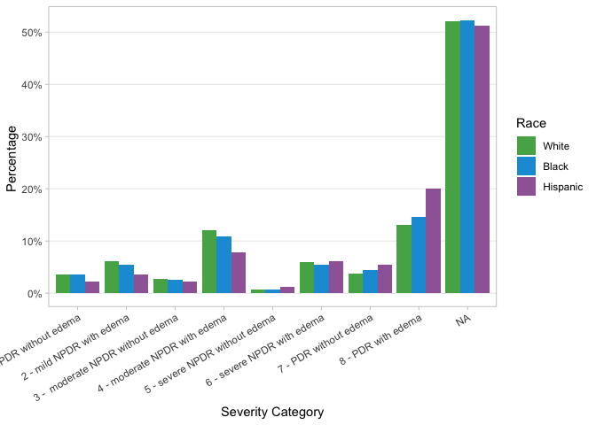
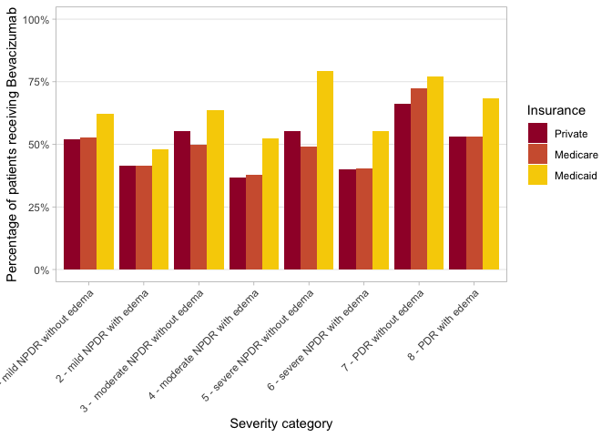
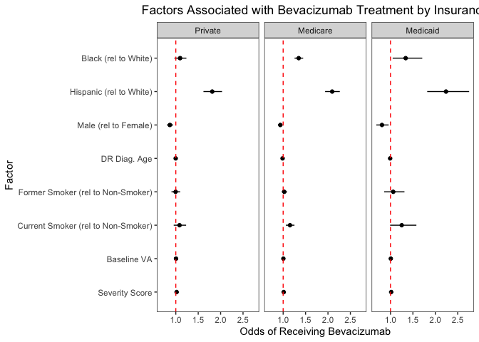
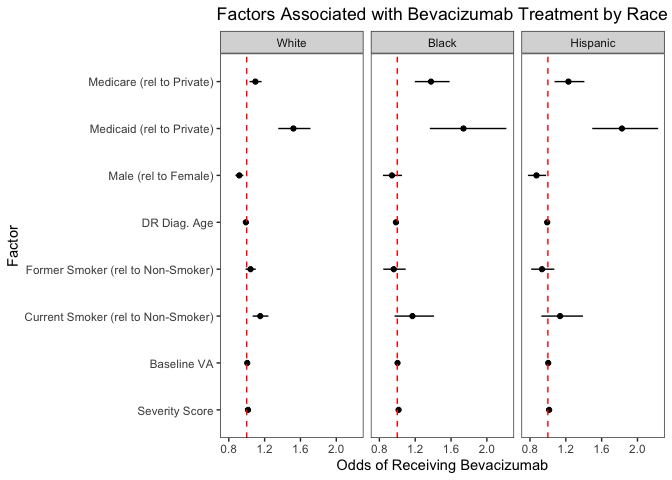
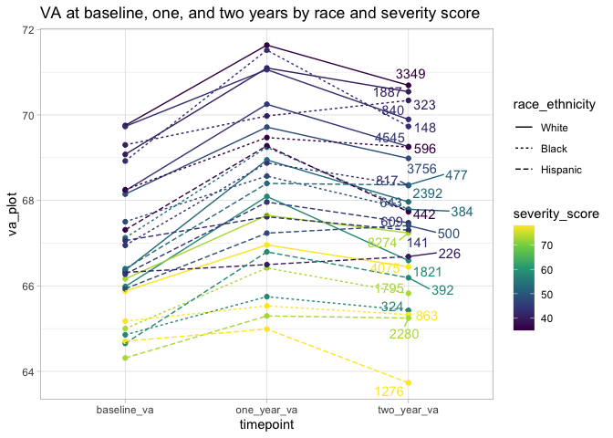
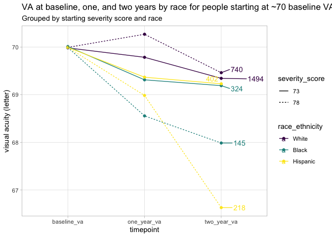
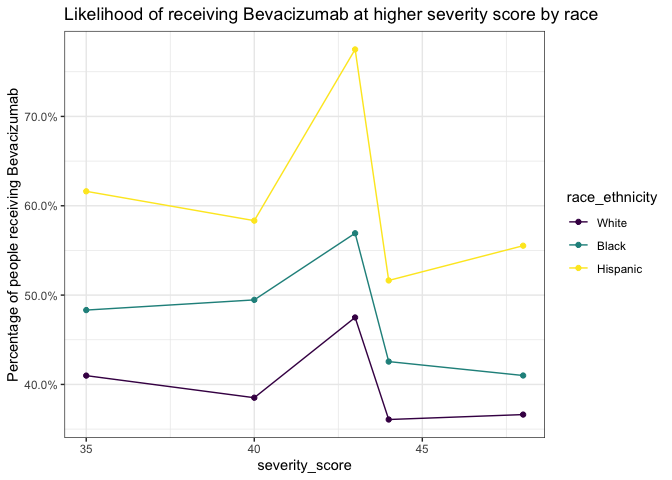
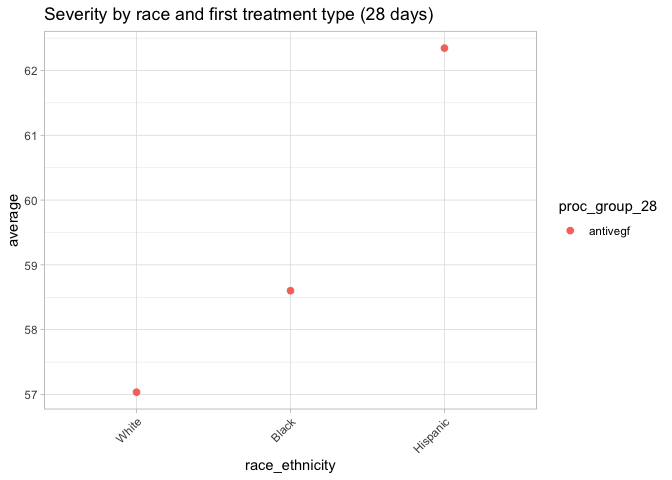

DR_Analysis_Main
================
Vikas Maturi
2021-07-07

-   [Setup](#setup)
    -   [Libraries and data import](#libraries-and-data-import)
    -   [Join severity and timeseries patient/visit
        data](#join-severity-and-timeseries-patientvisit-data)
-   [Cleaned datasets for analysis](#cleaned-datasets-for-analysis)
-   [Table 1: Patient Demographics](#table-1-patient-demographics)
    -   [Construct dataset to generate data
        tables](#construct-dataset-to-generate-data-tables)
    -   [Table: Age by race and
        insurance](#table-age-by-race-and-insurance)
    -   [Table: Gender by race and
        insurance](#table-gender-by-race-and-insurance)
    -   [Table: Baseline VA by race and
        insurance](#table-baseline-va-by-race-and-insurance)
    -   [Table: VEGF drug by race and
        insurance](#table-vegf-drug-by-race-and-insurance)
    -   [Table: Smoke status by race and
        insurance](#table-smoke-status-by-race-and-insurance)
    -   [Table: Insurance by race](#table-insurance-by-race)
-   [Figure 1: Baseline Differences in Severity Score by
    Race](#figure-1-baseline-differences-in-severity-score-by-race)
-   [Figure 2A and 2B: Differences in Rates of Bevacizumab Injection by
    Severity Category, Race and Insurance
    Status](#figure-2a-and-2b-differences-in-rates-of-bevacizumab-injection-by-severity-category-race-and-insurance-status)
-   [Regression X: Variables that influence likelihood of receiving
    Bevacizumab
    treatment](#regression-x-variables-that-influence-likelihood-of-receiving-bevacizumab-treatment)
-   [Supplement: Differences in Rates of Bevacizumab, Aflibercept, and
    Ranibizumab Injection by Severity Category, Race and Insurance
    Status](#supplement-differences-in-rates-of-bevacizumab-aflibercept-and-ranibizumab-injection-by-severity-category-race-and-insurance-status)
-   [Figure 3A and 3B: Visual Acuity Change from Baseline at One and Two
    Years, by
    Race](#figure-3a-and-3b-visual-acuity-change-from-baseline-at-one-and-two-years-by-race)
-   [Figure 4A, 4B, 4C: Visual Acuity Change from Baseline at One and
    Two Years, by Insurance and
    Race](#figure-4a-4b-4c-visual-acuity-change-from-baseline-at-one-and-two-years-by-insurance-and-race)
-   [Regression X: Variables that influence change in vision after one
    year](#regression-x-variables-that-influence-change-in-vision-after-one-year)
-   [Figure 5: Average severity score at each baseline VA (rounded to
    nearest 5) by
    race](#figure-5-average-severity-score-at-each-baseline-va-rounded-to-nearest-5-by-race)
-   [Figure 6: Average severity score at each baseline VA (rounded to
    nearest 5) by
    insurance](#figure-6-average-severity-score-at-each-baseline-va-rounded-to-nearest-5-by-insurance)
-   [Timeseries analysis of visual
    acuity](#timeseries-analysis-of-visual-acuity)
    -   [Distribution of VA by race](#distribution-of-va-by-race)
    -   [Timeseries VA by race and
        severity](#timeseries-va-by-race-and-severity)
    -   [Timeseries VA by race](#timeseries-va-by-race)
    -   [Timeseries VA by insurance](#timeseries-va-by-insurance)
    -   [Percentage with 15 letter loss by
        race](#percentage-with-15-letter-loss-by-race)
    -   [Percentage with 15 letter loss by
        insurance](#percentage-with-15-letter-loss-by-insurance)
    -   [Timeseries VA by insurance and
        race](#timeseries-va-by-insurance-and-race)
    -   [Timeseries VA by smoking and
        race](#timeseries-va-by-smoking-and-race)
    -   [Timeseries VA by gender and
        race](#timeseries-va-by-gender-and-race)
    -   [Race VA timeseries](#race-va-timeseries)
    -   [Race VA timeseries bucketed by
        10](#race-va-timeseries-bucketed-by-10)
    -   [Severity race VA timeseries](#severity-race-va-timeseries)
    -   [Severity insurance race VA
        timeseries](#severity-insurance-race-va-timeseries)
-   [Injections by VA analysis](#injections-by-va-analysis)
-   [Baseline analysis](#baseline-analysis)
    -   [Severity by race](#severity-by-race)
    -   [Severity by race and region](#severity-by-race-and-region)
    -   [Severity by race and age](#severity-by-race-and-age)
    -   [Severity by region](#severity-by-region)
    -   [Severity by race and
        insurance](#severity-by-race-and-insurance)
    -   [Severity by race and sex](#severity-by-race-and-sex)
    -   [Severity by type of treatment](#severity-by-type-of-treatment)
    -   [Likelihood of drug received by severity score and race (given
        that patient recieved anti-vegf
        treatment)](#likelihood-of-drug-received-by-severity-score-and-race-given-that-patient-recieved-anti-vegf-treatment)
    -   [Likelihood of drug received by severity score CATEGORY and race
        (given that patient recieved anti-vegf
        treatment)](#likelihood-of-drug-received-by-severity-score-category-and-race-given-that-patient-recieved-anti-vegf-treatment)
    -   [Likelihood of drug received by baseline VA and race (given that
        patient recieved anti-vegf
        treatment)](#likelihood-of-drug-received-by-baseline-va-and-race-given-that-patient-recieved-anti-vegf-treatment)
    -   [Likelihood of drug received by severity score CATEGORY and
        insurance (given that patient recieved anti-vegf
        treatment)](#likelihood-of-drug-received-by-severity-score-category-and-insurance-given-that-patient-recieved-anti-vegf-treatment)
    -   [Drug received by race and
        insurance](#drug-received-by-race-and-insurance)
    -   [Severity vs. vision](#severity-vs-vision)
-   [Regression](#regression)
    -   [Linear regression](#linear-regression)
    -   [Quantile regressionn](#quantile-regressionn)

## Setup

#### Libraries and data import

``` r
# load libraries
library(tidyverse)
library(readxl)
library(lubridate)
library(knitr)
library(googlesheets4)
library(car)


# parameters

race_colors <- c("#54AE55", "#189CD9", "#A167A5")

insurance_colors <- c("#A00033", "#D1603D", "#F7D002")
```

``` r
# read in cleaned, combined data on visits and severity
visits_severity <- read_csv(file = "data_clean/maturi_all_cleaned.csv")

# read in cleaned data on timeservies visual acuity
va_progression <- read_csv(file = "data_clean/va_progression.csv")
```

#### Join severity and timeseries patient/visit data

``` r
joined_data <- 
  visits_severity %>% 
  # select the data
  dplyr::select(pt_code_name, eye, first_problem_code, severity_score, gender, race_ethnicity, first_dr_age, age_group, insurance, region, smoke_status, new_class, valid_class, include_given_code, vision_category, vision_threatening, pt_code_name, eye, index_date, baseline_va_letter, proc_group_28, proc_group_365, proc_group_any, vegf_group_28, vegf_group_365, vegf_group_any, retina_speciality, baseline_iop, pdr_group, cat_eyes) %>% 
  left_join(va_progression, by = c("pt_code_name" = "patient_guid", "eye" = "va_eye", "index_date"))
```

## Cleaned datasets for analysis

The ‘timeseries_analysis’ dataset will be the basis of all analyses

``` r
# set seed to ensure that we randomly sample the same set of folks in each round
set.seed(1)
# filter out the necesssary data to conduct time series analysis
timeseries_analysis <-
  joined_data %>% 
  filter(
    # only data classified under new ICD codes or codes starting of the format 36x.xxx
    include_given_code == 1,
    #race is White, Black, or Hispanic, to ensure adequate numbers
    race_ethnicity %in% c("Caucasian", "Black or African American", "Hispanic"),
    #race and gender data available for the patient
    !is.na(race_ethnicity), 
    !is.na(gender),
    !is.na(severity_score),
    # only patients with one year and two year data available
    !is.na(one_year), 
    #!is.na(six_month),
    !is.na(two_year),
    # only patients getting antivegf treatment
    proc_group_28 == "antivegf",
    # no cat eyes
    !cat_eyes == 1
  ) %>% 
  # select only one eye per patient
  group_by(pt_code_name) %>%
  sample_n(1) %>%
  ungroup() %>%
  # adjust insurance data to combine medicare FFS and medicare managed
  mutate(
    insurance = if_else(insurance %in% c("Medicare FFS", "Medicare Managed"), "Medicare", insurance)
  ) %>% 
  mutate(
    baseline_va_r10 = plyr::round_any(baseline_va_letter, 10),
    baseline_va_quart = ntile(baseline_va_letter, 4),
    one_year_va_delta = one_year - baseline_va_letter,
    two_year_va_delta = two_year - baseline_va_letter,
    #turn race into a factor and rename races
    race_ethnicity = dplyr::case_when(
      race_ethnicity == "Caucasian" ~ "White",
      race_ethnicity == "Black or African American" ~ "Black",
      TRUE ~ race_ethnicity
    ),
    race_ethnicity = factor(race_ethnicity, ordered = TRUE, levels = c("White", "Black", "Hispanic")),
    insurance = factor(insurance, ordered = TRUE, levels = c("Private", "Medicare","Medicaid","Govt","Military","Unknown/Missing"))
  ) 
```

## Table 1: Patient Demographics

#### Construct dataset to generate data tables

``` r
# Create dataset for basic paper tables
tbl_data <-
  timeseries_analysis %>% 
  mutate(
    # unorder insurance to permit grouping
    insurance = as.character(insurance),
    insurance_tbl = if_else(
      insurance %in% c("Private", "Medicare", "Medicaid"),
      insurance, 
      "Other"
    ),
    age_tbl = case_when(
      first_dr_age < 53 ~ "< 53",
      first_dr_age >= 53 & first_dr_age <= 58 ~ "53 - 58",
      first_dr_age >= 59 & first_dr_age <= 64 ~ "59 - 64",
      first_dr_age >= 65 & first_dr_age <= 70 ~ "65 - 70",
      first_dr_age > 70 ~ "> 70"
    ),
    va_tbl = case_when(
      baseline_va_letter > 69.95 ~ "20/40 or better",
      baseline_va_letter >= 57.80 & baseline_va_letter <= 69.95 ~ "20/41 - 20/70",
      baseline_va_letter >= 35 & baseline_va_letter <= 57.80 ~ "20/71 - 20/200",
      baseline_va_letter < 35 ~ "20/201 or worse"
    ), 
    vegf_tbl = case_when(
      vegf_group_365 == "Avastin" ~ "bevacizumab" ,
      vegf_group_365 == "Lucentis" ~ "ranibizumab",
      vegf_group_365 == "Eylea" ~ "aflibercept",
      vegf_group_365 == "combo" ~ "combo"
    )
  )

tbl_data
```

    ## # A tibble: 43,274 × 40
    ##    pt_code_name   eye first_problem_c… severity_score gender race_ethnicity
    ##    <chr>        <dbl> <chr>                     <dbl> <chr>  <ord>         
    ##  1 00022808cb4…     1 362.02                       73 Male   White         
    ##  2 0002d4cc5f7…     1 362.02                       73 Male   Hispanic      
    ##  3 000340244d4…     1 E11.3411                     58 Male   White         
    ##  4 0003859ca8d…     1 E11.351                      78 Female White         
    ##  5 000406a5939…     1 362.05                       44 Male   White         
    ##  6 0007e418646…     1 362.02                       73 Female Black         
    ##  7 000944c41d8…     1 362.05                       44 Male   White         
    ##  8 00096924cfb…     1 E11.3211                     40 Male   White         
    ##  9 000aadb4949…     2 362.02                       73 Female White         
    ## 10 000b59b304e…     2 362.04                       35 Male   White         
    ## # … with 43,264 more rows, and 34 more variables: first_dr_age <dbl>,
    ## #   age_group <dbl>, insurance <chr>, region <chr>, smoke_status <chr>,
    ## #   new_class <dbl>, valid_class <dbl>, include_given_code <dbl>,
    ## #   vision_category <chr>, vision_threatening <dbl>, index_date <date>,
    ## #   baseline_va_letter <dbl>, proc_group_28 <chr>, proc_group_365 <chr>,
    ## #   proc_group_any <chr>, vegf_group_28 <chr>, vegf_group_365 <chr>,
    ## #   vegf_group_any <chr>, retina_speciality <dbl>, baseline_iop <dbl>, …

#### Table: Age by race and insurance

``` r
tbl_age_race <-
  tbl_data %>% 
  count(age_tbl, race_ethnicity) %>% 
  group_by(race_ethnicity) %>% 
  mutate(pct_age_race = round(n / sum(n) * 100, 3)) %>% 
  unite(x, "n", "pct_age_race", sep = " (") %>% 
  spread(key = race_ethnicity, value = x )

kable(tbl_age_race)
```

| age_tbl | White        | Black        | Hispanic     |
|:--------|:-------------|:-------------|:-------------|
| \< 53   | 5856 (18.897 | 1258 (21.243 | 1705 (26.796 |
| \> 70   | 6508 (21.001 | 1148 (19.385 | 911 (14.317  |
| 53 - 58 | 4986 (16.09  | 996 (16.819  | 1191 (18.718 |
| 59 - 64 | 6591 (21.269 | 1260 (21.277 | 1381 (21.704 |
| 65 - 70 | 7048 (22.744 | 1260 (21.277 | 1175 (18.466 |

``` r
tbl_age_insurance <-
  tbl_data %>% 
  count(age_tbl, insurance_tbl) %>% 
  group_by(insurance_tbl) %>% 
  mutate(pct_age_insurance = round(n / sum(n) * 100, 3)) %>%
  unite(x, "n", "pct_age_insurance", sep = " (") %>% 
  spread(key = insurance_tbl, value = x )

kable(tbl_age_insurance)
```

| age_tbl | Medicaid     | Medicare     | Other        | Private      |
|:--------|:-------------|:-------------|:-------------|:-------------|
| \< 53   | 1195 (48.283 | 2534 (9.505  | 1041 (30.927 | 4049 (37.581 |
| \> 70   | 94 (3.798    | 7687 (28.835 | 294 (8.734   | 492 (4.567   |
| 53 - 58 | 654 (26.424  | 2433 (9.126  | 872 (25.906  | 3214 (29.831 |
| 59 - 64 | 444 (17.939  | 5835 (21.888 | 695 (20.648  | 2258 (20.958 |
| 65 - 70 | 88 (3.556    | 8170 (30.646 | 464 (13.785  | 761 (7.063   |

#### Table: Gender by race and insurance

``` r
tbl_gender_race <-
  tbl_data %>% 
  count(gender, race_ethnicity) %>% 
  group_by(race_ethnicity) %>% 
  mutate(pct_age_race = round(n / sum(n) * 100, 3)) %>% 
  unite(x, "n", "pct_age_race", sep = " (") %>% 
  spread(key = race_ethnicity, value = x )

kable(tbl_gender_race)
```

| gender  | White         | Black        | Hispanic     |
|:--------|:--------------|:-------------|:-------------|
| Female  | 13715 (44.258 | 3455 (58.342 | 2928 (46.016 |
| Male    | 17160 (55.374 | 2441 (41.219 | 3389 (53.261 |
| Unknown | 114 (0.368    | 26 (0.439    | 46 (0.723    |

``` r
tbl_gender_insurance <-
  tbl_data %>% 
  count(gender, insurance_tbl) %>% 
  group_by(insurance_tbl) %>% 
  mutate(pct_gender_insurance = round(n / sum(n) * 100, 3)) %>%
  unite(x, "n", "pct_gender_insurance", sep = " (") %>% 
  spread(key = insurance_tbl, value = x )

kable(tbl_gender_insurance)
```

| gender  | Medicaid     | Medicare      | Other        | Private      |
|:--------|:-------------|:--------------|:-------------|:-------------|
| Female  | 1286 (51.96  | 12936 (48.524 | 1360 (40.404 | 4516 (41.916 |
| Male    | 1178 (47.596 | 13598 (51.007 | 1993 (59.21  | 6221 (57.741 |
| Unknown | 11 (0.444    | 125 (0.469    | 13 (0.386    | 37 (0.343    |

#### Table: Baseline VA by race and insurance

``` r
tbl_va_race <-
  tbl_data %>% 
  count(va_tbl, race_ethnicity) %>% 
  group_by(race_ethnicity) %>% 
  mutate(pct_va_race = round(n / sum(n) * 100, 3)) %>% 
  unite(x, "n", "pct_va_race", sep = " (") %>% 
  spread(key = race_ethnicity, value = x )

kable(tbl_va_race)
```

| va_tbl          | White         | Black        | Hispanic     |
|:----------------|:--------------|:-------------|:-------------|
| 20/201 or worse | 221 (0.713    | 53 (0.895    | 64 (1.006    |
| 20/40 or better | 17545 (56.617 | 3164 (53.428 | 3128 (49.159 |
| 20/41 - 20/70   | 8471 (27.336  | 1650 (27.862 | 1899 (29.844 |
| 20/71 - 20/200  | 4752 (15.334  | 1055 (17.815 | 1272 (19.991 |

``` r
tbl_va_insurance <-
  tbl_data %>% 
  count(va_tbl, insurance_tbl) %>% 
  group_by(insurance_tbl) %>% 
  mutate(pct_va_insurance = round(n / sum(n) * 100, 3)) %>%
  unite(x, "n", "pct_va_insurance", sep = " (") %>% 
  spread(key = insurance_tbl, value = x )

kable(tbl_va_insurance)
```

| va_tbl          | Medicaid     | Medicare      | Other        | Private      |
|:----------------|:-------------|:--------------|:-------------|:-------------|
| 20/201 or worse | 23 (0.929    | 229 (0.859    | 33 (0.98     | 53 (0.492    |
| 20/40 or better | 1335 (53.939 | 13799 (51.761 | 1952 (57.992 | 6751 (62.66  |
| 20/41 - 20/70   | 672 (27.152  | 7934 (29.761  | 865 (25.698  | 2549 (23.659 |
| 20/71 - 20/200  | 445 (17.98   | 4697 (17.619  | 516 (15.33   | 1421 (13.189 |

#### Table: VEGF drug by race and insurance

``` r
tbl_vegf_race <-
  tbl_data %>% 
  count(vegf_tbl, race_ethnicity) %>% 
  group_by(race_ethnicity) %>% 
  mutate(pct_vegf_race = round(n / sum(n) * 100, 3)) %>% 
  unite(x, "n", "pct_vegf_race", sep = " (") %>% 
  spread(key = race_ethnicity, value = x )

kable(tbl_vegf_race)
```

| vegf_tbl    | White         | Black        | Hispanic     |
|:------------|:--------------|:-------------|:-------------|
| aflibercept | 6241 (20.139  | 984 (16.616  | 673 (10.577  |
| bevacizumab | 14036 (45.293 | 3078 (51.976 | 4175 (65.614 |
| combo       | 6408 (20.678  | 1157 (19.537 | 1051 (16.517 |
| ranibizumab | 4304 (13.889  | 703 (11.871  | 464 (7.292   |

``` r
tbl_vegf_insurance <-
  tbl_data %>% 
  count(vegf_tbl, insurance_tbl) %>% 
  group_by(insurance_tbl) %>% 
  mutate(pct_vegf_insurance = round(n / sum(n) * 100, 3)) %>%
  unite(x, "n", "pct_vegf_insurance", sep = " (") %>% 
  spread(key = insurance_tbl, value = x )

kable(tbl_vegf_insurance)
```

| vegf_tbl    | Medicaid     | Medicare      | Other        | Private      |
|:------------|:-------------|:--------------|:-------------|:-------------|
| aflibercept | 268 (10.828  | 5152 (19.326  | 500 (14.854  | 1978 (18.359 |
| bevacizumab | 1578 (63.758 | 12610 (47.301 | 1935 (57.487 | 5166 (47.949 |
| combo       | 462 (18.667  | 5281 (19.809  | 586 (17.409  | 2287 (21.227 |
| ranibizumab | 167 (6.747   | 3616 (13.564  | 345 (10.25   | 1343 (12.465 |

#### Table: Smoke status by race and insurance

``` r
tbl_smoke_race <-
  tbl_data %>% 
  count(smoke_status, race_ethnicity) %>% 
  group_by(race_ethnicity) %>% 
  mutate(pct_smoke_race = round(n / sum(n) * 100, 3)) %>% 
  unite(x, "n", "pct_smoke_race", sep = " (") %>% 
  spread(key = race_ethnicity, value = x )


kable(tbl_smoke_race)
```

| smoke_status                                    | White         | Black        | Hispanic     |
|:------------------------------------------------|:--------------|:-------------|:-------------|
| Former / No longer active / Past History / Quit | 8753 (28.246  | 1434 (24.215 | 1386 (21.782 |
| No / Never                                      | 18345 (59.198 | 3846 (64.944 | 4341 (68.223 |
| Unknown / Unclassified                          | 352 (1.136    | 60 (1.013    | 67 (1.053    |
| Yes / Active                                    | 3539 (11.42   | 582 (9.828   | 569 (8.942   |

``` r
tbl_smoke_insurance <-
  tbl_data %>% 
  count(smoke_status, insurance_tbl) %>% 
  group_by(insurance_tbl) %>% 
  mutate(pct_smoke_insurance = round(n / sum(n) * 100, 3)) %>%
  unite(x, "n", "pct_smoke_insurance", sep = " (") %>% 
  spread(key = insurance_tbl, value = x )

kable(tbl_smoke_insurance)
```

| smoke_status                                    | Medicaid     | Medicare      | Other        | Private      |
|:------------------------------------------------|:-------------|:--------------|:-------------|:-------------|
| Former / No longer active / Past History / Quit | 528 (21.333  | 7990 (29.971  | 791 (23.5    | 2264 (21.014 |
| No / Never                                      | 1482 (59.879 | 15656 (58.727 | 2172 (64.528 | 7222 (67.032 |
| Unknown / Unclassified                          | 20 (0.808    | 251 (0.942    | 63 (1.872    | 145 (1.346   |
| Yes / Active                                    | 445 (17.98   | 2762 (10.36   | 340 (10.101  | 1143 (10.609 |

#### Table: Insurance by race

``` r
tbl_insurance_race <-
  tbl_data %>% 
  count(insurance_tbl, race_ethnicity) %>% 
  group_by(race_ethnicity) %>% 
  mutate(pct_insurance_race = n / sum(n) * 100)

kable(tbl_insurance_race)
```

| insurance_tbl | race_ethnicity |     n | pct_insurance_race |
|:--------------|:---------------|------:|-------------------:|
| Medicaid      | White          |  1392 |           4.491917 |
| Medicaid      | Black          |   371 |           6.264775 |
| Medicaid      | Hispanic       |   712 |          11.189690 |
| Medicare      | White          | 19551 |          63.090129 |
| Medicare      | Black          |  3803 |          64.218170 |
| Medicare      | Hispanic       |  3305 |          51.940908 |
| Other         | White          |  2091 |           6.747556 |
| Other         | Black          |   482 |           8.139142 |
| Other         | Hispanic       |   793 |          12.462675 |
| Private       | White          |  7955 |          25.670399 |
| Private       | Black          |  1266 |          21.377913 |
| Private       | Hispanic       |  1553 |          24.406726 |

## Figure 1: Baseline Differences in Severity Score by Race

To consider here: how do we want to respond to the NAs in this graph?
One option I could see is creating four new categories: (mild NPDR
unknown edema, moderate NPDR unknown edema, severe NPDR unknown edema,
PDR unknown edema)

``` r
timeseries_analysis %>% 
  dplyr::count(vision_category, race_ethnicity) %>%
  dplyr::ungroup() %>% 
  dplyr::group_by(race_ethnicity) %>% 
  dplyr::mutate(prop_category = n / sum(n)) %>% 
  ggplot() + 
  geom_col(aes(x = vision_category, y = prop_category, group = race_ethnicity, fill = race_ethnicity), position = "dodge", alpha = 1) +
  theme_light() +
  theme(
    axis.text.x = element_text(angle = 30, hjust = 1),
    panel.grid.minor = element_blank(),
    panel.grid.major.x = element_blank()
  ) +
  scale_y_continuous(labels = scales::label_percent(accuracy = 10)) +
  scale_fill_manual(values = race_colors) +
  labs(
    x = "Severity Category",
    y = "Percentage ",
    fill = "Race"
  )
```

<!-- -->

## Figure 2A and 2B: Differences in Rates of Bevacizumab Injection by Severity Category, Race and Insurance Status

``` r
# Calculate likelihood of drug by severity score and race (given that patient received antivegf treatment)
drug_sev_cat_race <-
  timeseries_analysis %>% 
  filter(proc_group_365 == "antivegf") %>% 
  count(vision_category, race_ethnicity, vegf_group_365) %>% 
  group_by(vision_category, race_ethnicity) %>% 
  mutate(count_severity_race = sum(n)) %>% 
  mutate(prop = n / count_severity_race) %>% 
  ungroup() %>% 
  select(vision_category, race_ethnicity, vegf_group_365, prop, count = n)

drug_sev_cat_race %>% 
  arrange(desc(vision_category), race_ethnicity) #JAY changed this!! 
```

    ## # A tibble: 108 × 5
    ##    vision_category    race_ethnicity vegf_group_365   prop count
    ##    <chr>              <ord>          <chr>           <dbl> <int>
    ##  1 8 - PDR with edema White          Avastin        0.506   1848
    ##  2 8 - PDR with edema White          combo          0.191    699
    ##  3 8 - PDR with edema White          Eylea          0.209    762
    ##  4 8 - PDR with edema White          Lucentis       0.0939   343
    ##  5 8 - PDR with edema Black          Avastin        0.588    446
    ##  6 8 - PDR with edema Black          combo          0.182    138
    ##  7 8 - PDR with edema Black          Eylea          0.146    111
    ##  8 8 - PDR with edema Black          Lucentis       0.0831    63
    ##  9 8 - PDR with edema Hispanic       Avastin        0.678    729
    ## 10 8 - PDR with edema Hispanic       combo          0.156    168
    ## # … with 98 more rows

``` r
# Graphing likelihood of Avastin by severity and race
drug_sev_cat_race %>% 
  # remove individuals with no vision category
  filter(!is.na(vision_category), !vision_category %in% c("NA")) %>% 
  # remove combo, Eylea, and Lucentis for this graph
  filter(vegf_group_365 == "Avastin") %>% 
  # round proportion to nearest 100th
  mutate(pct_round = round(prop, 2)) %>% 
  ggplot(aes(x = vision_category, y = pct_round, fill = race_ethnicity)) +
  geom_col(position = "dodge") +
  theme_light() +
  theme(
    axis.text.x = element_text(angle = 45, hjust = 1),
    panel.grid.minor = element_blank(),
    panel.grid.major.x = element_blank()
  ) +
  #facet_grid(vegf_group_365 ~ .) +
  #geom_text(aes(label = paste0(pct_round, "%")), vjust = -0.5, position = position_dodge(width = 1)) +
  #scale_x_continuous()
  scale_y_continuous(labels = scales::label_percent(accuracy = 1), limits = c(0, 1)) +
  scale_fill_manual(values = race_colors) +
  labs(
    x = "Severity category",
    y = "Percentage of people receiving Avastin",
    fill = "Race"
  )
```

<!-- -->

``` r
# Calculate likelihood of drug by severity score and insurance (given that patient received antivegf treatment)
drug_sev_cat_insurance <-
  timeseries_analysis %>%
  filter(proc_group_365 == "antivegf", insurance %in% c("Private", "Medicare", "Medicaid")) %>% 
  count(vision_category, insurance, vegf_group_365) %>% 
  group_by(vision_category, insurance) %>% 
  mutate(count_severity_race = sum(n)) %>% 
  mutate(prop = n / count_severity_race) %>% 
  ungroup() %>% 
  select(vision_category, insurance, vegf_group_365, prop, count = n)

drug_sev_cat_insurance %>% 
  arrange(desc(vision_category), insurance)
```

    ## # A tibble: 107 × 5
    ##    vision_category    insurance vegf_group_365   prop count
    ##    <chr>              <ord>     <chr>           <dbl> <int>
    ##  1 8 - PDR with edema Private   Avastin        0.535    824
    ##  2 8 - PDR with edema Private   combo          0.192    296
    ##  3 8 - PDR with edema Private   Eylea          0.182    281
    ##  4 8 - PDR with edema Private   Lucentis       0.0909   140
    ##  5 8 - PDR with edema Medicare  Avastin        0.528   1561
    ##  6 8 - PDR with edema Medicare  combo          0.185    547
    ##  7 8 - PDR with edema Medicare  Eylea          0.197    583
    ##  8 8 - PDR with edema Medicare  Lucentis       0.0890   263
    ##  9 8 - PDR with edema Medicaid  Avastin        0.680    329
    ## 10 8 - PDR with edema Medicaid  combo          0.151     73
    ## # … with 97 more rows

``` r
# Graphing likelihood of first drug type by severity and insurance
drug_sev_cat_insurance %>% 
  # remove individuals with no vision category
  filter(!is.na(vision_category), !vision_category %in% c("NA")) %>% 
  # remove combo, Eylea, and Lucentis for this graph
  filter(vegf_group_365 == "Avastin") %>% 
  # round proportion to nearest 100th
  mutate(pct_round = round(prop, 2)) %>%
  ggplot(aes(x = vision_category, y = prop, fill = insurance)) +
  geom_col(position = "dodge") +
  theme_light() +
  theme(
    axis.text.x = element_text(angle = 45, hjust=1),
    # remove background lines
    panel.grid.minor = element_blank(),
    panel.grid.major.x = element_blank()
  ) +
  #facet_grid(vegf_group_365~.) +
  scale_y_continuous(labels = scales::label_percent(accuracy = 1), limits = c(0, 1)) +
  # different colors for insurance
  scale_fill_manual(values = insurance_colors) +
  labs(
    x = "Severity category",
    y = "Percentage of people receiving Avastin",
    fill = "Insurance"
  )
```

<!-- -->

## Regression X: Variables that influence likelihood of receiving Bevacizumab treatment

``` r
# create dataset for regression
data_avastin_reg <- 
  timeseries_analysis %>% 
  filter(
    insurance %in% c("Medicare", "Medicaid", "Private")
  ) %>% 
  mutate(
    # unorder for appropriate regression interpretation
    race_ethnicity = factor(race_ethnicity, ordered = FALSE),
    race_ethnicity = relevel(race_ethnicity, ref = "White"),
    # unorder for appropriate regression interpretation
    insurance = factor(insurance, ordered = FALSE),
    insurance = relevel(insurance, ref = "Private"),
    smoke_status = factor(smoke_status),
    smoke_status = relevel(smoke_status, ref = "No / Never"),
    avastin = if_else(vegf_group_365 == "Avastin", 1, 0)
  ) 

# glm for logistic regression
avastin_1.logm <- 
  glm(
    avastin ~ race_ethnicity + insurance + race_ethnicity * insurance + gender + first_dr_age + smoke_status + baseline_va_letter +  severity_score, 
    data = data_avastin_reg, 
    family = binomial
  ) 

summary(avastin_1.logm)
```

    ## 
    ## Call:
    ## glm(formula = avastin ~ race_ethnicity + insurance + race_ethnicity * 
    ##     insurance + gender + first_dr_age + smoke_status + baseline_va_letter + 
    ##     severity_score, family = binomial, data = data_avastin_reg)
    ## 
    ## Deviance Residuals: 
    ##     Min       1Q   Median       3Q      Max  
    ## -1.9075  -1.0986  -0.9093   1.1740   1.5986  
    ## 
    ## Coefficients:
    ##                                                               Estimate
    ## (Intercept)                                                 -0.8304549
    ## race_ethnicityBlack                                          0.1180342
    ## race_ethnicityHispanic                                       0.6143160
    ## insuranceMedicare                                            0.0985570
    ## insuranceMedicaid                                            0.4330683
    ## genderMale                                                  -0.0942642
    ## genderUnknown                                               -0.0997580
    ## first_dr_age                                                -0.0096645
    ## smoke_statusFormer / No longer active / Past History / Quit  0.0202601
    ## smoke_statusUnknown / Unclassified                           0.1026341
    ## smoke_statusYes / Active                                     0.1370671
    ## baseline_va_letter                                           0.0051258
    ## severity_score                                               0.0142757
    ## race_ethnicityBlack:insuranceMedicare                        0.1777931
    ## race_ethnicityHispanic:insuranceMedicare                     0.1260080
    ## race_ethnicityBlack:insuranceMedicaid                        0.1872070
    ## race_ethnicityHispanic:insuranceMedicaid                     0.1661550
    ##                                                             Std. Error
    ## (Intercept)                                                  0.1055185
    ## race_ethnicityBlack                                          0.0611981
    ## race_ethnicityHispanic                                       0.0573083
    ## insuranceMedicare                                            0.0299273
    ## insuranceMedicaid                                            0.0596638
    ## genderMale                                                   0.0209544
    ## genderUnknown                                                0.1565012
    ## first_dr_age                                                 0.0010703
    ## smoke_statusFormer / No longer active / Past History / Quit  0.0240504
    ## smoke_statusUnknown / Unclassified                           0.1008541
    ## smoke_statusYes / Active                                     0.0339618
    ## baseline_va_letter                                           0.0008153
    ## severity_score                                               0.0006960
    ## race_ethnicityBlack:insuranceMedicare                        0.0709378
    ## race_ethnicityHispanic:insuranceMedicare                     0.0695434
    ## race_ethnicityBlack:insuranceMedicaid                        0.1368319
    ## race_ethnicityHispanic:insuranceMedicaid                     0.1173484
    ##                                                             z value
    ## (Intercept)                                                  -7.870
    ## race_ethnicityBlack                                           1.929
    ## race_ethnicityHispanic                                       10.720
    ## insuranceMedicare                                             3.293
    ## insuranceMedicaid                                             7.258
    ## genderMale                                                   -4.499
    ## genderUnknown                                                -0.637
    ## first_dr_age                                                 -9.030
    ## smoke_statusFormer / No longer active / Past History / Quit   0.842
    ## smoke_statusUnknown / Unclassified                            1.018
    ## smoke_statusYes / Active                                      4.036
    ## baseline_va_letter                                            6.287
    ## severity_score                                               20.511
    ## race_ethnicityBlack:insuranceMedicare                         2.506
    ## race_ethnicityHispanic:insuranceMedicare                      1.812
    ## race_ethnicityBlack:insuranceMedicaid                         1.368
    ## race_ethnicityHispanic:insuranceMedicaid                      1.416
    ##                                                             Pr(>|z|)    
    ## (Intercept)                                                 3.54e-15 ***
    ## race_ethnicityBlack                                          0.05377 .  
    ## race_ethnicityHispanic                                       < 2e-16 ***
    ## insuranceMedicare                                            0.00099 ***
    ## insuranceMedicaid                                           3.91e-13 ***
    ## genderMale                                                  6.84e-06 ***
    ## genderUnknown                                                0.52385    
    ## first_dr_age                                                 < 2e-16 ***
    ## smoke_statusFormer / No longer active / Past History / Quit  0.39956    
    ## smoke_statusUnknown / Unclassified                           0.30884    
    ## smoke_statusYes / Active                                    5.44e-05 ***
    ## baseline_va_letter                                          3.24e-10 ***
    ## severity_score                                               < 2e-16 ***
    ## race_ethnicityBlack:insuranceMedicare                        0.01220 *  
    ## race_ethnicityHispanic:insuranceMedicare                     0.07000 .  
    ## race_ethnicityBlack:insuranceMedicaid                        0.17126    
    ## race_ethnicityHispanic:insuranceMedicaid                     0.15680    
    ## ---
    ## Signif. codes:  0 '***' 0.001 '**' 0.01 '*' 0.05 '.' 0.1 ' ' 1
    ## 
    ## (Dispersion parameter for binomial family taken to be 1)
    ## 
    ##     Null deviance: 55288  on 39907  degrees of freedom
    ## Residual deviance: 53629  on 39891  degrees of freedom
    ## AIC: 53663
    ## 
    ## Number of Fisher Scoring iterations: 4

## Supplement: Differences in Rates of Bevacizumab, Aflibercept, and Ranibizumab Injection by Severity Category, Race and Insurance Status

``` r
# Graphing likelihood of Avastin by severity and race
drug_sev_cat_race %>% 
  # remove individuals with no vision category
  filter(!is.na(vision_category), !vision_category %in% c("NA")) %>% 
  # round proportion to nearest 100th
  mutate(pct_round = round(prop, 2)) %>% 
  ggplot(aes(x = vision_category, y = pct_round, fill = race_ethnicity)) +
  geom_col(position = "dodge") +
  theme_bw() +
  theme(
    axis.text.x = element_text(angle = 45, hjust=1),
    # remove background lines
    panel.grid.minor = element_blank(),
    panel.grid.major.x = element_blank()
  ) +  facet_grid(vegf_group_365 ~ .) +
  #geom_text(aes(label = paste0(pct_round, "%")), vjust = -0.5, position = position_dodge(width = 1)) +
  #scale_x_continuous()
  scale_y_continuous(labels = scales::label_percent(accuracy = 1), limits = c(0, 1)) +
  scale_fill_manual(values = race_colors) +
  labs(
    x = "Severity category",
    y = "Percentage of people receiving Avastin",
    fill = "Race"
  )
```

<!-- -->

``` r
# Graphing likelihood of first drug type by severity and insurance
drug_sev_cat_insurance %>% 
  # remove individuals with no vision category
  filter(!is.na(vision_category), !vision_category %in% c("NA")) %>% 
  # round proportion to nearest 100th
  mutate(pct_round = round(prop, 2)) %>%
  ggplot(aes(x = vision_category, y = prop, fill = insurance)) +
  geom_col(position = "dodge") +
  theme_bw() +
  theme(
    axis.text.x = element_text(angle = 45, hjust=1),
    # remove background lines
    panel.grid.minor = element_blank(),
    panel.grid.major.x = element_blank()
  ) +  facet_grid(vegf_group_365 ~ .) +
  facet_grid(vegf_group_365~.) +
  scale_y_continuous(labels = scales::label_percent(accuracy = 1), limits = c(0, 1)) +
  # different colors for insurance
  scale_fill_manual(values = insurance_colors) +
  labs(
    x = "Severity category",
    y = "Percentage of people receiving Avastin",
    fill = "Insurance"
  )
```

<!-- -->

## Figure 3A and 3B: Visual Acuity Change from Baseline at One and Two Years, by Race

``` r
change_15 <- 
  timeseries_analysis %>% 
  mutate(
    one_year_change = one_year - baseline_va_letter,
    two_year_change = two_year - baseline_va_letter,
    baseline_change = 0
  ) %>% 
  mutate(
    one_year_15_pt_loss = if_else(one_year_change <= -15, 1, 0),
    two_year_15_pt_loss = if_else(two_year_change <= -15, 1, 0),
    one_year_15_pt_gain = if_else(one_year_change >= 15, 1, 0),
    two_year_15_pt_gain = if_else(two_year_change >= 15, 1, 0),
  ) %>% 
  #gather(key = "time_diff", value = "va_change", baseline_change, one_year_change, two_year_change) %>% 
  ungroup()

# z value for p = .05 
z = 1.96
```

``` r
loss_15_race <-
  change_15 %>% 
  group_by(race_ethnicity) %>% 
  summarize(
    one_year_loss = sum(one_year_15_pt_loss) / n(),
    two_year_loss = sum(two_year_15_pt_loss) / n(),
    one_year_sd = sqrt(one_year_loss * (1 - one_year_loss) / n()),
    two_year_sd = sqrt(two_year_loss * (1 - two_year_loss) / n())
  ) %>% 
  gather(key = "time_diff", value = "pct_15pt_loss", one_year_loss, two_year_loss) %>% 
  mutate(
    sd = if_else(str_detect(string = time_diff, pattern = "one_year"), one_year_sd, two_year_sd),
    upper_bound = pct_15pt_loss + z * sd,
    lower_bound = pct_15pt_loss - z * sd
  )
  
loss_15_race %>%
  ggplot(aes(x = time_diff, y = pct_15pt_loss, fill = race_ethnicity)) +
  geom_col(position = "dodge") +
  geom_errorbar(aes(ymin = lower_bound, ymax = upper_bound), position = position_dodge(width = .9), width = .3) +
  theme_light() +
  theme(
    panel.grid.minor = element_blank(),
    panel.grid.major.x = element_blank()
  ) +
  scale_y_continuous(labels = scales::label_percent(accuracy = 1)) +
  scale_fill_manual(values = race_colors) +
  labs(
    x = "Time after baseline VA measurement",
    y = "Percentage of eyes that lost 15 or more pts of VA",
    fill = "Race"
  )
```

<!-- -->

``` r
# plot change in visual acuity by race at one and two years

va_race <-
  timeseries_analysis %>% 
  group_by(race_ethnicity) %>% 
  summarize(
    baseline_va = mean(baseline_va_letter), 
    one_year_va = mean(one_year), 
    two_year_va = mean(two_year),
    baseline_sd = sd(baseline_va_letter),
    one_year_sd = sd(one_year),
    two_year_sd = sd(two_year),
    count = n()) %>% 
  gather(key = "timepoint", value = "va_plot", baseline_va, one_year_va, two_year_va) %>% 
  ungroup()

va_race_diff <-
  va_race %>% 
  spread(key = timepoint, value = va_plot) %>% 
  mutate(
    one_year_change = one_year_va - baseline_va,
    two_year_change = two_year_va - baseline_va,
    baseline = 0
  ) %>% 
  gather(key = "time_diff", value = "va_change", baseline, one_year_change, two_year_change) %>% 
  ungroup()

va_race_diff %>% 
  ggplot(aes(x = time_diff, y = va_change, color = race_ethnicity)) +
  geom_point() +
  geom_line(aes(group = race_ethnicity)) +
  # ggrepel::geom_text_repel(
  #   data = va_race_diff %>% filter(time_diff == "two_year_change"),
  #   aes(label = count)
  # ) +
  theme_light() +
  scale_color_manual(values = race_colors) +
  labs(
    x = "Time point",
    y = "Change in visual acuity",
    color = "Race"
  )
```

<!-- -->

## Figure 4A, 4B, 4C: Visual Acuity Change from Baseline at One and Two Years, by Insurance and Race

``` r
# z value for p = .05 
z = 1.96

loss_15_insurance <-
  change_15 %>% 
  group_by(insurance) %>%
  filter(!insurance %in% c("Unknown/Missing", "Military", "Govt")) %>% 
  summarize(
    one_year_loss = sum(one_year_15_pt_loss) / n(),
    two_year_loss = sum(two_year_15_pt_loss) / n(),
    one_year_sd = sqrt(one_year_loss * (1 - one_year_loss) / n()),
    two_year_sd = sqrt(two_year_loss * (1 - two_year_loss) / n())
  ) %>% 
  gather(key = "time_diff", value = "pct_15pt_loss", one_year_loss, two_year_loss) %>% 
  mutate(
    sd = if_else(str_detect(string = time_diff, pattern = "one_year"), one_year_sd, two_year_sd),
    upper_bound = pct_15pt_loss + z * sd,
    lower_bound = pct_15pt_loss - z * sd
  )
  
loss_15_insurance %>% 
  ggplot(aes(x = time_diff, y = pct_15pt_loss, fill = insurance)) +
  geom_col(position = "dodge") +
  geom_errorbar(aes(ymin = lower_bound, ymax = upper_bound), position = position_dodge(width = .9), width = .4) +
  theme_light() +
  theme(
    panel.grid.minor = element_blank(),
    panel.grid.major.x = element_blank()
  ) +
  scale_y_continuous(labels = scales::label_percent(accuracy = 1)) +
  scale_fill_manual(values = insurance_colors) +
  labs(
    x = "Time after baseline VA measurement",
    y = "Percentage of eyes that lost 15 or more points of VA",
    fill = "Insurance"
  )
```

<!-- -->

``` r
va_insurance <-
  timeseries_analysis %>% 
  group_by(insurance) %>%
  filter(!insurance %in% c("Unknown/Missing", "Military", "Govt")) %>% 
  summarize(
    baseline_va = mean(baseline_va_letter), 
    one_year_va = mean(one_year), 
    two_year_va = mean(two_year),
    baseline_sd = sd(baseline_va_letter),
    one_year_sd = sd(one_year),
    two_year_sd = sd(two_year),
    count = n()) %>% 
  gather(key = "timepoint", value = "va_plot", baseline_va, one_year_va, two_year_va) %>% 
  ungroup()

va_insurance_diff <-
  va_insurance %>% 
  spread(key = timepoint, value = va_plot) %>% 
  mutate(
    one_year_change = one_year_va - baseline_va,
    two_year_change = two_year_va - baseline_va,
    baseline = 0
  ) %>% 
  gather(key = "time_diff", value = "va_change", baseline, one_year_change, two_year_change) %>% 
  ungroup()

va_insurance_diff %>% 
  ggplot(aes(x = time_diff, y = va_change, color = insurance)) +
  geom_point() +
  geom_line(aes(group = insurance)) +
  # ggrepel::geom_text_repel(
  #   data = va_insurance_diff %>% filter(time_diff == "two_year_change"),
  #   aes(label = count)
  # ) +
  theme_light() + 
  theme(
    panel.grid.minor = element_blank(),
    panel.grid.major.x = element_blank()
  ) +
  scale_color_manual(values = insurance_colors) +
  labs(
    x = "Time point",
    y = "Change in visual acuity",
    color = "Insurance"
  )
```

<!-- -->

``` r
insurance_race_va <-
  timeseries_analysis %>% 
  group_by(race_ethnicity, insurance) %>% 
  summarize(baseline_va = mean(baseline_va_letter), one_year_va = mean(one_year), two_year_va = mean(two_year), count = n()) %>% 
  gather(key = "timepoint", value = "va_plot", baseline_va, one_year_va, two_year_va)
```

    ## `summarise()` has grouped output by 'race_ethnicity'. You can override using the `.groups` argument.

``` r
va_insurance_race_diff_tbl <-
  insurance_race_va %>%
  filter(!insurance %in% c("Unknown/Missing", "Military", "Govt")) %>%
  spread(key = timepoint, value = va_plot) %>%
  mutate(
    one_year_change = one_year_va - baseline_va,
    two_year_change = two_year_va - baseline_va,
    baseline = 0
  )

va_insurance_race_diff <-
  insurance_race_va %>%
  filter(!insurance %in% c("Unknown/Missing", "Military", "Govt")) %>%
  spread(key = timepoint, value = va_plot) %>%
  mutate(
    one_year_change = one_year_va - baseline_va,
    two_year_change = two_year_va - baseline_va,
    baseline = 0
  ) %>%
  gather(key = "time_diff", value = "va_change", baseline, one_year_change, two_year_change) %>%
  ungroup()

va_insurance_race_diff_ci <-
  timeseries_analysis %>%
  mutate(
    one_year_change = one_year - baseline_va_letter,
    two_year_change = two_year - baseline_va_letter,
    baseline = 0
  ) %>%
  group_by(race_ethnicity, insurance) %>%
  summarize(
    mean_one_year_change = mean(one_year_change),
    mean_two_year_change = mean(two_year_change),
    sd_one_year_change = sd(one_year_change),
    sd_two_year_change = sd(two_year_change)
  )
```

    ## `summarise()` has grouped output by 'race_ethnicity'. You can override using the `.groups` argument.

``` r
va_insurance_race_diff %>%
  ggplot(aes(x = time_diff, y = va_change, color = race_ethnicity)) +
  geom_point() +
  geom_line(aes(group = interaction(insurance, race_ethnicity))) +
  # to display counts
  # ggrepel::geom_text_repel(
  #   data = va_insurance_race_diff %>% filter(time_diff == "two_year_change", insurance %in% c("Private", "Medicaid", "Medicare")),
  #   aes(label = count, hjust = -2)
  # ) +
  facet_grid(.~insurance) +
  theme_bw() +
  theme(
    axis.text.x = element_text(angle = 45, hjust=1),
    # remove background lines
    panel.grid.minor = element_blank(),
    panel.grid.major.x = element_blank()
  ) +
  scale_color_manual(values = race_colors) +
  labs(
    x = "Time point",
    y = "Visual acuity (VA) change",
    color = "Race"
  )
```

<!-- -->

## Regression X: Variables that influence change in vision after one year

``` r
# linear regression with race insurance interaction and severity score
one_year_va_delta_4.lm <- 
  lm(one_year_va_delta ~ race_ethnicity + insurance + race_ethnicity * insurance + gender + first_dr_age + smoke_status + baseline_va_letter + vegf_group_365 + severity_score, 
     data = timeseries_analysis %>% 
       filter(
         insurance %in% c("Medicare", "Medicaid", "Private")
       ) %>% 
       mutate(
         race_ethnicity = factor(race_ethnicity, ordered = FALSE),
         race_ethnicity = relevel(race_ethnicity, ref = "White"),
         insurance = factor(insurance, ordered = FALSE), 
         insurance = relevel(insurance, ref = "Private"),
         smoke_status = factor(smoke_status),
         smoke_status = relevel(smoke_status, ref = "No / Never")
       )
  ) 

summary(one_year_va_delta_4.lm)
```

    ## 
    ## Call:
    ## lm(formula = one_year_va_delta ~ race_ethnicity + insurance + 
    ##     race_ethnicity * insurance + gender + first_dr_age + smoke_status + 
    ##     baseline_va_letter + vegf_group_365 + severity_score, data = timeseries_analysis %>% 
    ##     filter(insurance %in% c("Medicare", "Medicaid", "Private")) %>% 
    ##     mutate(race_ethnicity = factor(race_ethnicity, ordered = FALSE), 
    ##         race_ethnicity = relevel(race_ethnicity, ref = "White"), 
    ##         insurance = factor(insurance, ordered = FALSE), insurance = relevel(insurance, 
    ##             ref = "Private"), smoke_status = factor(smoke_status), 
    ##         smoke_status = relevel(smoke_status, ref = "No / Never")))
    ## 
    ## Residuals:
    ##     Min      1Q  Median      3Q     Max 
    ## -96.894  -4.372   1.666   6.483  42.577 
    ## 
    ## Coefficients:
    ##                                                              Estimate
    ## (Intercept)                                                 36.411416
    ## race_ethnicityBlack                                         -1.456907
    ## race_ethnicityHispanic                                      -1.316521
    ## insuranceMedicare                                           -1.780485
    ## insuranceMedicaid                                           -2.128057
    ## genderMale                                                   0.405336
    ## genderUnknown                                               -1.214586
    ## first_dr_age                                                -0.057780
    ## smoke_statusFormer / No longer active / Past History / Quit  0.125248
    ## smoke_statusUnknown / Unclassified                           0.601629
    ## smoke_statusYes / Active                                    -0.658016
    ## baseline_va_letter                                          -0.395993
    ## vegf_group_365combo                                         -0.027556
    ## vegf_group_365Eylea                                          0.561849
    ## vegf_group_365Lucentis                                       0.767506
    ## severity_score                                              -0.063302
    ## race_ethnicityBlack:insuranceMedicare                        1.348333
    ## race_ethnicityHispanic:insuranceMedicare                    -0.078540
    ## race_ethnicityBlack:insuranceMedicaid                       -0.067253
    ## race_ethnicityHispanic:insuranceMedicaid                     0.602269
    ##                                                             Std. Error
    ## (Intercept)                                                   0.634959
    ## race_ethnicityBlack                                           0.368723
    ## race_ethnicityHispanic                                        0.338773
    ## insuranceMedicare                                             0.179176
    ## insuranceMedicaid                                             0.355968
    ## genderMale                                                    0.124870
    ## genderUnknown                                                 0.930065
    ## first_dr_age                                                  0.006362
    ## smoke_statusFormer / No longer active / Past History / Quit   0.143352
    ## smoke_statusUnknown / Unclassified                            0.602615
    ## smoke_statusYes / Active                                      0.202426
    ## baseline_va_letter                                            0.004856
    ## vegf_group_365combo                                           0.163024
    ## vegf_group_365Eylea                                           0.169126
    ## vegf_group_365Lucentis                                        0.192941
    ## severity_score                                                0.004181
    ## race_ethnicityBlack:insuranceMedicare                         0.427327
    ## race_ethnicityHispanic:insuranceMedicare                      0.408718
    ## race_ethnicityBlack:insuranceMedicaid                         0.801029
    ## race_ethnicityHispanic:insuranceMedicaid                      0.655178
    ##                                                             t value
    ## (Intercept)                                                  57.345
    ## race_ethnicityBlack                                          -3.951
    ## race_ethnicityHispanic                                       -3.886
    ## insuranceMedicare                                            -9.937
    ## insuranceMedicaid                                            -5.978
    ## genderMale                                                    3.246
    ## genderUnknown                                                -1.306
    ## first_dr_age                                                 -9.082
    ## smoke_statusFormer / No longer active / Past History / Quit   0.874
    ## smoke_statusUnknown / Unclassified                            0.998
    ## smoke_statusYes / Active                                     -3.251
    ## baseline_va_letter                                          -81.539
    ## vegf_group_365combo                                          -0.169
    ## vegf_group_365Eylea                                           3.322
    ## vegf_group_365Lucentis                                        3.978
    ## severity_score                                              -15.142
    ## race_ethnicityBlack:insuranceMedicare                         3.155
    ## race_ethnicityHispanic:insuranceMedicare                     -0.192
    ## race_ethnicityBlack:insuranceMedicaid                        -0.084
    ## race_ethnicityHispanic:insuranceMedicaid                      0.919
    ##                                                             Pr(>|t|)    
    ## (Intercept)                                                  < 2e-16 ***
    ## race_ethnicityBlack                                         7.79e-05 ***
    ## race_ethnicityHispanic                                      0.000102 ***
    ## insuranceMedicare                                            < 2e-16 ***
    ## insuranceMedicaid                                           2.27e-09 ***
    ## genderMale                                                  0.001171 ** 
    ## genderUnknown                                               0.191589    
    ## first_dr_age                                                 < 2e-16 ***
    ## smoke_statusFormer / No longer active / Past History / Quit 0.382281    
    ## smoke_statusUnknown / Unclassified                          0.318110    
    ## smoke_statusYes / Active                                    0.001152 ** 
    ## baseline_va_letter                                           < 2e-16 ***
    ## vegf_group_365combo                                         0.865775    
    ## vegf_group_365Eylea                                         0.000894 ***
    ## vegf_group_365Lucentis                                      6.96e-05 ***
    ## severity_score                                               < 2e-16 ***
    ## race_ethnicityBlack:insuranceMedicare                       0.001605 ** 
    ## race_ethnicityHispanic:insuranceMedicare                    0.847617    
    ## race_ethnicityBlack:insuranceMedicaid                       0.933090    
    ## race_ethnicityHispanic:insuranceMedicaid                    0.357973    
    ## ---
    ## Signif. codes:  0 '***' 0.001 '**' 0.01 '*' 0.05 '.' 0.1 ' ' 1
    ## 
    ## Residual standard error: 12.17 on 39888 degrees of freedom
    ## Multiple R-squared:  0.1459, Adjusted R-squared:  0.1455 
    ## F-statistic: 358.6 on 19 and 39888 DF,  p-value: < 2.2e-16

``` r
vif(one_year_va_delta_4.lm)
```

    ##                               GVIF Df GVIF^(1/(2*Df))
    ## race_ethnicity           15.244230  2        1.975952
    ## insurance                 3.059205  2        1.322520
    ## gender                    1.042914  2        1.010560
    ## first_dr_age              1.464462  1        1.210150
    ## smoke_status              1.059461  3        1.009673
    ## baseline_va_letter        1.037146  1        1.018404
    ## vegf_group_365            1.050078  3        1.008177
    ## severity_score            1.136036  1        1.065850
    ## race_ethnicity:insurance 29.006857  4        1.523395

## Figure 5: Average severity score at each baseline VA (rounded to nearest 5) by race

``` r
#calculate severity by race and age

severity_race_vision <-
  timeseries_analysis %>% 
  mutate(baseline_va_r5 = plyr::round_any(baseline_va_letter, 5)) %>% 
  group_by(race_ethnicity, baseline_va_r5) %>%
  summarize(avg_severity = mean(severity_score), count = n()) %>% 
  filter(count > 100) %>% 
  arrange(desc(avg_severity))
```

    ## `summarise()` has grouped output by 'race_ethnicity'. You can override using the `.groups` argument.

``` r
severity_race_vision
```

    ## # A tibble: 31 × 4
    ## # Groups:   race_ethnicity [3]
    ##    race_ethnicity baseline_va_r5 avg_severity count
    ##    <ord>                   <dbl>        <dbl> <int>
    ##  1 Hispanic                   40         65.9   144
    ##  2 Hispanic                   35         64.1   373
    ##  3 Hispanic                   50         64.0   359
    ##  4 Hispanic                   55         63.8   361
    ##  5 Hispanic                   60         62.9  1024
    ##  6 White                      25         62.6   147
    ##  7 Hispanic                   85         62.5   374
    ##  8 White                      45         62.3   175
    ##  9 Black                      35         62.2   317
    ## 10 Hispanic                   65         62.2   866
    ## # … with 21 more rows

``` r
# graph severity by race and age group

severity_race_vision %>%
  filter(race_ethnicity %in% c("White", "Black", "Hispanic")) %>% 
  ggplot(aes(x = baseline_va_r5, y = avg_severity, color = race_ethnicity)) +
  geom_line() +
  geom_point() +
  theme_light() +
  theme(
    panel.grid.minor = element_blank(),
    panel.grid.major.x = element_blank()
  ) +
  scale_color_manual(values = race_colors) +
  labs(
    y = "Average severity score", 
    x = "Baseline VA", 
    color = "Race"
  )
```

<!-- -->

## Figure 6: Average severity score at each baseline VA (rounded to nearest 5) by insurance

``` r
#calculate severity by race and age

severity_insurance_vision <-
  timeseries_analysis %>% 
  mutate(baseline_va_r5 = plyr::round_any(baseline_va_letter, 5)) %>% 
  group_by(insurance, baseline_va_r5) %>%
  summarize(avg_severity = mean(severity_score), count = n()) %>% 
  filter(count > 100) %>% 
  arrange(desc(avg_severity))
```

    ## `summarise()` has grouped output by 'insurance'. You can override using the `.groups` argument.

``` r
severity_insurance_vision
```

    ## # A tibble: 44 × 4
    ## # Groups:   insurance [6]
    ##    insurance       baseline_va_r5 avg_severity count
    ##    <ord>                    <dbl>        <dbl> <int>
    ##  1 Medicaid                    35         65.9   133
    ##  2 Medicaid                    50         65.8   132
    ##  3 Medicaid                    55         63.4   103
    ##  4 Medicare                    25         63.3   155
    ##  5 Govt                        60         63.0   144
    ##  6 Unknown/Missing             65         62.8   203
    ##  7 Medicaid                    65         62.6   340
    ##  8 Private                     40         62.6   137
    ##  9 Private                     35         62.6   422
    ## 10 Medicaid                    70         62.4   457
    ## # … with 34 more rows

``` r
# graph severity by race and age group

severity_insurance_vision %>%
  filter(insurance %in% c("Medicaid", "Medicare", "Private")) %>% 
  ggplot(aes(x = baseline_va_r5, y = avg_severity, color = insurance)) +
  geom_line() +
  geom_point() +
  theme_light() +
  theme(
    panel.grid.minor = element_blank(),
    panel.grid.major.x = element_blank()
  ) +
  scale_color_manual(values = insurance_colors) +
  labs(
    title = "Severity by insurance and baseline VA", 
    y = "Average severity score", 
    x = "Baseline VA", 
    color = "Insurance"
  )
```

<!-- -->

## Timeseries analysis of visual acuity

#### Distribution of VA by race

``` r
# table of percentage distribution to baseline letter va by race
race_distribution <-
  timeseries_analysis %>% 
  group_by(race_ethnicity, baseline_va_r10) %>%   
  summarize(count = n()) %>% 
  ungroup() %>% 
  group_by(race_ethnicity) %>% 
  mutate(prop = count / sum(count)) %>% 
  ungroup()
```

    ## `summarise()` has grouped output by 'race_ethnicity'. You can override using the `.groups` argument.

``` r
race_distribution %>% 
  group_by(race_ethnicity) %>% 
  summarize(total_race = sum(count))
```

    ## # A tibble: 3 × 2
    ##   race_ethnicity total_race
    ##   <ord>               <int>
    ## 1 White               30989
    ## 2 Black                5922
    ## 3 Hispanic             6363

``` r
timeseries_analysis %>% 
  ggplot(aes(x = baseline_va_letter)) +
  geom_histogram(binwidth = 10, aes(fill = race_ethnicity)) +
  theme_light() +
  scale_x_continuous(breaks = seq(0, 100, 10)) +
  labs(
    title = "Histogram of eye count by race"
  )
```

<!-- -->

``` r
race_distribution %>% 
  ggplot(aes(x = baseline_va_r10, y = prop, color = race_ethnicity)) + 
  geom_line() +
  geom_point() +
  theme_light()  +
  scale_y_continuous() +
  labs(
    title = "Propotion of eyes in each group of baseline visual acuity, by race",
    y = "Proportion", 
    x = "Baseline VA, rounded to nearest multiple of 10"
  )
```

<!-- -->

#### Timeseries VA by race and severity

``` r
## calculate change in va over time for people in each severity group/race
severity_race_va <-
  timeseries_analysis %>% 
  group_by(race_ethnicity, severity_score) %>% 
  summarize(baseline_va = mean(baseline_va_letter), one_year_va = mean(one_year), two_year_va = mean(two_year), count = n()) %>% 
  gather(key = "timepoint", value = "va_plot", baseline_va, one_year_va, two_year_va)
```

    ## `summarise()` has grouped output by 'race_ethnicity'. You can override using the `.groups` argument.

``` r
timeseries_analysis %>% 
  count(severity_score, race_ethnicity) %>% 
  group_by(race_ethnicity) %>% 
  mutate(prop = n / sum(n))
```

    ## # A tibble: 33 × 4
    ## # Groups:   race_ethnicity [3]
    ##    severity_score race_ethnicity     n   prop
    ##             <dbl> <ord>          <int>  <dbl>
    ##  1             35 White           3349 0.108 
    ##  2             35 Black            596 0.101 
    ##  3             35 Hispanic         442 0.0695
    ##  4             40 White           1887 0.0609
    ##  5             40 Black            323 0.0545
    ##  6             40 Hispanic         226 0.0355
    ##  7             43 White            840 0.0271
    ##  8             43 Black            148 0.0250
    ##  9             43 Hispanic         141 0.0222
    ## 10             44 White           4545 0.147 
    ## # … with 23 more rows

``` r
## density chart of distribution of severity scores, by race
timeseries_analysis %>% 
  ggplot() +
  geom_density(aes(x = severity_score, group = race_ethnicity, color = race_ethnicity), alpha = .2) +
  theme_light()
```

<!-- -->

This chart shows the density of patients by severity score. There are
two peaks - first at around severity scores between 40-48, and a second
at severity scores betewen 73-78. These numbers are generally aligned to
categorizations of moderate NPDR (with and without edema), and PDR (with
and without edema).

#### Timeseries VA by race

``` r
# plot change in visual acuity by race at one and two yeaars

va_race <-
  timeseries_analysis %>% 
  group_by(race_ethnicity) %>% 
  summarize(
    baseline_va = mean(baseline_va_letter), 
    one_year_va = mean(one_year), 
    two_year_va = mean(two_year),
    baseline_sd = sd(baseline_va_letter),
    one_year_sd = sd(one_year),
    two_year_sd = sd(two_year),
    count = n()) %>% 
  gather(key = "timepoint", value = "va_plot", baseline_va, one_year_va, two_year_va) %>% 
  ungroup()
  
va_race %>% 
  ggplot(aes(x = timepoint, y = va_plot, color = race_ethnicity)) +
  geom_point() +
  geom_line(aes(group = race_ethnicity)) +
  ggrepel::geom_text_repel(
    data = va_race %>% filter(timepoint == "two_year_va"),
    aes(label = count)
  ) +
  theme_light() + 
  labs(
    title = "VA at baseline, one, and two years by race",
    y = "Visual acuity"
  )
```

<!-- -->

``` r
va_race_diff <-
  va_race %>% 
  spread(key = timepoint, value = va_plot) %>% 
  mutate(
    one_year_change = one_year_va - baseline_va,
    two_year_change = two_year_va - baseline_va,
    baseline = 0
  ) %>% 
  gather(key = "time_diff", value = "va_change", baseline, one_year_change, two_year_change) %>% 
  ungroup()

va_race_diff %>% 
  ggplot(aes(x = time_diff, y = va_change, color = race_ethnicity)) +
  geom_point() +
  geom_line(aes(group = race_ethnicity)) +
  ggrepel::geom_text_repel(
    data = va_race_diff %>% filter(time_diff == "two_year_change"),
    aes(label = count)
  ) +
  theme_light() + 
  labs(
    title = "VA change from baseline, one, and two years by race",
    y = "Visual acuity (VA) change"
  )
```

<!-- -->

``` r
# plot change in visual acuity by race at one and two yeaars
severity_race_va %>% 
  filter(severity_score == 73) %>% 
  ggplot(aes(x = timepoint, y = va_plot, color = race_ethnicity)) +
  geom_point() +
  geom_line(aes(group = race_ethnicity)) +
  ggrepel::geom_text_repel(
    data = severity_race_va %>% filter(timepoint == "two_year_va", severity_score %in% c(73)),
    aes(label = count)
  ) +
  theme_light() + 
  labs(
    title = "VA at baseline, one, and two years by race at severity score 73",
    y = "Visual acuity"
  )
```

<!-- -->

Patients with starting severity score of 73, split by race, with visual
acuity measured over time. It appears that visual acuity changes seem to
follow similar trends (i.e., net change is quite similar), but White
people start with a visual acuity 1 letter higher than Black people and
two letters higher than Hispanic people.

``` r
severity_race_va %>% 
  filter(severity_score < 80) %>% 
  ggplot(aes(x = timepoint, y = va_plot, color = severity_score, linetype = race_ethnicity)) +
  geom_point() +
  geom_line(aes(group = interaction(severity_score, race_ethnicity))) +
  theme_light() + 
  ggrepel::geom_text_repel(
    data = severity_race_va %>% filter(timepoint == "two_year_va", severity_score < 80),
    aes(label = count)
  ) +
  scale_color_viridis_c() +
  labs(
    title = "VA at baseline, one, and two years by race and severity score"
  ) 
```

<!-- -->

``` r
# average two year visual acuity by starting severity and race

severity_race_va %>% 
  filter(timepoint == "two_year_va") %>% 
  # filtering out severity scores larger than 79, as there are less than 50 people in each category
  filter(severity_score < 80) %>% 
  ggplot(aes(x = severity_score, y = va_plot, color = race_ethnicity)) +
  geom_point() +
  geom_line(aes(group = race_ethnicity)) +
  ggrepel::geom_text_repel(
    data = severity_race_va %>% filter(timepoint == "two_year_va", severity_score %in% c(35, 78)),
    aes(label = count)
  ) +
  theme_light() + 
  labs(
    title = "VA at two years by race and severity score", 
    x = "Severity score", 
    y = "Two-year visual acuity"
  )
```

<!-- -->

This chart confirms our expectation that visual acuity two years after
index date typically is lower for patients with a higher starting
severity score.

#### Timeseries VA by insurance

``` r
# plot change in visual acuity by race at one and two yeaars

va_insurance <-
  timeseries_analysis %>% 
  group_by(insurance) %>%
  filter(!insurance %in% c("Unknown/Missing", "Military", "Govt")) %>% 
  summarize(
    baseline_va = mean(baseline_va_letter), 
    one_year_va = mean(one_year), 
    two_year_va = mean(two_year),
    baseline_sd = sd(baseline_va_letter),
    one_year_sd = sd(one_year),
    two_year_sd = sd(two_year),
    count = n()) %>% 
  gather(key = "timepoint", value = "va_plot", baseline_va, one_year_va, two_year_va) %>% 
  ungroup()
  
va_insurance %>% 
  ggplot(aes(x = timepoint, y = va_plot, color = insurance)) +
  geom_point() +
  geom_line(aes(group = insurance)) +
  ggrepel::geom_text_repel(
    data = va_insurance %>% filter(timepoint == "two_year_va"),
    aes(label = count)
  ) +
  theme_light() + 
  labs(
    title = "VA at baseline, one, and two years by insurance",
    y = "Visual acuity"
  )
```

<!-- -->

``` r
va_insurance_diff <-
  va_insurance %>% 
  spread(key = timepoint, value = va_plot) %>% 
  mutate(
    one_year_change = one_year_va - baseline_va,
    two_year_change = two_year_va - baseline_va,
    baseline = 0
  ) %>% 
  gather(key = "time_diff", value = "va_change", baseline, one_year_change, two_year_change) %>% 
  ungroup()

va_insurance_diff %>% 
  ggplot(aes(x = time_diff, y = va_change, color = insurance)) +
  geom_point() +
  geom_line(aes(group = insurance)) +
  ggrepel::geom_text_repel(
    data = va_insurance_diff %>% filter(time_diff == "two_year_change"),
    aes(label = count)
  ) +
  theme_light() + 
  labs(
    title = "VA change from baseline, one, and two years by insurance",
    y = "Visual acuity (VA) change"
  )
```

<!-- -->

#### Percentage with 15 letter loss by race

``` r
change_15 <- 
  timeseries_analysis %>% 
  mutate(
    one_year_change = one_year - baseline_va_letter,
    two_year_change = two_year - baseline_va_letter,
    baseline_change = 0
  ) %>% 
  mutate(
    one_year_15_pt_loss = if_else(one_year_change <= -15, 1, 0),
    two_year_15_pt_loss = if_else(two_year_change <= -15, 1, 0),
    one_year_15_pt_gain = if_else(one_year_change >= 15, 1, 0),
    two_year_15_pt_gain = if_else(two_year_change >= 15, 1, 0),
  ) %>% 
  #gather(key = "time_diff", value = "va_change", baseline_change, one_year_change, two_year_change) %>% 
  ungroup()


# z value for p = .05 
z = 1.96


loss_15_race <-
  change_15 %>% 
  group_by(race_ethnicity) %>% 
  summarize(
    one_year_loss = sum(one_year_15_pt_loss) / n(),
    two_year_loss = sum(two_year_15_pt_loss) / n(),
    one_year_sd = sqrt(one_year_loss * (1 - one_year_loss) / n()),
    two_year_sd = sqrt(two_year_loss * (1 - two_year_loss) / n())
  ) %>% 
  gather(key = "time_diff", value = "pct_15pt_loss", one_year_loss, two_year_loss) %>% 
  mutate(
    sd = if_else(str_detect(string = time_diff, pattern = "one_year"), one_year_sd, two_year_sd),
    upper_bound = pct_15pt_loss + z * sd,
    lower_bound = pct_15pt_loss - z * sd
  )
  
loss_15_race %>% 
  ggplot(aes(x = time_diff, y = pct_15pt_loss, fill = race_ethnicity)) +
  geom_col(position = "dodge") +
  geom_errorbar(aes(ymin = lower_bound, ymax = upper_bound), position = position_dodge(width = .9), width = .6) +
  theme_light() +
  labs(
    title = "Percentage of eyes that lost 15 or more pts of VA, by race"
  )
```

<!-- -->

``` r
gain_15_race <-
  change_15 %>% 
  group_by(race_ethnicity) %>% 
  summarize(
    one_year_gain = sum(one_year_15_pt_gain) / n(),
    two_year_gain = sum(two_year_15_pt_gain) / n(),
    one_year_sd = sqrt(one_year_gain * (1 - one_year_gain) / n()),
    two_year_sd = sqrt(two_year_gain * (1 - two_year_gain) / n())
  ) %>% 
  gather(key = "time_diff", value = "pct_15pt_gain", one_year_gain, two_year_gain) %>% 
  mutate(
    sd = if_else(str_detect(string = time_diff, pattern = "one_year"), one_year_sd, two_year_sd),
    upper_bound = pct_15pt_gain + z * sd,
    lower_bound = pct_15pt_gain - z * sd
  )

gain_15_race %>% 
  ggplot(aes(x = time_diff, y = pct_15pt_gain, fill = race_ethnicity)) +
  geom_col(position = "dodge") +
  geom_errorbar(aes(ymin = lower_bound, ymax = upper_bound), position = position_dodge(width = .9), width = .6) +
  theme_light() +
  labs(
    title = "Percentage of eyes that gained 15 or more pts of VA, by race"
  )
```

<!-- -->

#### Percentage with 15 letter loss by insurance

``` r
# z value for p = .05 
z = 1.96


loss_15_insurance <-
  change_15 %>% 
  group_by(insurance) %>%
  filter(!insurance %in% c("Unknown/Missing", "Military", "Govt")) %>% 
  summarize(
    one_year_loss = sum(one_year_15_pt_loss) / n(),
    two_year_loss = sum(two_year_15_pt_loss) / n(),
    one_year_sd = sqrt(one_year_loss * (1 - one_year_loss) / n()),
    two_year_sd = sqrt(two_year_loss * (1 - two_year_loss) / n())
  ) %>% 
  gather(key = "time_diff", value = "pct_15pt_loss", one_year_loss, two_year_loss) %>% 
  mutate(
    sd = if_else(str_detect(string = time_diff, pattern = "one_year"), one_year_sd, two_year_sd),
    upper_bound = pct_15pt_loss + z * sd,
    lower_bound = pct_15pt_loss - z * sd
  )
  
loss_15_insurance %>% 
  ggplot(aes(x = time_diff, y = pct_15pt_loss, fill = insurance)) +
  geom_col(position = "dodge") +
  geom_errorbar(aes(ymin = lower_bound, ymax = upper_bound), position = position_dodge(width = .9), width = .6) +
  theme_light() +
  labs(
    title = "Percentage of eyes that lost 15 or more pts of VA, by insurance"
  )
```

<!-- -->

``` r
gain_15_insurance <-
  change_15 %>% 
  group_by(insurance) %>% 
  filter(!insurance %in% c("Unknown/Missing", "Military", "Govt")) %>% 
  summarize(
    one_year_gain = sum(one_year_15_pt_gain) / n(),
    two_year_gain = sum(two_year_15_pt_gain) / n(),
    one_year_sd = sqrt(one_year_gain * (1 - one_year_gain) / n()),
    two_year_sd = sqrt(two_year_gain * (1 - two_year_gain) / n())
  ) %>% 
  gather(key = "time_diff", value = "pct_15pt_gain", one_year_gain, two_year_gain) %>% 
  mutate(
    sd = if_else(str_detect(string = time_diff, pattern = "one_year"), one_year_sd, two_year_sd),
    upper_bound = pct_15pt_gain + z * sd,
    lower_bound = pct_15pt_gain - z * sd
  )

gain_15_insurance %>% 
  ggplot(aes(x = time_diff, y = pct_15pt_gain, fill = insurance)) +
  geom_col(position = "dodge") +
  geom_errorbar(aes(ymin = lower_bound, ymax = upper_bound), position = position_dodge(width = .9), width = .6) +
  theme_light() +
  labs(
    title = "Percentage of eyes that gained 15 or more pts of VA, by insurance"
  )
```

<!-- -->

#### Timeseries VA by insurance and race

``` r
## NOTE - be sure to combine the two medicare datasets rather than eliminating one

# insurance_race_va %>% 
#   filter(!insurance %in% c("Unknown/Missing", "Military", "Govt")) %>% 
#   ggplot(aes(x = timepoint, y = va_plot, color = race_ethnicity, linetype = insurance)) +
#   geom_point() +
#   geom_line(aes(group = interaction(insurance, race_ethnicity))) +
#   ggrepel::geom_text_repel(
#     data = insurance_race_va %>% filter(timepoint == "two_year_va", insurance %in% c("Private", "Medicaid", "Medicare")), 
#     aes(label = count, hjust = -1)
#   ) +
#   theme_light() + 
#   labs(
#     title = "VA at baseline, one, and two years by race and insurance"
#   ) 
```

There are disparities in baseline VA that persist over time for Black
and Hispanic patients as compared to White patients. The type of
insurance appears to have strong correlation to the baseline VA, but
does not fully explain the difference in race.

``` r
# 
# va_insurance_race_diff_tbl <-
#   insurance_race_va %>% 
#   filter(!insurance %in% c("Unknown/Missing", "Military", "Govt")) %>% 
#   spread(key = timepoint, value = va_plot) %>% 
#   mutate(
#     one_year_change = one_year_va - baseline_va,
#     two_year_change = two_year_va - baseline_va,
#     baseline = 0
#   )
# 
# va_insurance_race_diff <-
#   insurance_race_va %>% 
#   filter(!insurance %in% c("Unknown/Missing", "Military", "Govt")) %>% 
#   spread(key = timepoint, value = va_plot) %>% 
#   mutate(
#     one_year_change = one_year_va - baseline_va,
#     two_year_change = two_year_va - baseline_va,
#     baseline = 0
#   ) %>% 
#   gather(key = "time_diff", value = "va_change", baseline, one_year_change, two_year_change) %>% 
#   ungroup()
# 
# va_insurance_race_diff_ci <-
#   timeseries_analysis %>% 
#   mutate(
#     one_year_change = one_year - baseline_va_letter,
#     two_year_change = two_year - baseline_va_letter,
#     baseline = 0
#   ) %>% 
#   group_by(race_ethnicity, insurance) %>% 
#   summarize(
#     mean_one_year_change = mean(one_year_change),
#     mean_two_year_change = mean(two_year_change),
#     sd_one_year_change = sd(one_year_change),
#     sd_two_year_change = sd(two_year_change)
#   )
# 
# va_insurance_race_diff %>% 
#   ggplot(aes(x = time_diff, y = va_change, color = race_ethnicity, linetype = insurance)) +
#   geom_point() +
#   geom_line(aes(group = interaction(insurance, race_ethnicity))) +
#   ggrepel::geom_text_repel(
#     data = va_insurance_race_diff %>% filter(time_diff == "two_year_change", insurance %in% c("Private", "Medicaid", "Medicare")), 
#     aes(label = count, hjust = -2)
#   ) +
#   facet_grid(insurance~.) +
#   theme_light() + 
#   labs(
#     title = "VA change from baseline, one, and two years by insurance and race",
#     y = "Visual acuity (VA) change"
#   )
```

#### Timeseries VA by smoking and race

``` r
smoking_race_va <-
  timeseries_analysis %>% 
  group_by(race_ethnicity, smoke_status) %>% 
  summarize(baseline_va = mean(baseline_va_letter), one_year_va = mean(one_year), two_year_va = mean(two_year), count = n()) %>% 
  gather(key = "timepoint", value = "va_plot", baseline_va, one_year_va, two_year_va)
```

    ## `summarise()` has grouped output by 'race_ethnicity'. You can override using the `.groups` argument.

``` r
## NOTE - be sure to combine the two medicare datasets rather than eliminating one

smoking_race_va %>% 
  #filter(!smoke_status %in% c("Unknown / Unclassified")) %>% 
  ggplot(aes(x = timepoint, y = va_plot, color = race_ethnicity, linetype = smoke_status)) +
  geom_point() +
  geom_line(aes(group = interaction(smoke_status, race_ethnicity))) +
  ggrepel::geom_text_repel(
    data = smoking_race_va %>% filter(timepoint == "two_year_va"), #!smoke_status %in% c("Unknown / Unclassified") 
    aes(label = count, hjust = -1)
  ) +
  theme_light() + 
  labs(
    title = "VA at baseline, one, and two years by race and smoking status"
  ) 
```

<!-- -->

#### Timeseries VA by gender and race

``` r
gender_race_va <-
  timeseries_analysis %>% 
  group_by(race_ethnicity, gender) %>% 
  summarize(baseline_va = mean(baseline_va_letter), one_year_va = mean(one_year), two_year_va = mean(two_year), count = n()) %>% 
  gather(key = "timepoint", value = "va_plot", baseline_va, one_year_va, two_year_va)
```

    ## `summarise()` has grouped output by 'race_ethnicity'. You can override using the `.groups` argument.

``` r
gender_race_va %>% 
  filter(gender %in% c("Male", "Female")) %>% 
  ggplot(aes(x = timepoint, y = va_plot, color = race_ethnicity, linetype = gender)) +
  geom_point() +
  geom_line(aes(group = interaction(gender, race_ethnicity))) +
  ggrepel::geom_text_repel(
    data = gender_race_va %>% filter(timepoint == "two_year_va", gender %in% c("Male", "Female")), 
    aes(label = count, hjust = -1)
  ) +
  theme_light() + 
  labs(
    title = "VA at baseline, one, and two years by race and gender"
  ) 
```

<!-- -->

Female patients appear to have lower baseline VA as compared to their
male counterparts of the same race. The raw gain or loss in VA over time
appears to be similar between genders within racial groups.

#### Race VA timeseries

``` r
va_race_tbl <-
  timeseries_analysis %>% 
  group_by(race_ethnicity) %>% 
  summarize(
    mean_baseline_va = mean(baseline_va_letter),
    mean_one_year = mean(one_year),
    mean_two_year = mean(two_year),
    count = n()
  )
```

``` r
race_va <-
  timeseries_analysis %>% 
  # round baseline data to nearest multiple of 5
  mutate(
    baseline_va_r = plyr::round_any(baseline_va_letter, 5)
  ) %>% 
  # group patients by race and same baseline va data
  group_by(baseline_va_r, race_ethnicity) %>% 
  summarize(baseline_va = mean(baseline_va_letter), one_year_va = mean(one_year), two_year_va = mean(two_year), count = n()) %>% 
  gather(key = "timepoint", value = "va_plot", baseline_va, one_year_va, two_year_va) %>% 
  ungroup()
```

    ## `summarise()` has grouped output by 'baseline_va_r'. You can override using the `.groups` argument.

``` r
race_va %>%
  filter(count > 25) %>% 
  ggplot(aes(x = timepoint, y = va_plot, color = baseline_va_r, linetype = race_ethnicity)) +
  geom_point() +
  geom_line(aes(group = interaction(baseline_va_r, race_ethnicity))) +
  theme_light() + 
  scale_color_viridis_c() +
  labs(
    title = "VA at baseline, one, and two years by race for people starting at the same baseline visual acuity"
  ) 
```

<!-- -->

This graph is hard to interpret, but is showing the differential
progression of va for people of different races that start at the same
level of baseline visual acuity. The next graphs dive into this daata
more closely.

This graph takes on an interesting shape. It indicates that people that
start with higher visual acuity are likely to experience a decline in
visual acuity, aand those starting at the lowest end of the spectrum of
visuala acuity are likely to make gains.

``` r
race_va %>%
  filter(count > 25) %>% 
  filter(baseline_va_r %in% c(65, 70, 75)) %>% 
  mutate(baseline_va_r = as.factor(baseline_va_r)) %>% 
  ggplot(aes(x = timepoint, y = va_plot, linetype = baseline_va_r, color = race_ethnicity)) +
  geom_point() +
  geom_line(aes(group = interaction(baseline_va_r, race_ethnicity))) +
  theme_light() + 
  ggrepel::geom_text_repel(
    data = race_va %>% filter(timepoint %in% c("two_year_va"), baseline_va_r %in% c(65, 70, 75)) %>% mutate(baseline_va_r = as.factor(baseline_va_r)), 
    aes(label = count, hjust = -1)
  ) +
  scale_y_continuous(breaks = seq(64, 78, 1)) +
  labs(
    title = "VA at baseline, one, and two years by race for people starting at ~65, ~70, ~75 baseline va",
    y = "visual acuity (letter)"
  ) 
```

<!-- -->

We observe that Hispanic patients experience starting with \~65 visual
acuity, they experiences much less gain in vision over two years as
compared to their White and Black counterprats. White people appear to
gain two letters, while Hispanic people gain less than hallf a letter.

Exemplifying the trends from above, we also se that those who start with
VA at \~75 all experience substantial decline, with those at other
starting points experiencing less severe declines or even making gains.

``` r
race_va %>%
  filter(count > 25) %>% 
  filter(baseline_va_r %in% c(50, 55, 60)) %>% 
  mutate(baseline_va_r = as.factor(baseline_va_r)) %>% 
  ggplot(aes(x = timepoint, y = va_plot, linetype = baseline_va_r, color = race_ethnicity)) +
  geom_point() +
  geom_line(aes(group = interaction(baseline_va_r, race_ethnicity))) +
  theme_light() + 
  ggrepel::geom_text_repel(
    data = race_va %>% filter(timepoint %in% c("two_year_va"), baseline_va_r %in% c(50, 55, 60)) %>% mutate(baseline_va_r = as.factor(baseline_va_r)), 
    aes(label = count, hjust = -1)
  ) +
  scale_y_continuous(breaks = seq(40, 65, 1)) +
  labs(
    title = "VA at baseline, one, and two years by race for people starting at ~50, ~55, ~60 baseline va",
    y = "visual acuity (letter)"
  ) 
```

<!-- -->

At this level, the dispairities in improvements are much more stark.
Whie people with baseline va of 50 are 3 additional points of VA gain as
compared to their Black and Hispanic counterparts. Similar, though not
as stark disparities are present for people with starting VA at 55 and
60.

Further analysis is required to control for the specific condition
associated that the patient is diagnosed with.

``` r
race_va %>%
  filter(count > 25) %>% 
  filter(baseline_va_r %in% c(35, 40, 45)) %>% 
  mutate(baseline_va_r = as.factor(baseline_va_r)) %>% 
  ggplot(aes(x = timepoint, y = va_plot, linetype = baseline_va_r, color = race_ethnicity)) +
  geom_point() +
  geom_line(aes(group = interaction(baseline_va_r, race_ethnicity))) +
  theme_light() + 
  ggrepel::geom_text_repel(
    data = race_va %>% filter(timepoint %in% c("two_year_va"), baseline_va_r %in% c(35, 40, 45)) %>% mutate(baseline_va_r = as.factor(baseline_va_r)), 
    aes(label = count, hjust = -1)
  ) +
  scale_y_continuous(breaks = seq(30, 60, 1)) +
  labs(
    title = "VA at baseline, one, and two years by race for people starting at ~35, ~40, ~45 baseline va",
    y = "visual acuity (letter)"
  ) 
```

<!-- -->

#### Race VA timeseries bucketed by 10

``` r
race_va_10 <-
  timeseries_analysis %>% 
  # group patients by race and same baseline va data
  group_by(baseline_va_r10, race_ethnicity) %>% 
  summarize(baseline_va = mean(baseline_va_letter), one_year_va = mean(one_year), two_year_va = mean(two_year), count = n()) %>% 
  gather(key = "timepoint", value = "va_plot", baseline_va, one_year_va, two_year_va) %>% 
  ungroup()
```

    ## `summarise()` has grouped output by 'baseline_va_r10'. You can override using the `.groups` argument.

``` r
## Same as above - split by ten 
race_va_10 %>%
  filter(count > 25) %>% 
  filter(baseline_va_r10 %in% c(50, 60, 70)) %>% 
  mutate(baseline_va_r10 = as.factor(baseline_va_r10)) %>% 
  ggplot(aes(x = timepoint, y = va_plot, linetype = baseline_va_r10, color = race_ethnicity)) +
  geom_point() +
  geom_line(aes(group = interaction(baseline_va_r10, race_ethnicity))) +
  theme_light() + 
  ggrepel::geom_text_repel(
    data = race_va_10 %>% filter(timepoint %in% c("two_year_va"), baseline_va_r10 %in% c(50, 60, 70)) %>% mutate(baseline_va_r10 = as.factor(baseline_va_r10)), 
    aes(label = count, hjust = -1)
  ) +
  labs(
    title = "VA at baseline, one, and two years by race for people starting at ~50, ~60, ~70 baseline va",
    y = "visual acuity (letter)"
  ) 
```

<!-- -->

``` r
severity_race_va_10 <-
  timeseries_analysis %>% 
  # group patients by race, severity, and same baseline va data
  group_by(baseline_va_r10, severity_score, race_ethnicity) %>% 
  summarize(baseline_va = mean(baseline_va_letter), one_year_va = mean(one_year), two_year_va = mean(two_year), count = n()) %>% 
  gather(key = "timepoint", value = "va_plot", baseline_va, one_year_va, two_year_va) %>% 
  ungroup()
```

    ## `summarise()` has grouped output by 'baseline_va_r10', 'severity_score'. You can override using the `.groups` argument.

``` r
severity_race_va_10_sd <-
  timeseries_analysis %>% 
  # group patients by race, severity, and same baseline va data
  group_by(baseline_va_r10, severity_score, race_ethnicity) %>% 
  summarize(baseline_va = sd(baseline_va_letter), one_year_va = sd(one_year), two_year_va = sd(two_year), count = n()) %>% 
  gather(key = "timepoint", value = "va_plot_sd", baseline_va, one_year_va, two_year_va) %>% 
  ungroup()
```

    ## `summarise()` has grouped output by 'baseline_va_r10', 'severity_score'. You can override using the `.groups` argument.

``` r
severity_race_va_10 %>% 
  arrange(desc(count))
```

    ## # A tibble: 669 × 6
    ##    baseline_va_r10 severity_score race_ethnicity count timepoint   va_plot
    ##              <dbl>          <dbl> <ord>          <int> <chr>         <dbl>
    ##  1              80             73 White           2863 baseline_va    79.3
    ##  2              80             73 White           2863 one_year_va    76.2
    ##  3              80             73 White           2863 two_year_va    74.8
    ##  4              60             73 White           2648 baseline_va    61.1
    ##  5              60             73 White           2648 one_year_va    64.0
    ##  6              60             73 White           2648 two_year_va    64.1
    ##  7              80             44 White           1729 baseline_va    78.9
    ##  8              80             44 White           1729 one_year_va    76.9
    ##  9              80             44 White           1729 two_year_va    75.4
    ## 10              70             73 White           1532 baseline_va    70.0
    ## # … with 659 more rows

``` r
severity_race_va_10 %>%
  filter(
    baseline_va_r10 %in% c(80),
    severity_score %in% c(73)
  ) %>% 
  left_join(severity_race_va_10_sd %>% select(-count), by = c("baseline_va_r10", "severity_score", "race_ethnicity", "timepoint")) %>% 
  mutate(severity_score = as.factor(severity_score)) %>% 
  ggplot(aes(x = timepoint, y = va_plot, linetype = severity_score, color = race_ethnicity)) +
  geom_point() +
  geom_line(aes(group = interaction(severity_score, race_ethnicity))) +
  theme_light() + 
  ggrepel::geom_text_repel(
    data = severity_race_va_10 %>% filter(timepoint %in% c("two_year_va"), baseline_va_r10 %in% c(80), severity_score %in% c(73)) %>% mutate(severity_score = as.factor(severity_score)), 
    aes(label = count, hjust = -1)
  ) +
  geom_errorbar(aes(ymin = va_plot - va_plot_sd, ymax = va_plot + va_plot_sd)) +
  labs(
    title = "VA at baseline, one, and two years by race for people starting at ~80 baseline VA",
    subtitle = "Grouped by starting severity score and race",
    y = "visual acuity (letter)"
  ) 
```

<!-- -->

#### Severity race VA timeseries

``` r
severity_race_va <-
  timeseries_analysis %>% 
  # round baseline data to nearest multiple of 5
  mutate(
    baseline_va_r = plyr::round_any(baseline_va_letter, 5)
  ) %>% 
  # group patients by race, severity, and same baseline va data
  group_by(baseline_va_r, severity_score, race_ethnicity) %>% 
  summarize(baseline_va = mean(baseline_va_letter), one_year_va = mean(one_year), two_year_va = mean(two_year), count = n()) %>% 
  gather(key = "timepoint", value = "va_plot", baseline_va, one_year_va, two_year_va) %>% 
  ungroup()
```

    ## `summarise()` has grouped output by 'baseline_va_r', 'severity_score'. You can override using the `.groups` argument.

``` r
severity_race_va %>%
  filter(
    baseline_va_r %in% c(50),
    severity_score %in% c(73, 78)
  ) %>% 
  mutate(severity_score = as.factor(severity_score)) %>% 
  ggplot(aes(x = timepoint, y = va_plot, linetype = severity_score, color = race_ethnicity)) +
  geom_point() +
  geom_line(aes(group = interaction(severity_score, race_ethnicity))) +
  theme_light() + 
  ggrepel::geom_text_repel(
    data = severity_race_va %>% filter(timepoint %in% c("two_year_va"), baseline_va_r %in% c(50), severity_score %in% c(73, 78)) %>% mutate(severity_score = as.factor(severity_score)), 
    aes(label = count, hjust = -1)
  ) +
  scale_y_continuous(breaks = seq(40, 65, 1)) +
  labs(
    title = "VA at baseline, one, and two years by race for people starting at ~50 baseline VA",
    subtitle = "Grouped by starting severity score and race",
    y = "visual acuity (letter)"
  ) 
```

<!-- -->

For patients that start with a baseline visual acuity close to 50, the
change in visual acuity over one to two years is associated with race.
White patients with starting severity at 73 experience \~6pt gain in
visual acuity, as compared to \~5pt gain for Black and Hispanic
counterparts. After two years, white patients maintain that gain in
visual acuity; however, Black and Hispanic patients experiences a
moderate drop in visual acuity by .5pts (Hispanics) and 1.5pts (Black).

For those patients with starting severity at 78, gains in visual acuity
the first year are again similar across races, \~3 to 3.5 points.
However, in year two, white patients experience another substantial gain
in visual acuity (\~3pts), while Hispanic paitents experience no gain in
visual acuity and Black patients experience a small decline in visual
acuity (\~.5 pts).

This analysis suggests that there may be factors between the first and
second year of treatment that are creating disparate treatment outcomes
for Black and Hispanic patients as compared to white patients.

``` r
severity_race_va %>%
  filter(
    baseline_va_r %in% c(35),
    severity_score %in% c(73, 78)
  ) %>% 
  mutate(severity_score = as.factor(severity_score)) %>% 
  ggplot(aes(x = timepoint, y = va_plot, linetype = severity_score, color = race_ethnicity)) +
  geom_point() +
  geom_line(aes(group = interaction(severity_score, race_ethnicity))) +
  theme_light() + 
  theme(panel.grid.minor = element_blank()) +
  ggrepel::geom_text_repel(
    data = severity_race_va %>% filter(timepoint %in% c("two_year_va"), baseline_va_r %in% c(35), severity_score %in% c(73, 78)) %>% mutate(severity_score = as.factor(severity_score)), 
    aes(label = count, hjust = -1)
  ) +
  scale_y_continuous(breaks = seq(33, 55, 1)) +
  labs(
    title = "VA at baseline, one, and two years by race for people starting at ~35 baseline VA",
    subtitle = "Grouped by starting severity score and race",
    y = "visual acuity (letter)"
  ) 
```

<!-- -->

The trend identified for patients with a baseline VA of 50 (the prior
chart) partially holds for those patients with starting VA of 35. We see
that, for patients with starting severity of 73, gains in visual acuity
after one year are consistent by race. However, aafter two yers, Black
patients lost abaout 3pts of visual acutiy, while white patients gained
\~1pt in visual acuity and Hispanic patients did not experience any
change.

This trend does not hold for patients with starting severity of 78. We
see that in year one, white patients make substantially higher gains
(16pts) in VA as compared to Black patients (14 pts) and Hipanic
patients (11 pts). After two years, however, white patients experience a
drop in visual acuity (1 pts) while Black patients experience another
gain of three points.

``` r
severity_race_va %>%
  filter(
    baseline_va_r %in% c(70),
    severity_score %in% c(73, 78)
  ) %>% 
  mutate(severity_score = as.factor(severity_score)) %>% 
  ggplot(aes(x = timepoint, y = va_plot, linetype = severity_score, color = race_ethnicity)) +
  geom_point() +
  geom_line(aes(group = interaction(severity_score, race_ethnicity))) +
  theme_light() + 
  theme(panel.grid.minor = element_blank()) +
  ggrepel::geom_text_repel(
    data = severity_race_va %>% filter(timepoint %in% c("two_year_va"), baseline_va_r %in% c(70), severity_score %in% c(73, 78)) %>% mutate(severity_score = as.factor(severity_score)), 
    aes(label = count, hjust = -1)
  ) +
  labs(
    title = "VA at baseline, one, and two years by race for people starting at ~70 baseline VA",
    subtitle = "Grouped by starting severity score and race",
    y = "visual acuity (letter)"
  ) 
```

<!-- -->

#### Severity insurance race VA timeseries

``` r
severity_ins_race_va <-
  timeseries_analysis %>% 
  # round baseline data to nearest multiple of 5
  mutate(
    baseline_va_r = plyr::round_any(baseline_va_letter, 5)
  ) %>% 
  # group patients by race, severity, and same baseline va data
  group_by(baseline_va_r, severity_score, insurance, race_ethnicity) %>% 
  summarize(baseline_va = mean(baseline_va_letter), one_year_va = mean(one_year), two_year_va = mean(two_year), count = n()) %>% 
  gather(key = "timepoint", value = "va_plot", baseline_va, one_year_va, two_year_va) %>% 
  ungroup()
```

    ## `summarise()` has grouped output by 'baseline_va_r', 'severity_score', 'insurance'. You can override using the `.groups` argument.

``` r
severity_ins_race_va %>%
  filter(
    baseline_va_r %in% c(50),
    severity_score %in% c(78),
    insurance %in% c("Medicaid", "Medicare", "Private")
  ) %>% 
  mutate(severity_score = as.factor(severity_score)) %>% 
  ggplot(aes(x = timepoint, y = va_plot, linetype = insurance, color = race_ethnicity)) +
  geom_point() +
  geom_line(aes(group = interaction(insurance, race_ethnicity))) +
  theme_light() + 
  ggrepel::geom_text_repel(
    data = severity_ins_race_va %>% filter(timepoint %in% c("two_year_va"), baseline_va_r %in% c(50), severity_score %in% c(78), insurance %in% c("Medicaid", "Medicare", "Private")) %>% mutate(severity_score = as.factor(severity_score)), 
    aes(label = count, hjust = -1)
  ) +
  labs(
    title = "VA at baseline, one, and two years by race for people starting at ~50 baseline VA",
    subtitle = "Grouped by insuraance and race; starting severity = 78 ",
    y = "visual acuity (letter)"
  ) 
```

<!-- -->

## Injections by VA analysis

``` r
## calculate change in va over time for people in each severity group/race
inj_race_va <-
  timeseries_analysis %>% 
  group_by(race_ethnicity, inj_year_1) %>% 
  summarize(baseline_va = mean(baseline_va_letter), one_year_va = mean(one_year), two_year_va = mean(two_year), count = n()) %>% 
  gather(key = "timepoint", value = "va_plot", baseline_va, one_year_va, two_year_va) %>%
  filter(inj_year_1 < 13) %>% 
  mutate(inj_year_1 = as.factor(inj_year_1)) %>% 
  ungroup()


str(inj_race_va)
```

``` r
inj_race_va %>%
  filter(inj_year_1 %in% c(1, 8)) %>% 
  ggplot(aes(x = timepoint, y = va_plot, color = race_ethnicity, linetype = inj_year_1)) +
  geom_point() +
  geom_line(aes(group = interaction(inj_year_1, race_ethnicity))) +
  ggrepel::geom_text_repel(
    data = inj_race_va %>% filter(timepoint == "two_year_va", inj_year_1 %in% c(1, 8)),
    aes(label = count, hjust = -1)
  ) +
  theme_light() + 
  labs(
    title = "VA at baseline, one, and two years by race and number of injections"
  ) 
```

``` r
severity_race_inj_va_quart <-
  timeseries_analysis %>% 
  # group patients by race, severity, and same baseline va data
  group_by(baseline_va_quart, severity_score, race_ethnicity, inj_year_1) %>% 
  summarize(baseline_va = mean(baseline_va_letter), one_year_va = mean(one_year), two_year_va = mean(two_year), count = n()) %>% 
  gather(key = "timepoint", value = "va_plot", baseline_va, one_year_va, two_year_va) %>% 
  ungroup()


severity_race_inj_va_quart_sd <-
  timeseries_analysis %>% 
  # group patients by race, severity, and same baseline va data
  group_by(baseline_va_quart, severity_score, race_ethnicity, inj_year_1) %>% 
  summarize(baseline_va = sd(baseline_va_letter), one_year_va = sd(one_year), two_year_va = sd(two_year), count = n()) %>% 
  gather(key = "timepoint", value = "va_plot_sd", baseline_va, one_year_va, two_year_va) %>% 
  ungroup()


severity_race_inj_va_quart %>% 
  arrange(desc(count))
```

``` r
severity_race_inj_va_quart %>%
  filter(
    baseline_va_quart %in% c(4),
    severity_score %in% c(73),
    inj_year_1 %in% c(1)
  ) %>% 
  mutate(severity_score = as.factor(severity_score)) %>% 
  ggplot(aes(x = timepoint, y = va_plot, linetype = severity_score, color = race_ethnicity)) +
  geom_point() +
  geom_line(aes(group = interaction(severity_score, race_ethnicity))) +
  theme_light() + 
  ggrepel::geom_text_repel(
    data = 
      severity_race_inj_va_quart %>% 
      filter(
        timepoint %in% c("two_year_va"), 
        baseline_va_quart %in% c(4), 
        severity_score %in% c(73), 
        inj_year_1 %in% c(1)) %>% 
      mutate(severity_score = as.factor(severity_score)), 
    aes(label = count, hjust = -1)
  ) +
  labs(
    title = "VA at baseline, one, and two years by race for people at ~4th VA quart, 73 severity",
    subtitle = "Grouped by starting severity score, race, and number of injections = 1",
    y = "visual acuity (letter)"
  ) 
```

Hispanic patients with the same starting severity and baseline VA
quartile that receive the same number of injections in the first year (1
injection) do substantially worse than their white counterparts

## Baseline analysis

#### Severity by race

``` r
# Calculate severity by race
severity_race <-
  timeseries_analysis %>% 
  group_by(race_ethnicity) %>% 
  summarize(average = mean(severity_score), count = n()) %>% 
  arrange(desc(average))

# Output severity by race to a cleaner table
severity_race %>% kable()
```

| race_ethnicity |  average | count |
|:---------------|---------:|------:|
| Hispanic       | 62.39353 |  6363 |
| Black          | 58.56974 |  5922 |
| White          | 57.03453 | 30989 |

Hispanic people have the highest severity of all racial groups, nearaly
5 points higher than White people. Black, Asian, and Caucasian people
have similar severity at timme of diagnosis.

#### Severity by race and region

``` r
# Calculate severity by race and region
severity_race_reg <-
  timeseries_analysis %>% 
  group_by(race_ethnicity, region) %>% 
  summarize(average = mean(severity_score), count = n()) %>% 
  arrange(desc(average))
```

    ## `summarise()` has grouped output by 'race_ethnicity'. You can override using the `.groups` argument.

``` r
# Print severity by race and region table
severity_race_reg
```

    ## # A tibble: 15 × 4
    ## # Groups:   race_ethnicity [3]
    ##    race_ethnicity region    average count
    ##    <ord>          <chr>       <dbl> <int>
    ##  1 Hispanic       <NA>         68.3    98
    ##  2 Hispanic       Midwest      63.7   491
    ##  3 Hispanic       West         63.1  2269
    ##  4 Hispanic       South        62.3  2633
    ##  5 Hispanic       Northeast    59.6   872
    ##  6 Black          South        58.8  3409
    ##  7 Black          Northeast    58.4  1125
    ##  8 Black          Midwest      58.1   981
    ##  9 Black          West         58.0   339
    ## 10 White          South        57.8 10792
    ## 11 White          West         57.3  5058
    ## 12 Black          <NA>         56.8    68
    ## 13 White          Midwest      56.5  8652
    ## 14 White          <NA>         56.4   334
    ## 15 White          Northeast    56.3  6153

``` r
# graph severity by race and region

severity_race_reg %>% 
  filter(!race_ethnicity == "Unknown") %>% 
  ggplot(aes(x = region, y = average)) + 
  geom_col(aes(fill  = race_ethnicity), position = "dodge") +
  scale_fill_viridis_d() + 
  theme_light() +
  labs(
    title = "Severity by race and region"
  )
```

<!-- -->

While there is some regional variation, Hispanic people are most likely
among all racial groups to have higher severity at time of diagnosis as
compared to other racial groups.

#### Severity by race and age

``` r
#calculate severity by race and age

severity_race_age <-
  timeseries_analysis %>% 
  group_by(race_ethnicity, age_group) %>% 
  summarize(avg_severity = mean(severity_score), count = n()) %>% 
  arrange(desc(avg_severity))
```

    ## `summarise()` has grouped output by 'race_ethnicity'. You can override using the `.groups` argument.

``` r
severity_race_age %>% head(10) %>% kable()
```

| race_ethnicity | age_group | avg_severity | count |
|:---------------|----------:|-------------:|------:|
| Black          |        25 |     72.25926 |    27 |
| Hispanic       |        35 |     68.89744 |   156 |
| White          |        35 |     68.50963 |   571 |
| White          |        20 |     68.33333 |    33 |
| Hispanic       |        45 |     68.32414 |   435 |
| Hispanic       |        25 |     68.27273 |    33 |
| Hispanic       |        40 |     68.19355 |   279 |
| Black          |        20 |     68.00000 |     3 |
| Hispanic       |        20 |     68.00000 |     7 |
| White          |        30 |     67.95183 |   436 |

``` r
# graph severity by race and age group

severity_race_age %>%
  filter(race_ethnicity %in% c("Caucasian", "Black or African American", "Hispanic", "Asian")) %>% 
  ggplot(aes(age_group, avg_severity)) +
  geom_line(aes(color = race_ethnicity)) +
  geom_point(aes(color = race_ethnicity)) +
  theme_light() +
  labs(
    title = "Severity by race and age group"
  )
```

<!-- -->

\[All data\] Analysis

\[New classification\] We see that at all age levels between 45 to 80,
Hispanic people have higher severity at time of diagnosis. Asian, Black,
and Caucasian people appear to have similar severity at time of
diagnosis, though a slight gap emerges at around age 75.

``` r
# close-up look at severity by race and age
severity_race_age %>%
  filter(race_ethnicity %in% c("Caucasian", "Black or African American", "Hispanic")) %>% 
  filter(age_group > 65, age_group < 95) %>% 
  ggplot(aes(age_group, avg_severity)) +
  geom_line(aes(color = race_ethnicity)) +
  geom_point(aes(color = race_ethnicity)) +
  theme_light() +
  theme(
    panel.grid.minor = element_blank()
  ) +
  scale_y_continuous(breaks = c(48, 50, 52, 54, 56)) + 
  labs(
    title = "Severity by race and age group, between 70 to 90 years old", 
    y = "Average severity score at time of diagnosis", 
    x = "Age group (nearest multiple of 5)"
  )
```

<!-- -->

\[New classification\] Average severity at time of diagnosis is \~1.5-2
pts higher for Black people vs. Caucasian people, and \~3-4 pts higher
for Hispanic poeple as compared to Caucasian people

#### Severity by region

``` r
# severity by region

severity_reg <-
  timeseries_analysis %>% 
  group_by(region) %>% 
  summarize(average = mean(severity_score), n = n()) %>% 
  arrange(desc(average))

severity_reg %>% kable()
```

| region    |  average |     n |
|:----------|---------:|------:|
| West      | 59.06822 |  7666 |
| NA        | 58.78200 |   500 |
| South     | 58.68968 | 16834 |
| Midwest   | 57.01274 | 10124 |
| Northeast | 56.92221 |  8150 |

Severity in the West does appear to be a few points higher than in other
regions - perhaps due to a higher number of Hispanic people being from
the West.

#### Severity by race and insurance

``` r
# severity by race and insurace

severity_race_ins <-
  timeseries_analysis %>% 
  group_by(race_ethnicity, insurance) %>% 
  summarize(average = mean(severity_score), count = n()) %>% 
  arrange(desc(average))
```

    ## `summarise()` has grouped output by 'race_ethnicity'. You can override using the `.groups` argument.

``` r
severity_race_ins
```

    ## # A tibble: 18 × 4
    ## # Groups:   race_ethnicity [3]
    ##    race_ethnicity insurance       average count
    ##    <ord>          <ord>             <dbl> <int>
    ##  1 Hispanic       Govt               65.2   123
    ##  2 Hispanic       Unknown/Missing    63.3   640
    ##  3 Hispanic       Medicaid           63.2   712
    ##  4 Hispanic       Private            62.5  1553
    ##  5 White          Medicaid           61.9  1392
    ##  6 Hispanic       Medicare           61.9  3305
    ##  7 Black          Medicaid           61.6   371
    ##  8 White          Unknown/Missing    60.5   794
    ##  9 Black          Unknown/Missing    60.1   229
    ## 10 Hispanic       Military           59.3    30
    ## 11 White          Govt               59.2   862
    ## 12 Black          Private            59.0  1266
    ## 13 White          Private            58.9  7955
    ## 14 Black          Govt               58.7   180
    ## 15 Black          Medicare           58.0  3803
    ## 16 Black          Military           57.3    73
    ## 17 White          Military           55.9   435
    ## 18 White          Medicare           55.7 19551

``` r
# graph severity by race and insurance 

severity_race_ins %>% 
  filter(!race_ethnicity %in% c("Unknown", "Other")) %>% 
  ggplot(aes(x = insurance, y = average)) + 
  geom_col(aes(fill  = race_ethnicity), position = "dodge") +
  theme_light() +
  theme(
    axis.text.x = element_text(angle = 45, hjust = 1)
  ) +
  scale_fill_viridis_d() + 
  labs(
    title = "Severity by race and insurance",
    y = "Average severity at time of diagnosis",
    x = "Type of insurance"
  )
```

<!-- -->

We see large Hispanic/white gaps for those on Govt,Medicare FFS, Private
or with Unknown/Missing insurance information. Smaller Hispanic/white
gap for those on Medicaid or with Military insurance.

#### Severity by race and sex

``` r
# severity by race and sex

severity_race_sex <-
  timeseries_analysis %>% 
  group_by(race_ethnicity, gender) %>% 
  summarize(average = mean(severity_score), count = n()) %>% 
  arrange(desc(average))
```

    ## `summarise()` has grouped output by 'race_ethnicity'. You can override using the `.groups` argument.

``` r
severity_race_sex %>% head(5) %>% kable()
```

| race_ethnicity | gender  |  average | count |
|:---------------|:--------|---------:|------:|
| Hispanic       | Unknown | 64.34783 |    46 |
| Hispanic       | Male    | 63.22544 |  3389 |
| Hispanic       | Female  | 61.39993 |  2928 |
| White          | Unknown | 59.69298 |   114 |
| Black          | Male    | 59.69193 |  2441 |

``` r
# graphing severity by race and sex
severity_race_sex %>% 
  filter(!gender %in% c("Unknown")) %>% 
  ggplot(aes(x = race_ethnicity, y = average)) + 
  geom_point(aes(color = gender), size = 2) +
  theme_light() +
  theme(
    axis.text.x = element_text(angle = 45, hjust = 1)
  ) +
  scale_fill_viridis_d() + 
  labs(
    title = "Severity by race and sex"
  )
```

<!-- -->

Male patients have higher severity at the time of diagnosis than female
patients among all racial groups.

#### Severity by type of treatment

``` r
# severity by race and type of treatment

severity_race_first_treatment <-
  timeseries_analysis %>% 
  group_by(race_ethnicity, proc_group_28) %>% 
  summarize(average = mean(severity_score), count = n()) %>% 
  arrange(desc(average))
```

    ## `summarise()` has grouped output by 'race_ethnicity'. You can override using the `.groups` argument.

``` r
# severity_race_first_treatment
```

``` r
# graphing severity by race and type of treatment
severity_race_first_treatment %>% 
  ggplot(aes(x = race_ethnicity, y = average)) + 
  geom_point(aes(color = proc_group_28), size = 2) +
  theme_light() +
  theme(
    axis.text.x = element_text(angle = 45, hjust = 1)
  ) +
  scale_fill_viridis_d() + 
  labs(
    title = "Severity by race and first treatment type (28 days)"
  )
```

<!-- -->

Physicians are treating people with higher severity within their racial
group with antivegf or combo drugs for their first treatment, as
compared to laser or steroid.

``` r
# Likelihood of first treatment type by severity and race
treatment_sev_race <-
  timeseries_analysis %>% 
  count(severity_score, race_ethnicity, proc_group_28) %>% 
  group_by(severity_score, race_ethnicity) %>% 
  mutate(count_severity_race = sum(n)) %>% 
  mutate(prop = n / count_severity_race) %>% 
  ungroup() %>% 
  select(severity_score, race_ethnicity, proc_group_28, prop, count = n)

treatment_sev_race %>% 
  arrange(desc(severity_score, race_ethnicity))
```

    ## # A tibble: 33 × 5
    ##    severity_score race_ethnicity proc_group_28  prop count
    ##             <dbl> <ord>          <chr>         <dbl> <int>
    ##  1             85 White          antivegf          1    16
    ##  2             85 Black          antivegf          1    13
    ##  3             85 Hispanic       antivegf          1     9
    ##  4             81 White          antivegf          1    34
    ##  5             81 Black          antivegf          1    16
    ##  6             81 Hispanic       antivegf          1    11
    ##  7             78 White          antivegf          1  4075
    ##  8             78 Black          antivegf          1   863
    ##  9             78 Hispanic       antivegf          1  1276
    ## 10             73 White          antivegf          1  8274
    ## # … with 23 more rows

``` r
# Graphing likelihood of first treatment type by severity and race
treatment_sev_race %>% 
  filter(!race_ethnicity %in% c("Unknown", "Asian")) %>% 
  filter(severity_score > 50) %>% 
  ggplot(aes(x = severity_score, y = prop, color = race_ethnicity, shape = proc_group_28)) +
  geom_point() + 
  #facet_wrap("proc_group_28") +
  theme_bw() +
  #scale_y_continuous(labels = scales::percent, breaks = c(.70, .75, .8, .85, .9), limits = c(.7, .9)) +
  labs(
    title = "Likelihood of treatment at each severity score by race",
    y = "Percentage of people receiving this treatment"
  )
```

<!-- -->
\[New classification\] At this level, it is difficult to see how race
may be impacting treatment assigment. In the next graph, we look more
closely at the likelihood of receiving an anti-vegf treatment, based on
race.

``` r
# Graphing likelihood of antivegf as first treatment by severity and race
treatment_sev_race %>% 
  filter(!race_ethnicity %in% c("Unknown", "Asian")) %>% 
  filter(severity_score > 50) %>% 
  filter(proc_group_28 == "antivegf") %>% 
  ggplot(aes(x = severity_score, y = prop, color = race_ethnicity)) +
  geom_point() + 
  #facet_wrap("proc_group_28") +
  theme_bw() +
  scale_y_continuous(labels = scales::percent) +
  labs(
    title = "Likelihood of antivegf at each severity score by race",
    y = "Percentage of people receiving antivegf"
  )
```

<!-- -->

\[New classification\] Black people appear to be 2-5% points less likely
to receive antivegf treatment as compared to Caucasian people at several
severity scores (53, 58, 73, 78)

We can extend this analysis by looking at which antivegf drugs patients
of different races receive, at different severity levels.

#### Likelihood of drug received by severity score and race (given that patient recieved anti-vegf treatment)

``` r
# Calculate likelihood of drug by severity score and race (given that patient received antivegf treatment)
drug_sev_race <-
  timeseries_analysis %>% 
  filter(proc_group_365 == "antivegf") %>% 
  count(severity_score, race_ethnicity, vegf_group_365) %>% 
  group_by(severity_score, race_ethnicity) %>% 
  mutate(count_severity_race = sum(n)) %>% 
  mutate(prop = n / count_severity_race) %>% 
  ungroup() %>% 
  select(severity_score, race_ethnicity, vegf_group_365, prop, count = n)

drug_sev_race %>% 
  arrange(desc(severity_score, race_ethnicity))
```

    ## # A tibble: 129 × 5
    ##    severity_score race_ethnicity vegf_group_365   prop count
    ##             <dbl> <ord>          <chr>           <dbl> <int>
    ##  1             85 White          Avastin        0.6        9
    ##  2             85 White          combo          0.2        3
    ##  3             85 White          Eylea          0.133      2
    ##  4             85 White          Lucentis       0.0667     1
    ##  5             85 Black          Avastin        0.8        8
    ##  6             85 Black          combo          0.2        2
    ##  7             85 Hispanic       Avastin        0.333      3
    ##  8             85 Hispanic       combo          0.333      3
    ##  9             85 Hispanic       Eylea          0.333      3
    ## 10             81 White          Avastin        0.727     24
    ## # … with 119 more rows

``` r
# Graphing likelihood of first drug type by severity and race
drug_sev_race %>% 
  filter(!race_ethnicity %in% c("Unknown", "Asian", "Other")) %>% 
  ggplot(aes(x = severity_score, y = prop, color = race_ethnicity)) +
  geom_point() + 
  theme_bw() +
  facet_grid(~vegf_group_365) +
  #scale_y_continuous(labels = scales::percent, breaks = c(.70, .75, .8, .85, .9), limits = c(.7, .9)) +
  labs(
    title = "Likelihood of drug at each severity score by race",
    y = "Percentage of people receiving this drug"
  )
```

<!-- -->

``` r
# Graphing likelihood of Eylea as first treatment by severity and race
drug_sev_race %>% 
  filter(!race_ethnicity %in% c("Unknown", "Other")) %>% 
  filter(severity_score > 50) %>% 
  filter(vegf_group_365 == "Eylea") %>% 
  ggplot(aes(x = severity_score, y = prop, color = race_ethnicity)) +
  geom_point() + 
  theme_bw() +
  scale_y_continuous(labels = scales::percent) +
  labs(
    title = "Likelihood of receiving Eylea at higher severity score by race",
    y = "Percentage of people receiving Eylea"
  )
```

<!-- -->

Caucasian people are 5-10% more likely to receive Eylea treatment
(first) as compared to Hispanic people at the same level of severity,
and 2-5% more likely to receive Eylea treatment (first) as compared to
Black people at the same level of severity.

``` r
# Graphing likelihood of Avastin as first treatment by severity and race
drug_sev_race %>% 
  filter(!race_ethnicity %in% c("Unknown", "Other")) %>% 
  filter(severity_score < 50) %>% 
  filter(vegf_group_365 == "Avastin") %>% 
  ggplot(aes(x = severity_score, y = prop, color = race_ethnicity)) +
  geom_point() + 
  geom_line() +
  theme_bw() +
  scale_y_continuous(labels = scales::percent) +
  labs(
    title = "Likelihood of receiving Avastin at higher severity score by race",
    y = "Percentage of people receiving Avastin"
  )
```

<!-- -->

At lower levels of severity, Hispanic people are far more likely
(15-25%) to receive Avastin as compared to their Caucasian counterparts
with the same level of severity. Black and Asian people seem somewhat
more likely to receive Avastin, but there is some variation.

#### Likelihood of drug received by severity score CATEGORY and race (given that patient recieved anti-vegf treatment)

``` r
# Calculate likelihood of drug by severity score and race (given that patient received antivegf treatment)
drug_sev_cat_race <-
  timeseries_analysis %>% 
  filter(proc_group_365 == "antivegf") %>% 
  count(vision_category, race_ethnicity, vegf_group_365) %>% 
  group_by(vision_category, race_ethnicity) %>% 
  mutate(count_severity_race = sum(n)) %>% 
  mutate(prop = n / count_severity_race) %>% 
  ungroup() %>% 
  select(vision_category, race_ethnicity, vegf_group_365, prop, count = n)

drug_sev_cat_race %>% 
  arrange(desc(vision_category, race_ethnicity))
```

    ## # A tibble: 108 × 5
    ##    vision_category    race_ethnicity vegf_group_365   prop count
    ##    <chr>              <ord>          <chr>           <dbl> <int>
    ##  1 8 - PDR with edema White          Avastin        0.506   1848
    ##  2 8 - PDR with edema White          combo          0.191    699
    ##  3 8 - PDR with edema White          Eylea          0.209    762
    ##  4 8 - PDR with edema White          Lucentis       0.0939   343
    ##  5 8 - PDR with edema Black          Avastin        0.588    446
    ##  6 8 - PDR with edema Black          combo          0.182    138
    ##  7 8 - PDR with edema Black          Eylea          0.146    111
    ##  8 8 - PDR with edema Black          Lucentis       0.0831    63
    ##  9 8 - PDR with edema Hispanic       Avastin        0.678    729
    ## 10 8 - PDR with edema Hispanic       combo          0.156    168
    ## # … with 98 more rows

``` r
# Graphing likelihood of first drug type by severity and race
drug_sev_cat_race %>% 
  filter(!race_ethnicity %in% c("Unknown", "Asian", "Other"), !is.na(vision_category), !vision_category %in% c("NA")) %>% 
  mutate(prop_round = round(prop, 2)) %>% 
  ggplot(aes(x = vision_category, y = prop, fill = race_ethnicity)) +
  geom_col(position = "dodge") +
  theme_bw() +
  theme(axis.text.x = element_text(angle = 90, vjust = 0.5, hjust=1)) +
  facet_grid(vegf_group_365~.) +
  scale_y_continuous(limits = c(0, 1)) +
  geom_text(aes(label = prop_round), vjust = -0.5, position = position_dodge(width = .9)) +
  #scale_x_continuous()
  #scale_y_continuous(labels = scales::percent, breaks = c(.70, .75, .8, .85, .9), limits = c(.7, .9)) +
  labs(
    title = "Likelihood of drug at each severity score by race",
    y = "Percentage of people receiving this drug"
  )
```

<!-- -->

``` r
# Graphing likelihood of Eylea as first treatment by severity and race
drug_sev_cat_race %>% 
  filter(!is.na(vision_category)) %>% 
  filter(vegf_group_365 == "Eylea") %>% 
  ggplot(aes(x = vision_category, y = prop, color = race_ethnicity)) +
  geom_point() + 
  theme_bw() +
  scale_y_continuous(labels = scales::percent) +
  labs(
    title = "Likelihood of receiving Eylea at higher vision_category by race",
    y = "Percentage of people receiving Eylea"
  )
```

<!-- -->

``` r
# Graphing likelihood of Avastin as first treatment by severity and race
drug_sev_cat_race %>% 
  filter(!is.na(vision_category)) %>% 
  filter(vegf_group_365 == "Avastin") %>% 
  ggplot(aes(x = vision_category, y = prop, color = race_ethnicity)) +
  geom_point() + 
  geom_line() +
  theme_bw() +
  scale_y_continuous(labels = scales::percent) +
  labs(
    title = "Likelihood of receiving Avastin at higher vision_category by race",
    y = "Percentage of people receiving Avastin"
  )
```

    ## geom_path: Each group consists of only one observation. Do you need to
    ## adjust the group aesthetic?

<!-- -->

#### Likelihood of drug received by baseline VA and race (given that patient recieved anti-vegf treatment)

``` r
# Calculate likelihood of drug by severity score and race (given that patient received antivegf treatment)
drug_va_race <-
  timeseries_analysis %>% 
  filter(proc_group_365 == "antivegf") %>% 
  count(baseline_va_r10, race_ethnicity, vegf_group_365) %>% 
  group_by(baseline_va_r10, race_ethnicity) %>% 
  mutate(count_va_race = sum(n)) %>% 
  mutate(prop = n / count_va_race) %>% 
  ungroup() %>% 
  select(baseline_va_r10, race_ethnicity, vegf_group_365, prop, count = n)

drug_va_race %>% 
  arrange(desc(baseline_va_r10, race_ethnicity))
```

    ## # A tibble: 94 × 5
    ##    baseline_va_r10 race_ethnicity vegf_group_365   prop count
    ##              <dbl> <ord>          <chr>           <dbl> <int>
    ##  1             100 Black          Eylea          1          2
    ##  2             100 Hispanic       Avastin        1          1
    ##  3              90 White          Avastin        0.452     19
    ##  4              90 White          combo          0.0952     4
    ##  5              90 White          Eylea          0.238     10
    ##  6              90 White          Lucentis       0.214      9
    ##  7              90 Black          Avastin        0.4        2
    ##  8              90 Black          combo          0.2        1
    ##  9              90 Black          Eylea          0.2        1
    ## 10              90 Black          Lucentis       0.2        1
    ## # … with 84 more rows

``` r
# Graphing likelihood of first drug type by severity and race
drug_va_race %>% 
  filter(baseline_va_r10 <= 80) %>% 
  ggplot(aes(x = baseline_va_r10, y = prop, color = race_ethnicity)) +
  geom_point() + 
  geom_line() +
  theme_bw() +
  facet_grid(vegf_group_365~.) +
  #scale_y_continuous(labels = scales::percent, breaks = c(.70, .75, .8, .85, .9), limits = c(.7, .9)) +
  labs(
    title = "Likelihood of drug at each baseline va (rounded) by race",
    y = "Percentage of people receiving this drug"
  )
```

<!-- -->

#### Likelihood of drug received by severity score CATEGORY and insurance (given that patient recieved anti-vegf treatment)

``` r
# Calculate likelihood of drug by severity score and insurance (given that patient received antivegf treatment)
drug_sev_cat_insurance <-
  timeseries_analysis %>%
  filter(proc_group_365 == "antivegf", insurance %in% c("Private", "Medicare", "Medicaid")) %>% 
  count(vision_category, insurance, vegf_group_365) %>% 
  group_by(vision_category, insurance) %>% 
  mutate(count_severity_race = sum(n)) %>% 
  mutate(prop = n / count_severity_race) %>% 
  ungroup() %>% 
  select(vision_category, insurance, vegf_group_365, prop, count = n)

drug_sev_cat_insurance %>% 
  arrange(desc(vision_category, insurance))
```

    ## # A tibble: 107 × 5
    ##    vision_category    insurance vegf_group_365   prop count
    ##    <chr>              <ord>     <chr>           <dbl> <int>
    ##  1 8 - PDR with edema Private   Avastin        0.535    824
    ##  2 8 - PDR with edema Private   combo          0.192    296
    ##  3 8 - PDR with edema Private   Eylea          0.182    281
    ##  4 8 - PDR with edema Private   Lucentis       0.0909   140
    ##  5 8 - PDR with edema Medicare  Avastin        0.528   1561
    ##  6 8 - PDR with edema Medicare  combo          0.185    547
    ##  7 8 - PDR with edema Medicare  Eylea          0.197    583
    ##  8 8 - PDR with edema Medicare  Lucentis       0.0890   263
    ##  9 8 - PDR with edema Medicaid  Avastin        0.680    329
    ## 10 8 - PDR with edema Medicaid  combo          0.151     73
    ## # … with 97 more rows

``` r
# Graphing likelihood of first drug type by severity and insurance
drug_sev_cat_insurance %>% 
  filter(!is.na(vision_category), !vision_category %in% c("NA")) %>% 
  mutate(prop_round = round(prop, 2)) %>% 
  ggplot(aes(x = vision_category, y = prop, fill = insurance)) +
  geom_col(position = "dodge") +
  theme_bw() +
  theme(axis.text.x = element_text(angle = 90, vjust = 0.5, hjust=1)) +
  facet_grid(vegf_group_365~.) +
  scale_y_continuous(limits = c(0, 1)) +
  #geom_text(aes(label = prop_round), vjust = -0.5, position = position_dodge(width = .9)) +
  #scale_x_continuous()
  #scale_y_continuous(labels = scales::percent, breaks = c(.70, .75, .8, .85, .9), limits = c(.7, .9)) +
  labs(
    title = "Likelihood of drug at each severity score by insurance",
    y = "Percentage of people receiving this drug"
  )
```

<!-- -->

``` r
# Graphing likelihood of Eylea as first treatment by severity and insurance
drug_sev_cat_insurance %>% 
  filter(!is.na(vision_category)) %>% 
  filter(vegf_group_365 == "Eylea") %>% 
  ggplot(aes(x = vision_category, y = prop, color = insurance)) +
  geom_point() + 
  theme_bw() +
  theme(axis.text.x = element_text(angle = 90, vjust = 0.5, hjust=1)) +
  scale_y_continuous(labels = scales::percent) +
  labs(
    title = "Likelihood of receiving Eylea at higher vision_category by race",
    y = "Percentage of people receiving Eylea"
  )
```

<!-- -->

``` r
# Graphing likelihood of Avastin as first treatment by severity and insurance
drug_sev_cat_insurance %>% 
  filter(!is.na(vision_category)) %>% 
  filter(vegf_group_365 == "Avastin") %>% 
  ggplot(aes(x = vision_category, y = prop, color = insurance)) +
  geom_point() + 
  geom_line() +
  theme_bw() +
  theme(axis.text.x = element_text(angle = 90, vjust = 0.5, hjust=1)) +
  scale_y_continuous(labels = scales::percent) +
  labs(
    title = "Likelihood of receiving Avastin at higher vision_category by race",
    y = "Percentage of people receiving Avastin"
  )
```

    ## geom_path: Each group consists of only one observation. Do you need to
    ## adjust the group aesthetic?

<!-- -->

#### Drug received by race and insurance

Part of the reason there may be variation by race in which treatment
drug is received is due to insurance. Medical providers may only choose
drugs covered by the patients insurance (e.g., Medicare does not cover
Eylea).

``` r
# Calculate likelihood of drug by severity score and race (given that patient received antivegf treatment)
drug_sev_race_ins <-
  timeseries_analysis %>% 
  filter(proc_group_28 == "antivegf") %>% 
  count(severity_score, race_ethnicity, vegf_group_28, insurance) %>% 
  group_by(severity_score, race_ethnicity, insurance) %>% 
  mutate(count_severity_race = sum(n)) %>% 
  mutate(prop = n / count_severity_race) %>% 
  ungroup() %>% 
  select(severity_score, race_ethnicity, insurance, vegf_group_28, prop, count = n)

drug_sev_race_ins %>% 
  arrange(desc(severity_score, race_ethnicity, insurance))
```

    ## # A tibble: 563 × 6
    ##    severity_score race_ethnicity insurance       vegf_group_28  prop count
    ##             <dbl> <ord>          <ord>           <chr>         <dbl> <int>
    ##  1             85 White          Private         Avastin       1         7
    ##  2             85 White          Medicare        Avastin       0.571     4
    ##  3             85 White          Medicaid        Avastin       1         1
    ##  4             85 White          Unknown/Missing Avastin       1         1
    ##  5             85 White          Medicare        Eylea         0.286     2
    ##  6             85 White          Medicare        Lucentis      0.143     1
    ##  7             85 Black          Private         Avastin       1         6
    ##  8             85 Black          Medicare        Avastin       1         6
    ##  9             85 Black          Medicaid        Lucentis      1         1
    ## 10             85 Hispanic       Private         Avastin       0.5       1
    ## # … with 553 more rows

``` r
# Graphing likelihood of Eylea as first treatment by severity, race, and Medicare FFS  insurance
drug_sev_race_ins %>% 
  filter(!race_ethnicity %in% c("Unknown", "Other", "Asian")) %>% 
  filter(severity_score > 50) %>% 
  filter(vegf_group_28 == "Eylea") %>% 
  filter(insurance == "Medicare") %>% 
  ggplot(aes(x = severity_score, y = prop, color = race_ethnicity)) +
  geom_point() + 
  geom_line() +
  theme_bw() +
  scale_y_continuous(labels = scales::percent) +
  labs(
    title = "Likelihood of receiving Eylea at higher severity score by race, with Medicare insurance",
    y = "Percentage of people receiving Eylea"
  )
```

<!-- -->

``` r
# Graphing likelihood of Eylea as first treatment by severity, race, and Medicaid insurance
drug_sev_race_ins %>% 
  # Asian filtered due to too small data size
  filter(!race_ethnicity %in% c("Unknown", "Other", "Asian")) %>% 
  filter(severity_score > 50) %>% 
  filter(vegf_group_28 == "Eylea") %>% 
  filter(insurance == "Medicaid") %>% 
  ggplot(aes(x = severity_score, y = prop, color = race_ethnicity)) +
  geom_point() + 
  geom_line() +
  theme_bw() +
  scale_y_continuous(labels = scales::percent) +
  labs(
    title = "Likelihood of receiving Eylea at higher severity score by race, with Medicaid insurance",
    y = "Percentage of people receiving Eylea"
  )
```

<!-- -->

``` r
# Graphing likelihood of Eylea as first treatment by severity, race, and private insurance
drug_sev_race_ins %>% 
  # Asian filtered due to too small data size
  filter(!race_ethnicity %in% c("Unknown", "Other", "Asian")) %>% 
  filter(severity_score > 50) %>% 
  filter(vegf_group_28 == "Eylea") %>% 
  filter(insurance == "Private") %>% 
  ggplot(aes(x = severity_score, y = prop, color = race_ethnicity)) +
  geom_point() + 
  geom_line() +
  theme_bw() +
  scale_y_continuous(labels = scales::percent) +
  labs(
    title = "Likelihood of receiving Eylea at higher severity score by race, with private insurance",
    y = "Percentage of people receiving Eylea"
  )
```

<!-- -->

``` r
# Calculate likelihood of drug by severity score, race, baseline va (given that patient received antivegf treatment)
drug_sev_race_va <-
  timeseries_analysis %>% 
  filter(proc_group_28 == "antivegf") %>% 
  count(severity_score, race_ethnicity, vegf_group_28,  baseline_va_r10) %>% 
  group_by(severity_score, race_ethnicity) %>% 
  mutate(count_severity_race_ins_va = sum(n)) %>% 
  mutate(prop = n / count_severity_race_ins_va) %>% 
  ungroup() %>% 
  select(severity_score, race_ethnicity, vegf_group_28, baseline_va_r10, prop, count = n)
```

``` r
# Graphing likelihood of Eylea as first treatment by severity, race, and private insurance
drug_sev_race_va %>% 
  # Asian filtered due to too small data size
  filter(!race_ethnicity %in% c("Unknown", "Other", "Asian")) %>% 
  filter(vegf_group_28 == "Eylea") %>% 
  filter(count > 25) %>%
  filter(baseline_va_r10 == 60) %>% 
  ggplot(aes(x = severity_score, y = prop, color = race_ethnicity)) +
  geom_point() + 
  geom_line() +
  theme_bw() +
  scale_y_continuous(labels = scales::percent) +
  labs(
    title = "Likelihood of receiving Eylea at higher severity score by race",
    y = "Percentage of people receiving Eylea"
  ) 
```

<!-- -->

#### Severity vs. vision

Do severity scores differ by race for people with the same vision score?

``` r
#calculate severity by race and age

severity_race_vision <-
  timeseries_analysis %>% 
  group_by(race_ethnicity, baseline_va_letter) %>%
  summarize(avg_severity = mean(severity_score), count = n()) %>% 
  filter(count > 100) %>% 
  arrange(desc(avg_severity))
```

    ## `summarise()` has grouped output by 'race_ethnicity'. You can override using the `.groups` argument.

``` r
severity_race_vision
```

    ## # A tibble: 36 × 4
    ## # Groups:   race_ethnicity [3]
    ##    race_ethnicity baseline_va_letter avg_severity count
    ##    <ord>                       <dbl>        <dbl> <int>
    ##  1 Hispanic                       40         65.6   140
    ##  2 Hispanic                       35         64.1   373
    ##  3 Hispanic                       50         64.0   348
    ##  4 Hispanic                       55         63.9   355
    ##  5 Hispanic                       61         63.3   616
    ##  6 Hispanic                       85         62.5   374
    ##  7 White                          45         62.4   161
    ##  8 Hispanic                       65         62.3   847
    ##  9 Black                          35         62.2   317
    ## 10 Hispanic                       58         62.1   381
    ## # … with 26 more rows

``` r
# graph severity by race and age group

severity_race_vision %>%
  filter(race_ethnicity %in% c("Caucasian", "Black or African American", "Hispanic", "Asian")) %>% 
  ggplot(aes(x = baseline_va_letter, y = avg_severity, color = race_ethnicity)) +
  geom_line() +
  geom_point() +
  theme_light() +
  labs(
    title = "Severity by race and baseline VA", 
    y = "Average severity score", 
    x = "Baseline VA"
  )
```

<!-- -->

Hispanic people are more likely to have a higher starting severity score
at all levels of baseline visual acuity, as compared to Black, Asian,
and Caucasian people.

``` r
#calculate severity by race and age

severity_race_vision_flip <-
  timeseries_analysis %>% 
  group_by(race_ethnicity, severity_score) %>%
  summarize(avg_va = mean(baseline_va_letter), count = n()) %>% 
  filter(count > 100) %>% 
  arrange(desc(avg_va))
```

    ## `summarise()` has grouped output by 'race_ethnicity'. You can override using the `.groups` argument.

``` r
severity_race_vision_flip %>%
  filter(race_ethnicity %in% c("Caucasian", "Black or African American", "Hispanic")) %>% 
  ggplot(aes(x = severity_score, y = avg_va, color = race_ethnicity)) +
  geom_line() +
  geom_point() +
  theme_light() +
  labs(
    title = "Severity by race and baseline VA", 
    x = "Severity score", 
    y = "Average Baseline VA"
  )
```

<!-- -->

## Regression

#### Linear regression

Start with a linear regression to see what variables are initially
predictive

``` r
# basic linear regression
# one_year_va_delta_1.lm <- 
#   lm(
#     one_year_va_delta ~ relevel(race_ethnicity, ref = "Caucasian") + insurance + gender + first_dr_age + smoke_status + baseline_va_letter, 
#     data = timeseries_analysis %>% mutate(race_ethnicity = factor(race_ethnicity))
#     )
# 
# summary(one_year_va_delta_1.lm)
```

``` r
# linear regression with insurance race interaction
# one_year_va_delta_2.lm <- 
#   lm(
#     one_year_va_delta ~ relevel(race_ethnicity, ref = "Caucasian") + insurance + relevel(race_ethnicity, ref = "Caucasian") * insurance + gender + first_dr_age + smoke_status + baseline_va_letter, 
#     data = timeseries_analysis %>% 
#       filter(insurance %in% c("Medicare", "Medicaid", "Private")) %>% 
#       mutate(race_ethnicity = factor(race_ethnicity))
#   )
# 
# summary(one_year_va_delta_2.lm)
```

``` r
# linear regression with severity score
# one_year_va_delta_3.lm <- 
#   lm(one_year_va_delta ~ race_ethnicity + insurance + gender + first_dr_age + smoke_status + baseline_va_letter + severity_score, 
#      data = timeseries_analysis)
# 
# summary(one_year_va_delta_3.lm)
```

``` r
# linear regression with race insurance interaction and severity score
# one_year_va_delta_4.lm <- 
#   lm(one_year_va_delta ~ race_ethnicity + insurance + race_ethnicity * insurance + gender + first_dr_age + smoke_status + baseline_va_letter + severity_score, 
#      data = timeseries_analysis %>% 
#        filter(insurance %in% c("Medicare", "Medicaid", "Private")) %>% 
#        mutate(
#          race_ethnicity = factor(race_ethnicity),
#          race_ethnicity = relevel(race_ethnicity, ref = "Caucasian"),
#          insurance = factor(insurance), 
#          insurance = relevel(insurance, ref = "Private")
#        )
#   ) 
# 
# summary(one_year_va_delta_4.lm)
```

#### Quantile regressionn
