DR_Analysis_Main
================
Vikas Maturi
2021-07-07

- <a href="#setup" id="toc-setup">Setup</a>
  - <a href="#libraries-and-data-import"
    id="toc-libraries-and-data-import">Libraries and data import</a>
  - <a href="#join-severity-and-timeseries-patientvisit-data"
    id="toc-join-severity-and-timeseries-patientvisit-data">Join severity
    and timeseries patient/visit data</a>
- <a href="#cleaned-datasets-for-analysis"
  id="toc-cleaned-datasets-for-analysis">Cleaned datasets for analysis</a>
- <a href="#table-1-patient-demographics"
  id="toc-table-1-patient-demographics">Table 1: Patient Demographics</a>
  - <a href="#construct-dataset-to-generate-data-tables"
    id="toc-construct-dataset-to-generate-data-tables">Construct dataset to
    generate data tables</a>
  - <a href="#table-age-by-race-and-insurance"
    id="toc-table-age-by-race-and-insurance">Table: Age by race and
    insurance</a>
  - <a href="#table-gender-by-race-and-insurance"
    id="toc-table-gender-by-race-and-insurance">Table: Gender by race and
    insurance</a>
  - <a href="#table-baseline-va-by-race-and-insurance"
    id="toc-table-baseline-va-by-race-and-insurance">Table: Baseline VA by
    race and insurance</a>
  - <a href="#table-vegf-drug-by-race-and-insurance"
    id="toc-table-vegf-drug-by-race-and-insurance">Table: VEGF drug by race
    and insurance</a>
  - <a href="#table-smoke-status-by-race-and-insurance"
    id="toc-table-smoke-status-by-race-and-insurance">Table: Smoke status by
    race and insurance</a>
  - <a href="#table-insurance-by-race"
    id="toc-table-insurance-by-race">Table: Insurance by race</a>
- <a href="#calculation-x-mean-va-and-sd-of-va-and-at-baseline"
  id="toc-calculation-x-mean-va-and-sd-of-va-and-at-baseline">Calculation
  X: Mean VA and SD of VA and at baseline</a>
- <a href="#calculation-x-n-after-eliminating-icd-10-diagnostic-codes"
  id="toc-calculation-x-n-after-eliminating-icd-10-diagnostic-codes">Calculation
  X: N after eliminating ICD-10 diagnostic codes</a>
- <a href="#figure-1a-baseline-differences-in-severity-score-by-race"
  id="toc-figure-1a-baseline-differences-in-severity-score-by-race">Figure
  1A: Baseline Differences in Severity Score by Race</a>
- <a
  href="#figure-2a-and-2b-differences-in-rates-of-bevacizumab-injection-by-severity-category-race-and-insurance-status"
  id="toc-figure-2a-and-2b-differences-in-rates-of-bevacizumab-injection-by-severity-category-race-and-insurance-status">Figure
  2A and 2B: Differences in Rates of Bevacizumab Injection by Severity
  Category, Race and Insurance Status</a>
- <a
  href="#regression-x-variables-that-influence-likelihood-of-receiving-bevacizumab-treatment"
  id="toc-regression-x-variables-that-influence-likelihood-of-receiving-bevacizumab-treatment">Regression
  X: Variables that influence likelihood of receiving Bevacizumab
  treatment</a>
- <a
  href="#regression-x2-variables-that-influence-likelihood-of-receiving-bevacizumab-treatment-for-patients-with-less-than-2050-vision"
  id="toc-regression-x2-variables-that-influence-likelihood-of-receiving-bevacizumab-treatment-for-patients-with-less-than-2050-vision">Regression
  X.2: Variables that influence likelihood of receiving Bevacizumab
  treatment for patients with less than 20/50 vision</a>
  - <a
    href="#bevacizumab-regression-no-interaction-between-insurance-x-race"
    id="toc-bevacizumab-regression-no-interaction-between-insurance-x-race">Bevacizumab
    Regression: NO interaction between insurance x race</a>
  - <a
    href="#bevacizumab-regression-interaction-model-between-insurance-x-race"
    id="toc-bevacizumab-regression-interaction-model-between-insurance-x-race">Bevacizumab
    Regression: Interaction model between insurance x race</a>
- <a
  href="#regression-y-using-no-intercept-model-to-determine-variables-that-influence-likelihood-of-receiving-bevacizumab-treatment"
  id="toc-regression-y-using-no-intercept-model-to-determine-variables-that-influence-likelihood-of-receiving-bevacizumab-treatment">Regression
  Y: Using No-Intercept Model to Determine Variables that influence
  likelihood of receiving Bevacizumab treatment</a>
  - <a
    href="#forest-plot-representing-effect-of-race-on-bevacizumab-administration-by-insurance-status"
    id="toc-forest-plot-representing-effect-of-race-on-bevacizumab-administration-by-insurance-status">Forest
    Plot Representing Effect of Race on Bevacizumab Administration by
    Insurance Status</a>
- <a
  href="#supplement-differences-in-rates-of-bevacizumab-aflibercept-and-ranibizumab-injection-by-severity-category-race-and-insurance-status"
  id="toc-supplement-differences-in-rates-of-bevacizumab-aflibercept-and-ranibizumab-injection-by-severity-category-race-and-insurance-status">Supplement:
  Differences in Rates of Bevacizumab, Aflibercept, and Ranibizumab
  Injection by Severity Category, Race and Insurance Status</a>
- <a
  href="#figure-3a-and-3b-visual-acuity-change-from-baseline-at-one-and-two-years-by-race"
  id="toc-figure-3a-and-3b-visual-acuity-change-from-baseline-at-one-and-two-years-by-race">Figure
  3A and 3B: Visual Acuity Change from Baseline at One and Two Years, by
  Race</a>
- <a
  href="#figure-4a-4b-4c-visual-acuity-change-from-baseline-at-one-and-two-years-by-insurance-and-race"
  id="toc-figure-4a-4b-4c-visual-acuity-change-from-baseline-at-one-and-two-years-by-insurance-and-race">Figure
  4A, 4B, 4C: Visual Acuity Change from Baseline at One and Two Years, by
  Insurance and Race</a>
- <a
  href="#regression-x-variables-that-influence-change-in-vision-after-one-year"
  id="toc-regression-x-variables-that-influence-change-in-vision-after-one-year">Regression
  X: Variables that influence change in vision after one year</a>
- <a
  href="#regression-y-variables-that-influence-change-in-vision-after-one-year-stratified-by-race-and-insurance-status"
  id="toc-regression-y-variables-that-influence-change-in-vision-after-one-year-stratified-by-race-and-insurance-status">Regression
  Y: Variables that influence change in vision after one year: stratified
  by race and insurance status</a>
- <a href="#regression-xx-likelihood-of-receiving-bevacizumab"
  id="toc-regression-xx-likelihood-of-receiving-bevacizumab">Regression
  XX: Likelihood of receiving bevacizumab</a>
- <a href="#forest-plots-on-va-change"
  id="toc-forest-plots-on-va-change">Forest Plots on VA change</a>
  - <a
    href="#forest-plot-to-determine-factors-associated-with-va-changes-within-each-insurance-group"
    id="toc-forest-plot-to-determine-factors-associated-with-va-changes-within-each-insurance-group">Forest
    Plot to Determine Factors Associated with VA Changes within Each
    Insurance Group</a>
  - <a
    href="#forest-plot-to-determine-factors-associated-with-va-changes-within-each-race"
    id="toc-forest-plot-to-determine-factors-associated-with-va-changes-within-each-race">Forest
    Plot to Determine Factors Associated with VA Changes within Each
    Race</a>
- <a
  href="#calculation-x-number-of-patients-including-the-multivariate-linear-regression"
  id="toc-calculation-x-number-of-patients-including-the-multivariate-linear-regression">Calculation
  X: Number of patients including the multivariate linear regression</a>
- <a
  href="#figure-5-average-severity-score-at-each-baseline-va-rounded-to-nearest-5-by-race"
  id="toc-figure-5-average-severity-score-at-each-baseline-va-rounded-to-nearest-5-by-race">Figure
  5: Average severity score at each baseline VA (rounded to nearest 5) by
  race</a>
- <a
  href="#figure-6-average-severity-score-at-each-baseline-va-rounded-to-nearest-5-by-insurance"
  id="toc-figure-6-average-severity-score-at-each-baseline-va-rounded-to-nearest-5-by-insurance">Figure
  6: Average severity score at each baseline VA (rounded to nearest 5) by
  insurance</a>
- <a href="#timeseries-analysis-of-visual-acuity"
  id="toc-timeseries-analysis-of-visual-acuity">Timeseries analysis of
  visual acuity</a>
  - <a href="#distribution-of-va-by-race"
    id="toc-distribution-of-va-by-race">Distribution of VA by race</a>
  - <a href="#timeseries-va-by-race-and-severity"
    id="toc-timeseries-va-by-race-and-severity">Timeseries VA by race and
    severity</a>
  - <a href="#timeseries-va-by-race"
    id="toc-timeseries-va-by-race">Timeseries VA by race</a>
  - <a href="#timeseries-va-by-insurance"
    id="toc-timeseries-va-by-insurance">Timeseries VA by insurance</a>
  - <a href="#percentage-with-15-letter-loss-by-race"
    id="toc-percentage-with-15-letter-loss-by-race">Percentage with 15
    letter loss by race</a>
  - <a href="#percentage-with-15-letter-loss-by-insurance"
    id="toc-percentage-with-15-letter-loss-by-insurance">Percentage with 15
    letter loss by insurance</a>
  - <a href="#timeseries-va-by-insurance-and-race"
    id="toc-timeseries-va-by-insurance-and-race">Timeseries VA by insurance
    and race</a>
  - <a href="#timeseries-va-by-smoking-and-race"
    id="toc-timeseries-va-by-smoking-and-race">Timeseries VA by smoking and
    race</a>
  - <a href="#timeseries-va-by-gender-and-race"
    id="toc-timeseries-va-by-gender-and-race">Timeseries VA by gender and
    race</a>
  - <a href="#race-va-timeseries" id="toc-race-va-timeseries">Race VA
    timeseries</a>
  - <a href="#race-va-timeseries-bucketed-by-10"
    id="toc-race-va-timeseries-bucketed-by-10">Race VA timeseries bucketed
    by 10</a>
  - <a href="#severity-race-va-timeseries"
    id="toc-severity-race-va-timeseries">Severity race VA timeseries</a>
  - <a href="#severity-insurance-race-va-timeseries"
    id="toc-severity-insurance-race-va-timeseries">Severity insurance race
    VA timeseries</a>
- <a href="#injections-by-va-analysis"
  id="toc-injections-by-va-analysis">Injections by VA analysis</a>
- <a href="#baseline-analysis" id="toc-baseline-analysis">Baseline
  analysis</a>
  - <a href="#severity-by-race" id="toc-severity-by-race">Severity by
    race</a>
  - <a href="#severity-by-race-and-region"
    id="toc-severity-by-race-and-region">Severity by race and region</a>
  - <a href="#severity-by-race-and-age"
    id="toc-severity-by-race-and-age">Severity by race and age</a>
  - <a href="#severity-by-region" id="toc-severity-by-region">Severity by
    region</a>
  - <a href="#severity-by-race-and-insurance"
    id="toc-severity-by-race-and-insurance">Severity by race and
    insurance</a>
  - <a href="#severity-by-race-and-sex"
    id="toc-severity-by-race-and-sex">Severity by race and sex</a>
  - <a href="#severity-by-type-of-treatment"
    id="toc-severity-by-type-of-treatment">Severity by type of treatment</a>
  - <a
    href="#likelihood-of-drug-received-by-severity-score-and-race-given-that-patient-recieved-anti-vegf-treatment"
    id="toc-likelihood-of-drug-received-by-severity-score-and-race-given-that-patient-recieved-anti-vegf-treatment">Likelihood
    of drug received by severity score and race (given that patient recieved
    anti-vegf treatment)</a>
  - <a
    href="#likelihood-of-drug-received-by-severity-score-category-and-race-given-that-patient-recieved-anti-vegf-treatment"
    id="toc-likelihood-of-drug-received-by-severity-score-category-and-race-given-that-patient-recieved-anti-vegf-treatment">Likelihood
    of drug received by severity score CATEGORY and race (given that patient
    recieved anti-vegf treatment)</a>
  - <a
    href="#likelihood-of-drug-received-by-baseline-va-and-race-given-that-patient-recieved-anti-vegf-treatment"
    id="toc-likelihood-of-drug-received-by-baseline-va-and-race-given-that-patient-recieved-anti-vegf-treatment">Likelihood
    of drug received by baseline VA and race (given that patient recieved
    anti-vegf treatment)</a>
  - <a
    href="#likelihood-of-drug-received-by-severity-score-category-and-insurance-given-that-patient-recieved-anti-vegf-treatment"
    id="toc-likelihood-of-drug-received-by-severity-score-category-and-insurance-given-that-patient-recieved-anti-vegf-treatment">Likelihood
    of drug received by severity score CATEGORY and insurance (given that
    patient recieved anti-vegf treatment)</a>
  - <a href="#drug-received-by-race-and-insurance"
    id="toc-drug-received-by-race-and-insurance">Drug received by race and
    insurance</a>
  - <a href="#severity-vs-vision" id="toc-severity-vs-vision">Severity
    vs. vision</a>
- <a href="#regression" id="toc-regression">Regression</a>
  - <a href="#linear-regression" id="toc-linear-regression">Linear
    regression</a>
  - <a href="#quantile-regressionn" id="toc-quantile-regressionn">Quantile
    regressionn</a>

## Setup

#### Libraries and data import

``` r
# load libraries
library(tidyverse)
library(readxl)
library(lubridate)
library(knitr)
library(googlesheets4)
library(car)
library(lsmeans)
library(boot)

# parameters

race_colors <- c("#54AE55", "#189CD9", "#A167A5")

insurance_colors <- c("#A00033", "#D1603D", "#F7D002")
```

``` r
# read in cleaned, combined data on visits and severity
visits_severity <- read_csv(file = "data_clean/maturi_all_cleaned.csv")

# read in cleaned data on timeservies visual acuity
va_progression <- read_csv(file = "data_clean/va_progression.csv")


test1 <- read_csv(file = "data_clean/registration_gap.csv")
```

#### Join severity and timeseries patient/visit data

``` r
joined_data <- 
  visits_severity %>% 
  # select the data
  dplyr::select(pt_code_name, eye, first_problem_code, severity_score, gender, race_ethnicity, first_dr_age, age_group, insurance, region, smoke_status, new_class, valid_class, include_given_code, vision_category, vision_threatening, pt_code_name, eye, index_date, baseline_va_letter, proc_group_28, proc_group_365, proc_group_any, vegf_group_28, vegf_group_365, vegf_group_any, retina_speciality, baseline_iop, pdr_group, cat_eyes) %>% 
  left_join(va_progression, by = c("pt_code_name" = "patient_guid", "eye" = "va_eye", "index_date"))
```

## Cleaned datasets for analysis

The ‘timeseries_analysis’ dataset will be the basis of all analyses

``` r
# set seed to ensure that we randomly sample the same set of folks in each round
set.seed(1)
# filter out the necesssary data to conduct time series analysis
timeseries_analysis <-
  joined_data %>% 
  filter(
    # only data classified under new ICD codes or codes starting of the format 36x.xxx
    include_given_code == 1,
    #race is White, Black, or Hispanic, to ensure adequate numbers
    race_ethnicity %in% c("Caucasian", "Black or African American", "Hispanic"),
    #race and gender data available for the patient
    !is.na(race_ethnicity), 
    !is.na(gender),
    !is.na(severity_score),
    # only patients with one year and two year data available
    !is.na(one_year), 
    #!is.na(six_month),
    !is.na(two_year),
    # only patients getting antivegf treatment
    proc_group_28 == "antivegf",
    # no cat eyes
    !cat_eyes == 1
  ) %>% 
  # select only one eye per patient
  group_by(pt_code_name) %>%
  sample_n(1) %>%
  ungroup() %>%
  # adjust insurance data to combine medicare FFS and medicare managed
  mutate(
    insurance = if_else(insurance %in% c("Medicare FFS", "Medicare Managed"), "Medicare", insurance)
  ) %>% 
  mutate(
    baseline_va_r10 = plyr::round_any(baseline_va_letter, 10),
    baseline_va_quart = ntile(baseline_va_letter, 4),
    one_year_va_delta = one_year - baseline_va_letter,
    two_year_va_delta = two_year - baseline_va_letter,
    #turn race into a factor and rename races
    race_ethnicity = dplyr::case_when(
      race_ethnicity == "Caucasian" ~ "White",
      race_ethnicity == "Black or African American" ~ "Black",
      TRUE ~ race_ethnicity
    ),
    race_ethnicity = factor(race_ethnicity, ordered = TRUE, levels = c("White", "Black", "Hispanic")),
    insurance = factor(insurance, ordered = TRUE, levels = c("Private", "Medicare","Medicaid","Govt","Military","Unknown/Missing"))
  ) 
```

## Table 1: Patient Demographics

#### Construct dataset to generate data tables

``` r
# Create dataset for basic paper tables
tbl_data <-
  timeseries_analysis %>% 
  mutate(
    # unorder insurance to permit grouping
    insurance = as.character(insurance),
    insurance_tbl = if_else(
      insurance %in% c("Private", "Medicare", "Medicaid"),
      insurance, 
      "Other"
    ),
    age_tbl = case_when(
      first_dr_age < 53 ~ "< 53",
      first_dr_age >= 53 & first_dr_age <= 58 ~ "53 - 58",
      first_dr_age >= 59 & first_dr_age <= 64 ~ "59 - 64",
      first_dr_age >= 65 & first_dr_age <= 70 ~ "65 - 70",
      first_dr_age > 70 ~ "> 70"
    ),
    va_tbl = case_when(
      baseline_va_letter > 69.95 ~ "20/40 or better",
      baseline_va_letter >= 57.80 & baseline_va_letter <= 69.95 ~ "20/41 - 20/70",
      baseline_va_letter >= 35 & baseline_va_letter <= 57.80 ~ "20/71 - 20/200",
      baseline_va_letter < 35 ~ "20/201 or worse"
    ), 
    vegf_tbl = case_when(
      vegf_group_365 == "Avastin" ~ "bevacizumab" ,
      vegf_group_365 == "Lucentis" ~ "ranibizumab",
      vegf_group_365 == "Eylea" ~ "aflibercept",
      vegf_group_365 == "combo" ~ "combo"
    )
  )

tbl_data
```

    ## # A tibble: 43,274 × 40
    ##    pt_code…¹   eye first…² sever…³ gender race_…⁴ first…⁵ age_g…⁶ insur…⁷ region
    ##    <chr>     <dbl> <chr>     <dbl> <chr>  <ord>     <dbl>   <dbl> <chr>   <chr> 
    ##  1 00022808…     1 362.02       73 Male   White        51      50 Private South 
    ##  2 0002d4cc…     1 362.02       73 Male   Hispan…      52      50 Medica… South 
    ##  3 00034024…     2 E11.34…      53 Male   White        59      60 Private South 
    ##  4 0003859c…     1 E11.351      78 Female White        74      75 Medica… Midwe…
    ##  5 000406a5…     1 362.05       44 Male   White        68      70 Medica… North…
    ##  6 0007e418…     1 362.02       73 Female Black        47      45 Govt    North…
    ##  7 000944c4…     1 362.05       44 Male   White        68      70 Medica… South 
    ##  8 00096924…     1 E11.32…      40 Male   White        39      40 Private West  
    ##  9 000aadb4…     2 362.02       73 Female White        57      55 Medica… South 
    ## 10 000b59b3…     1 362.04       35 Male   White        62      60 Medica… West  
    ## # … with 43,264 more rows, 30 more variables: smoke_status <chr>,
    ## #   new_class <dbl>, valid_class <dbl>, include_given_code <dbl>,
    ## #   vision_category <chr>, vision_threatening <dbl>, index_date <date>,
    ## #   baseline_va_letter <dbl>, proc_group_28 <chr>, proc_group_365 <chr>,
    ## #   proc_group_any <chr>, vegf_group_28 <chr>, vegf_group_365 <chr>,
    ## #   vegf_group_any <chr>, retina_speciality <dbl>, baseline_iop <dbl>,
    ## #   pdr_group <chr>, cat_eyes <dbl>, one_month <dbl>, six_month <dbl>, …

#### Table: Age by race and insurance

``` r
tbl_age_race <-
  tbl_data %>% 
  count(age_tbl, race_ethnicity) %>% 
  group_by(race_ethnicity) %>% 
  mutate(pct_age_race = round(n / sum(n) * 100, 3)) %>% 
  unite(x, "n", "pct_age_race", sep = " (") %>% 
  spread(key = race_ethnicity, value = x )

kable(tbl_age_race)
```

| age_tbl | White        | Black        | Hispanic     |
|:--------|:-------------|:-------------|:-------------|
| \< 53   | 5856 (18.897 | 1256 (21.209 | 1704 (26.78  |
| \> 70   | 6507 (20.998 | 1147 (19.368 | 911 (14.317  |
| 53 - 58 | 4995 (16.119 | 999 (16.869  | 1191 (18.718 |
| 59 - 64 | 6590 (21.266 | 1258 (21.243 | 1383 (21.735 |
| 65 - 70 | 7041 (22.721 | 1262 (21.31  | 1174 (18.45  |

``` r
tbl_age_insurance <-
  tbl_data %>% 
  count(age_tbl, insurance_tbl) %>% 
  group_by(insurance_tbl) %>% 
  mutate(pct_age_insurance = round(n / sum(n) * 100, 3)) %>%
  unite(x, "n", "pct_age_insurance", sep = " (") %>% 
  spread(key = insurance_tbl, value = x )

kable(tbl_age_insurance)
```

| age_tbl | Medicaid     | Medicare     | Other        | Private      |
|:--------|:-------------|:-------------|:-------------|:-------------|
| \< 53   | 1194 (48.242 | 2534 (9.505  | 1040 (30.897 | 4048 (37.572 |
| \> 70   | 94 (3.798    | 7685 (28.827 | 294 (8.734   | 492 (4.567   |
| 53 - 58 | 658 (26.586  | 2435 (9.134  | 872 (25.906  | 3220 (29.887 |
| 59 - 64 | 442 (17.859  | 5838 (21.899 | 697 (20.707  | 2254 (20.921 |
| 65 - 70 | 87 (3.515    | 8167 (30.635 | 463 (13.755  | 760 (7.054   |

#### Table: Gender by race and insurance

``` r
tbl_gender_race <-
  tbl_data %>% 
  count(gender, race_ethnicity) %>% 
  group_by(race_ethnicity) %>% 
  mutate(pct_age_race = round(n / sum(n) * 100, 3)) %>% 
  unite(x, "n", "pct_age_race", sep = " (") %>% 
  spread(key = race_ethnicity, value = x )

kable(tbl_gender_race)
```

| gender  | White         | Black        | Hispanic     |
|:--------|:--------------|:-------------|:-------------|
| Female  | 13715 (44.258 | 3455 (58.342 | 2928 (46.016 |
| Male    | 17160 (55.374 | 2441 (41.219 | 3389 (53.261 |
| Unknown | 114 (0.368    | 26 (0.439    | 46 (0.723    |

``` r
tbl_gender_insurance <-
  tbl_data %>% 
  count(gender, insurance_tbl) %>% 
  group_by(insurance_tbl) %>% 
  mutate(pct_gender_insurance = round(n / sum(n) * 100, 3)) %>%
  unite(x, "n", "pct_gender_insurance", sep = " (") %>% 
  spread(key = insurance_tbl, value = x )

kable(tbl_gender_insurance)
```

| gender  | Medicaid     | Medicare      | Other        | Private      |
|:--------|:-------------|:--------------|:-------------|:-------------|
| Female  | 1286 (51.96  | 12936 (48.524 | 1360 (40.404 | 4516 (41.916 |
| Male    | 1178 (47.596 | 13598 (51.007 | 1993 (59.21  | 6221 (57.741 |
| Unknown | 11 (0.444    | 125 (0.469    | 13 (0.386    | 37 (0.343    |

#### Table: Baseline VA by race and insurance

``` r
tbl_va_race <-
  tbl_data %>% 
  count(va_tbl, race_ethnicity) %>% 
  group_by(race_ethnicity) %>% 
  mutate(pct_va_race = round(n / sum(n) * 100, 3)) %>% 
  unite(x, "n", "pct_va_race", sep = " (") %>% 
  spread(key = race_ethnicity, value = x )

kable(tbl_va_race)
```

| va_tbl          | White         | Black        | Hispanic     |
|:----------------|:--------------|:-------------|:-------------|
| 20/201 or worse | 225 (0.726    | 56 (0.946    | 60 (0.943    |
| 20/40 or better | 17473 (56.385 | 3134 (52.921 | 3124 (49.096 |
| 20/41 - 20/70   | 8468 (27.326  | 1682 (28.403 | 1894 (29.766 |
| 20/71 - 20/200  | 4823 (15.564  | 1050 (17.73  | 1285 (20.195 |

``` r
tbl_va_insurance <-
  tbl_data %>% 
  count(va_tbl, insurance_tbl) %>% 
  group_by(insurance_tbl) %>% 
  mutate(pct_va_insurance = round(n / sum(n) * 100, 3)) %>%
  unite(x, "n", "pct_va_insurance", sep = " (") %>% 
  spread(key = insurance_tbl, value = x )

kable(tbl_va_insurance)
```

| va_tbl          | Medicaid     | Medicare      | Other        | Private      |
|:----------------|:-------------|:--------------|:-------------|:-------------|
| 20/201 or worse | 26 (1.051    | 228 (0.855    | 30 (0.891    | 57 (0.529    |
| 20/40 or better | 1331 (53.778 | 13721 (51.469 | 1965 (58.378 | 6714 (62.317 |
| 20/41 - 20/70   | 664 (26.828  | 7931 (29.75   | 866 (25.728  | 2583 (23.974 |
| 20/71 - 20/200  | 454 (18.343  | 4779 (17.926  | 505 (15.003  | 1420 (13.18  |

#### Table: VEGF drug by race and insurance

``` r
tbl_vegf_race <-
  tbl_data %>% 
  count(vegf_tbl, race_ethnicity) %>% 
  group_by(race_ethnicity) %>% 
  mutate(pct_vegf_race = round(n / sum(n) * 100, 3)) %>% 
  unite(x, "n", "pct_vegf_race", sep = " (") %>% 
  spread(key = race_ethnicity, value = x )

kable(tbl_vegf_race)
```

| vegf_tbl    | White         | Black        | Hispanic     |
|:------------|:--------------|:-------------|:-------------|
| aflibercept | 6223 (20.081  | 984 (16.616  | 669 (10.514  |
| bevacizumab | 14029 (45.271 | 3078 (51.976 | 4175 (65.614 |
| combo       | 6412 (20.691  | 1156 (19.52  | 1058 (16.627 |
| ranibizumab | 4325 (13.957  | 704 (11.888  | 461 (7.245   |

``` r
tbl_vegf_insurance <-
  tbl_data %>% 
  count(vegf_tbl, insurance_tbl) %>% 
  group_by(insurance_tbl) %>% 
  mutate(pct_vegf_insurance = round(n / sum(n) * 100, 3)) %>%
  unite(x, "n", "pct_vegf_insurance", sep = " (") %>% 
  spread(key = insurance_tbl, value = x )

kable(tbl_vegf_insurance)
```

| vegf_tbl    | Medicaid     | Medicare      | Other        | Private      |
|:------------|:-------------|:--------------|:-------------|:-------------|
| aflibercept | 275 (11.111  | 5144 (19.296  | 493 (14.646  | 1964 (18.229 |
| bevacizumab | 1572 (63.515 | 12605 (47.282 | 1937 (57.546 | 5168 (47.967 |
| combo       | 459 (18.545  | 5283 (19.817  | 587 (17.439  | 2297 (21.32  |
| ranibizumab | 169 (6.828   | 3627 (13.605  | 349 (10.368  | 1345 (12.484 |

#### Table: Smoke status by race and insurance

``` r
tbl_smoke_race <-
  tbl_data %>% 
  count(smoke_status, race_ethnicity) %>% 
  group_by(race_ethnicity) %>% 
  mutate(pct_smoke_race = round(n / sum(n) * 100, 3)) %>% 
  unite(x, "n", "pct_smoke_race", sep = " (") %>% 
  spread(key = race_ethnicity, value = x )


kable(tbl_smoke_race)
```

| smoke_status                                    | White         | Black        | Hispanic     |
|:------------------------------------------------|:--------------|:-------------|:-------------|
| Former / No longer active / Past History / Quit | 8753 (28.246  | 1434 (24.215 | 1386 (21.782 |
| No / Never                                      | 18345 (59.198 | 3846 (64.944 | 4341 (68.223 |
| Unknown / Unclassified                          | 352 (1.136    | 60 (1.013    | 67 (1.053    |
| Yes / Active                                    | 3539 (11.42   | 582 (9.828   | 569 (8.942   |

``` r
tbl_smoke_insurance <-
  tbl_data %>% 
  count(smoke_status, insurance_tbl) %>% 
  group_by(insurance_tbl) %>% 
  mutate(pct_smoke_insurance = round(n / sum(n) * 100, 3)) %>%
  unite(x, "n", "pct_smoke_insurance", sep = " (") %>% 
  spread(key = insurance_tbl, value = x )

kable(tbl_smoke_insurance)
```

| smoke_status                                    | Medicaid     | Medicare      | Other        | Private      |
|:------------------------------------------------|:-------------|:--------------|:-------------|:-------------|
| Former / No longer active / Past History / Quit | 528 (21.333  | 7990 (29.971  | 791 (23.5    | 2264 (21.014 |
| No / Never                                      | 1482 (59.879 | 15656 (58.727 | 2172 (64.528 | 7222 (67.032 |
| Unknown / Unclassified                          | 20 (0.808    | 251 (0.942    | 63 (1.872    | 145 (1.346   |
| Yes / Active                                    | 445 (17.98   | 2762 (10.36   | 340 (10.101  | 1143 (10.609 |

#### Table: Insurance by race

``` r
tbl_insurance_race <-
  tbl_data %>% 
  count(insurance_tbl, race_ethnicity) %>% 
  group_by(race_ethnicity) %>% 
  mutate(pct_insurance_race = n / sum(n) * 100)

kable(tbl_insurance_race)
```

| insurance_tbl | race_ethnicity |     n | pct_insurance_race |
|:--------------|:---------------|------:|-------------------:|
| Medicaid      | White          |  1392 |           4.491917 |
| Medicaid      | Black          |   371 |           6.264775 |
| Medicaid      | Hispanic       |   712 |          11.189690 |
| Medicare      | White          | 19551 |          63.090129 |
| Medicare      | Black          |  3803 |          64.218170 |
| Medicare      | Hispanic       |  3305 |          51.940908 |
| Other         | White          |  2091 |           6.747556 |
| Other         | Black          |   482 |           8.139142 |
| Other         | Hispanic       |   793 |          12.462675 |
| Private       | White          |  7955 |          25.670399 |
| Private       | Black          |  1266 |          21.377913 |
| Private       | Hispanic       |  1553 |          24.406726 |

## Calculation X: Mean VA and SD of VA and at baseline

``` r
mean_va_race <-
  tbl_data %>% 
  group_by(race_ethnicity) %>% 
  summarize(
    mean_baseline_va_letter = mean(baseline_va_letter),
    sd = sd(baseline_va_letter)
  )

kable(mean_va_race)
```

| race_ethnicity | mean_baseline_va_letter |       sd |
|:---------------|------------------------:|---------:|
| White          |                67.27205 | 12.65379 |
| Black          |                66.25329 | 13.10330 |
| Hispanic       |                65.18113 | 13.31704 |

``` r
mean_va_insurance <-
  tbl_data %>% 
  group_by(insurance) %>% 
  summarize(
    mean_baseline_va_letter = mean(baseline_va_letter),
    sd = sd(baseline_va_letter),
    n = n()
  )

kable(mean_va_insurance)
```

| insurance       | mean_baseline_va_letter |       sd |     n |
|:----------------|------------------------:|---------:|------:|
| Govt            |                68.81030 | 12.65409 |  1165 |
| Medicaid        |                66.26768 | 13.49156 |  2475 |
| Medicare        |                65.90407 | 12.77960 | 26659 |
| Military        |                68.65799 | 12.28457 |   538 |
| Private         |                68.95754 | 12.53751 | 10774 |
| Unknown/Missing |                66.62267 | 13.16884 |  1663 |

## Calculation X: N after eliminating ICD-10 diagnostic codes

``` r
tbl_data %>% 
  filter(!is.na(vision_category)) %>% 
  count()
```

    ## # A tibble: 1 × 1
    ##       n
    ##   <int>
    ## 1 20763

## Figure 1A: Baseline Differences in Severity Score by Race

To consider here: how do we want to respond to the NAs in this graph?
One option I could see is creating four new categories: (mild NPDR
unknown edema, moderate NPDR unknown edema, severe NPDR unknown edema,
PDR unknown edema)

``` r
figure_1A <- timeseries_analysis %>% 
  dplyr::filter(!is.na(vision_category)) %>% 
  dplyr::count(vision_category, race_ethnicity) %>%
  dplyr::ungroup() %>% 
  dplyr::group_by(race_ethnicity) %>% 
  dplyr::mutate(prop_category = n / sum(n)) %>% 
  ggplot() + 
  geom_col(aes(x = vision_category, y = prop_category, group = race_ethnicity, fill = race_ethnicity), position = "dodge", alpha = 1) +
  theme_light() +
  theme(
    axis.text.x = element_text(angle = 55, hjust = 1),
    panel.grid.minor = element_blank(),
    panel.grid.major.x = element_blank()
  ) +
  scale_y_continuous(labels = scales::label_percent(accuracy = 10)) +
  scale_fill_manual(values = race_colors) +
  labs(
    x = "Severity Category",
    y = "Percentage ",
    fill = "Race"
  )

figure_1A
```

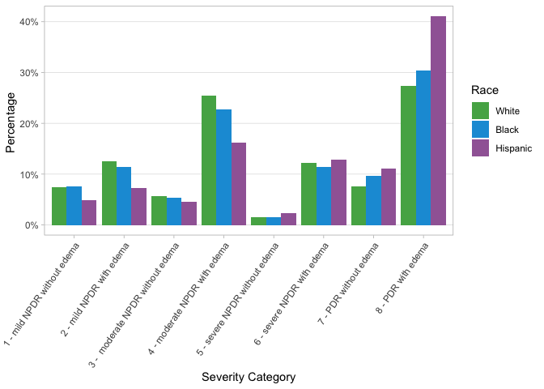<!-- -->

``` r
ggsave("graphs/figure1A.png", figure_1A, width = 10, height = 5)
```

## Figure 2A and 2B: Differences in Rates of Bevacizumab Injection by Severity Category, Race and Insurance Status

``` r
# Calculate likelihood of drug by severity score and race (given that patient received antivegf treatment)
drug_sev_cat_race <-
  timeseries_analysis %>% 
  filter(proc_group_365 == "antivegf") %>% 
  count(vision_category, race_ethnicity, vegf_group_365) %>% 
  group_by(vision_category, race_ethnicity) %>% 
  mutate(count_severity_race = sum(n)) %>% 
  mutate(prop = n / count_severity_race) %>% 
  ungroup() %>% 
  select(vision_category, race_ethnicity, vegf_group_365, prop, count = n)

drug_sev_cat_race %>% 
  arrange(desc(vision_category), race_ethnicity) #JAY changed this!! 
```

    ## # A tibble: 108 × 5
    ##    vision_category    race_ethnicity vegf_group_365   prop count
    ##    <chr>              <ord>          <chr>           <dbl> <int>
    ##  1 8 - PDR with edema White          Avastin        0.502   1830
    ##  2 8 - PDR with edema White          Eylea          0.207    755
    ##  3 8 - PDR with edema White          Lucentis       0.0945   345
    ##  4 8 - PDR with edema White          combo          0.197    719
    ##  5 8 - PDR with edema Black          Avastin        0.590    443
    ##  6 8 - PDR with edema Black          Eylea          0.142    107
    ##  7 8 - PDR with edema Black          Lucentis       0.0812    61
    ##  8 8 - PDR with edema Black          combo          0.186    140
    ##  9 8 - PDR with edema Hispanic       Avastin        0.684    735
    ## 10 8 - PDR with edema Hispanic       Eylea          0.108    116
    ## # … with 98 more rows

``` r
# Graphing likelihood of Bevacizumab by severity and race
plot_drug_sev_cat_race <-
  drug_sev_cat_race %>% 
  # remove individuals with no vision category
  filter(!is.na(vision_category), !vision_category %in% c("NA")) %>% 
  # remove combo, Eylea, and Lucentis for this graph
  filter(vegf_group_365 == "Avastin") %>% 
  # round proportion to nearest 100th
  mutate(pct_round = round(prop, 2)) %>% 
  ggplot(aes(x = vision_category, y = pct_round, fill = race_ethnicity)) +
  geom_col(position = "dodge") +
  theme_light() +
  theme(
    axis.text.x = element_text(angle = 45, hjust = 1),
    panel.grid.minor = element_blank(),
    panel.grid.major.x = element_blank()
  ) +
  #facet_grid(vegf_group_365 ~ .) +
  #geom_text(aes(label = paste0(pct_round, "%")), vjust = -0.5, position = position_dodge(width = 1)) +
  #scale_x_continuous()
  scale_y_continuous(labels = scales::label_percent(accuracy = 1), limits = c(0, 1)) +
  scale_fill_manual(values = race_colors) +
  labs(
    x = "Severity category",
    y = "Percentage of patients receiving Bevacizumab",
    fill = "Race"
  )

plot_drug_sev_cat_race
```

<!-- -->

``` r
ggsave("graphs/2A_plot_drug_sev_cat_race.png", plot_drug_sev_cat_race, width = 10, height = 5)
```

``` r
# Calculate likelihood of drug by severity score and insurance (given that patient received antivegf treatment)
drug_sev_cat_insurance <-
  timeseries_analysis %>%
  filter(proc_group_365 == "antivegf", insurance %in% c("Private", "Medicare", "Medicaid")) %>% 
  count(vision_category, insurance, vegf_group_365) %>% 
  group_by(vision_category, insurance) %>% 
  mutate(count_severity_race = sum(n)) %>% 
  mutate(prop = n / count_severity_race) %>% 
  ungroup() %>% 
  select(vision_category, insurance, vegf_group_365, prop, count = n)

drug_sev_cat_insurance %>% 
  arrange(desc(vision_category), insurance)
```

    ## # A tibble: 107 × 5
    ##    vision_category    insurance vegf_group_365   prop count
    ##    <chr>              <ord>     <chr>           <dbl> <int>
    ##  1 8 - PDR with edema Private   Avastin        0.530    819
    ##  2 8 - PDR with edema Private   Eylea          0.183    283
    ##  3 8 - PDR with edema Private   Lucentis       0.0920   142
    ##  4 8 - PDR with edema Private   combo          0.194    300
    ##  5 8 - PDR with edema Medicare  Avastin        0.530   1561
    ##  6 8 - PDR with edema Medicare  Eylea          0.192    565
    ##  7 8 - PDR with edema Medicare  Lucentis       0.0879   259
    ##  8 8 - PDR with edema Medicare  combo          0.190    561
    ##  9 8 - PDR with edema Medicaid  Avastin        0.683    330
    ## 10 8 - PDR with edema Medicaid  Eylea          0.126     61
    ## # … with 97 more rows

``` r
plot_drug_sev_cat_insurance <-
# Graphing likelihood of first drug type by severity and insurance
drug_sev_cat_insurance %>% 
  # remove individuals with no vision category
  filter(!is.na(vision_category), !vision_category %in% c("NA")) %>% 
  # remove combo, Eylea, and Lucentis for this graph
  filter(vegf_group_365 == "Avastin") %>% 
  # round proportion to nearest 100th
  mutate(pct_round = round(prop, 2)) %>%
  ggplot(aes(x = vision_category, y = prop, fill = insurance)) +
  geom_col(position = "dodge") +
  theme_light() +
  theme(
    axis.text.x = element_text(angle = 45, hjust=1),
    # remove background lines
    panel.grid.minor = element_blank(),
    panel.grid.major.x = element_blank()
  ) +
  #facet_grid(vegf_group_365~.) +
  scale_y_continuous(labels = scales::label_percent(accuracy = 1), limits = c(0, 1)) +
  # different colors for insurance
  scale_fill_manual(values = insurance_colors) +
  labs(
    x = "Severity category",
    y = "Percentage of patients receiving Bevacizumab",
    fill = "Insurance"
  )

plot_drug_sev_cat_insurance
```

<!-- -->

``` r
ggsave("graphs/2B_plot_drug_sev_cat_insurance.png", plot_drug_sev_cat_insurance, width = 10, height = 5)
```

## Regression X: Variables that influence likelihood of receiving Bevacizumab treatment

``` r
# create dataset for regression
data_avastin_reg <- 
  timeseries_analysis %>% 
  filter(
    insurance %in% c("Medicare", "Medicaid", "Private")
  ) %>% 
  mutate(
    # unorder for appropriate regression interpretation
    race_ethnicity = factor(race_ethnicity, ordered = FALSE),
    race_ethnicity = relevel(race_ethnicity, ref = "White"),
    # unorder for appropriate regression interpretation
    insurance = factor(insurance, ordered = FALSE),
    insurance = relevel(insurance, ref = "Private"),
    smoke_status = factor(smoke_status),
    smoke_status = relevel(smoke_status, ref = "No / Never"),
    avastin = if_else(vegf_group_365 == "Avastin", 1, 0)
  ) 

# glm for logistic regression
avastin_1.logm <- 
  glm(
    avastin ~ race_ethnicity + insurance + race_ethnicity * insurance + gender + first_dr_age + smoke_status + baseline_va_letter +  severity_score, 
    data = data_avastin_reg, 
    family = binomial
  ) 

summary(avastin_1.logm)
```

    ## 
    ## Call:
    ## glm(formula = avastin ~ race_ethnicity + insurance + race_ethnicity * 
    ##     insurance + gender + first_dr_age + smoke_status + baseline_va_letter + 
    ##     severity_score, family = binomial, data = data_avastin_reg)
    ## 
    ## Deviance Residuals: 
    ##     Min       1Q   Median       3Q      Max  
    ## -1.9064  -1.0988  -0.9094   1.1737   1.5980  
    ## 
    ## Coefficients:
    ##                                                               Estimate
    ## (Intercept)                                                 -0.8078209
    ## race_ethnicityBlack                                          0.1294160
    ## race_ethnicityHispanic                                       0.6059121
    ## insuranceMedicare                                            0.1027022
    ## insuranceMedicaid                                            0.4263705
    ## genderMale                                                  -0.0897833
    ## genderUnknown                                               -0.0959267
    ## first_dr_age                                                -0.0099623
    ## smoke_statusFormer / No longer active / Past History / Quit  0.0138680
    ## smoke_statusUnknown / Unclassified                           0.1180483
    ## smoke_statusYes / Active                                     0.1409853
    ## baseline_va_letter                                           0.0050255
    ## severity_score                                               0.0142587
    ## race_ethnicityBlack:insuranceMedicare                        0.1599609
    ## race_ethnicityHispanic:insuranceMedicare                     0.1343913
    ## race_ethnicityBlack:insuranceMedicaid                        0.1486693
    ## race_ethnicityHispanic:insuranceMedicaid                     0.1749217
    ##                                                             Std. Error z value
    ## (Intercept)                                                  0.1053330  -7.669
    ## race_ethnicityBlack                                          0.0611937   2.115
    ## race_ethnicityHispanic                                       0.0572690  10.580
    ## insuranceMedicare                                            0.0299268   3.432
    ## insuranceMedicaid                                            0.0596480   7.148
    ## genderMale                                                   0.0209546  -4.285
    ## genderUnknown                                                0.1564935  -0.613
    ## first_dr_age                                                 0.0010702  -9.309
    ## smoke_statusFormer / No longer active / Past History / Quit  0.0240497   0.577
    ## smoke_statusUnknown / Unclassified                           0.1008727   1.170
    ## smoke_statusYes / Active                                     0.0339608   4.151
    ## baseline_va_letter                                           0.0008121   6.189
    ## severity_score                                               0.0006960  20.487
    ## race_ethnicityBlack:insuranceMedicare                        0.0709361   2.255
    ## race_ethnicityHispanic:insuranceMedicare                     0.0695216   1.933
    ## race_ethnicityBlack:insuranceMedicaid                        0.1364150   1.090
    ## race_ethnicityHispanic:insuranceMedicaid                     0.1172241   1.492
    ##                                                             Pr(>|z|)    
    ## (Intercept)                                                 1.73e-14 ***
    ## race_ethnicityBlack                                           0.0344 *  
    ## race_ethnicityHispanic                                       < 2e-16 ***
    ## insuranceMedicare                                             0.0006 ***
    ## insuranceMedicaid                                           8.80e-13 ***
    ## genderMale                                                  1.83e-05 ***
    ## genderUnknown                                                 0.5399    
    ## first_dr_age                                                 < 2e-16 ***
    ## smoke_statusFormer / No longer active / Past History / Quit   0.5642    
    ## smoke_statusUnknown / Unclassified                            0.2419    
    ## smoke_statusYes / Active                                    3.30e-05 ***
    ## baseline_va_letter                                          6.07e-10 ***
    ## severity_score                                               < 2e-16 ***
    ## race_ethnicityBlack:insuranceMedicare                         0.0241 *  
    ## race_ethnicityHispanic:insuranceMedicare                      0.0532 .  
    ## race_ethnicityBlack:insuranceMedicaid                         0.2758    
    ## race_ethnicityHispanic:insuranceMedicaid                      0.1356    
    ## ---
    ## Signif. codes:  0 '***' 0.001 '**' 0.01 '*' 0.05 '.' 0.1 ' ' 1
    ## 
    ## (Dispersion parameter for binomial family taken to be 1)
    ## 
    ##     Null deviance: 55287  on 39907  degrees of freedom
    ## Residual deviance: 53633  on 39891  degrees of freedom
    ## AIC: 53667
    ## 
    ## Number of Fisher Scoring iterations: 4

## Regression X.2: Variables that influence likelihood of receiving Bevacizumab treatment for patients with less than 20/50 vision

Create the dataset for the regression. Dataset only includes patients
wiht less than a 20/50 vision.

``` r
# create dataset for regression
data_avastin_reg_2 <- 
  timeseries_analysis %>% 
  filter(
    insurance %in% c("Medicare", "Medicaid", "Private")
  ) %>%
  # filter for vision at or worse than 20/50
  filter(baseline_va_letter < 66) %>% 
  mutate(
    # unorder for appropriate regression interpretation
    race_ethnicity = factor(race_ethnicity, ordered = FALSE),
    race_ethnicity = relevel(race_ethnicity, ref = "White"),
    # unorder for appropriate regression interpretation
    insurance = factor(insurance, ordered = FALSE),
    insurance = relevel(insurance, ref = "Private"),
    smoke_status = factor(smoke_status),
    smoke_status = relevel(smoke_status, ref = "No / Never"),
    avastin = if_else(vegf_group_365 == "Avastin", 1, 0)
  ) 
```

#### Bevacizumab Regression: NO interaction between insurance x race

``` r
library(broom)      # for tidy model output
library(questionr)  # for odds.ratios
library(sjPlot)     # for plotting results of log.regr.
```

    ## Learn more about sjPlot with 'browseVignettes("sjPlot")'.

``` r
library(sjmisc)     # for plotting results of log.regr.
```

    ## 
    ## Attaching package: 'sjmisc'

    ## The following object is masked from 'package:purrr':
    ## 
    ##     is_empty

    ## The following object is masked from 'package:tidyr':
    ## 
    ##     replace_na

    ## The following object is masked from 'package:tibble':
    ## 
    ##     add_case

We run a logistic regression model that predicts the likelihood of
receiving bevacizumab treatment vs. not receiving bevacizumab treatment.
The model does not include an interaction term.

``` r
avastin_3.logm <-
  glm(
    avastin ~ race_ethnicity + insurance + gender + first_dr_age + smoke_status + baseline_va_letter +  severity_score, 
    data = data_avastin_reg_2, 
    family = binomial
  ) 

summary(avastin_3.logm)
```

    ## 
    ## Call:
    ## glm(formula = avastin ~ race_ethnicity + insurance + gender + 
    ##     first_dr_age + smoke_status + baseline_va_letter + severity_score, 
    ##     family = binomial, data = data_avastin_reg_2)
    ## 
    ## Deviance Residuals: 
    ##     Min       1Q   Median       3Q      Max  
    ## -1.8530  -1.1016  -0.8924   1.1834   1.6352  
    ## 
    ## Coefficients:
    ##                                                              Estimate
    ## (Intercept)                                                 -0.404264
    ## race_ethnicityBlack                                          0.304117
    ## race_ethnicityHispanic                                       0.721877
    ## insuranceMedicare                                            0.138984
    ## insuranceMedicaid                                            0.393246
    ## genderMale                                                  -0.058238
    ## genderUnknown                                               -0.103045
    ## first_dr_age                                                -0.011553
    ## smoke_statusFormer / No longer active / Past History / Quit  0.005483
    ## smoke_statusUnknown / Unclassified                          -0.040662
    ## smoke_statusYes / Active                                     0.179188
    ## baseline_va_letter                                          -0.001602
    ## severity_score                                               0.014412
    ##                                                             Std. Error z value
    ## (Intercept)                                                   0.152758  -2.646
    ## race_ethnicityBlack                                           0.044002   6.911
    ## race_ethnicityHispanic                                        0.043725  16.510
    ## insuranceMedicare                                             0.040162   3.461
    ## insuranceMedicaid                                             0.070338   5.591
    ## genderMale                                                    0.031133  -1.871
    ## genderUnknown                                                 0.216257  -0.476
    ## first_dr_age                                                  0.001559  -7.413
    ## smoke_statusFormer / No longer active / Past History / Quit   0.035669   0.154
    ## smoke_statusUnknown / Unclassified                            0.153624  -0.265
    ## smoke_statusYes / Active                                      0.050714   3.533
    ## baseline_va_letter                                            0.001490  -1.075
    ## severity_score                                                0.001048  13.750
    ##                                                             Pr(>|z|)    
    ## (Intercept)                                                 0.008134 ** 
    ## race_ethnicityBlack                                         4.80e-12 ***
    ## race_ethnicityHispanic                                       < 2e-16 ***
    ## insuranceMedicare                                           0.000539 ***
    ## insuranceMedicaid                                           2.26e-08 ***
    ## genderMale                                                  0.061395 .  
    ## genderUnknown                                               0.633722    
    ## first_dr_age                                                1.24e-13 ***
    ## smoke_statusFormer / No longer active / Past History / Quit 0.877828    
    ## smoke_statusUnknown / Unclassified                          0.791253    
    ## smoke_statusYes / Active                                    0.000410 ***
    ## baseline_va_letter                                          0.282258    
    ## severity_score                                               < 2e-16 ***
    ## ---
    ## Signif. codes:  0 '***' 0.001 '**' 0.01 '*' 0.05 '.' 0.1 ' ' 1
    ## 
    ## (Dispersion parameter for binomial family taken to be 1)
    ## 
    ##     Null deviance: 24988  on 18049  degrees of freedom
    ## Residual deviance: 24178  on 18037  degrees of freedom
    ## AIC: 24204
    ## 
    ## Number of Fisher Scoring iterations: 4

We then translate the output of the glm model into interpretable terms
(specifically, odds ratios)

``` r
modelsum_avastin3 <-
  coef(avastin_3.logm) %>% 
  tidy() %>% 
  rename(log_OR = `x`) %>% 
  left_join(confint(avastin_3.logm) %>% as_tibble(rownames = "names"), by = ("names")) %>% 
  rename(lower_log_OR    = `2.5 %`,
         upper_log_OR    = `97.5 %`) %>%
  left_join(odds.ratio(avastin_3.logm) %>% as_tibble(rownames = "names"), by = ("names")) %>% 
  rename(lower_OR        = `2.5 %`,
         upper_OR        = `97.5 %`) %>% 
  mutate(percent_change  = ifelse(OR < 1, (1/OR - 1)*-100, (OR - 1)*100  ),
         lower_percent_change = ifelse(lower_OR < 1, (1/lower_OR - 1)*-100, (lower_OR - 1)*100  ),
         upper_percent_change = ifelse(upper_OR < 1, (1/upper_OR - 1)*-100, (upper_OR - 1)*100  )) %>%
  mutate_if(is.numeric, ~round(., 3)) %>% 
  select(names, log_OR, OR, percent_change, p, everything()) %>% 
  kable()
```

    ## Warning: 'tidy.numeric' is deprecated.
    ## See help("Deprecated")

    ## Waiting for profiling to be done...
    ## Waiting for profiling to be done...

``` r
modelsum_avastin3
```

| names                                                       | log_OR |    OR | percent_change |     p | lower_log_OR | upper_log_OR | lower_OR | upper_OR | lower_percent_change | upper_percent_change |
|:------------------------------------------------------------|-------:|------:|---------------:|------:|-------------:|-------------:|---------:|---------:|---------------------:|---------------------:|
| (Intercept)                                                 | -0.404 | 0.667 |        -49.820 | 0.008 |       -0.704 |       -0.105 |    0.495 |    0.900 |             -102.125 |              -11.058 |
| race_ethnicityBlack                                         |  0.304 | 1.355 |         35.543 | 0.000 |        0.218 |        0.390 |    1.243 |    1.478 |               24.346 |               47.757 |
| race_ethnicityHispanic                                      |  0.722 | 2.058 |        105.829 | 0.000 |        0.636 |        0.808 |    1.890 |    2.243 |               88.961 |              124.293 |
| insuranceMedicare                                           |  0.139 | 1.149 |         14.911 | 0.001 |        0.060 |        0.218 |    1.062 |    1.243 |                6.217 |               24.329 |
| insuranceMedicaid                                           |  0.393 | 1.482 |         48.178 | 0.000 |        0.256 |        0.532 |    1.291 |    1.702 |               29.142 |               70.150 |
| genderMale                                                  | -0.058 | 0.943 |         -5.997 | 0.061 |       -0.119 |        0.003 |    0.888 |    1.003 |              -12.667 |                0.278 |
| genderUnknown                                               | -0.103 | 0.902 |        -10.854 | 0.634 |       -0.529 |        0.321 |    0.589 |    1.379 |              -69.765 |               37.870 |
| first_dr_age                                                | -0.012 | 0.989 |         -1.162 | 0.000 |       -0.015 |       -0.009 |    0.985 |    0.992 |               -1.472 |               -0.854 |
| smoke_statusFormer / No longer active / Past History / Quit |  0.005 | 1.005 |          0.550 | 0.878 |       -0.064 |        0.075 |    0.938 |    1.078 |               -6.656 |                7.830 |
| smoke_statusUnknown / Unclassified                          | -0.041 | 0.960 |         -4.150 | 0.791 |       -0.343 |        0.260 |    0.709 |    1.297 |              -40.944 |               29.690 |
| smoke_statusYes / Active                                    |  0.179 | 1.196 |         19.625 | 0.000 |        0.080 |        0.279 |    1.083 |    1.321 |                8.310 |               32.134 |
| baseline_va_letter                                          | -0.002 | 0.998 |         -0.160 | 0.282 |       -0.005 |        0.001 |    0.995 |    1.001 |               -0.453 |                0.132 |
| severity_score                                              |  0.014 | 1.015 |          1.452 | 0.000 |        0.012 |        0.016 |    1.012 |    1.017 |                1.244 |                1.660 |

Interpretation:

- The intercept becomes the base level and takes all the first
  (alphabetically, numerically, or in ordered factor) values of any
  variable, e.g., “female” from gender. With respect to race and
  insurance, the Intercept represents White patients on Private
  insurance.

- Hispanic patients (with vision lower than 20/50) are 106% more likely
  to receive Bevacizumab as compared to their White counterparts. The
  odds ratio of 2.058 represents the ratio of the odds of Hispanic
  patients receiving Bevacizumab as compared to the odds of White
  patients receiving Bevacizumab.

- Black patients (with vision lower than 20/50) are 35.5% more likely to
  receive Bevacizumab as compared to their White counterparts

- Patients on Medicare (with vision lower than 20/50) are 14.9% more
  likely to receive Bevacizumab as compared to their White counterparts

- Patients on Medicaid (with vision lower than 20/50) are 48.2% more
  likely to receive Bevacizumab as compared to their White counterparts

Notably, in this regression, all of these values have p values \< .01
(and for all but Medicare patients, \< .001)

#### Bevacizumab Regression: Interaction model between insurance x race

``` r
# glm for logistic regression
avastin_2.logm <- 
  glm(
    avastin ~ race_ethnicity + insurance + race_ethnicity * insurance + gender + first_dr_age + smoke_status + baseline_va_letter +  severity_score, 
    data = data_avastin_reg_2, 
    family = binomial
  ) 

summary(avastin_2.logm)
```

    ## 
    ## Call:
    ## glm(formula = avastin ~ race_ethnicity + insurance + race_ethnicity * 
    ##     insurance + gender + first_dr_age + smoke_status + baseline_va_letter + 
    ##     severity_score, family = binomial, data = data_avastin_reg_2)
    ## 
    ## Deviance Residuals: 
    ##     Min       1Q   Median       3Q      Max  
    ## -1.8950  -1.1009  -0.8906   1.1839   1.6065  
    ## 
    ## Coefficients:
    ##                                                              Estimate
    ## (Intercept)                                                 -0.362840
    ## race_ethnicityBlack                                          0.074605
    ## race_ethnicityHispanic                                       0.541937
    ## insuranceMedicare                                            0.063335
    ## insuranceMedicaid                                            0.296133
    ## genderMale                                                  -0.057309
    ## genderUnknown                                               -0.107451
    ## first_dr_age                                                -0.011316
    ## smoke_statusFormer / No longer active / Past History / Quit  0.007005
    ## smoke_statusUnknown / Unclassified                          -0.035573
    ## smoke_statusYes / Active                                     0.180788
    ## baseline_va_letter                                          -0.001602
    ## severity_score                                               0.014445
    ## race_ethnicityBlack:insuranceMedicare                        0.292341
    ## race_ethnicityHispanic:insuranceMedicare                     0.224540
    ## race_ethnicityBlack:insuranceMedicaid                        0.249941
    ## race_ethnicityHispanic:insuranceMedicaid                     0.319318
    ##                                                             Std. Error z value
    ## (Intercept)                                                   0.153321  -2.367
    ## race_ethnicityBlack                                           0.098158   0.760
    ## race_ethnicityHispanic                                        0.088590   6.117
    ## insuranceMedicare                                             0.046838   1.352
    ## insuranceMedicaid                                             0.090515   3.272
    ## genderMale                                                    0.031146  -1.840
    ## genderUnknown                                                 0.216475  -0.496
    ## first_dr_age                                                  0.001563  -7.240
    ## smoke_statusFormer / No longer active / Past History / Quit   0.035693   0.196
    ## smoke_statusUnknown / Unclassified                            0.153605  -0.232
    ## smoke_statusYes / Active                                      0.050769   3.561
    ## baseline_va_letter                                            0.001490  -1.075
    ## severity_score                                                0.001049  13.769
    ## race_ethnicityBlack:insuranceMedicare                         0.110632   2.642
    ## race_ethnicityHispanic:insuranceMedicare                      0.103467   2.170
    ## race_ethnicityBlack:insuranceMedicaid                         0.201646   1.240
    ## race_ethnicityHispanic:insuranceMedicaid                      0.171659   1.860
    ##                                                             Pr(>|z|)    
    ## (Intercept)                                                 0.017955 *  
    ## race_ethnicityBlack                                         0.447229    
    ## race_ethnicityHispanic                                      9.51e-10 ***
    ## insuranceMedicare                                           0.176313    
    ## insuranceMedicaid                                           0.001069 ** 
    ## genderMale                                                  0.065766 .  
    ## genderUnknown                                               0.619636    
    ## first_dr_age                                                4.47e-13 ***
    ## smoke_statusFormer / No longer active / Past History / Quit 0.844403    
    ## smoke_statusUnknown / Unclassified                          0.816857    
    ## smoke_statusYes / Active                                    0.000369 ***
    ## baseline_va_letter                                          0.282276    
    ## severity_score                                               < 2e-16 ***
    ## race_ethnicityBlack:insuranceMedicare                       0.008230 ** 
    ## race_ethnicityHispanic:insuranceMedicare                    0.029996 *  
    ## race_ethnicityBlack:insuranceMedicaid                       0.215159    
    ## race_ethnicityHispanic:insuranceMedicaid                    0.062859 .  
    ## ---
    ## Signif. codes:  0 '***' 0.001 '**' 0.01 '*' 0.05 '.' 0.1 ' ' 1
    ## 
    ## (Dispersion parameter for binomial family taken to be 1)
    ## 
    ##     Null deviance: 24988  on 18049  degrees of freedom
    ## Residual deviance: 24167  on 18033  degrees of freedom
    ## AIC: 24201
    ## 
    ## Number of Fisher Scoring iterations: 4

Interpretation:

- The output of this model cannot be easily interpreted. The estimates
  (log-odds ratios) for the interaction terms reported by R are not
  their real log-odds ratios. Instead, we need to add the log-odds
  rations of all the predictors participating in the particular
  interaction to the interaction coefficient reported by the model to
  give us the real log-odds ration of an interaction.

We then manually construct a more interpretable dataset:

``` r
# leverage the effects package to calculate the appropriate log-odds of each category
modelsum_avastin2 <-
  coef(avastin_2.logm) %>% 
  tidy() %>% 
  rename(wrong_log_OR = `x`) %>% 
  add_column(
    log_OR = c(
      -0.362840480, 
      0.074604515, 
      0.541937215, 
      0.063334512,
      0.296132583,
      -0.057308892,
      -0.107450836,
      -0.011315890,
      0.007005235,
      -0.035573295,
      0.180788307,
      -0.001602338,
      0.014444630, 
      0.292340917 + 0.074604515 + 0.063334512, # Black*Medicare + Black + Medicare 
      0.224539672 + 0.541937215 + 0.063334512, # Hisp*Medicare + Hisp + Medidcare 
      0.249940709 + 0.074604515 + 0.296132583, # Black*Medicaid + Black + Medicaid
      0.319317837 + 0.541937215 + 0.296132583), # Hisp*Medicaid + Hisp + Medicaid
  ) %>% 
  add_column( 
    log_odds = c(
      -0.362840480, 
      0.074604515 - 0.362840480, 
      0.541937215 - 0.362840480, 
      0.063334512 - 0.362840480,
      0.296132583 - 0.362840480,
      -0.057308892 - 0.362840480,
      -0.107450836 - 0.362840480,
      -0.011315890 - 0.362840480,
      0.007005235 - 0.362840480,
      -0.035573295 - 0.362840480,
      0.180788307 - 0.362840480,
      -0.001602338 - 0.362840480,
      0.014444630 - 0.362840480, 
      0.292340917 + 0.074604515 + 0.063334512 - 0.362840480, # Black*Medicare + Black + Medicare 
      0.224539672 + 0.541937215 + 0.063334512 - 0.362840480, # Hisp*Medicare + Hisp + Medidcare 
      0.249940709 + 0.074604515 + 0.296132583 - 0.362840480, # Black*Medicaid + Black + Medicaid
      0.319317837 + 0.541937215 + 0.296132583 - 0.362840480), # Hisp*Medicaid + Hisp + Medicaid
  ) %>% 
  add_column(wrong_OR = exp(coef(avastin_2.logm))) %>% 
  mutate(
    OR = exp(log_OR),
    `%_change`  = ifelse(OR < 1, (1/OR - 1)*-100, (OR - 1)*100),
    odds = exp(log_odds),
    probability = odds / (1 + odds)
  ) %>%
  mutate_if(is.numeric, ~round(., 3)) %>%
  kable()
```

    ## Warning: 'tidy.numeric' is deprecated.
    ## See help("Deprecated")

``` r
modelsum_avastin2
```

| names                                                       | wrong_log_OR | log_OR | log_odds | wrong_OR |    OR | %\_change |  odds | probability |
|:------------------------------------------------------------|-------------:|-------:|---------:|---------:|------:|----------:|------:|------------:|
| (Intercept)                                                 |       -0.363 | -0.363 |   -0.363 |    0.696 | 0.696 |   -43.741 | 0.696 |       0.410 |
| race_ethnicityBlack                                         |        0.075 |  0.075 |   -0.288 |    1.077 | 1.077 |     7.746 | 0.750 |       0.428 |
| race_ethnicityHispanic                                      |        0.542 |  0.542 |    0.179 |    1.719 | 1.719 |    71.933 | 1.196 |       0.545 |
| insuranceMedicare                                           |        0.063 |  0.063 |   -0.300 |    1.065 | 1.065 |     6.538 | 0.741 |       0.426 |
| insuranceMedicaid                                           |        0.296 |  0.296 |   -0.067 |    1.345 | 1.345 |    34.465 | 0.935 |       0.483 |
| genderMale                                                  |       -0.057 | -0.057 |   -0.420 |    0.944 | 0.944 |    -5.898 | 0.657 |       0.396 |
| genderUnknown                                               |       -0.107 | -0.107 |   -0.470 |    0.898 | 0.898 |   -11.344 | 0.625 |       0.385 |
| first_dr_age                                                |       -0.011 | -0.011 |   -0.374 |    0.989 | 0.989 |    -1.138 | 0.688 |       0.408 |
| smoke_statusFormer / No longer active / Past History / Quit |        0.007 |  0.007 |   -0.356 |    1.007 | 1.007 |     0.703 | 0.701 |       0.412 |
| smoke_statusUnknown / Unclassified                          |       -0.036 | -0.036 |   -0.398 |    0.965 | 0.965 |    -3.621 | 0.671 |       0.402 |
| smoke_statusYes / Active                                    |        0.181 |  0.181 |   -0.182 |    1.198 | 1.198 |    19.816 | 0.834 |       0.455 |
| baseline_va_letter                                          |       -0.002 | -0.002 |   -0.364 |    0.998 | 0.998 |    -0.160 | 0.695 |       0.410 |
| severity_score                                              |        0.014 |  0.014 |   -0.348 |    1.015 | 1.015 |     1.455 | 0.706 |       0.414 |
| race_ethnicityBlack:insuranceMedicare                       |        0.292 |  0.430 |    0.067 |    1.340 | 1.538 |    53.769 | 1.070 |       0.517 |
| race_ethnicityHispanic:insuranceMedicare                    |        0.225 |  0.830 |    0.467 |    1.252 | 2.293 |   129.289 | 1.595 |       0.615 |
| race_ethnicityBlack:insuranceMedicaid                       |        0.250 |  0.621 |    0.258 |    1.284 | 1.860 |    86.019 | 1.294 |       0.564 |
| race_ethnicityHispanic:insuranceMedicaid                    |        0.319 |  1.157 |    0.795 |    1.376 | 3.182 |   218.161 | 2.213 |       0.689 |

Interpretation:

- The intercept becomes the base level and takes all the first
  (alphabetically, numerically, or in ordered factor) values of any
  variable, e.g., “female” from gender. With respect to race and
  insurance, the Intercept represents White patients on Private
  insurance.

- When we add the interaction term between race and insurance, we find
  that Hispanic patients on Medicaid (with vision worse than 20/50) are
  218% more likely to receive Bevacizumab as compared to White patients
  on Private insurance.

- We find that Hispanic patients on Medicare (with vision worse than
  20/50) are 129% more likely to receive Bevacizumab as compared to
  White patients on Private insurance.

- The model also suggests that Black patients on private insurance are
  only slightly more likely to receive Bevacizumab treatment as compared
  with White patients.

- However, this table cannot provide us with measures of significance.
  Thus, we turn to the emmeans packages to dig into the specific
  differences between different groups:

``` r
emmeans_results <- emmeans(avastin_2.logm, ~ race_ethnicity*insurance)
emmeans_results
```

    ##  race_ethnicity insurance  emmean     SE  df asymp.LCL asymp.UCL
    ##  White          Private   -0.3190 0.0898 Inf -4.95e-01  -0.14301
    ##  Black          Private   -0.2444 0.1213 Inf -4.82e-01  -0.00674
    ##  Hispanic       Private    0.2229 0.1137 Inf  1.76e-05   0.44581
    ##  White          Medicare  -0.2557 0.0833 Inf -4.19e-01  -0.09248
    ##  Black          Medicare   0.1113 0.0924 Inf -6.99e-02   0.29245
    ##  Hispanic       Medicare   0.5108 0.0937 Inf  3.27e-01   0.69437
    ##  White          Medicaid  -0.0229 0.1157 Inf -2.50e-01   0.20385
    ##  Black          Medicaid   0.3017 0.1768 Inf -4.49e-02   0.64818
    ##  Hispanic       Medicaid   0.8384 0.1467 Inf  5.51e-01   1.12588
    ## 
    ## Results are averaged over the levels of: gender, smoke_status 
    ## Results are given on the logit (not the response) scale. 
    ## Confidence level used: 0.95

``` r
pairs(emmeans_results)
```

    ##  contrast                              estimate     SE  df z.ratio p.value
    ##  White Private - Black Private          -0.0746 0.0982 Inf  -0.760  0.9978
    ##  White Private - Hispanic Private       -0.5419 0.0886 Inf  -6.117  <.0001
    ##  White Private - White Medicare         -0.0633 0.0468 Inf  -1.352  0.9153
    ##  White Private - Black Medicare         -0.4303 0.0622 Inf  -6.918  <.0001
    ##  White Private - Hispanic Medicare      -0.8298 0.0636 Inf -13.054  <.0001
    ##  White Private - White Medicaid         -0.2961 0.0905 Inf  -3.272  0.0296
    ##  White Private - Black Medicaid         -0.6207 0.1606 Inf  -3.864  0.0036
    ##  White Private - Hispanic Medicaid      -1.1574 0.1278 Inf  -9.055  <.0001
    ##  Black Private - Hispanic Private       -0.4673 0.1208 Inf  -3.869  0.0035
    ##  Black Private - White Medicare          0.0113 0.0942 Inf   0.120  1.0000
    ##  Black Private - Black Medicare         -0.3557 0.1026 Inf  -3.468  0.0154
    ##  Black Private - Hispanic Medicare      -0.7552 0.1035 Inf  -7.296  <.0001
    ##  Black Private - White Medicaid         -0.2215 0.1224 Inf  -1.809  0.6760
    ##  Black Private - Black Medicaid         -0.5461 0.1804 Inf  -3.027  0.0622
    ##  Black Private - Hispanic Medicaid      -1.0828 0.1519 Inf  -7.127  <.0001
    ##  Hispanic Private - White Medicare       0.4786 0.0841 Inf   5.691  <.0001
    ##  Hispanic Private - Black Medicare       0.1117 0.0935 Inf   1.194  0.9580
    ##  Hispanic Private - Hispanic Medicare   -0.2879 0.0944 Inf  -3.050  0.0581
    ##  Hispanic Private - White Medicaid       0.2458 0.1149 Inf   2.139  0.4464
    ##  Hispanic Private - Black Medicaid      -0.0787 0.1754 Inf  -0.449  1.0000
    ##  Hispanic Private - Hispanic Medicaid   -0.6155 0.1460 Inf  -4.215  0.0008
    ##  White Medicare - Black Medicare        -0.3669 0.0512 Inf  -7.161  <.0001
    ##  White Medicare - Hispanic Medicare     -0.7665 0.0536 Inf -14.307  <.0001
    ##  White Medicare - White Medicaid        -0.2328 0.0876 Inf  -2.659  0.1628
    ##  White Medicare - Black Medicaid        -0.5573 0.1586 Inf  -3.514  0.0131
    ##  White Medicare - Hispanic Medicaid     -1.0941 0.1252 Inf  -8.739  <.0001
    ##  Black Medicare - Hispanic Medicare     -0.3995 0.0675 Inf  -5.917  <.0001
    ##  Black Medicare - White Medicaid         0.1341 0.0965 Inf   1.390  0.9020
    ##  Black Medicare - Black Medicaid        -0.1904 0.1636 Inf  -1.164  0.9640
    ##  Black Medicare - Hispanic Medicaid     -0.7271 0.1316 Inf  -5.526  <.0001
    ##  Hispanic Medicare - White Medicaid      0.5337 0.0974 Inf   5.478  <.0001
    ##  Hispanic Medicare - Black Medicaid      0.2091 0.1642 Inf   1.273  0.9391
    ##  Hispanic Medicare - Hispanic Medicaid  -0.3276 0.1323 Inf  -2.476  0.2437
    ##  White Medicaid - Black Medicaid        -0.3245 0.1763 Inf  -1.841  0.6548
    ##  White Medicaid - Hispanic Medicaid     -0.8613 0.1471 Inf  -5.853  <.0001
    ##  Black Medicaid - Hispanic Medicaid     -0.5367 0.1981 Inf  -2.710  0.1441
    ## 
    ## Results are averaged over the levels of: gender, smoke_status 
    ## Results are given on the log odds ratio (not the response) scale. 
    ## P value adjustment: tukey method for comparing a family of 9 estimates

``` r
contrast(emmeans_results, "revpairwise", by="insurance",adjust="holm")
```

    ## insurance = Private:
    ##  contrast         estimate     SE  df z.ratio p.value
    ##  Black - White      0.0746 0.0982 Inf   0.760  0.4472
    ##  Hispanic - White   0.5419 0.0886 Inf   6.117  <.0001
    ##  Hispanic - Black   0.4673 0.1208 Inf   3.869  0.0002
    ## 
    ## insurance = Medicare:
    ##  contrast         estimate     SE  df z.ratio p.value
    ##  Black - White      0.3669 0.0512 Inf   7.161  <.0001
    ##  Hispanic - White   0.7665 0.0536 Inf  14.307  <.0001
    ##  Hispanic - Black   0.3995 0.0675 Inf   5.917  <.0001
    ## 
    ## insurance = Medicaid:
    ##  contrast         estimate     SE  df z.ratio p.value
    ##  Black - White      0.3245 0.1763 Inf   1.841  0.0657
    ##  Hispanic - White   0.8613 0.1471 Inf   5.853  <.0001
    ##  Hispanic - Black   0.5367 0.1981 Inf   2.710  0.0135
    ## 
    ## Results are averaged over the levels of: gender, smoke_status 
    ## Results are given on the log odds ratio (not the response) scale. 
    ## P value adjustment: holm method for 3 tests

Interpretation:

- The measures above offer pairwise comparisons between patients of
  different races, controlling for insurance.
- Even comparing patients with the same insurance type, Hispanic
  patients are significantly more likely to receive Bevacizumab as
  compared to White patients
- However, significant differential treatment between Black and White
  patients is only observed among patients on Medicare.
- There are also significant differences in treatment between Black and
  Hispanic patients who are on Medicare and Medicaid.

## Regression Y: Using No-Intercept Model to Determine Variables that influence likelihood of receiving Bevacizumab treatment

``` r
no_intercept_regression_avastin_data <- 
  timeseries_analysis %>% 
  filter(
    insurance %in% c("Medicare", "Medicaid", "Private"),
    race_ethnicity %in% c("White", "Black", "Hispanic")
  ) %>% 
  mutate(
    # unorder for appropriate regression interpretation
    race_ethnicity = factor(race_ethnicity, ordered = FALSE),
    race_ethnicity = relevel(race_ethnicity, ref = "White"),
    # unorder for appropriate regression interpretation
    insurance = factor(insurance, ordered = FALSE),
    insurance = relevel(insurance, ref = "Private"),
    smoke_status = factor(smoke_status),
    smoke_status = relevel(smoke_status, ref = "No / Never"),
    avastin = if_else(vegf_group_365 == "Avastin", 1, 0)
  ) 

# glm for logistic regression
no_intercept_avastin <- 
  glm(avastin ~ 0 + gender + race_ethnicity + insurance + race_ethnicity * insurance + first_dr_age + smoke_status + baseline_va_letter +  severity_score, 
    data = no_intercept_regression_avastin_data, family = binomial(link = "probit"))


summary(no_intercept_avastin)
```

    ## 
    ## Call:
    ## glm(formula = avastin ~ 0 + gender + race_ethnicity + insurance + 
    ##     race_ethnicity * insurance + first_dr_age + smoke_status + 
    ##     baseline_va_letter + severity_score, family = binomial(link = "probit"), 
    ##     data = no_intercept_regression_avastin_data)
    ## 
    ## Deviance Residuals: 
    ##     Min       1Q   Median       3Q      Max  
    ## -1.9253  -1.0994  -0.9096   1.1738   1.6008  
    ## 
    ## Coefficients:
    ##                                                               Estimate
    ## genderFemale                                                -0.5037932
    ## genderMale                                                  -0.5597391
    ## genderUnknown                                               -0.5650720
    ## race_ethnicityBlack                                          0.0810885
    ## race_ethnicityHispanic                                       0.3771049
    ## insuranceMedicare                                            0.0633973
    ## insuranceMedicaid                                            0.2662283
    ## first_dr_age                                                -0.0061557
    ## smoke_statusFormer / No longer active / Past History / Quit  0.0085563
    ## smoke_statusUnknown / Unclassified                           0.0740108
    ## smoke_statusYes / Active                                     0.0876460
    ## baseline_va_letter                                           0.0031119
    ## severity_score                                               0.0088683
    ## race_ethnicityBlack:insuranceMedicare                        0.0995853
    ## race_ethnicityHispanic:insuranceMedicare                     0.0830372
    ## race_ethnicityBlack:insuranceMedicaid                        0.0913260
    ## race_ethnicityHispanic:insuranceMedicaid                     0.0970483
    ##                                                             Std. Error z value
    ## genderFemale                                                 0.0654273  -7.700
    ## genderMale                                                   0.0655236  -8.543
    ## genderUnknown                                                0.1166996  -4.842
    ## race_ethnicityBlack                                          0.0381826   2.124
    ## race_ethnicityHispanic                                       0.0354371  10.642
    ## insuranceMedicare                                            0.0186210   3.405
    ## insuranceMedicaid                                            0.0370600   7.184
    ## first_dr_age                                                 0.0006637  -9.274
    ## smoke_statusFormer / No longer active / Past History / Quit  0.0149401   0.573
    ## smoke_statusUnknown / Unclassified                           0.0627295   1.180
    ## smoke_statusYes / Active                                     0.0210990   4.154
    ## baseline_va_letter                                           0.0005041   6.174
    ## severity_score                                               0.0004327  20.496
    ## race_ethnicityBlack:insuranceMedicare                        0.0442568   2.250
    ## race_ethnicityHispanic:insuranceMedicare                     0.0429408   1.934
    ## race_ethnicityBlack:insuranceMedicaid                        0.0842259   1.084
    ## race_ethnicityHispanic:insuranceMedicaid                     0.0708902   1.369
    ##                                                             Pr(>|z|)    
    ## genderFemale                                                1.36e-14 ***
    ## genderMale                                                   < 2e-16 ***
    ## genderUnknown                                               1.28e-06 ***
    ## race_ethnicityBlack                                         0.033695 *  
    ## race_ethnicityHispanic                                       < 2e-16 ***
    ## insuranceMedicare                                           0.000663 ***
    ## insuranceMedicaid                                           6.78e-13 ***
    ## first_dr_age                                                 < 2e-16 ***
    ## smoke_statusFormer / No longer active / Past History / Quit 0.566844    
    ## smoke_statusUnknown / Unclassified                          0.238064    
    ## smoke_statusYes / Active                                    3.27e-05 ***
    ## baseline_va_letter                                          6.67e-10 ***
    ## severity_score                                               < 2e-16 ***
    ## race_ethnicityBlack:insuranceMedicare                       0.024438 *  
    ## race_ethnicityHispanic:insuranceMedicare                    0.053142 .  
    ## race_ethnicityBlack:insuranceMedicaid                       0.278233    
    ## race_ethnicityHispanic:insuranceMedicaid                    0.171001    
    ## ---
    ## Signif. codes:  0 '***' 0.001 '**' 0.01 '*' 0.05 '.' 0.1 ' ' 1
    ## 
    ## (Dispersion parameter for binomial family taken to be 1)
    ## 
    ##     Null deviance: 55324  on 39908  degrees of freedom
    ## Residual deviance: 53635  on 39891  degrees of freedom
    ## AIC: 53669
    ## 
    ## Number of Fisher Scoring iterations: 4

``` r
matrix_coef <- summary(no_intercept_avastin)$coefficients[,2]
matrix_coef
```

    ##                                                genderFemale 
    ##                                                0.0654273445 
    ##                                                  genderMale 
    ##                                                0.0655236267 
    ##                                               genderUnknown 
    ##                                                0.1166995914 
    ##                                         race_ethnicityBlack 
    ##                                                0.0381826037 
    ##                                      race_ethnicityHispanic 
    ##                                                0.0354371405 
    ##                                           insuranceMedicare 
    ##                                                0.0186210376 
    ##                                           insuranceMedicaid 
    ##                                                0.0370600411 
    ##                                                first_dr_age 
    ##                                                0.0006637345 
    ## smoke_statusFormer / No longer active / Past History / Quit 
    ##                                                0.0149400591 
    ##                          smoke_statusUnknown / Unclassified 
    ##                                                0.0627295072 
    ##                                    smoke_statusYes / Active 
    ##                                                0.0210989641 
    ##                                          baseline_va_letter 
    ##                                                0.0005040566 
    ##                                              severity_score 
    ##                                                0.0004326813 
    ##                       race_ethnicityBlack:insuranceMedicare 
    ##                                                0.0442567651 
    ##                    race_ethnicityHispanic:insuranceMedicare 
    ##                                                0.0429407799 
    ##                       race_ethnicityBlack:insuranceMedicaid 
    ##                                                0.0842258559 
    ##                    race_ethnicityHispanic:insuranceMedicaid 
    ##                                                0.0708901999

``` r
inv.logit(matrix_coef)
```

    ##                                                genderFemale 
    ##                                                   0.5163510 
    ##                                                  genderMale 
    ##                                                   0.5163750 
    ##                                               genderUnknown 
    ##                                                   0.5291418 
    ##                                         race_ethnicityBlack 
    ##                                                   0.5095445 
    ##                                      race_ethnicityHispanic 
    ##                                                   0.5088584 
    ##                                           insuranceMedicare 
    ##                                                   0.5046551 
    ##                                           insuranceMedicaid 
    ##                                                   0.5092639 
    ##                                                first_dr_age 
    ##                                                   0.5001659 
    ## smoke_statusFormer / No longer active / Past History / Quit 
    ##                                                   0.5037349 
    ##                          smoke_statusUnknown / Unclassified 
    ##                                                   0.5156772 
    ##                                    smoke_statusYes / Active 
    ##                                                   0.5052745 
    ##                                          baseline_va_letter 
    ##                                                   0.5001260 
    ##                                              severity_score 
    ##                                                   0.5001082 
    ##                       race_ethnicityBlack:insuranceMedicare 
    ##                                                   0.5110624 
    ##                    race_ethnicityHispanic:insuranceMedicare 
    ##                                                   0.5107335 
    ##                       race_ethnicityBlack:insuranceMedicaid 
    ##                                                   0.5210440 
    ##                    race_ethnicityHispanic:insuranceMedicaid 
    ##                                                   0.5177151

#### Forest Plot Representing Effect of Race on Bevacizumab Administration by Insurance Status

``` r
#FOREST PLOT DEMONSTRATING EFFECT OF RACE, SPLIT BY INSURANCE STATUS
Private_avastin_logreg <-
  glm(
    avastin ~ race_ethnicity + gender + first_dr_age + smoke_status + baseline_va_letter +  severity_score,
    data = timeseries_analysis %>%
      filter(
        insurance %in% c("Private"),
        race_ethnicity %in% c("White", "Black", "Hispanic"),
        gender %in% c("Male", "Female"),
        smoke_status %in% c("Yes / Active", "Former / No longer active / Past History / Quit", "No / Never")
       ) %>% 
      mutate(
        # unorder for appropriate regression interpretation
        race_ethnicity = factor(race_ethnicity, ordered = FALSE),
        race_ethnicity = relevel(race_ethnicity, ref = "White"),
        smoke_status = factor(smoke_status),
        smoke_status = relevel(smoke_status, ref = "No / Never"),
        avastin = if_else(vegf_group_365 == "Avastin", 1, 0)
      ),
    family = binomial
  )


Medicare_avastin_logreg <-
  glm(
    avastin ~ race_ethnicity + gender + first_dr_age + smoke_status + baseline_va_letter +  severity_score,
    data = timeseries_analysis %>%
      filter(
        insurance %in% c("Medicare"),
        race_ethnicity %in% c("White", "Black", "Hispanic"),
        gender %in% c("Male", "Female"),
        smoke_status %in% c("Yes / Active", "Former / No longer active / Past History / Quit", "No / Never")
       ) %>% 
      mutate(
        # unorder for appropriate regression interpretation
        race_ethnicity = factor(race_ethnicity, ordered = FALSE),
        race_ethnicity = relevel(race_ethnicity, ref = "White"),
        smoke_status = factor(smoke_status),
        smoke_status = relevel(smoke_status, ref = "No / Never"),
        avastin = if_else(vegf_group_365 == "Avastin", 1, 0)
      ),
    family = binomial
  )

Medicaid_avastin_logreg <-
  glm(
    avastin ~ race_ethnicity + gender + first_dr_age + smoke_status + baseline_va_letter +  severity_score,
    data = timeseries_analysis %>%
      filter(
        insurance %in% c("Medicaid"),
        race_ethnicity %in% c("White", "Black", "Hispanic"),
        gender %in% c("Male", "Female"),
        smoke_status %in% c("Yes / Active", "Former / No longer active / Past History / Quit", "No / Never")
       ) %>% 
      mutate(
        # unorder for appropriate regression interpretation
        race_ethnicity = factor(race_ethnicity, ordered = FALSE),
        race_ethnicity = relevel(race_ethnicity, ref = "White"),
        smoke_status = factor(smoke_status),
        smoke_status = relevel(smoke_status, ref = "No / Never"),
        avastin = if_else(vegf_group_365 == "Avastin", 1, 0)
      ),
    family = binomial
  )

#Extract values from regression output
bev_private <- summary(Private_avastin_logreg)$coefficients[1:9,]

#Convert values into data frame
bev_private = as.data.frame(bev_private)
bev_private <- tibble::rownames_to_column(bev_private, "FACTOR")

#Create limits for values
bev_private$up_error = bev_private$Estimate + 1.96*bev_private$`Std. Error`
bev_private$down_error = bev_private$Estimate - 1.96*bev_private$`Std. Error`

#Calculate odds ratios and confidence intervals
bev_private$odds <- exp(bev_private$Estimate)

bev_private$upper_limit = exp(bev_private$up_error)
bev_private$lower_limit = exp(bev_private$down_error)
bev_private
```

    ##                                                        FACTOR     Estimate
    ## 1                                                 (Intercept) -1.355822078
    ## 2                                         race_ethnicityBlack  0.104751637
    ## 3                                      race_ethnicityHispanic  0.586654132
    ## 4                                                  genderMale -0.119050313
    ## 5                                                first_dr_age -0.003133658
    ## 6 smoke_statusFormer / No longer active / Past History / Quit  0.005555526
    ## 7                                    smoke_statusYes / Active  0.058685193
    ## 8                                          baseline_va_letter  0.004792970
    ## 9                                              severity_score  0.018112175
    ##    Std. Error    z value     Pr(>|z|)      up_error   down_error      odds
    ## 1 0.202673691 -6.6896797 2.236596e-11 -0.9585816439 -1.753062512 0.2577353
    ## 2 0.061957237  1.6907087 9.089246e-02  0.2261878223 -0.016684547 1.1104348
    ## 3 0.058097909 10.0976806 5.656416e-24  0.7005260342  0.472782230 1.7979626
    ## 4 0.040383076 -2.9480249 3.198113e-03 -0.0398994842 -0.198201142 0.8877631
    ## 5 0.002032872 -1.5414930 1.231968e-01  0.0008507713 -0.007118088 0.9968712
    ## 6 0.049565841  0.1120838 9.107570e-01  0.1027045732 -0.091593522 1.0055710
    ## 7 0.065026972  0.9024746 3.668048e-01  0.1861380586 -0.068767672 1.0604414
    ## 8 0.001598574  2.9982781 2.715098e-03  0.0079261758  0.001659765 1.0048045
    ## 9 0.001360307 13.3147735 1.899476e-40  0.0207783766  0.015445974 1.0182772
    ##   upper_limit lower_limit
    ## 1   0.3834363   0.1732426
    ## 2   1.2538111   0.9834539
    ## 3   2.0148123   1.6044519
    ## 4   0.9608860   0.8202049
    ## 5   1.0008511   0.9929072
    ## 6   1.1081640   0.9124760
    ## 7   1.2045886   0.9335435
    ## 8   1.0079577   1.0016611
    ## 9   1.0209958   1.0155659

``` r
#Add a group name
bev_private$group <- "private"
bev_private$FACTOR_clean <- c("Intercept", "Black (rel to White)", "Hispanic (rel to White)", "Male (rel to Female)", "DR Diag. Age", "Former Smoker (rel to Non-Smoker)", "Current Smoker (rel to Non-Smoker)", "Baseline VA", "Severity Score")

# View(bev_private)

#MEDICARE DATA ASSEMBLY

bev_medicare <- summary(Medicare_avastin_logreg)$coefficients[1:9,]
bev_medicare = as.data.frame(bev_medicare)
bev_medicare <- tibble::rownames_to_column(bev_medicare, "FACTOR")

#Create limits for values
bev_medicare$up_error = bev_medicare$Estimate + 1.96*bev_medicare$`Std. Error`
bev_medicare$down_error = bev_medicare$Estimate - 1.96*bev_medicare$`Std. Error`

#Calculate odds ratios and confidence intervals
bev_medicare$odds <- exp(bev_medicare$Estimate)

bev_medicare$upper_limit = exp(bev_medicare$up_error)
bev_medicare$lower_limit = exp(bev_medicare$down_error)
bev_private
```

    ##                                                        FACTOR     Estimate
    ## 1                                                 (Intercept) -1.355822078
    ## 2                                         race_ethnicityBlack  0.104751637
    ## 3                                      race_ethnicityHispanic  0.586654132
    ## 4                                                  genderMale -0.119050313
    ## 5                                                first_dr_age -0.003133658
    ## 6 smoke_statusFormer / No longer active / Past History / Quit  0.005555526
    ## 7                                    smoke_statusYes / Active  0.058685193
    ## 8                                          baseline_va_letter  0.004792970
    ## 9                                              severity_score  0.018112175
    ##    Std. Error    z value     Pr(>|z|)      up_error   down_error      odds
    ## 1 0.202673691 -6.6896797 2.236596e-11 -0.9585816439 -1.753062512 0.2577353
    ## 2 0.061957237  1.6907087 9.089246e-02  0.2261878223 -0.016684547 1.1104348
    ## 3 0.058097909 10.0976806 5.656416e-24  0.7005260342  0.472782230 1.7979626
    ## 4 0.040383076 -2.9480249 3.198113e-03 -0.0398994842 -0.198201142 0.8877631
    ## 5 0.002032872 -1.5414930 1.231968e-01  0.0008507713 -0.007118088 0.9968712
    ## 6 0.049565841  0.1120838 9.107570e-01  0.1027045732 -0.091593522 1.0055710
    ## 7 0.065026972  0.9024746 3.668048e-01  0.1861380586 -0.068767672 1.0604414
    ## 8 0.001598574  2.9982781 2.715098e-03  0.0079261758  0.001659765 1.0048045
    ## 9 0.001360307 13.3147735 1.899476e-40  0.0207783766  0.015445974 1.0182772
    ##   upper_limit lower_limit   group                       FACTOR_clean
    ## 1   0.3834363   0.1732426 private                          Intercept
    ## 2   1.2538111   0.9834539 private               Black (rel to White)
    ## 3   2.0148123   1.6044519 private            Hispanic (rel to White)
    ## 4   0.9608860   0.8202049 private               Male (rel to Female)
    ## 5   1.0008511   0.9929072 private                       DR Diag. Age
    ## 6   1.1081640   0.9124760 private  Former Smoker (rel to Non-Smoker)
    ## 7   1.2045886   0.9335435 private Current Smoker (rel to Non-Smoker)
    ## 8   1.0079577   1.0016611 private                        Baseline VA
    ## 9   1.0209958   1.0155659 private                     Severity Score

``` r
#Add a group name
bev_medicare$group <- "medicare"
bev_medicare$FACTOR_clean <- c("Intercept", "Black (rel to White)", "Hispanic (rel to White)", "Male (rel to Female)", "DR Diag. Age", "Former Smoker (rel to Non-Smoker)", "Current Smoker (rel to Non-Smoker)", "Baseline VA", "Severity Score")
# View(bev_medicare)

#MEDICAID DATA ASSEMBLY
bev_medicaid <- summary(Medicaid_avastin_logreg)$coefficients[1:9,]
bev_medicaid = as.data.frame(bev_medicaid)
bev_medicaid <- tibble::rownames_to_column(bev_medicaid, "FACTOR")

#Create limits for values
bev_medicaid$up_error = bev_medicaid$Estimate + 1.96*bev_medicaid$`Std. Error`
bev_medicaid$down_error = bev_medicaid$Estimate - 1.96*bev_medicaid$`Std. Error`

#Calculate odds ratios and confidence intervals
bev_medicaid$odds <- exp(bev_medicaid$Estimate)

bev_medicaid$upper_limit = exp(bev_medicaid$up_error)
bev_medicaid$lower_limit = exp(bev_medicaid$down_error)
# View(bev_private)
# View(bev_medicare)
# View(bev_medicaid)


#Add a group name
bev_medicaid$group <- "medicaid"
bev_medicaid$FACTOR_clean <- c("Intercept", "Black (rel to White)", "Hispanic (rel to White)", "Male (rel to Female)", "DR Diag. Age", "Former Smoker (rel to Non-Smoker)", "Current Smoker (rel to Non-Smoker)", "Baseline VA", "Severity Score")

#Combine all group output information
combined_bev_insurance_output = rbind(bev_medicaid,bev_medicare, bev_private)

#Remove original factor names that created unaesthetic graph
combined_bev_insurance_output = subset(combined_bev_insurance_output, select = -c(FACTOR) )

#Remove intercept values to allow for graph interpretation
combined_bev_insurance_output<-combined_bev_insurance_output[!(combined_bev_insurance_output$FACTOR_clean=="Intercept"),]

#Create factor for group name to order the facet grids
combined_bev_insurance_output$group = factor(combined_bev_insurance_output$group, levels=c("private","medicare","medicaid"), labels = c("Private", "Medicare", "Medicaid")) 
combined_bev_insurance_output$FACTOR_clean = factor(combined_bev_insurance_output$FACTOR_clean, levels = c("Severity Score",  "Baseline VA", "Current Smoker (rel to Non-Smoker)", "Former Smoker (rel to Non-Smoker)", "DR Diag. Age", "Male (rel to Female)","Hispanic (rel to White)", "Black (rel to White)", "Intercept"))
```

``` r
plot_forest_bev_insurance <- 
  ggplot(combined_bev_insurance_output,aes(y = FACTOR_clean, x = odds))+
  geom_point()+
  facet_wrap(~group)+
  geom_segment(aes(x = lower_limit, xend = upper_limit, yend = FACTOR_clean))+
  geom_vline(lty=2, aes(xintercept=1), colour = 'red') +
  labs(y= "Factor", x = "Odds of Receiving Bevacizumab", title = "Factors Associated with Bevacizumab Treatment by Insurance") + 
  theme_bw() +
  theme(
    plot.title = element_text(hjust = 0.5),
    # remove background lines
    panel.grid.minor = element_blank(),
    panel.grid.major = element_blank()
  )


plot_forest_bev_insurance
```

<!-- -->

``` r
#ggsave("graphs/plot_forest_bev_insurance.png", plot_forest_bev_insurance, width = 10, height = 5)
```

``` r
#FOREST PLOT DEMONSTRATING EFFECT OF RACE, SPLIT BY INSURANCE STATUS
White_avastin_logreg <-
  glm(
    avastin ~ insurance + gender + first_dr_age + smoke_status + baseline_va_letter +  severity_score,
    data = timeseries_analysis %>%
      filter(
        insurance %in% c("Medicare", "Medicaid", "Private"),
        race_ethnicity %in% c("White"),
        gender %in% c("Male", "Female"),
        smoke_status %in% c("Yes / Active", "Former / No longer active / Past History / Quit", "No / Never")
       ) %>% 
      mutate(
        # unorder for appropriate regression interpretation
        insurance = factor(insurance, ordered = FALSE),
        insurance = relevel(insurance, ref = "Private"),
        smoke_status = factor(smoke_status),
        smoke_status = relevel(smoke_status, ref = "No / Never"),
        avastin = if_else(vegf_group_365 == "Avastin", 1, 0)
      ),
    family = binomial
  )

summary(White_avastin_logreg)
```

    ## 
    ## Call:
    ## glm(formula = avastin ~ insurance + gender + first_dr_age + smoke_status + 
    ##     baseline_va_letter + severity_score, family = binomial, data = timeseries_analysis %>% 
    ##     filter(insurance %in% c("Medicare", "Medicaid", "Private"), 
    ##         race_ethnicity %in% c("White"), gender %in% c("Male", 
    ##             "Female"), smoke_status %in% c("Yes / Active", "Former / No longer active / Past History / Quit", 
    ##             "No / Never")) %>% mutate(insurance = factor(insurance, 
    ##     ordered = FALSE), insurance = relevel(insurance, ref = "Private"), 
    ##     smoke_status = factor(smoke_status), smoke_status = relevel(smoke_status, 
    ##         ref = "No / Never"), avastin = if_else(vegf_group_365 == 
    ##         "Avastin", 1, 0)))
    ## 
    ## Deviance Residuals: 
    ##    Min      1Q  Median      3Q     Max  
    ## -1.609  -1.066  -0.942   1.221   1.604  
    ## 
    ## Coefficients:
    ##                                                               Estimate
    ## (Intercept)                                                 -0.8897386
    ## insuranceMedicare                                            0.0925886
    ## insuranceMedicaid                                            0.4196275
    ## genderMale                                                  -0.0862764
    ## first_dr_age                                                -0.0093570
    ## smoke_statusFormer / No longer active / Past History / Quit  0.0421730
    ## smoke_statusYes / Active                                     0.1407622
    ## baseline_va_letter                                           0.0056805
    ## severity_score                                               0.0142264
    ##                                                             Std. Error z value
    ## (Intercept)                                                  0.1244960  -7.147
    ## insuranceMedicare                                            0.0313126   2.957
    ## insuranceMedicaid                                            0.0601243   6.979
    ## genderMale                                                   0.0245280  -3.517
    ## first_dr_age                                                 0.0012814  -7.302
    ## smoke_statusFormer / No longer active / Past History / Quit  0.0278326   1.515
    ## smoke_statusYes / Active                                     0.0389402   3.615
    ## baseline_va_letter                                           0.0009696   5.858
    ## severity_score                                               0.0008229  17.289
    ##                                                             Pr(>|z|)    
    ## (Intercept)                                                 8.89e-13 ***
    ## insuranceMedicare                                           0.003107 ** 
    ## insuranceMedicaid                                           2.97e-12 ***
    ## genderMale                                                  0.000436 ***
    ## first_dr_age                                                2.84e-13 ***
    ## smoke_statusFormer / No longer active / Past History / Quit 0.129711    
    ## smoke_statusYes / Active                                    0.000301 ***
    ## baseline_va_letter                                          4.68e-09 ***
    ## severity_score                                               < 2e-16 ***
    ## ---
    ## Signif. codes:  0 '***' 0.001 '**' 0.01 '*' 0.05 '.' 0.1 ' ' 1
    ## 
    ## (Dispersion parameter for binomial family taken to be 1)
    ## 
    ##     Null deviance: 39164  on 28478  degrees of freedom
    ## Residual deviance: 38555  on 28470  degrees of freedom
    ## AIC: 38573
    ## 
    ## Number of Fisher Scoring iterations: 4

``` r
Black_avastin_logreg <-
  glm(
    avastin ~ insurance + gender + first_dr_age + smoke_status + baseline_va_letter +  severity_score,
    data = timeseries_analysis %>%
      filter(
        insurance %in% c("Medicare", "Medicaid", "Private"),
        race_ethnicity %in% c("Black"),
        gender %in% c("Male", "Female"),
        smoke_status %in% c("Yes / Active", "Former / No longer active / Past History / Quit", "No / Never")
       ) %>% 
      mutate(
        # unorder for appropriate regression interpretation
        insurance = factor(insurance, ordered = FALSE),
        insurance = relevel(insurance, ref = "Private"),
        smoke_status = factor(smoke_status),
        smoke_status = relevel(smoke_status, ref = "No / Never"),
        avastin = if_else(vegf_group_365 == "Avastin", 1, 0)
      ),
    family = binomial
  )

Hispanic_avastin_logreg <-
  glm(
    avastin ~ insurance + gender + first_dr_age + smoke_status + baseline_va_letter +  severity_score,
    data = timeseries_analysis %>%
      filter(
        insurance %in% c("Medicare", "Medicaid", "Private"),
        race_ethnicity %in% c("Hispanic"),
        gender %in% c("Male", "Female"),
        smoke_status %in% c("Yes / Active", "Former / No longer active / Past History / Quit", "No / Never")
       ) %>% 
      mutate(
        # unorder for appropriate regression interpretation
        insurance = factor(insurance, ordered = FALSE),
        insurance = relevel(insurance, ref = "Private"),
        smoke_status = factor(smoke_status),
        smoke_status = relevel(smoke_status, ref = "No / Never"),
        avastin = if_else(vegf_group_365 == "Avastin", 1, 0)
      ),
    family = binomial
  )

#Extract values from regression output
bev_white <- summary(White_avastin_logreg)$coefficients[1:9,]

#Convert values into data frame
bev_white = as.data.frame(bev_white)
bev_white <- tibble::rownames_to_column(bev_white, "FACTOR")

#Create limits for values
bev_white$up_error = bev_white$Estimate + 1.96*bev_white$`Std. Error`
bev_white$down_error = bev_white$Estimate - 1.96*bev_white$`Std. Error`

#Calculate odds ratios and confidence intervals
bev_white$odds <- exp(bev_white$Estimate)

bev_white$upper_limit = exp(bev_white$up_error)
bev_white$lower_limit = exp(bev_white$down_error)

#Add a group name
bev_white$group <- "white"
bev_white$FACTOR_clean <- c("Intercept", "Medicare (rel to Private)", "Medicaid (rel to Private)", "Male (rel to Female)", "DR Diag. Age", "Former Smoker (rel to Non-Smoker)", "Current Smoker (rel to Non-Smoker)", "Baseline VA", "Severity Score")

# View(bev_private)

#MEDICARE DATA ASSEMBLY

bev_black <- summary(Black_avastin_logreg)$coefficients[1:9,]
bev_black = as.data.frame(bev_black)
bev_black <- tibble::rownames_to_column(bev_black, "FACTOR")

#Create limits for values
bev_black$up_error = bev_black$Estimate + 1.96*bev_black$`Std. Error`
bev_black$down_error = bev_black$Estimate - 1.96*bev_black$`Std. Error`

#Calculate odds ratios and confidence intervals
bev_black$odds <- exp(bev_black$Estimate)

bev_black$upper_limit = exp(bev_black$up_error)
bev_black$lower_limit = exp(bev_black$down_error)

#Add a group name
bev_black$group <- "black"
bev_black$FACTOR_clean <- c("Intercept", "Medicare (rel to Private)", "Medicaid (rel to Private)", "Male (rel to Female)", "DR Diag. Age", "Former Smoker (rel to Non-Smoker)", "Current Smoker (rel to Non-Smoker)", "Baseline VA", "Severity Score")


#MEDICAID DATA ASSEMBLY
bev_hispanic <- summary(Hispanic_avastin_logreg)$coefficients[1:9,]
bev_hispanic = as.data.frame(bev_hispanic)
bev_hispanic <- tibble::rownames_to_column(bev_hispanic, "FACTOR")

#Create limits for values
bev_hispanic$up_error = bev_hispanic$Estimate + 1.96*bev_hispanic$`Std. Error`
bev_hispanic$down_error = bev_hispanic$Estimate - 1.96*bev_hispanic$`Std. Error`

#Calculate odds ratios and confidence intervals
bev_hispanic$odds <- exp(bev_hispanic$Estimate)

bev_hispanic$upper_limit = exp(bev_hispanic$up_error)
bev_hispanic$lower_limit = exp(bev_hispanic$down_error)


#Add a group name
bev_hispanic$group <- "hispanic"
bev_hispanic$FACTOR_clean <- c("Intercept", "Medicare (rel to Private)", "Medicaid (rel to Private)", "Male (rel to Female)", "DR Diag. Age", "Former Smoker (rel to Non-Smoker)", "Current Smoker (rel to Non-Smoker)", "Baseline VA", "Severity Score")


# View(bev_white)
# View(bev_black)
# View(bev_hispanic)

#Combine all group output information
combined_bev_race_output = rbind(bev_hispanic,bev_black,bev_white)

#Remove original factor names that created unaesthetic graph
combined_bev_race_output = subset(combined_bev_race_output, select = -c(FACTOR) )

#Remove intercept values to allow for graph interpretation
combined_bev_race_output<-combined_bev_race_output[!(combined_bev_race_output$FACTOR_clean=="Intercept"),]

#Create factor for group name to order the facet grids
combined_bev_race_output$group = factor(combined_bev_race_output$group, levels=c("white","black","hispanic"), labels = c("White", "Black", "Hispanic")) 
combined_bev_race_output$FACTOR_clean = factor(combined_bev_race_output$FACTOR_clean, levels = c("Severity Score",  "Baseline VA", "Current Smoker (rel to Non-Smoker)", "Former Smoker (rel to Non-Smoker)", "DR Diag. Age", "Male (rel to Female)","Medicaid (rel to Private)", "Medicare (rel to Private)", "Intercept"))
```

``` r
plot_forest_bev_race <- 
  ggplot(combined_bev_race_output,aes(y = FACTOR_clean, x = odds))+
  geom_point()+
  facet_wrap(~group)+
  geom_segment(aes(x = lower_limit, xend = upper_limit, yend = FACTOR_clean))+
  geom_vline(lty=2, aes(xintercept=1), colour = 'red') +
  labs(y= "Factor", x = "Odds of Receiving Bevacizumab", title = "Factors Associated with Bevacizumab Treatment by Race") + 
  theme_bw() +
  theme(
    plot.title = element_text(hjust = 0.5),
    # remove background lines
    panel.grid.minor = element_blank(),
    panel.grid.major = element_blank()
  ) 


plot_forest_bev_race 
```

<!-- -->

``` r
#ggsave("graphs/plot_forest_bev_race.png", plot_forest_bev_race, width = 10, height = 5)
```

## Supplement: Differences in Rates of Bevacizumab, Aflibercept, and Ranibizumab Injection by Severity Category, Race and Insurance Status

``` r
drug_sev_cat_race_2 <-
  drug_sev_cat_race %>% 
  # remove individuals with no vision category
  filter(!is.na(vision_category), !vision_category %in% c("NA")) %>% 
  # round proportion to nearest 100th
  mutate(pct_round = round(prop, 2))  %>% 
  mutate(
    vegf_drug_name = vegf_group_365, 
  ) 

drug_sev_cat_race_2$vegf_drug_name[drug_sev_cat_race_2$vegf_group_365=="Avastin"]<-"Bevacizumab"
drug_sev_cat_race_2$vegf_drug_name[drug_sev_cat_race_2$vegf_group_365=="Lucentis"]<-"Ranibizumab"
drug_sev_cat_race_2$vegf_drug_name[drug_sev_cat_race_2$vegf_group_365=="Eylea"]<-"Aflibercept"

plot_drug_sev_cat_race_all <- 
# Graphing likelihood of Bevacizumab by severity and race
drug_sev_cat_race_2 %>% 
  ggplot(aes(x = vision_category, y = pct_round, fill = race_ethnicity)) +
  geom_col(position = "dodge") +
  theme_bw() +
  theme(
    axis.text.x = element_text(angle = 45, hjust=1),
    # remove background lines
    panel.grid.minor = element_blank(),
    panel.grid.major.x = element_blank()
  ) +  facet_grid(vegf_drug_name ~ .) +
  #geom_text(aes(label = paste0(pct_round, "%")), vjust = -0.5, position = position_dodge(width = 1)) +
  #scale_x_continuous()
  scale_y_continuous(labels = scales::label_percent(accuracy = 1), limits = c(0, 1)) +
  scale_fill_manual(values = race_colors) +
  labs(
    x = "Severity category",
    y = "Percentage of people receiving Each Treatment",
    fill = "Race"
  )

plot_drug_sev_cat_race_all
```

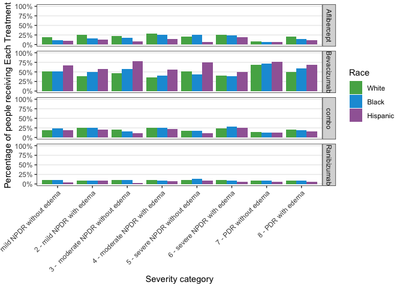<!-- -->

``` r
ggsave("graphs/SUPPLEMENT_plot_drug_sev_cat_race_all.png", plot_drug_sev_cat_race_all, width = 10, height = 7)
```

``` r
drug_sev_cat_insurance_2 <-
  drug_sev_cat_insurance %>% 
  # remove individuals with no vision category
  filter(!is.na(vision_category), !vision_category %in% c("NA")) %>% 
  # round proportion to nearest 100th
  mutate(pct_round = round(prop, 2))  %>% 
  mutate(
    vegf_drug_name = vegf_group_365, 
  ) 

drug_sev_cat_insurance_2$vegf_drug_name[drug_sev_cat_insurance_2$vegf_group_365=="Avastin"]<-"Bevacizumab"
drug_sev_cat_insurance_2$vegf_drug_name[drug_sev_cat_insurance_2$vegf_group_365=="Lucentis"]<-"Ranibizumab"
drug_sev_cat_insurance_2$vegf_drug_name[drug_sev_cat_insurance_2$vegf_group_365=="Eylea"]<-"Aflibercept"

plot_drug_sev_cat_insurance_all <-
# Graphing likelihood of first drug type by severity and insurance
drug_sev_cat_insurance_2 %>% 
  # remove individuals with no vision category
  filter(!is.na(vision_category), !vision_category %in% c("NA")) %>% 
  # round proportion to nearest 100th
  mutate(pct_round = round(prop, 2)) %>%
  ggplot(aes(x = vision_category, y = prop, fill = insurance)) +
  geom_col(position = "dodge") +
  theme_bw() +
  theme(
    axis.text.x = element_text(angle = 45, hjust=1),
    # remove background lines
    panel.grid.minor = element_blank(),
    panel.grid.major.x = element_blank()
  ) +  facet_grid(vegf_drug_name ~ .) +
  scale_y_continuous(labels = scales::label_percent(accuracy = 1), limits = c(0, 1)) +
  # different colors for insurance
  scale_fill_manual(values = insurance_colors) +
  labs(
    x = "Severity category",
    y = "Percentage of people receiving Each Treatment",
    fill = "Insurance"
  )

plot_drug_sev_cat_insurance_all
```

<!-- -->

``` r
ggsave("graphs/SUPPLEMENT_plot_drug_sev_cat_insurance_all.png", plot_drug_sev_cat_insurance_all, width = 10, height = 7)
```

## Figure 3A and 3B: Visual Acuity Change from Baseline at One and Two Years, by Race

``` r
change_15 <- 
  timeseries_analysis %>% 
  mutate(
    one_year_change = one_year - baseline_va_letter,
    two_year_change = two_year - baseline_va_letter,
    baseline_change = 0
  ) %>% 
  mutate(
    one_year_15_pt_loss = if_else(one_year_change <= -15, 1, 0),
    two_year_15_pt_loss = if_else(two_year_change <= -15, 1, 0),
    one_year_15_pt_gain = if_else(one_year_change >= 15, 1, 0),
    two_year_15_pt_gain = if_else(two_year_change >= 15, 1, 0),
  ) %>% 
  #gather(key = "time_diff", value = "va_change", baseline_change, one_year_change, two_year_change) %>% 
  ungroup()

# z value for p = .05 
z = 1.96
```

``` r
loss_15_race <-
  change_15 %>% 
  group_by(race_ethnicity) %>% 
  summarize(
    one_year_loss = sum(one_year_15_pt_loss) / n(),
    two_year_loss = sum(two_year_15_pt_loss) / n(),
    one_year_sd = sqrt(one_year_loss * (1 - one_year_loss) / n()),
    two_year_sd = sqrt(two_year_loss * (1 - two_year_loss) / n())
  ) %>% 
  gather(key = "time_diff", value = "pct_15pt_loss", one_year_loss, two_year_loss) %>% 
  mutate(
    sd = if_else(str_detect(string = time_diff, pattern = "one_year"), one_year_sd, two_year_sd),
    upper_bound = pct_15pt_loss + z * sd,
    lower_bound = pct_15pt_loss - z * sd
  ) %>%
  mutate(
    time_diff = case_when(
      time_diff == "one_year_loss" ~ "One year",
      time_diff == "two_year_loss" ~ "Two year"
    )
  )

# View(loss_15_race)

plot_loss_15_race <-
loss_15_race %>%
  ggplot(aes(x = time_diff, y = pct_15pt_loss, fill = race_ethnicity)) +
  geom_col(position = "dodge") +
  geom_errorbar(aes(ymin = lower_bound, ymax = upper_bound), position = position_dodge(width = .9), width = .3) +
  theme_light() +
  theme(
    panel.grid.minor = element_blank(),
    panel.grid.major.x = element_blank()
  ) +
  scale_y_continuous(labels = scales::label_percent(accuracy = 1)) +
  scale_fill_manual(values = race_colors) +
  labs(
    x = "Time after baseline VA measurement",
    y = "Percentage of eyes that lost 15 or more pts of VA",
    fill = "Race"
  )

plot_loss_15_race
```

<!-- -->

``` r
ggsave("graphs/3A_plot_loss_15_race.png", plot_loss_15_race, width = 7, height = 5)
```

``` r
# plot change in visual acuity by race at one and two years

va_race <-
  timeseries_analysis %>% 
  group_by(race_ethnicity) %>% 
  mutate(
    one_year_change_new = one_year - baseline_va_letter,
    two_year_change_new = two_year - baseline_va_letter
  ) %>% 
  summarize(
    baseline_va = mean(baseline_va_letter), 
    one_year_va = mean(one_year), 
    two_year_va = mean(two_year),
    baseline_sd = sd(baseline_va_letter),
    one_year_sd = sd(one_year),
    two_year_sd = sd(two_year),
    one_year_change_sd = sd(one_year_change_new),
    two_year_change_sd= sd(two_year_change_new),
    count = n()) %>% 
  gather(key = "timepoint", value = "va_plot", baseline_va, one_year_va, two_year_va) %>% 
  ungroup()

va_race_diff <-
  va_race %>% 
  spread(key = timepoint, value = va_plot) %>% 
  mutate(
    one_year_change = one_year_va - baseline_va,
    two_year_change = two_year_va - baseline_va,
    baseline = 0
  ) %>% 
  gather(key = "time_diff", value = "va_change", baseline, one_year_change, two_year_change) %>% 
  mutate(
    time_diff = case_when(
      time_diff == "baseline" ~ "Baseline",
      time_diff == "one_year_change" ~ "One year",
      time_diff == "two_year_change" ~ "Two years"
    )
  ) %>% 
  ungroup()

plot_va_race_diff <- 
  va_race_diff %>% 
  ggplot(aes(x = time_diff, y = va_change, color = race_ethnicity)) +
  geom_point() +
  geom_line(aes(group = race_ethnicity)) +
  # ggrepel::geom_text_repel(
  #   data = va_race_diff %>% filter(time_diff == "two_year_change"),
  #   aes(label = count)
  # ) +
  theme_light() +
  theme(
    panel.grid.minor.x = element_blank(),
    panel.grid.major.x = element_blank(),
    legend.position = "bottom",
    #legend.spacing.x = unit(1.0, "cm")
    legend.margin = margin(c(5, 5, 5, 0)),
    legend.text = element_text(margin = margin(r = 10, unit = "pt"))
  ) +
  scale_color_manual(values = race_colors) +
  labs(
    x = "",
    y = "Change in visual acuity (VA)",
    color = "Race"
  ) 
  # guides(
  #   fill = guide_legend(
  #     label.position = "top",
  #     #title.position = "left", 
  #   )
  # )

plot_va_race_diff
```

<!-- -->

``` r
#ggsave("graphs/3B_plot_va_race_diff.png", plot_va_race_diff, width = 7, height = 5)
```

## Figure 4A, 4B, 4C: Visual Acuity Change from Baseline at One and Two Years, by Insurance and Race

``` r
# z value for p = .05 
z = 1.96

loss_15_insurance <-
  change_15 %>% 
  group_by(insurance) %>%
  filter(!insurance %in% c("Unknown/Missing", "Military", "Govt")) %>% 
  summarize(
    one_year_loss = sum(one_year_15_pt_loss) / n(),
    two_year_loss = sum(two_year_15_pt_loss) / n(),
    one_year_sd = sqrt(one_year_loss * (1 - one_year_loss) / n()),
    two_year_sd = sqrt(two_year_loss * (1 - two_year_loss) / n())
  ) %>% 
  gather(key = "time_diff", value = "pct_15pt_loss", one_year_loss, two_year_loss) %>% 
  mutate(
    sd = if_else(str_detect(string = time_diff, pattern = "one_year"), one_year_sd, two_year_sd),
    upper_bound = pct_15pt_loss + z * sd,
    lower_bound = pct_15pt_loss - z * sd
  ) %>% 
  mutate(
    time_diff = case_when(
      time_diff == "one_year_loss" ~ "One year",
      time_diff == "two_year_loss" ~ "Two year"
    )
  )


# View(loss_15_insurance)


plot_loss_15_insurance <-
loss_15_insurance %>% 
  ggplot(aes(x = time_diff, y = pct_15pt_loss, fill = insurance)) +
  geom_col(position = "dodge") +
  geom_errorbar(aes(ymin = lower_bound, ymax = upper_bound), position = position_dodge(width = .9), width = .4) +
  theme_light() +
  theme(
    panel.grid.minor = element_blank(),
    panel.grid.major.x = element_blank()
  ) +
  scale_y_continuous(labels = scales::label_percent(accuracy = 1)) +
  scale_fill_manual(values = insurance_colors) +
  labs(
    x = "Time after baseline VA measurement",
    y = "Percentage of eyes that lost 15 or more points of VA",
    fill = "Insurance"
  )

plot_loss_15_insurance
```

<!-- -->

``` r
ggsave("graphs/4A_plot_loss_15_insurance.png", plot_loss_15_insurance, width = 7, height = 5)
```

``` r
va_insurance <-
  timeseries_analysis %>% 
  group_by(insurance) %>%
  filter(!insurance %in% c("Unknown/Missing", "Military", "Govt")) %>% 
  summarize(
    baseline_va = mean(baseline_va_letter), 
    one_year_va = mean(one_year), 
    two_year_va = mean(two_year),
    baseline_sd = sd(baseline_va_letter),
    one_year_sd = sd(one_year),
    two_year_sd = sd(two_year),
    count = n()) %>% 
  gather(key = "timepoint", value = "va_plot", baseline_va, one_year_va, two_year_va) %>% 
  ungroup()

va_insurance_diff <-
  va_insurance %>% 
  spread(key = timepoint, value = va_plot) %>% 
  mutate(
    one_year_change = one_year_va - baseline_va,
    two_year_change = two_year_va - baseline_va,
    baseline = 0
  ) %>% 
  gather(key = "time_diff", value = "va_change", baseline, one_year_change, two_year_change) %>% 
  mutate(
    time_diff = case_when(
      time_diff == "baseline" ~ "Baseline",
      time_diff == "one_year_change" ~ "One year",
      time_diff == "two_year_change" ~ "Two years"
    )
  ) %>% 
  ungroup()

plot_va_insurance_diff <-
va_insurance_diff %>% 
  ggplot(aes(x = time_diff, y = va_change, color = insurance)) +
  geom_point() +
  geom_line(aes(group = insurance)) +
  # ggrepel::geom_text_repel(
  #   data = va_insurance_diff %>% filter(time_diff == "two_year_change"),
  #   aes(label = count)
  # ) +
  theme_light() + 
  theme(
    panel.grid.minor.x = element_blank(),
    panel.grid.major.x = element_blank(),    
    legend.position = "bottom",
    #legend.spacing.x = unit(1.0, "cm")
    legend.margin = margin(c(5, 5, 5, 0)),
    legend.text = element_text(margin = margin(r = 10, unit = "pt"))
  ) +
  scale_color_manual(values = insurance_colors) +
  labs(
    x = "Time point",
    y = "Change in visual acuity",
    color = "Insurance"
  )

plot_va_insurance_diff
```

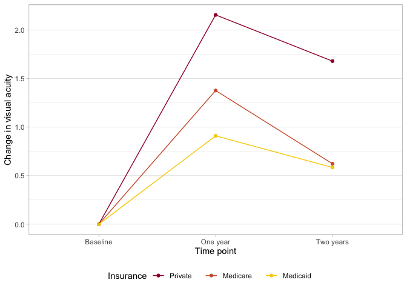<!-- -->

``` r
ggsave("graphs/4B_plot_va_insurance_diff.png", plot_va_insurance_diff, width = 7, height = 5)
```

``` r
insurance_race_va <-
  timeseries_analysis %>% 
  group_by(race_ethnicity, insurance) %>% 
  summarize(baseline_va = mean(baseline_va_letter), one_year_va = mean(one_year), two_year_va = mean(two_year), count = n()) %>% 
  gather(key = "timepoint", value = "va_plot", baseline_va, one_year_va, two_year_va)
```

    ## `summarise()` has grouped output by 'race_ethnicity'. You can override using
    ## the `.groups` argument.

``` r
va_insurance_race_diff_tbl <-
  insurance_race_va %>%
  filter(!insurance %in% c("Unknown/Missing", "Military", "Govt")) %>%
  spread(key = timepoint, value = va_plot) %>%
  mutate(
    one_year_change = one_year_va - baseline_va,
    two_year_change = two_year_va - baseline_va,
    baseline = 0
  )

va_insurance_race_diff <-
  insurance_race_va %>%
  filter(!insurance %in% c("Unknown/Missing", "Military", "Govt")) %>%
  spread(key = timepoint, value = va_plot) %>%
  mutate(
    one_year_change = one_year_va - baseline_va,
    two_year_change = two_year_va - baseline_va,
    baseline = 0
  ) %>%
  gather(key = "time_diff", value = "va_change", baseline, one_year_change, two_year_change) %>%
  mutate(
    time_diff = case_when(
      time_diff == "baseline" ~ "Baseline",
      time_diff == "one_year_change" ~ "One year",
      time_diff == "two_year_change" ~ "Two years"
    )
  ) %>% 
  ungroup()

va_insurance_race_diff_ci <-
  timeseries_analysis %>%
  mutate(
    one_year_change = one_year - baseline_va_letter,
    two_year_change = two_year - baseline_va_letter,
    baseline = 0
  ) %>%
  group_by(race_ethnicity, insurance) %>%
  summarize(
    mean_one_year_change = mean(one_year_change),
    mean_two_year_change = mean(two_year_change),
    sd_one_year_change = sd(one_year_change),
    sd_two_year_change = sd(two_year_change)
  )
```

    ## `summarise()` has grouped output by 'race_ethnicity'. You can override using
    ## the `.groups` argument.

``` r
plot_va_insurance_race_diff <-
va_insurance_race_diff %>%
  ggplot(aes(x = time_diff, y = va_change, color = race_ethnicity)) +
  geom_point() +
  geom_line(aes(group = interaction(insurance, race_ethnicity))) +
  # to display counts
  # ggrepel::geom_text_repel(
  #   data = va_insurance_race_diff %>% filter(time_diff == "two_year_change", insurance %in% c("Private", "Medicaid", "Medicare")),
  #   aes(label = count, hjust = -2)
  # ) +
  facet_grid(.~insurance) +
  theme_bw() +
  theme(
    axis.text.x = element_text(angle = 45, hjust=1),
    # remove background lines
    panel.grid.minor = element_blank(),
    panel.grid.major.x = element_blank()
  ) +
  scale_color_manual(values = race_colors) +
  labs(
    x = "Time point",
    y = "Visual acuity (VA) change",
    color = "Race"
  )

# View(va_insurance_race_diff)
plot_va_insurance_race_diff
```

<!-- -->

``` r
#ggsave("graphs/4C_plot_va_insurance_race_diff.png", plot_va_insurance_race_diff, width = 10, height = 5)
```

## Regression X: Variables that influence change in vision after one year

``` r
# linear regression with race insurance interaction and severity score
one_year_va_delta_4.lm <- 
  lm(one_year_va_delta ~ race_ethnicity + insurance + race_ethnicity * insurance + gender + first_dr_age + smoke_status + baseline_va_letter + vegf_group_365 + severity_score, 
     data = timeseries_analysis %>% 
       filter(
         insurance %in% c("Medicare", "Medicaid", "Private")
       ) %>% 
       mutate(
         race_ethnicity = factor(race_ethnicity, ordered = FALSE),
         race_ethnicity = relevel(race_ethnicity, ref = "White"),
         insurance = factor(insurance, ordered = FALSE), 
         insurance = relevel(insurance, ref = "Private"),
         smoke_status = factor(smoke_status),
         smoke_status = relevel(smoke_status, ref = "No / Never")
       )
  ) 

summary(one_year_va_delta_4.lm)
```

    ## 
    ## Call:
    ## lm(formula = one_year_va_delta ~ race_ethnicity + insurance + 
    ##     race_ethnicity * insurance + gender + first_dr_age + smoke_status + 
    ##     baseline_va_letter + vegf_group_365 + severity_score, data = timeseries_analysis %>% 
    ##     filter(insurance %in% c("Medicare", "Medicaid", "Private")) %>% 
    ##     mutate(race_ethnicity = factor(race_ethnicity, ordered = FALSE), 
    ##         race_ethnicity = relevel(race_ethnicity, ref = "White"), 
    ##         insurance = factor(insurance, ordered = FALSE), insurance = relevel(insurance, 
    ##             ref = "Private"), smoke_status = factor(smoke_status), 
    ##         smoke_status = relevel(smoke_status, ref = "No / Never")))
    ## 
    ## Residuals:
    ##     Min      1Q  Median      3Q     Max 
    ## -97.003  -4.411   1.641   6.476  42.528 
    ## 
    ## Coefficients:
    ##                                                              Estimate
    ## (Intercept)                                                 35.796414
    ## race_ethnicityBlack                                         -1.415187
    ## race_ethnicityHispanic                                      -1.279069
    ## insuranceMedicare                                           -1.658148
    ## insuranceMedicaid                                           -2.094126
    ## genderMale                                                   0.499426
    ## genderUnknown                                               -1.349028
    ## first_dr_age                                                -0.055824
    ## smoke_statusFormer / No longer active / Past History / Quit  0.172152
    ## smoke_statusUnknown / Unclassified                           0.373918
    ## smoke_statusYes / Active                                    -0.574961
    ## baseline_va_letter                                          -0.394888
    ## vegf_group_365combo                                         -0.018251
    ## vegf_group_365Eylea                                          0.541154
    ## vegf_group_365Lucentis                                       0.733181
    ## severity_score                                              -0.058738
    ## race_ethnicityBlack:insuranceMedicare                        1.281941
    ## race_ethnicityHispanic:insuranceMedicare                    -0.080459
    ## race_ethnicityBlack:insuranceMedicaid                        0.424601
    ## race_ethnicityHispanic:insuranceMedicaid                     0.457069
    ##                                                             Std. Error t value
    ## (Intercept)                                                   0.632711  56.576
    ## race_ethnicityBlack                                           0.368043  -3.845
    ## race_ethnicityHispanic                                        0.338092  -3.783
    ## insuranceMedicare                                             0.178840  -9.272
    ## insuranceMedicaid                                             0.355306  -5.894
    ## genderMale                                                    0.124640   4.007
    ## genderUnknown                                                 0.928360  -1.453
    ## first_dr_age                                                  0.006349  -8.793
    ## smoke_statusFormer / No longer active / Past History / Quit   0.143086   1.203
    ## smoke_statusUnknown / Unclassified                            0.601501   0.622
    ## smoke_statusYes / Active                                      0.202052  -2.846
    ## baseline_va_letter                                            0.004829 -81.770
    ## vegf_group_365combo                                           0.162653  -0.112
    ## vegf_group_365Eylea                                           0.168939   3.203
    ## vegf_group_365Lucentis                                        0.192395   3.811
    ## severity_score                                                0.004173 -14.076
    ## race_ethnicityBlack:insuranceMedicare                         0.426547   3.005
    ## race_ethnicityHispanic:insuranceMedicare                      0.407997  -0.197
    ## race_ethnicityBlack:insuranceMedicaid                         0.799547   0.531
    ## race_ethnicityHispanic:insuranceMedicaid                      0.653977   0.699
    ##                                                             Pr(>|t|)    
    ## (Intercept)                                                  < 2e-16 ***
    ## race_ethnicityBlack                                         0.000121 ***
    ## race_ethnicityHispanic                                      0.000155 ***
    ## insuranceMedicare                                            < 2e-16 ***
    ## insuranceMedicaid                                           3.80e-09 ***
    ## genderMale                                                  6.16e-05 ***
    ## genderUnknown                                               0.146196    
    ## first_dr_age                                                 < 2e-16 ***
    ## smoke_statusFormer / No longer active / Past History / Quit 0.228932    
    ## smoke_statusUnknown / Unclassified                          0.534182    
    ## smoke_statusYes / Active                                    0.004435 ** 
    ## baseline_va_letter                                           < 2e-16 ***
    ## vegf_group_365combo                                         0.910657    
    ## vegf_group_365Eylea                                         0.001360 ** 
    ## vegf_group_365Lucentis                                      0.000139 ***
    ## severity_score                                               < 2e-16 ***
    ## race_ethnicityBlack:insuranceMedicare                       0.002654 ** 
    ## race_ethnicityHispanic:insuranceMedicare                    0.843668    
    ## race_ethnicityBlack:insuranceMedicaid                       0.595386    
    ## race_ethnicityHispanic:insuranceMedicaid                    0.484614    
    ## ---
    ## Signif. codes:  0 '***' 0.001 '**' 0.01 '*' 0.05 '.' 0.1 ' ' 1
    ## 
    ## Residual standard error: 12.15 on 39888 degrees of freedom
    ## Multiple R-squared:  0.146,  Adjusted R-squared:  0.1456 
    ## F-statistic: 358.9 on 19 and 39888 DF,  p-value: < 2.2e-16

``` r
vif(one_year_va_delta_4.lm)
```

    ## there are higher-order terms (interactions) in this model
    ## consider setting type = 'predictor'; see ?vif

    ##                               GVIF Df GVIF^(1/(2*Df))
    ## race_ethnicity           15.239096  2        1.975786
    ## insurance                 3.058857  2        1.322482
    ## gender                    1.042937  2        1.010566
    ## first_dr_age              1.463765  1        1.209861
    ## smoke_status              1.059389  3        1.009662
    ## baseline_va_letter        1.038051  1        1.018848
    ## vegf_group_365            1.049995  3        1.008164
    ## severity_score            1.136024  1        1.065844
    ## race_ethnicity:insurance 29.014594  4        1.523446

## Regression Y: Variables that influence change in vision after one year: stratified by race and insurance status

``` r
#Race analysis: Regress data across only privately-insured patients to see effect of race on vision: 
private_only_one_year_va_delta.lm <-
  lm(one_year_va_delta ~ race_ethnicity + gender + first_dr_age + smoke_status + baseline_va_letter + vegf_group_365 + severity_score, 
     data = timeseries_analysis %>% 
       filter(
         insurance %in% c("Private"), 
         race_ethnicity %in% c("White", "Black", "Hispanic")
       ) %>% 
       mutate(
         race_ethnicity = factor(race_ethnicity, ordered = FALSE),
         race_ethnicity = relevel(race_ethnicity, ref = "White"),
         smoke_status = factor(smoke_status),
         smoke_status = relevel(smoke_status, ref = "No / Never")
       )
  ) 
summary(private_only_one_year_va_delta.lm)
```

    ## 
    ## Call:
    ## lm(formula = one_year_va_delta ~ race_ethnicity + gender + first_dr_age + 
    ##     smoke_status + baseline_va_letter + vegf_group_365 + severity_score, 
    ##     data = timeseries_analysis %>% filter(insurance %in% c("Private"), 
    ##         race_ethnicity %in% c("White", "Black", "Hispanic")) %>% 
    ##         mutate(race_ethnicity = factor(race_ethnicity, ordered = FALSE), 
    ##             race_ethnicity = relevel(race_ethnicity, ref = "White"), 
    ##             smoke_status = factor(smoke_status), smoke_status = relevel(smoke_status, 
    ##                 ref = "No / Never")))
    ## 
    ## Residuals:
    ##     Min      1Q  Median      3Q     Max 
    ## -91.434  -4.004   1.800   6.194  38.702 
    ## 
    ## Coefficients:
    ##                                                              Estimate
    ## (Intercept)                                                 43.771647
    ## race_ethnicityBlack                                         -1.374783
    ## race_ethnicityHispanic                                      -1.328633
    ## genderMale                                                   0.542346
    ## genderUnknown                                               -3.185341
    ## first_dr_age                                                -0.126832
    ## smoke_statusFormer / No longer active / Past History / Quit  0.041728
    ## smoke_statusUnknown / Unclassified                          -1.214120
    ## smoke_statusYes / Active                                    -0.894743
    ## baseline_va_letter                                          -0.456970
    ## vegf_group_365combo                                          0.267042
    ## vegf_group_365Eylea                                          0.502567
    ## vegf_group_365Lucentis                                       0.908965
    ## severity_score                                              -0.056473
    ##                                                             Std. Error t value
    ## (Intercept)                                                   1.169853  37.416
    ## race_ethnicityBlack                                           0.355329  -3.869
    ## race_ethnicityHispanic                                        0.328065  -4.050
    ## genderMale                                                    0.230981   2.348
    ## genderUnknown                                                 1.932246  -1.649
    ## first_dr_age                                                  0.011605 -10.929
    ## smoke_statusFormer / No longer active / Past History / Quit   0.284080   0.147
    ## smoke_statusUnknown / Unclassified                            0.981755  -1.237
    ## smoke_statusYes / Active                                      0.373932  -2.393
    ## baseline_va_letter                                            0.009117 -50.124
    ## vegf_group_365combo                                           0.296195   0.902
    ## vegf_group_365Eylea                                           0.313487   1.603
    ## vegf_group_365Lucentis                                        0.359964   2.525
    ## severity_score                                                0.007806  -7.234
    ##                                                             Pr(>|t|)    
    ## (Intercept)                                                  < 2e-16 ***
    ## race_ethnicityBlack                                          0.00011 ***
    ## race_ethnicityHispanic                                      5.16e-05 ***
    ## genderMale                                                   0.01889 *  
    ## genderUnknown                                                0.09928 .  
    ## first_dr_age                                                 < 2e-16 ***
    ## smoke_statusFormer / No longer active / Past History / Quit  0.88322    
    ## smoke_statusUnknown / Unclassified                           0.21623    
    ## smoke_statusYes / Active                                     0.01674 *  
    ## baseline_va_letter                                           < 2e-16 ***
    ## vegf_group_365combo                                          0.36730    
    ## vegf_group_365Eylea                                          0.10893    
    ## vegf_group_365Lucentis                                       0.01158 *  
    ## severity_score                                              4.99e-13 ***
    ## ---
    ## Signif. codes:  0 '***' 0.001 '**' 0.01 '*' 0.05 '.' 0.1 ' ' 1
    ## 
    ## Residual standard error: 11.69 on 10760 degrees of freedom
    ## Multiple R-squared:  0.1936, Adjusted R-squared:  0.1926 
    ## F-statistic: 198.7 on 13 and 10760 DF,  p-value: < 2.2e-16

``` r
vif(private_only_one_year_va_delta.lm)
```

    ##                        GVIF Df GVIF^(1/(2*Df))
    ## race_ethnicity     1.030916  2        1.007641
    ## gender             1.023550  2        1.005836
    ## first_dr_age       1.116442  1        1.056618
    ## smoke_status       1.029705  3        1.004891
    ## baseline_va_letter 1.029752  1        1.014767
    ## vegf_group_365     1.040199  3        1.006590
    ## severity_score     1.119059  1        1.057856

``` r
#Significant for both Black and Hispanic patients

Medicare_only_one_year_va_delta.lm <-
  lm(one_year_va_delta ~ race_ethnicity + gender + first_dr_age + smoke_status + baseline_va_letter + vegf_group_365 + severity_score, 
     data = timeseries_analysis %>% 
       filter(
         insurance %in% c("Medicare"), 
         race_ethnicity %in% c("White", "Black", "Hispanic")
       ) %>% 
       mutate(
         race_ethnicity = factor(race_ethnicity, ordered = FALSE),
         race_ethnicity = relevel(race_ethnicity, ref = "White"),
         smoke_status = factor(smoke_status),
         smoke_status = relevel(smoke_status, ref = "No / Never")
       )
  ) 
summary(Medicare_only_one_year_va_delta.lm)
```

    ## 
    ## Call:
    ## lm(formula = one_year_va_delta ~ race_ethnicity + gender + first_dr_age + 
    ##     smoke_status + baseline_va_letter + vegf_group_365 + severity_score, 
    ##     data = timeseries_analysis %>% filter(insurance %in% c("Medicare"), 
    ##         race_ethnicity %in% c("White", "Black", "Hispanic")) %>% 
    ##         mutate(race_ethnicity = factor(race_ethnicity, ordered = FALSE), 
    ##             race_ethnicity = relevel(race_ethnicity, ref = "White"), 
    ##             smoke_status = factor(smoke_status), smoke_status = relevel(smoke_status, 
    ##                 ref = "No / Never")))
    ## 
    ## Residuals:
    ##     Min      1Q  Median      3Q     Max 
    ## -97.338  -4.656   1.473   6.474  43.359 
    ## 
    ## Coefficients:
    ##                                                              Estimate
    ## (Intercept)                                                 30.198881
    ## race_ethnicityBlack                                         -0.061325
    ## race_ethnicityHispanic                                      -1.203384
    ## genderMale                                                   0.501450
    ## genderUnknown                                               -0.567570
    ## first_dr_age                                                -0.027554
    ## smoke_statusFormer / No longer active / Past History / Quit  0.199439
    ## smoke_statusUnknown / Unclassified                           1.085125
    ## smoke_statusYes / Active                                    -0.610803
    ## baseline_va_letter                                          -0.365196
    ## vegf_group_365combo                                         -0.050357
    ## vegf_group_365Eylea                                          0.555195
    ## vegf_group_365Lucentis                                       0.682923
    ## severity_score                                              -0.057047
    ##                                                             Std. Error t value
    ## (Intercept)                                                   0.805255  37.502
    ## race_ethnicityBlack                                           0.216054  -0.284
    ## race_ethnicityHispanic                                        0.231872  -5.190
    ## genderMale                                                    0.151871   3.302
    ## genderUnknown                                                 1.084838  -0.523
    ## first_dr_age                                                  0.007853  -3.509
    ## smoke_statusFormer / No longer active / Past History / Quit   0.168961   1.180
    ## smoke_statusUnknown / Unclassified                            0.768699   1.412
    ## smoke_statusYes / Active                                      0.251426  -2.429
    ## baseline_va_letter                                            0.005866 -62.262
    ## vegf_group_365combo                                           0.199139  -0.253
    ## vegf_group_365Eylea                                           0.202831   2.737
    ## vegf_group_365Lucentis                                        0.229209   2.979
    ## severity_score                                                0.005048 -11.300
    ##                                                             Pr(>|t|)    
    ## (Intercept)                                                  < 2e-16 ***
    ## race_ethnicityBlack                                         0.776533    
    ## race_ethnicityHispanic                                      2.12e-07 ***
    ## genderMale                                                  0.000962 ***
    ## genderUnknown                                               0.600850    
    ## first_dr_age                                                0.000451 ***
    ## smoke_statusFormer / No longer active / Past History / Quit 0.237856    
    ## smoke_statusUnknown / Unclassified                          0.158068    
    ## smoke_statusYes / Active                                    0.015132 *  
    ## baseline_va_letter                                           < 2e-16 ***
    ## vegf_group_365combo                                         0.800366    
    ## vegf_group_365Eylea                                         0.006200 ** 
    ## vegf_group_365Lucentis                                      0.002890 ** 
    ## severity_score                                               < 2e-16 ***
    ## ---
    ## Signif. codes:  0 '***' 0.001 '**' 0.01 '*' 0.05 '.' 0.1 ' ' 1
    ## 
    ## Residual standard error: 12.07 on 26645 degrees of freedom
    ## Multiple R-squared:  0.1285, Adjusted R-squared:  0.1281 
    ## F-statistic: 302.2 on 13 and 26645 DF,  p-value: < 2.2e-16

``` r
vif(Medicare_only_one_year_va_delta.lm)
```

    ##                        GVIF Df GVIF^(1/(2*Df))
    ## race_ethnicity     1.060584  2        1.014814
    ## gender             1.050827  2        1.012471
    ## first_dr_age       1.116251  1        1.056528
    ## smoke_status       1.056396  3        1.009186
    ## baseline_va_letter 1.028863  1        1.014329
    ## vegf_group_365     1.044744  3        1.007322
    ## severity_score     1.130493  1        1.063246

``` r
#Significant for Hispanic patients (***)

Medicaid_only_one_year_va_delta.lm <-
  lm(one_year_va_delta ~ race_ethnicity + gender + first_dr_age + smoke_status + baseline_va_letter + vegf_group_365 + severity_score, 
     data = timeseries_analysis %>% 
       filter(
         insurance %in% c("Medicaid"), 
         race_ethnicity %in% c("White", "Black", "Hispanic")
       ) %>% 
       mutate(
         race_ethnicity = factor(race_ethnicity, ordered = FALSE),
         race_ethnicity = relevel(race_ethnicity, ref = "White"),
         smoke_status = factor(smoke_status),
         smoke_status = relevel(smoke_status, ref = "No / Never")
       )
  ) 
summary(Medicaid_only_one_year_va_delta.lm)
```

    ## 
    ## Call:
    ## lm(formula = one_year_va_delta ~ race_ethnicity + gender + first_dr_age + 
    ##     smoke_status + baseline_va_letter + vegf_group_365 + severity_score, 
    ##     data = timeseries_analysis %>% filter(insurance %in% c("Medicaid"), 
    ##         race_ethnicity %in% c("White", "Black", "Hispanic")) %>% 
    ##         mutate(race_ethnicity = factor(race_ethnicity, ordered = FALSE), 
    ##             race_ethnicity = relevel(race_ethnicity, ref = "White"), 
    ##             smoke_status = factor(smoke_status), smoke_status = relevel(smoke_status, 
    ##                 ref = "No / Never")))
    ## 
    ## Residuals:
    ##     Min      1Q  Median      3Q     Max 
    ## -89.802  -4.149   2.701   7.872  37.376 
    ## 
    ## Coefficients:
    ##                                                              Estimate
    ## (Intercept)                                                 39.081369
    ## race_ethnicityBlack                                         -0.971798
    ## race_ethnicityHispanic                                      -0.770097
    ## genderMale                                                   0.633317
    ## genderUnknown                                               -2.508074
    ## first_dr_age                                                -0.050771
    ## smoke_statusFormer / No longer active / Past History / Quit  0.433223
    ## smoke_statusUnknown / Unclassified                           4.083183
    ## smoke_statusYes / Active                                     0.804783
    ## baseline_va_letter                                          -0.465305
    ## vegf_group_365combo                                         -0.972597
    ## vegf_group_365Eylea                                          0.458476
    ## vegf_group_365Lucentis                                       0.005743
    ## severity_score                                              -0.077166
    ##                                                             Std. Error t value
    ## (Intercept)                                                   2.753728  14.192
    ## race_ethnicityBlack                                           0.857700  -1.133
    ## race_ethnicityHispanic                                        0.692123  -1.113
    ## genderMale                                                    0.589663   1.074
    ## genderUnknown                                                 4.391231  -0.571
    ## first_dr_age                                                  0.027629  -1.838
    ## smoke_statusFormer / No longer active / Past History / Quit   0.740059   0.585
    ## smoke_statusUnknown / Unclassified                            3.269366   1.249
    ## smoke_statusYes / Active                                      0.801719   1.004
    ## baseline_va_letter                                            0.021817 -21.328
    ## vegf_group_365combo                                           0.780471  -1.246
    ## vegf_group_365Eylea                                           0.956500   0.479
    ## vegf_group_365Lucentis                                        1.179018   0.005
    ## severity_score                                                0.020275  -3.806
    ##                                                             Pr(>|t|)    
    ## (Intercept)                                                  < 2e-16 ***
    ## race_ethnicityBlack                                         0.257313    
    ## race_ethnicityHispanic                                      0.265963    
    ## genderMale                                                  0.282914    
    ## genderUnknown                                               0.567947    
    ## first_dr_age                                                0.066242 .  
    ## smoke_statusFormer / No longer active / Past History / Quit 0.558339    
    ## smoke_statusUnknown / Unclassified                          0.211812    
    ## smoke_statusYes / Active                                    0.315563    
    ## baseline_va_letter                                           < 2e-16 ***
    ## vegf_group_365combo                                         0.212822    
    ## vegf_group_365Eylea                                         0.631749    
    ## vegf_group_365Lucentis                                      0.996114    
    ## severity_score                                              0.000145 ***
    ## ---
    ## Signif. codes:  0 '***' 0.001 '**' 0.01 '*' 0.05 '.' 0.1 ' ' 1
    ## 
    ## Residual standard error: 14.48 on 2461 degrees of freedom
    ## Multiple R-squared:  0.1581, Adjusted R-squared:  0.1537 
    ## F-statistic: 35.55 on 13 and 2461 DF,  p-value: < 2.2e-16

``` r
vif(Medicaid_only_one_year_va_delta.lm)
```

    ##                        GVIF Df GVIF^(1/(2*Df))
    ## race_ethnicity     1.090547  2        1.021906
    ## gender             1.021687  2        1.005378
    ## first_dr_age       1.122245  1        1.059360
    ## smoke_status       1.066316  3        1.010759
    ## baseline_va_letter 1.021722  1        1.010803
    ## vegf_group_365     1.052504  3        1.008565
    ## severity_score     1.093542  1        1.045726

``` r
#Not significant for either Hispanic and Black patients. 


#Insurance analysis: Regress data across only White patients to see effect of insurance on vision: 
white_only_one_year_va_delta.lm <-
  lm(one_year_va_delta ~ insurance + gender + first_dr_age + smoke_status + baseline_va_letter + vegf_group_365 + severity_score, 
     data = timeseries_analysis %>% 
       filter(
         insurance %in% c("Medicare", "Medicaid", "Private"), 
         race_ethnicity %in% c("White")
       ) %>% 
       mutate(
         insurance = factor(insurance, ordered = FALSE), 
         insurance = relevel(insurance, ref = "Private"),
         smoke_status = factor(smoke_status),
         smoke_status = relevel(smoke_status, ref = "No / Never")
       )
  ) 
summary(white_only_one_year_va_delta.lm)
```

    ## 
    ## Call:
    ## lm(formula = one_year_va_delta ~ insurance + gender + first_dr_age + 
    ##     smoke_status + baseline_va_letter + vegf_group_365 + severity_score, 
    ##     data = timeseries_analysis %>% filter(insurance %in% c("Medicare", 
    ##         "Medicaid", "Private"), race_ethnicity %in% c("White")) %>% 
    ##         mutate(insurance = factor(insurance, ordered = FALSE), 
    ##             insurance = relevel(insurance, ref = "Private"), 
    ##             smoke_status = factor(smoke_status), smoke_status = relevel(smoke_status, 
    ##                 ref = "No / Never")))
    ## 
    ## Residuals:
    ##     Min      1Q  Median      3Q     Max 
    ## -96.801  -4.381   1.564   6.299  40.793 
    ## 
    ## Coefficients:
    ##                                                             Estimate Std. Error
    ## (Intercept)                                                 36.12606    0.72150
    ## insuranceMedicare                                           -1.70150    0.17958
    ## insuranceMedicaid                                           -2.06933    0.34399
    ## genderMale                                                   0.61078    0.14101
    ## genderUnknown                                               -0.89560    1.12389
    ## first_dr_age                                                -0.05316    0.00735
    ## smoke_statusFormer / No longer active / Past History / Quit  0.13789    0.16020
    ## smoke_statusUnknown / Unclassified                           0.44560    0.67344
    ## smoke_statusYes / Active                                    -0.83899    0.22531
    ## baseline_va_letter                                          -0.40117    0.00555
    ## vegf_group_365combo                                         -0.17036    0.18418
    ## vegf_group_365Eylea                                          0.50312    0.18645
    ## vegf_group_365Lucentis                                       0.60855    0.21162
    ## severity_score                                              -0.05893    0.00475
    ##                                                             t value Pr(>|t|)
    ## (Intercept)                                                  50.070  < 2e-16
    ## insuranceMedicare                                            -9.475  < 2e-16
    ## insuranceMedicaid                                            -6.016 1.81e-09
    ## genderMale                                                    4.331 1.49e-05
    ## genderUnknown                                                -0.797 0.425531
    ## first_dr_age                                                 -7.233 4.83e-13
    ## smoke_statusFormer / No longer active / Past History / Quit   0.861 0.389407
    ## smoke_statusUnknown / Unclassified                            0.662 0.508184
    ## smoke_statusYes / Active                                     -3.724 0.000197
    ## baseline_va_letter                                          -72.279  < 2e-16
    ## vegf_group_365combo                                          -0.925 0.354982
    ## vegf_group_365Eylea                                           2.698 0.006972
    ## vegf_group_365Lucentis                                        2.876 0.004034
    ## severity_score                                              -12.406  < 2e-16
    ##                                                                
    ## (Intercept)                                                 ***
    ## insuranceMedicare                                           ***
    ## insuranceMedicaid                                           ***
    ## genderMale                                                  ***
    ## genderUnknown                                                  
    ## first_dr_age                                                ***
    ## smoke_statusFormer / No longer active / Past History / Quit    
    ## smoke_statusUnknown / Unclassified                             
    ## smoke_statusYes / Active                                    ***
    ## baseline_va_letter                                          ***
    ## vegf_group_365combo                                            
    ## vegf_group_365Eylea                                         ** 
    ## vegf_group_365Lucentis                                      ** 
    ## severity_score                                              ***
    ## ---
    ## Signif. codes:  0 '***' 0.001 '**' 0.01 '*' 0.05 '.' 0.1 ' ' 1
    ## 
    ## Residual standard error: 11.73 on 28884 degrees of freedom
    ## Multiple R-squared:  0.1556, Adjusted R-squared:  0.1552 
    ## F-statistic: 409.5 on 13 and 28884 DF,  p-value: < 2.2e-16

``` r
vif(white_only_one_year_va_delta.lm)
```

    ##                        GVIF Df GVIF^(1/(2*Df))
    ## insurance          1.412047  2        1.090090
    ## gender             1.028914  2        1.007151
    ## first_dr_age       1.525838  1        1.235248
    ## smoke_status       1.056282  3        1.009168
    ## baseline_va_letter 1.035581  1        1.017635
    ## vegf_group_365     1.028440  3        1.004685
    ## severity_score     1.128845  1        1.062471

``` r
#significant worse for both Medicaid and Medicare patients (***)

black_only_one_year_va_delta.lm <-
  lm(one_year_va_delta ~ insurance + gender + first_dr_age + smoke_status + baseline_va_letter + vegf_group_365 + severity_score, 
     data = timeseries_analysis %>% 
       filter(
         insurance %in% c("Medicare", "Medicaid", "Private"), 
         race_ethnicity %in% c("Black")
       ) %>% 
       mutate(
         insurance = factor(insurance, ordered = FALSE), 
         insurance = relevel(insurance, ref = "Private"),
         smoke_status = factor(smoke_status),
         smoke_status = relevel(smoke_status, ref = "No / Never")
       )
  ) 
summary(black_only_one_year_va_delta.lm)
```

    ## 
    ## Call:
    ## lm(formula = one_year_va_delta ~ insurance + gender + first_dr_age + 
    ##     smoke_status + baseline_va_letter + vegf_group_365 + severity_score, 
    ##     data = timeseries_analysis %>% filter(insurance %in% c("Medicare", 
    ##         "Medicaid", "Private"), race_ethnicity %in% c("Black")) %>% 
    ##         mutate(insurance = factor(insurance, ordered = FALSE), 
    ##             insurance = relevel(insurance, ref = "Private"), 
    ##             smoke_status = factor(smoke_status), smoke_status = relevel(smoke_status, 
    ##                 ref = "No / Never")))
    ## 
    ## Residuals:
    ##     Min      1Q  Median      3Q     Max 
    ## -93.494  -4.701   1.690   6.708  40.669 
    ## 
    ## Coefficients:
    ##                                                             Estimate Std. Error
    ## (Intercept)                                                 30.89348    1.75615
    ## insuranceMedicare                                           -0.52084    0.44454
    ## insuranceMedicaid                                           -1.62011    0.75546
    ## genderMale                                                   0.07024    0.35757
    ## genderUnknown                                               -1.56397    2.60280
    ## first_dr_age                                                -0.03855    0.01738
    ## smoke_statusFormer / No longer active / Past History / Quit  0.61895    0.41420
    ## smoke_statusUnknown / Unclassified                           1.58699    1.71141
    ## smoke_statusYes / Active                                    -0.62547    0.59245
    ## baseline_va_letter                                          -0.37018    0.01337
    ## vegf_group_365combo                                         -0.01875    0.46112
    ## vegf_group_365Eylea                                          0.44111    0.48910
    ## vegf_group_365Lucentis                                       0.94301    0.55603
    ## severity_score                                              -0.04271    0.01157
    ##                                                             t value Pr(>|t|)
    ## (Intercept)                                                  17.592  < 2e-16
    ## insuranceMedicare                                            -1.172 0.241394
    ## insuranceMedicaid                                            -2.145 0.032035
    ## genderMale                                                    0.196 0.844274
    ## genderUnknown                                                -0.601 0.547944
    ## first_dr_age                                                 -2.218 0.026575
    ## smoke_statusFormer / No longer active / Past History / Quit   1.494 0.135145
    ## smoke_statusUnknown / Unclassified                            0.927 0.353813
    ## smoke_statusYes / Active                                     -1.056 0.291137
    ## baseline_va_letter                                          -27.697  < 2e-16
    ## vegf_group_365combo                                          -0.041 0.967559
    ## vegf_group_365Eylea                                           0.902 0.367157
    ## vegf_group_365Lucentis                                        1.696 0.089948
    ## severity_score                                               -3.692 0.000225
    ##                                                                
    ## (Intercept)                                                 ***
    ## insuranceMedicare                                              
    ## insuranceMedicaid                                           *  
    ## genderMale                                                     
    ## genderUnknown                                                  
    ## first_dr_age                                                *  
    ## smoke_statusFormer / No longer active / Past History / Quit    
    ## smoke_statusUnknown / Unclassified                             
    ## smoke_statusYes / Active                                       
    ## baseline_va_letter                                          ***
    ## vegf_group_365combo                                            
    ## vegf_group_365Eylea                                            
    ## vegf_group_365Lucentis                                      .  
    ## severity_score                                              ***
    ## ---
    ## Signif. codes:  0 '***' 0.001 '**' 0.01 '*' 0.05 '.' 0.1 ' ' 1
    ## 
    ## Residual standard error: 12.69 on 5426 degrees of freedom
    ## Multiple R-squared:  0.1252, Adjusted R-squared:  0.1231 
    ## F-statistic: 59.74 on 13 and 5426 DF,  p-value: < 2.2e-16

``` r
vif(black_only_one_year_va_delta.lm) 
```

    ##                        GVIF Df GVIF^(1/(2*Df))
    ## insurance          1.227481  2        1.052577
    ## gender             1.037313  2        1.009200
    ## first_dr_age       1.325501  1        1.151304
    ## smoke_status       1.050873  3        1.008304
    ## baseline_va_letter 1.035621  1        1.017654
    ## vegf_group_365     1.036393  3        1.005976
    ## severity_score     1.106235  1        1.051777

``` r
#barely significant worse for Medicaid patients (*)

hispanic_only_one_year_va_delta.lm <-
  lm(one_year_va_delta ~ insurance + gender + first_dr_age + smoke_status + baseline_va_letter + vegf_group_365 + severity_score, 
     data = timeseries_analysis %>% 
       filter(
         insurance %in% c("Medicare", "Medicaid", "Private"), 
         race_ethnicity %in% c("Hispanic")
       ) %>% 
       mutate(
         insurance = factor(insurance, ordered = FALSE), 
         insurance = relevel(insurance, ref = "Private"),
         smoke_status = factor(smoke_status),
         smoke_status = relevel(smoke_status, ref = "No / Never")
       )
  ) 
summary(hispanic_only_one_year_va_delta.lm)
```

    ## 
    ## Call:
    ## lm(formula = one_year_va_delta ~ insurance + gender + first_dr_age + 
    ##     smoke_status + baseline_va_letter + vegf_group_365 + severity_score, 
    ##     data = timeseries_analysis %>% filter(insurance %in% c("Medicare", 
    ##         "Medicaid", "Private"), race_ethnicity %in% c("Hispanic")) %>% 
    ##         mutate(insurance = factor(insurance, ordered = FALSE), 
    ##             insurance = relevel(insurance, ref = "Private"), 
    ##             smoke_status = factor(smoke_status), smoke_status = relevel(smoke_status, 
    ##                 ref = "No / Never")))
    ## 
    ## Residuals:
    ##     Min      1Q  Median      3Q     Max 
    ## -91.119  -4.563   2.053   7.097  43.090 
    ## 
    ## Coefficients:
    ##                                                             Estimate Std. Error
    ## (Intercept)                                                 36.67014    1.83430
    ## insuranceMedicare                                           -1.46471    0.44787
    ## insuranceMedicaid                                           -1.67683    0.62077
    ## genderMale                                                   0.34578    0.37924
    ## genderUnknown                                               -2.58824    2.20113
    ## first_dr_age                                                -0.08633    0.01798
    ## smoke_statusFormer / No longer active / Past History / Quit -0.19338    0.45567
    ## smoke_statusUnknown / Unclassified                          -1.57050    1.94155
    ## smoke_statusYes / Active                                     1.15389    0.64920
    ## baseline_va_letter                                          -0.39033    0.01397
    ## vegf_group_365combo                                          0.74704    0.49720
    ## vegf_group_365Eylea                                          0.71021    0.60442
    ## vegf_group_365Lucentis                                       1.27501    0.70645
    ## severity_score                                              -0.07412    0.01264
    ##                                                             t value Pr(>|t|)
    ## (Intercept)                                                  19.991  < 2e-16
    ## insuranceMedicare                                            -3.270  0.00108
    ## insuranceMedicaid                                            -2.701  0.00693
    ## genderMale                                                    0.912  0.36194
    ## genderUnknown                                                -1.176  0.23970
    ## first_dr_age                                                 -4.802 1.61e-06
    ## smoke_statusFormer / No longer active / Past History / Quit  -0.424  0.67130
    ## smoke_statusUnknown / Unclassified                           -0.809  0.41861
    ## smoke_statusYes / Active                                      1.777  0.07556
    ## baseline_va_letter                                          -27.933  < 2e-16
    ## vegf_group_365combo                                           1.502  0.13303
    ## vegf_group_365Eylea                                           1.175  0.24003
    ## vegf_group_365Lucentis                                        1.805  0.07116
    ## severity_score                                               -5.865 4.75e-09
    ##                                                                
    ## (Intercept)                                                 ***
    ## insuranceMedicare                                           ** 
    ## insuranceMedicaid                                           ** 
    ## genderMale                                                     
    ## genderUnknown                                                  
    ## first_dr_age                                                ***
    ## smoke_statusFormer / No longer active / Past History / Quit    
    ## smoke_statusUnknown / Unclassified                             
    ## smoke_statusYes / Active                                    .  
    ## baseline_va_letter                                          ***
    ## vegf_group_365combo                                            
    ## vegf_group_365Eylea                                            
    ## vegf_group_365Lucentis                                      .  
    ## severity_score                                              ***
    ## ---
    ## Signif. codes:  0 '***' 0.001 '**' 0.01 '*' 0.05 '.' 0.1 ' ' 1
    ## 
    ## Residual standard error: 13.62 on 5556 degrees of freedom
    ## Multiple R-squared:  0.1276, Adjusted R-squared:  0.1256 
    ## F-statistic: 62.53 on 13 and 5556 DF,  p-value: < 2.2e-16

``` r
vif(hispanic_only_one_year_va_delta.lm)
```

    ##                        GVIF Df GVIF^(1/(2*Df))
    ## insurance          1.201910  2        1.047051
    ## gender             1.068483  2        1.016698
    ## first_dr_age       1.274246  1        1.128825
    ## smoke_status       1.068082  3        1.011038
    ## baseline_va_letter 1.034518  1        1.017112
    ## vegf_group_365     1.028981  3        1.004773
    ## severity_score     1.097311  1        1.047526

``` r
#significant worse for both Medicaid and Medicare patients (**)


# Analysis:
#   - Hispanic patients have significantly worse VA outcomes after 1-year in privately-insured and Medicare populations, relative to White patients. Black patients hve significantly worse VA outcomes after 1-year in only privately-insured populations. Medicaid-based Hispanic patients and Medicaid-based White patients show no significant difference in 1-year VA outcomes.
# - Across all individual racial groups, Medicaid patients have worse VA outcomes after 1 year relative to privately-insured patients. In White and Hispanic populations, Medicare patients have significantly worse VA outcomes after 1 year relative to privately insured patients.
# 
#   Racial differences in VA change, after controlling for insurance, are evident in the privately-insured population for both Black/Hispanic patients and the Medicaid population for Hispanic patients.
```

## Regression XX: Likelihood of receiving bevacizumab

``` r
log
```

    ## function (x, base = exp(1))  .Primitive("log")

## Forest Plots on VA change

#### Forest Plot to Determine Factors Associated with VA Changes within Each Insurance Group

``` r
library(tibble)

#Race analysis: Regress data across only privately-insured patients to see effect of race on vision: 
GRAPHprivate_only_one_year_va_delta.lm <-
  lm(one_year_va_delta ~ race_ethnicity + gender + first_dr_age + smoke_status + baseline_va_letter + vegf_group_365 + severity_score, 
     data = timeseries_analysis %>% 
       filter(
         insurance %in% c("Private"), 
         race_ethnicity %in% c("White", "Black", "Hispanic"), 
         gender %in% c("Male", "Female"),
         smoke_status %in% c("Yes / Active", "Former / No longer active / Past History / Quit", "No / Never")
       ) %>% 
       mutate(
         race_ethnicity = factor(race_ethnicity, ordered = FALSE),
         race_ethnicity = relevel(race_ethnicity, ref = "White"),
         smoke_status = factor(smoke_status),
         smoke_status = relevel(smoke_status, ref = "No / Never")
       )
  ) 
summary(GRAPHprivate_only_one_year_va_delta.lm)
```

    ## 
    ## Call:
    ## lm(formula = one_year_va_delta ~ race_ethnicity + gender + first_dr_age + 
    ##     smoke_status + baseline_va_letter + vegf_group_365 + severity_score, 
    ##     data = timeseries_analysis %>% filter(insurance %in% c("Private"), 
    ##         race_ethnicity %in% c("White", "Black", "Hispanic"), 
    ##         gender %in% c("Male", "Female"), smoke_status %in% c("Yes / Active", 
    ##             "Former / No longer active / Past History / Quit", 
    ##             "No / Never")) %>% mutate(race_ethnicity = factor(race_ethnicity, 
    ##         ordered = FALSE), race_ethnicity = relevel(race_ethnicity, 
    ##         ref = "White"), smoke_status = factor(smoke_status), 
    ##         smoke_status = relevel(smoke_status, ref = "No / Never")))
    ## 
    ## Residuals:
    ##     Min      1Q  Median      3Q     Max 
    ## -91.428  -4.020   1.800   6.199  38.642 
    ## 
    ## Coefficients:
    ##                                                              Estimate
    ## (Intercept)                                                 43.844016
    ## race_ethnicityBlack                                         -1.351530
    ## race_ethnicityHispanic                                      -1.244000
    ## genderMale                                                   0.556610
    ## first_dr_age                                                -0.125930
    ## smoke_statusFormer / No longer active / Past History / Quit  0.032643
    ## smoke_statusYes / Active                                    -0.867247
    ## baseline_va_letter                                          -0.459151
    ## vegf_group_365combo                                          0.296461
    ## vegf_group_365Eylea                                          0.515857
    ## vegf_group_365Lucentis                                       0.868029
    ## severity_score                                              -0.056447
    ##                                                             Std. Error t value
    ## (Intercept)                                                   1.181141  37.120
    ## race_ethnicityBlack                                           0.358804  -3.767
    ## race_ethnicityHispanic                                        0.332029  -3.747
    ## genderMale                                                    0.232725   2.392
    ## first_dr_age                                                  0.011717 -10.748
    ## smoke_statusFormer / No longer active / Past History / Quit   0.285422   0.114
    ## smoke_statusYes / Active                                      0.375366  -2.310
    ## baseline_va_letter                                            0.009209 -49.859
    ## vegf_group_365combo                                           0.299072   0.991
    ## vegf_group_365Eylea                                           0.317117   1.627
    ## vegf_group_365Lucentis                                        0.363688   2.387
    ## severity_score                                                0.007885  -7.159
    ##                                                             Pr(>|t|)    
    ## (Intercept)                                                  < 2e-16 ***
    ## race_ethnicityBlack                                         0.000166 ***
    ## race_ethnicityHispanic                                      0.000180 ***
    ## genderMale                                                  0.016787 *  
    ## first_dr_age                                                 < 2e-16 ***
    ## smoke_statusFormer / No longer active / Past History / Quit 0.908949    
    ## smoke_statusYes / Active                                    0.020885 *  
    ## baseline_va_letter                                           < 2e-16 ***
    ## vegf_group_365combo                                         0.321577    
    ## vegf_group_365Eylea                                         0.103828    
    ## vegf_group_365Lucentis                                      0.017016 *  
    ## severity_score                                              8.65e-13 ***
    ## ---
    ## Signif. codes:  0 '***' 0.001 '**' 0.01 '*' 0.05 '.' 0.1 ' ' 1
    ## 
    ## Residual standard error: 11.72 on 10580 degrees of freedom
    ## Multiple R-squared:  0.1939, Adjusted R-squared:  0.1931 
    ## F-statistic: 231.4 on 11 and 10580 DF,  p-value: < 2.2e-16

``` r
vif(GRAPHprivate_only_one_year_va_delta.lm)
```

    ##                        GVIF Df GVIF^(1/(2*Df))
    ## race_ethnicity     1.029813  2        1.007371
    ## gender             1.019921  1        1.009911
    ## first_dr_age       1.115093  1        1.055979
    ## smoke_status       1.027669  2        1.006847
    ## baseline_va_letter 1.029965  1        1.014872
    ## vegf_group_365     1.039221  3        1.006433
    ## severity_score     1.117812  1        1.057266

``` r
#Significant for both Black and Hispanic patients

GRAPHMedicare_only_one_year_va_delta.lm <-
  lm(one_year_va_delta ~ race_ethnicity + gender + first_dr_age + smoke_status + baseline_va_letter + vegf_group_365 + severity_score, 
     data = timeseries_analysis %>% 
       filter(
         insurance %in% c("Medicare"), 
         race_ethnicity %in% c("White", "Black", "Hispanic"),
          gender %in% c("Male", "Female"),
         smoke_status %in% c("Yes / Active", "Former / No longer active / Past History / Quit", "No / Never")
       ) %>% 
       mutate(
         race_ethnicity = factor(race_ethnicity, ordered = FALSE),
         race_ethnicity = relevel(race_ethnicity, ref = "White"),
         smoke_status = factor(smoke_status),
         smoke_status = relevel(smoke_status, ref = "No / Never")
       )
  ) 
summary(GRAPHMedicare_only_one_year_va_delta.lm)
```

    ## 
    ## Call:
    ## lm(formula = one_year_va_delta ~ race_ethnicity + gender + first_dr_age + 
    ##     smoke_status + baseline_va_letter + vegf_group_365 + severity_score, 
    ##     data = timeseries_analysis %>% filter(insurance %in% c("Medicare"), 
    ##         race_ethnicity %in% c("White", "Black", "Hispanic"), 
    ##         gender %in% c("Male", "Female"), smoke_status %in% c("Yes / Active", 
    ##             "Former / No longer active / Past History / Quit", 
    ##             "No / Never")) %>% mutate(race_ethnicity = factor(race_ethnicity, 
    ##         ordered = FALSE), race_ethnicity = relevel(race_ethnicity, 
    ##         ref = "White"), smoke_status = factor(smoke_status), 
    ##         smoke_status = relevel(smoke_status, ref = "No / Never")))
    ## 
    ## Residuals:
    ##     Min      1Q  Median      3Q     Max 
    ## -97.307  -4.661   1.473   6.489  43.382 
    ## 
    ## Coefficients:
    ##                                                              Estimate
    ## (Intercept)                                                 30.063065
    ## race_ethnicityBlack                                         -0.081947
    ## race_ethnicityHispanic                                      -1.206288
    ## genderMale                                                   0.517669
    ## first_dr_age                                                -0.025886
    ## smoke_statusFormer / No longer active / Past History / Quit  0.184342
    ## smoke_statusYes / Active                                    -0.580880
    ## baseline_va_letter                                          -0.364439
    ## vegf_group_365combo                                         -0.047728
    ## vegf_group_365Eylea                                          0.552635
    ## vegf_group_365Lucentis                                       0.659919
    ## severity_score                                              -0.057463
    ##                                                             Std. Error t value
    ## (Intercept)                                                   0.811090  37.065
    ## race_ethnicityBlack                                           0.217697  -0.376
    ## race_ethnicityHispanic                                        0.233511  -5.166
    ## genderMale                                                    0.152559   3.393
    ## first_dr_age                                                  0.007913  -3.271
    ## smoke_statusFormer / No longer active / Past History / Quit   0.169426   1.088
    ## smoke_statusYes / Active                                      0.252130  -2.304
    ## baseline_va_letter                                            0.005911 -61.659
    ## vegf_group_365combo                                           0.200545  -0.238
    ## vegf_group_365Eylea                                           0.204250   2.706
    ## vegf_group_365Lucentis                                        0.230690   2.861
    ## severity_score                                                0.005081 -11.311
    ##                                                             Pr(>|t|)    
    ## (Intercept)                                                  < 2e-16 ***
    ## race_ethnicityBlack                                         0.706603    
    ## race_ethnicityHispanic                                      2.41e-07 ***
    ## genderMale                                                  0.000692 ***
    ## first_dr_age                                                0.001071 ** 
    ## smoke_statusFormer / No longer active / Past History / Quit 0.276590    
    ## smoke_statusYes / Active                                    0.021237 *  
    ## baseline_va_letter                                           < 2e-16 ***
    ## vegf_group_365combo                                         0.811888    
    ## vegf_group_365Eylea                                         0.006821 ** 
    ## vegf_group_365Lucentis                                      0.004231 ** 
    ## severity_score                                               < 2e-16 ***
    ## ---
    ## Signif. codes:  0 '***' 0.001 '**' 0.01 '*' 0.05 '.' 0.1 ' ' 1
    ## 
    ## Residual standard error: 12.07 on 26272 degrees of freedom
    ## Multiple R-squared:  0.1279, Adjusted R-squared:  0.1275 
    ## F-statistic: 350.3 on 11 and 26272 DF,  p-value: < 2.2e-16

``` r
vif(GRAPHMedicare_only_one_year_va_delta.lm)
```

    ##                        GVIF Df GVIF^(1/(2*Df))
    ## race_ethnicity     1.060121  2        1.014703
    ## gender             1.049794  1        1.024595
    ## first_dr_age       1.115898  1        1.056361
    ## smoke_status       1.055481  2        1.013591
    ## baseline_va_letter 1.028692  1        1.014245
    ## vegf_group_365     1.044098  3        1.007218
    ## severity_score     1.129020  1        1.062553

``` r
#Significant for Hispanic patients (***)

GRAPHMedicaid_only_one_year_va_delta.lm <-
  lm(one_year_va_delta ~ race_ethnicity + gender + first_dr_age + smoke_status + baseline_va_letter + vegf_group_365 + severity_score, 
     data = timeseries_analysis %>% 
       filter(
         insurance %in% c("Medicaid"), 
         race_ethnicity %in% c("White", "Black", "Hispanic"),
        gender %in% c("Male", "Female"),
         smoke_status %in% c("Yes / Active", "Former / No longer active / Past History / Quit", "No / Never")
       ) %>% 
       mutate(
         race_ethnicity = factor(race_ethnicity, ordered = FALSE),
         race_ethnicity = relevel(race_ethnicity, ref = "White"),
         smoke_status = factor(smoke_status),
         smoke_status = relevel(smoke_status, ref = "No / Never")
       )
  ) 
summary(GRAPHMedicaid_only_one_year_va_delta.lm)
```

    ## 
    ## Call:
    ## lm(formula = one_year_va_delta ~ race_ethnicity + gender + first_dr_age + 
    ##     smoke_status + baseline_va_letter + vegf_group_365 + severity_score, 
    ##     data = timeseries_analysis %>% filter(insurance %in% c("Medicaid"), 
    ##         race_ethnicity %in% c("White", "Black", "Hispanic"), 
    ##         gender %in% c("Male", "Female"), smoke_status %in% c("Yes / Active", 
    ##             "Former / No longer active / Past History / Quit", 
    ##             "No / Never")) %>% mutate(race_ethnicity = factor(race_ethnicity, 
    ##         ordered = FALSE), race_ethnicity = relevel(race_ethnicity, 
    ##         ref = "White"), smoke_status = factor(smoke_status), 
    ##         smoke_status = relevel(smoke_status, ref = "No / Never")))
    ## 
    ## Residuals:
    ##     Min      1Q  Median      3Q     Max 
    ## -89.722  -4.115   2.731   7.875  37.286 
    ## 
    ## Coefficients:
    ##                                                             Estimate Std. Error
    ## (Intercept)                                                 38.95309    2.77636
    ## race_ethnicityBlack                                         -0.85693    0.86500
    ## race_ethnicityHispanic                                      -0.66600    0.69947
    ## genderMale                                                   0.60984    0.59398
    ## first_dr_age                                                -0.05068    0.02787
    ## smoke_statusFormer / No longer active / Past History / Quit  0.52370    0.74533
    ## smoke_statusYes / Active                                     0.85106    0.80528
    ## baseline_va_letter                                          -0.46504    0.02202
    ## vegf_group_365combo                                         -0.90769    0.78824
    ## vegf_group_365Eylea                                          0.52682    0.96773
    ## vegf_group_365Lucentis                                       0.03281    1.18398
    ## severity_score                                              -0.07684    0.02045
    ##                                                             t value Pr(>|t|)
    ## (Intercept)                                                  14.030  < 2e-16
    ## race_ethnicityBlack                                          -0.991 0.321945
    ## race_ethnicityHispanic                                       -0.952 0.341114
    ## genderMale                                                    1.027 0.304663
    ## first_dr_age                                                 -1.819 0.069101
    ## smoke_statusFormer / No longer active / Past History / Quit   0.703 0.482347
    ## smoke_statusYes / Active                                      1.057 0.290687
    ## baseline_va_letter                                          -21.119  < 2e-16
    ## vegf_group_365combo                                          -1.152 0.249621
    ## vegf_group_365Eylea                                           0.544 0.586229
    ## vegf_group_365Lucentis                                        0.028 0.977897
    ## severity_score                                               -3.758 0.000175
    ##                                                                
    ## (Intercept)                                                 ***
    ## race_ethnicityBlack                                            
    ## race_ethnicityHispanic                                         
    ## genderMale                                                     
    ## first_dr_age                                                .  
    ## smoke_statusFormer / No longer active / Past History / Quit    
    ## smoke_statusYes / Active                                       
    ## baseline_va_letter                                          ***
    ## vegf_group_365combo                                            
    ## vegf_group_365Eylea                                            
    ## vegf_group_365Lucentis                                         
    ## severity_score                                              ***
    ## ---
    ## Signif. codes:  0 '***' 0.001 '**' 0.01 '*' 0.05 '.' 0.1 ' ' 1
    ## 
    ## Residual standard error: 14.54 on 2432 degrees of freedom
    ## Multiple R-squared:  0.1567, Adjusted R-squared:  0.1529 
    ## F-statistic: 41.08 on 11 and 2432 DF,  p-value: < 2.2e-16

``` r
vif(GRAPHMedicaid_only_one_year_va_delta.lm)
```

    ##                        GVIF Df GVIF^(1/(2*Df))
    ## race_ethnicity     1.090776  2        1.021960
    ## gender             1.017410  1        1.008667
    ## first_dr_age       1.117917  1        1.057316
    ## smoke_status       1.061057  2        1.014927
    ## baseline_va_letter 1.021209  1        1.010549
    ## vegf_group_365     1.052840  3        1.008619
    ## severity_score     1.092616  1        1.045283

``` r
#Not significant for either Hispanic and Black patients. 


#Extract values from regression output
private_output <- summary(GRAPHprivate_only_one_year_va_delta.lm)$coefficients[1:12,]

#Convert values into data frame
private_output = as.data.frame(private_output)
private_output <- tibble::rownames_to_column(private_output, "FACTOR")

#Create limits for values
private_output$upper_limit = private_output$Estimate + 1.96*private_output$`Std. Error`
private_output$lower_limit = private_output$Estimate - 1.96*private_output$`Std. Error`

#Add a group name
private_output$group <- "private"
private_output$FACTOR_clean <- c("Intercept", "Black (rel to White)", "Hispanic (rel to White)", "Male (rel to Female)", "DR Diag. Age", "Former Smoker (rel to Non-Smoker)", "Current Smoker (rel to Non-Smoker)", "Baseline VA", "Combo (rel to Bevacizumab)", "Aflibercept (rel to Bevacizumab)", "Ranibizumab (rel to Bevacizumab)", "Severity Score")

# View(private_output)


#Repeat steps for other groups:

medicare_output <- summary(GRAPHMedicare_only_one_year_va_delta.lm)$coefficients[1:12,]
medicare_output = as.data.frame(medicare_output)
medicare_output <- tibble::rownames_to_column(medicare_output, "FACTOR")
medicare_output$upper_limit = medicare_output$Estimate + 1.96*medicare_output$`Std. Error`
medicare_output$lower_limit = medicare_output$Estimate - 1.96*medicare_output$`Std. Error`
medicare_output$group <- "medicare"
medicare_output$FACTOR_clean <- c("Intercept", "Black (rel to White)", "Hispanic (rel to White)", "Male (rel to Female)", "DR Diag. Age", "Former Smoker (rel to Non-Smoker)", "Current Smoker (rel to Non-Smoker)", "Baseline VA", "Combo (rel to Bevacizumab)", "Aflibercept (rel to Bevacizumab)", "Ranibizumab (rel to Bevacizumab)", "Severity Score")
#Convert group name into a factor

# View(medicare_output)


medicaid_output <- summary(GRAPHMedicaid_only_one_year_va_delta.lm)$coefficients[1:12,]
medicaid_output = as.data.frame(medicaid_output)
medicaid_output <- tibble::rownames_to_column(medicaid_output, "FACTOR")
medicaid_output$upper_limit = medicaid_output$Estimate + 1.96*medicaid_output$`Std. Error`
medicaid_output$lower_limit = medicaid_output$Estimate - 1.96*medicaid_output$`Std. Error`
medicaid_output$group <- "medicaid"
medicaid_output$FACTOR_clean <- c("Intercept", "Black (rel to White)", "Hispanic (rel to White)", "Male (rel to Female)", "DR Diag. Age", "Former Smoker (rel to Non-Smoker)", "Current Smoker (rel to Non-Smoker)", "Baseline VA", "Combo (rel to Bevacizumab)", "Aflibercept (rel to Bevacizumab)", "Ranibizumab (rel to Bevacizumab)", "Severity Score")
#Convert group name into a factor


#Combine all group output information
combined_output = rbind(medicaid_output,medicare_output, private_output)

#Remove original factor names that created unaesthetic graph
combined_output = subset(combined_output, select = -c(FACTOR) )
combined_output$FACTOR_clean = factor(medicaid_output$FACTOR_clean, levels = c("Severity Score", "Ranibizumab (rel to Bevacizumab)", "Aflibercept (rel to Bevacizumab)", "Combo (rel to Bevacizumab)", "Baseline VA", "Current Smoker (rel to Non-Smoker)", "Former Smoker (rel to Non-Smoker)",  "DR Diag. Age", "Male (rel to Female)","Hispanic (rel to White)", "Black (rel to White)", "Intercept"))

#Remove intercept values to allow for graph interpretation
combined_output<-combined_output[!(combined_output$FACTOR_clean=="Intercept"),]

#Create factor for group name to order the facet grids
combined_output$group = factor(combined_output$group, levels=c("private","medicare","medicaid"), labels = c("Private", "Medicare", "Medicaid")) 
```

``` r
forest_va_change_insurance <- 
  ggplot(combined_output, aes(y = FACTOR_clean, x = Estimate))+
  geom_point() +
  facet_wrap(~group)+
  geom_segment(aes(x = lower_limit, xend = upper_limit, yend = FACTOR_clean))+
  geom_vline(lty = 2, aes(xintercept=0), colour = 'red') +
  theme_bw() +
  theme(
    plot.title = element_text(hjust = 0.5),
    # remove background lines
    panel.grid.minor = element_blank(),
    panel.grid.major = element_blank()
  ) +
  labs(
    y = "Factor", 
    x = "Relative Effect on VA after 1 year", 
    title = "Factors Associated with Changes in VA by Insurance"
  )

forest_va_change_insurance
```

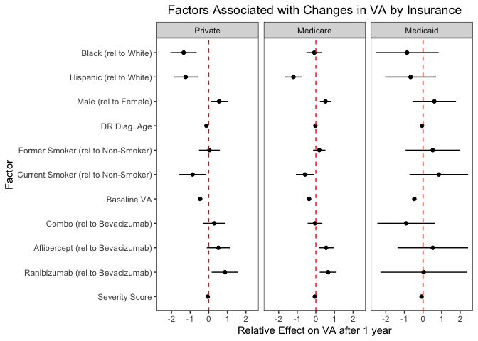<!-- -->

``` r
ggsave("graphs/forest_va_change_insurance.png", forest_va_change_insurance, width = 10, height = 5)
```

#### Forest Plot to Determine Factors Associated with VA Changes within Each Race

``` r
#Insurance analysis: Regress data across only privately-insured patients to see effect of race on vision: 
GRAPHwhite_only_one_year_va_delta.lm <-
  lm(one_year_va_delta ~ insurance + gender + first_dr_age + smoke_status + baseline_va_letter + vegf_group_365 + severity_score, 
     data = timeseries_analysis %>% 
       filter(
         insurance %in% c("Medicare", "Medicaid", "Private"), 
         race_ethnicity %in% c("White"), 
         gender %in% c("Male", "Female"),
         smoke_status %in% c("Yes / Active", "Former / No longer active / Past History / Quit", "No / Never")
       ) %>% 
       mutate(
         insurance = factor(insurance, ordered = FALSE), 
         insurance = relevel(insurance, ref = "Private"),
         smoke_status = factor(smoke_status),
         smoke_status = relevel(smoke_status, ref = "No / Never")
       )
  ) 

# COUNT_for_Regression <-
#   timeseries_analysis %>%
#        filter(
#          insurance %in% c("Medicare", "Medicaid", "Private"),
#          race_ethnicity %in% c("White", "Black", "Hispanic"),
#          gender %in% c("Male", "Female"),
#          smoke_status %in% c("Yes / Active", "Former / No longer active / Past History / Quit", "No / Never")
#        ) %>%
#        mutate(
#          insurance = factor(insurance, ordered = FALSE),
#          insurance = relevel(insurance, ref = "Private"),
#          smoke_status = factor(smoke_status),
#          smoke_status = relevel(smoke_status, ref = "No / Never")
#        )
# 
# count(COUNT_for_Regression)

summary(GRAPHwhite_only_one_year_va_delta.lm)
```

    ## 
    ## Call:
    ## lm(formula = one_year_va_delta ~ insurance + gender + first_dr_age + 
    ##     smoke_status + baseline_va_letter + vegf_group_365 + severity_score, 
    ##     data = timeseries_analysis %>% filter(insurance %in% c("Medicare", 
    ##         "Medicaid", "Private"), race_ethnicity %in% c("White"), 
    ##         gender %in% c("Male", "Female"), smoke_status %in% c("Yes / Active", 
    ##             "Former / No longer active / Past History / Quit", 
    ##             "No / Never")) %>% mutate(insurance = factor(insurance, 
    ##         ordered = FALSE), insurance = relevel(insurance, ref = "Private"), 
    ##         smoke_status = factor(smoke_status), smoke_status = relevel(smoke_status, 
    ##             ref = "No / Never")))
    ## 
    ## Residuals:
    ##     Min      1Q  Median      3Q     Max 
    ## -96.748  -4.372   1.568   6.312  40.793 
    ## 
    ## Coefficients:
    ##                                                              Estimate
    ## (Intercept)                                                 36.093816
    ## insuranceMedicare                                           -1.735831
    ## insuranceMedicaid                                           -2.148004
    ## genderMale                                                   0.616449
    ## first_dr_age                                                -0.051671
    ## smoke_statusFormer / No longer active / Past History / Quit  0.126711
    ## smoke_statusYes / Active                                    -0.795408
    ## baseline_va_letter                                          -0.401309
    ## vegf_group_365combo                                         -0.157992
    ## vegf_group_365Eylea                                          0.495099
    ## vegf_group_365Lucentis                                       0.591658
    ## severity_score                                              -0.059408
    ##                                                             Std. Error t value
    ## (Intercept)                                                   0.726969  49.650
    ## insuranceMedicare                                             0.181130  -9.583
    ## insuranceMedicaid                                             0.346585  -6.198
    ## genderMale                                                    0.141706   4.350
    ## first_dr_age                                                  0.007407  -6.976
    ## smoke_statusFormer / No longer active / Past History / Quit   0.160656   0.789
    ## smoke_statusYes / Active                                      0.225783  -3.523
    ## baseline_va_letter                                            0.005595 -71.729
    ## vegf_group_365combo                                           0.185556  -0.851
    ## vegf_group_365Eylea                                           0.187959   2.634
    ## vegf_group_365Lucentis                                        0.213137   2.776
    ## severity_score                                                0.004785 -12.415
    ##                                                             Pr(>|t|)    
    ## (Intercept)                                                  < 2e-16 ***
    ## insuranceMedicare                                            < 2e-16 ***
    ## insuranceMedicaid                                           5.81e-10 ***
    ## genderMale                                                  1.36e-05 ***
    ## first_dr_age                                                3.11e-12 ***
    ## smoke_statusFormer / No longer active / Past History / Quit 0.430287    
    ## smoke_statusYes / Active                                    0.000428 ***
    ## baseline_va_letter                                           < 2e-16 ***
    ## vegf_group_365combo                                         0.394525    
    ## vegf_group_365Eylea                                         0.008441 ** 
    ## vegf_group_365Lucentis                                      0.005508 ** 
    ## severity_score                                               < 2e-16 ***
    ## ---
    ## Signif. codes:  0 '***' 0.001 '**' 0.01 '*' 0.05 '.' 0.1 ' ' 1
    ## 
    ## Residual standard error: 11.74 on 28467 degrees of freedom
    ## Multiple R-squared:  0.1555, Adjusted R-squared:  0.1552 
    ## F-statistic: 476.6 on 11 and 28467 DF,  p-value: < 2.2e-16

``` r
#Extract values from regression output
white_output <- summary(GRAPHwhite_only_one_year_va_delta.lm)$coefficients[1:12,]

#Convert values into data frame
white_output = as.data.frame(white_output)
white_output <- tibble::rownames_to_column(white_output, "FACTOR")

#Create limits for values
white_output$upper_limit = white_output$Estimate + 1.96*white_output$`Std. Error`
white_output$lower_limit = white_output$Estimate - 1.96*white_output$`Std. Error`

#Add a group name
white_output$group <- "white"
white_output$FACTOR_clean <- c("Intercept", "Medicare (rel to Private)", "Medicaid (rel to Private)", "Male (rel to Female)", "DR Diag. Age", "Former Smoker (rel to Non-Smoker)", "Current Smoker (rel to Non-Smoker)", "Baseline VA", "Combo (rel to Bevacizumab)", "Aflibercept (rel to Bevacizumab)", "Ranibizumab (rel to Bevacizumab)", "Severity Score")


#Repeat steps for other groups:

GRAPHblack_only_one_year_va_delta.lm <-
  lm(one_year_va_delta ~ insurance + gender + first_dr_age + smoke_status + baseline_va_letter + vegf_group_365 + severity_score, 
     data = timeseries_analysis %>% 
       filter(
         insurance %in% c("Medicare", "Medicaid", "Private"), 
         race_ethnicity %in% c("Black"), 
         gender %in% c("Male", "Female"),
         smoke_status %in% c("Yes / Active", "Former / No longer active / Past History / Quit", "No / Never")
       ) %>% 
       mutate(
         insurance = factor(insurance, ordered = FALSE), 
         insurance = relevel(insurance, ref = "Private"),
         smoke_status = factor(smoke_status),
         smoke_status = relevel(smoke_status, ref = "No / Never")
       )
  ) 
summary(GRAPHblack_only_one_year_va_delta.lm)
```

    ## 
    ## Call:
    ## lm(formula = one_year_va_delta ~ insurance + gender + first_dr_age + 
    ##     smoke_status + baseline_va_letter + vegf_group_365 + severity_score, 
    ##     data = timeseries_analysis %>% filter(insurance %in% c("Medicare", 
    ##         "Medicaid", "Private"), race_ethnicity %in% c("Black"), 
    ##         gender %in% c("Male", "Female"), smoke_status %in% c("Yes / Active", 
    ##             "Former / No longer active / Past History / Quit", 
    ##             "No / Never")) %>% mutate(insurance = factor(insurance, 
    ##         ordered = FALSE), insurance = relevel(insurance, ref = "Private"), 
    ##         smoke_status = factor(smoke_status), smoke_status = relevel(smoke_status, 
    ##             ref = "No / Never")))
    ## 
    ## Residuals:
    ##     Min      1Q  Median      3Q     Max 
    ## -93.448  -4.717   1.667   6.721  40.688 
    ## 
    ## Coefficients:
    ##                                                             Estimate Std. Error
    ## (Intercept)                                                 30.48115    1.77380
    ## insuranceMedicare                                           -0.63715    0.44933
    ## insuranceMedicaid                                           -1.59371    0.76101
    ## genderMale                                                   0.10530    0.36040
    ## first_dr_age                                                -0.03282    0.01757
    ## smoke_statusFormer / No longer active / Past History / Quit  0.61913    0.41649
    ## smoke_statusYes / Active                                    -0.61017    0.59556
    ## baseline_va_letter                                          -0.36985    0.01351
    ## vegf_group_365combo                                         -0.03915    0.46523
    ## vegf_group_365Eylea                                          0.46190    0.49362
    ## vegf_group_365Lucentis                                       0.88922    0.56144
    ## severity_score                                              -0.04086    0.01167
    ##                                                             t value Pr(>|t|)
    ## (Intercept)                                                  17.184  < 2e-16
    ## insuranceMedicare                                            -1.418 0.156250
    ## insuranceMedicaid                                            -2.094 0.036288
    ## genderMale                                                    0.292 0.770164
    ## first_dr_age                                                 -1.868 0.061809
    ## smoke_statusFormer / No longer active / Past History / Quit   1.487 0.137192
    ## smoke_statusYes / Active                                     -1.025 0.305632
    ## baseline_va_letter                                          -27.372  < 2e-16
    ## vegf_group_365combo                                          -0.084 0.932937
    ## vegf_group_365Eylea                                           0.936 0.349444
    ## vegf_group_365Lucentis                                        1.584 0.113293
    ## severity_score                                               -3.502 0.000465
    ##                                                                
    ## (Intercept)                                                 ***
    ## insuranceMedicare                                              
    ## insuranceMedicaid                                           *  
    ## genderMale                                                     
    ## first_dr_age                                                .  
    ## smoke_statusFormer / No longer active / Past History / Quit    
    ## smoke_statusYes / Active                                       
    ## baseline_va_letter                                          ***
    ## vegf_group_365combo                                            
    ## vegf_group_365Eylea                                            
    ## vegf_group_365Lucentis                                         
    ## severity_score                                              ***
    ## ---
    ## Signif. codes:  0 '***' 0.001 '**' 0.01 '*' 0.05 '.' 0.1 ' ' 1
    ## 
    ## Residual standard error: 12.72 on 5348 degrees of freedom
    ## Multiple R-squared:  0.1241, Adjusted R-squared:  0.1223 
    ## F-statistic: 68.87 on 11 and 5348 DF,  p-value: < 2.2e-16

``` r
#Extract values from regression output
black_output <- summary(GRAPHblack_only_one_year_va_delta.lm)$coefficients[1:12,]

#Convert values into data frame
black_output = as.data.frame(black_output)
black_output <- tibble::rownames_to_column(black_output, "FACTOR")

#Create limits for values
black_output$upper_limit = black_output$Estimate + 1.96*black_output$`Std. Error`
black_output$lower_limit = black_output$Estimate - 1.96*black_output$`Std. Error`

#Add a group name
black_output$group <- "black"
black_output$FACTOR_clean <- c("Intercept", "Medicare (rel to Private)", "Medicaid (rel to Private)", "Male (rel to Female)", "DR Diag. Age", "Former Smoker (rel to Non-Smoker)", "Current Smoker (rel to Non-Smoker)", "Baseline VA", "Combo (rel to Bevacizumab)", "Aflibercept (rel to Bevacizumab)", "Ranibizumab (rel to Bevacizumab)", "Severity Score")

GRAPHhispanic_only_one_year_va_delta.lm <-
  lm(one_year_va_delta ~ insurance + gender + first_dr_age + smoke_status + baseline_va_letter + vegf_group_365 + severity_score, 
     data = timeseries_analysis %>% 
       filter(
         insurance %in% c("Medicare", "Medicaid", "Private"), 
         race_ethnicity %in% c("Hispanic"), 
         gender %in% c("Male", "Female"),
         smoke_status %in% c("Yes / Active", "Former / No longer active / Past History / Quit", "No / Never")
       ) %>% 
       mutate(
         insurance = factor(insurance, ordered = FALSE), 
         insurance = relevel(insurance, ref = "Private"),
         smoke_status = factor(smoke_status),
         smoke_status = relevel(smoke_status, ref = "No / Never")
       )
  ) 
summary(GRAPHhispanic_only_one_year_va_delta.lm)
```

    ## 
    ## Call:
    ## lm(formula = one_year_va_delta ~ insurance + gender + first_dr_age + 
    ##     smoke_status + baseline_va_letter + vegf_group_365 + severity_score, 
    ##     data = timeseries_analysis %>% filter(insurance %in% c("Medicare", 
    ##         "Medicaid", "Private"), race_ethnicity %in% c("Hispanic"), 
    ##         gender %in% c("Male", "Female"), smoke_status %in% c("Yes / Active", 
    ##             "Former / No longer active / Past History / Quit", 
    ##             "No / Never")) %>% mutate(insurance = factor(insurance, 
    ##         ordered = FALSE), insurance = relevel(insurance, ref = "Private"), 
    ##         smoke_status = factor(smoke_status), smoke_status = relevel(smoke_status, 
    ##             ref = "No / Never")))
    ## 
    ## Residuals:
    ##     Min      1Q  Median      3Q     Max 
    ## -91.120  -4.582   2.017   7.097  43.097 
    ## 
    ## Coefficients:
    ##                                                             Estimate Std. Error
    ## (Intercept)                                                 36.87331    1.84717
    ## insuranceMedicare                                           -1.55582    0.45305
    ## insuranceMedicaid                                           -1.72433    0.62658
    ## genderMale                                                   0.36443    0.38171
    ## first_dr_age                                                -0.08787    0.01812
    ## smoke_statusFormer / No longer active / Past History / Quit -0.17994    0.45859
    ## smoke_statusYes / Active                                     1.12214    0.65397
    ## baseline_va_letter                                          -0.39010    0.01410
    ## vegf_group_365combo                                          0.77529    0.50218
    ## vegf_group_365Eylea                                          0.77216    0.61098
    ## vegf_group_365Lucentis                                       1.23365    0.71126
    ## severity_score                                              -0.07549    0.01274
    ##                                                             t value Pr(>|t|)
    ## (Intercept)                                                  19.962  < 2e-16
    ## insuranceMedicare                                            -3.434 0.000599
    ## insuranceMedicaid                                            -2.752 0.005943
    ## genderMale                                                    0.955 0.339755
    ## first_dr_age                                                 -4.849 1.27e-06
    ## smoke_statusFormer / No longer active / Past History / Quit  -0.392 0.694792
    ## smoke_statusYes / Active                                      1.716 0.086240
    ## baseline_va_letter                                          -27.676  < 2e-16
    ## vegf_group_365combo                                           1.544 0.122685
    ## vegf_group_365Eylea                                           1.264 0.206353
    ## vegf_group_365Lucentis                                        1.734 0.082891
    ## severity_score                                               -5.927 3.27e-09
    ##                                                                
    ## (Intercept)                                                 ***
    ## insuranceMedicare                                           ***
    ## insuranceMedicaid                                           ** 
    ## genderMale                                                     
    ## first_dr_age                                                ***
    ## smoke_statusFormer / No longer active / Past History / Quit    
    ## smoke_statusYes / Active                                    .  
    ## baseline_va_letter                                          ***
    ## vegf_group_365combo                                            
    ## vegf_group_365Eylea                                            
    ## vegf_group_365Lucentis                                      .  
    ## severity_score                                              ***
    ## ---
    ## Signif. codes:  0 '***' 0.001 '**' 0.01 '*' 0.05 '.' 0.1 ' ' 1
    ## 
    ## Residual standard error: 13.65 on 5469 degrees of freedom
    ## Multiple R-squared:  0.1273, Adjusted R-squared:  0.1255 
    ## F-statistic: 72.51 on 11 and 5469 DF,  p-value: < 2.2e-16

``` r
#Extract values from regression output
hispanic_output <- summary(GRAPHhispanic_only_one_year_va_delta.lm)$coefficients[1:12,]

#Convert values into data frame
hispanic_output = as.data.frame(hispanic_output)
hispanic_output <- tibble::rownames_to_column(hispanic_output, "FACTOR")

#Create limits for values
hispanic_output$upper_limit = hispanic_output$Estimate + 1.96*hispanic_output$`Std. Error`
hispanic_output$lower_limit = hispanic_output$Estimate - 1.96*hispanic_output$`Std. Error`

#Add a group name
hispanic_output$group <- "hispanic"
hispanic_output$FACTOR_clean <- c("Intercept", "Medicare (rel to Private)", "Medicaid (rel to Private)", "Male (rel to Female)", "DR Diag. Age", "Former Smoker (rel to Non-Smoker)", "Current Smoker (rel to Non-Smoker)", "Baseline VA", "Combo (rel to Bevacizumab)", "Aflibercept (rel to Bevacizumab)", "Ranibizumab (rel to Bevacizumab)", "Severity Score")


#Combine all group output information
combined_race_output = rbind(white_output, black_output, hispanic_output)

#Remove original factor names that created unaesthetic graph
combined_race_output = subset(combined_race_output, select = -c(FACTOR) )

#Remove intercept values to allow for graph interpretation
combined_race_output<-combined_race_output[!(combined_race_output$FACTOR_clean=="Intercept"),]

#Create factor for group name to order the facet grids
combined_race_output$group = factor(combined_race_output$group, levels=c("white","black","hispanic"), labels = c("White", "Black", "Hispanic")) 
combined_race_output$FACTOR_clean = factor(combined_race_output$FACTOR_clean, levels = c("Severity Score", "Ranibizumab (rel to Bevacizumab)", "Aflibercept (rel to Bevacizumab)", "Combo (rel to Bevacizumab)", "Baseline VA", "Current Smoker (rel to Non-Smoker)", "Former Smoker (rel to Non-Smoker)", "DR Diag. Age", "Male (rel to Female)","Medicaid (rel to Private)", "Medicare (rel to Private)", "Intercept"))
```

``` r
vif(GRAPHwhite_only_one_year_va_delta.lm)
```

    ##                        GVIF Df GVIF^(1/(2*Df))
    ## insurance          1.412768  2        1.090229
    ## gender             1.027293  1        1.013555
    ## first_dr_age       1.526020  1        1.235322
    ## smoke_status       1.054912  2        1.013454
    ## baseline_va_letter 1.035299  1        1.017497
    ## vegf_group_365     1.027938  3        1.004603
    ## severity_score     1.128000  1        1.062073

``` r
vif(GRAPHblack_only_one_year_va_delta.lm)
```

    ##                        GVIF Df GVIF^(1/(2*Df))
    ## insurance          1.229325  2        1.052972
    ## gender             1.034418  1        1.017064
    ## first_dr_age       1.329181  1        1.152901
    ## smoke_status       1.048916  2        1.012011
    ## baseline_va_letter 1.035670  1        1.017679
    ## vegf_group_365     1.035240  3        1.005789
    ## severity_score     1.105188  1        1.051279

``` r
vif(GRAPHhispanic_only_one_year_va_delta.lm)
```

    ##                        GVIF Df GVIF^(1/(2*Df))
    ## insurance          1.202671  2        1.047217
    ## gender             1.067670  1        1.033281
    ## first_dr_age       1.273275  1        1.128395
    ## smoke_status       1.065953  2        1.016095
    ## baseline_va_letter 1.034687  1        1.017195
    ## vegf_group_365     1.028203  3        1.004646
    ## severity_score     1.095429  1        1.046627

``` r
forest_va_change_race <- 
  ggplot(combined_race_output,aes(y = FACTOR_clean, x = Estimate))+
  geom_point()+
  facet_wrap(~group)+
  geom_segment(aes(x = lower_limit, xend = upper_limit, yend = FACTOR_clean))+
  geom_vline(lty = 2, aes(xintercept=0), colour = 'red') +
  theme_bw() +
  theme(
    plot.title = element_text(hjust = 0.5),
    # remove background lines
    panel.grid.minor = element_blank(),
    panel.grid.major = element_blank()
  ) +
  labs(
    y= "Factor", 
    x = "Relative Effect on VA after 1 year",
    title = "Factors Associated with Changes in VA by Race"
  )

forest_va_change_race
```

<!-- -->

``` r
ggsave("graphs/forest_va_change_race.png", forest_va_change_race, width = 10, height = 5)
```

``` r
#Old Forest Plot attempts
# 
# race_colors <- c("#54AE55", "#189CD9", "#A167A5")
# insurance_colors <- c("#A00033", "#D1603D", "#F7D002")
# 
# dotCOLS = c("#a6d8f0","#f9b282")
# barCOLS = c("#A00033","#D1603D")
# 
# p <- ggplot(combined_output, aes(x=FACTOR_clean, y=Estimate, ymin=lower_limit, ymax=upper_limit,col=group,fill=group)) + 
# #specify position here
#   geom_errorbar(size=2,position=position_dodge(width = 0.5)) +
#   geom_hline(yintercept=0, lty=2) +
# #specify position here too
#   geom_point(size=1, shape=21, colour="white", stroke = 0.5,position=position_dodge(width = 0.5)) +
#   scale_fill_manual(values = insurance_colors) +
#   scale_color_manual(values=insurance_colors)+
#   scale_y_continuous(name="Change in VA", limits = c(-7, 3)) +
#   coord_flip() +
#   theme_minimal()
# 
# p
```

## Calculation X: Number of patients including the multivariate linear regression

``` r
timeseries_analysis %>% 
  filter(
    insurance %in% c("Medicare", "Medicaid", "Private")
  ) %>% 
  mutate(
    race_ethnicity = factor(race_ethnicity, ordered = FALSE),
    race_ethnicity = relevel(race_ethnicity, ref = "White"),
    insurance = factor(insurance, ordered = FALSE), 
    insurance = relevel(insurance, ref = "Private"),
    smoke_status = factor(smoke_status),
    smoke_status = relevel(smoke_status, ref = "No / Never")
  ) %>% 
  count()
```

    ## # A tibble: 1 × 1
    ##       n
    ##   <int>
    ## 1 39908

## Figure 5: Average severity score at each baseline VA (rounded to nearest 5) by race

``` r
#calculate severity by race and age

severity_race_vision <-
  timeseries_analysis %>% 
  mutate(baseline_va_r5 = plyr::round_any(baseline_va_letter, 5)) %>% 
  group_by(race_ethnicity, baseline_va_r5) %>%
  summarize(avg_severity = mean(severity_score), count = n()) %>% 
  filter(count > 100) %>% 
  arrange(desc(avg_severity))
```

    ## `summarise()` has grouped output by 'race_ethnicity'. You can override using
    ## the `.groups` argument.

``` r
severity_race_vision
```

    ## # A tibble: 31 × 4
    ## # Groups:   race_ethnicity [3]
    ##    race_ethnicity baseline_va_r5 avg_severity count
    ##    <ord>                   <dbl>        <dbl> <int>
    ##  1 Hispanic                   40         65.6   137
    ##  2 Hispanic                   35         64.0   388
    ##  3 Hispanic                   55         63.9   362
    ##  4 Hispanic                   50         63.6   363
    ##  5 White                      25         63.0   158
    ##  6 White                      45         62.9   182
    ##  7 Hispanic                   60         62.8  1034
    ##  8 Hispanic                   65         62.5   853
    ##  9 Black                      35         62.1   325
    ## 10 White                      40         62.1   463
    ## # … with 21 more rows

``` r
# graph severity by race and age group

plot_sev_race_va <-
  severity_race_vision %>%
  filter(race_ethnicity %in% c("White", "Black", "Hispanic")) %>% 
  ggplot(aes(x = baseline_va_r5, y = avg_severity, color = race_ethnicity)) +
  geom_line() +
  geom_point() +
  theme_light() +
  theme(
    panel.grid.minor = element_blank(),
    panel.grid.major.x = element_blank()
  ) +
  scale_color_manual(values = race_colors) +
  labs(
    y = "Average severity score", 
    x = "Baseline VA", 
    color = "Race"
  )

plot_sev_race_va
```

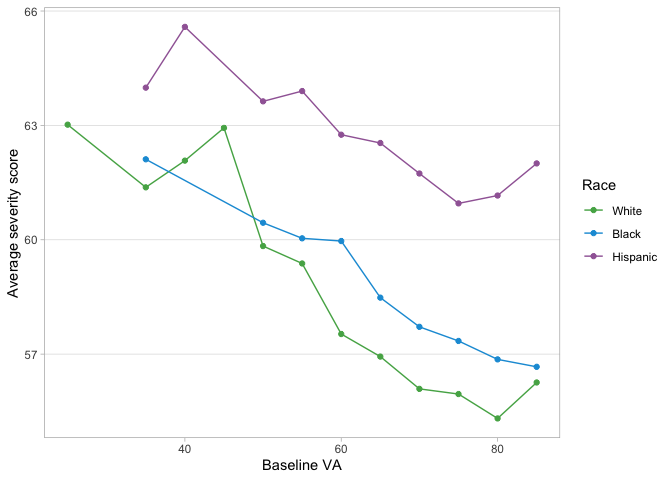<!-- -->

``` r
#ggsave("graphs/5_plot_sev_race_va.png", plot_sev_race_va, width = 7, height = 5)
```

## Figure 6: Average severity score at each baseline VA (rounded to nearest 5) by insurance

``` r
#calculate severity by race and age

severity_insurance_vision <-
  timeseries_analysis %>% 
  mutate(baseline_va_r5 = plyr::round_any(baseline_va_letter, 5)) %>% 
  group_by(insurance, baseline_va_r5) %>%
  summarize(avg_severity = mean(severity_score), count = n()) %>% 
  filter(count > 100) %>% 
  arrange(desc(avg_severity))
```

    ## `summarise()` has grouped output by 'insurance'. You can override using the
    ## `.groups` argument.

``` r
severity_insurance_vision
```

    ## # A tibble: 44 × 4
    ## # Groups:   insurance [6]
    ##    insurance       baseline_va_r5 avg_severity count
    ##    <ord>                    <dbl>        <dbl> <int>
    ##  1 Medicaid                    50         66.2   141
    ##  2 Medicaid                    35         64.7   134
    ##  3 Medicare                    25         63.3   160
    ##  4 Private                     40         63.2   132
    ##  5 Medicaid                    65         63.1   329
    ##  6 Unknown/Missing             60         62.9   245
    ##  7 Medicaid                    55         62.8   106
    ##  8 Unknown/Missing             65         62.7   203
    ##  9 Govt                        60         62.6   136
    ## 10 Private                     55         62.5   410
    ## # … with 34 more rows

``` r
# graph severity by race and age group
plot_sev_insurance_va <-
  severity_insurance_vision %>%
  filter(insurance %in% c("Medicaid", "Medicare", "Private")) %>% 
  ggplot(aes(x = baseline_va_r5, y = avg_severity, color = insurance)) +
  geom_line() +
  geom_point() +
  theme_light() +
  theme(
    panel.grid.minor = element_blank(),
    panel.grid.major.x = element_blank()
  ) +
  scale_color_manual(values = insurance_colors) +
  labs(
    title = "Severity by insurance and baseline VA", 
    y = "Average severity score", 
    x = "Baseline VA", 
    color = "Insurance"
  )

plot_sev_insurance_va
```

<!-- -->

``` r
#ggsave("graphs/6_plot_sev_insurance_va.png", plot_sev_insurance_va, width = 7, height = 5)
```

## Timeseries analysis of visual acuity

#### Distribution of VA by race

``` r
# table of percentage distribution to baseline letter va by race
race_distribution <-
  timeseries_analysis %>% 
  group_by(race_ethnicity, baseline_va_r10) %>%   
  summarize(count = n()) %>% 
  ungroup() %>% 
  group_by(race_ethnicity) %>% 
  mutate(prop = count / sum(count)) %>% 
  ungroup()
```

    ## `summarise()` has grouped output by 'race_ethnicity'. You can override using
    ## the `.groups` argument.

``` r
race_distribution %>% 
  group_by(race_ethnicity) %>% 
  summarize(total_race = sum(count))
```

    ## # A tibble: 3 × 2
    ##   race_ethnicity total_race
    ##   <ord>               <int>
    ## 1 White               30989
    ## 2 Black                5922
    ## 3 Hispanic             6363

``` r
timeseries_analysis %>% 
  ggplot(aes(x = baseline_va_letter)) +
  geom_histogram(binwidth = 10, aes(fill = race_ethnicity)) +
  theme_light() +
  scale_x_continuous(breaks = seq(0, 100, 10)) +
  labs(
    title = "Histogram of eye count by race"
  )
```

<!-- -->

``` r
race_distribution %>% 
  ggplot(aes(x = baseline_va_r10, y = prop, color = race_ethnicity)) + 
  geom_line() +
  geom_point() +
  theme_light()  +
  scale_y_continuous() +
  labs(
    title = "Propotion of eyes in each group of baseline visual acuity, by race",
    y = "Proportion", 
    x = "Baseline VA, rounded to nearest multiple of 10"
  )
```

<!-- -->

#### Timeseries VA by race and severity

``` r
## calculate change in va over time for people in each severity group/race
severity_race_va <-
  timeseries_analysis %>% 
  group_by(race_ethnicity, severity_score) %>% 
  summarize(baseline_va = mean(baseline_va_letter), one_year_va = mean(one_year), two_year_va = mean(two_year), count = n()) %>% 
  gather(key = "timepoint", value = "va_plot", baseline_va, one_year_va, two_year_va)
```

    ## `summarise()` has grouped output by 'race_ethnicity'. You can override using
    ## the `.groups` argument.

``` r
timeseries_analysis %>% 
  count(severity_score, race_ethnicity) %>% 
  group_by(race_ethnicity) %>% 
  mutate(prop = n / sum(n))
```

    ## # A tibble: 33 × 4
    ## # Groups:   race_ethnicity [3]
    ##    severity_score race_ethnicity     n   prop
    ##             <dbl> <ord>          <int>  <dbl>
    ##  1             35 White           3361 0.108 
    ##  2             35 Black            591 0.0998
    ##  3             35 Hispanic         448 0.0704
    ##  4             40 White           1871 0.0604
    ##  5             40 Black            321 0.0542
    ##  6             40 Hispanic         225 0.0354
    ##  7             43 White            836 0.0270
    ##  8             43 Black            151 0.0255
    ##  9             43 Hispanic         140 0.0220
    ## 10             44 White           4535 0.146 
    ## # … with 23 more rows

``` r
## density chart of distribution of severity scores, by race
timeseries_analysis %>% 
  ggplot() +
  geom_density(aes(x = severity_score, group = race_ethnicity, color = race_ethnicity), alpha = .2) +
  theme_light()
```

<!-- -->

This chart shows the density of patients by severity score. There are
two peaks - first at around severity scores between 40-48, and a second
at severity scores betewen 73-78. These numbers are generally aligned to
categorizations of moderate NPDR (with and without edema), and PDR (with
and without edema).

#### Timeseries VA by race

``` r
# plot change in visual acuity by race at one and two yeaars

va_race <-
  timeseries_analysis %>% 
  group_by(race_ethnicity) %>% 
  summarize(
    baseline_va = mean(baseline_va_letter), 
    one_year_va = mean(one_year), 
    two_year_va = mean(two_year),
    baseline_sd = sd(baseline_va_letter),
    one_year_sd = sd(one_year),
    two_year_sd = sd(two_year),
    count = n()) %>% 
  gather(key = "timepoint", value = "va_plot", baseline_va, one_year_va, two_year_va) %>% 
  ungroup()
  
va_race %>% 
  ggplot(aes(x = timepoint, y = va_plot, color = race_ethnicity)) +
  geom_point() +
  geom_line(aes(group = race_ethnicity)) +
  ggrepel::geom_text_repel(
    data = va_race %>% filter(timepoint == "two_year_va"),
    aes(label = count)
  ) +
  theme_light() + 
  labs(
    title = "VA at baseline, one, and two years by race",
    y = "Visual acuity"
  )
```

<!-- -->

``` r
va_race_diff <-
  va_race %>% 
  spread(key = timepoint, value = va_plot) %>% 
  mutate(
    one_year_change = one_year_va - baseline_va,
    two_year_change = two_year_va - baseline_va,
    baseline = 0
  ) %>% 
  gather(key = "time_diff", value = "va_change", baseline, one_year_change, two_year_change) %>% 
  ungroup()

va_race_diff %>% 
  ggplot(aes(x = time_diff, y = va_change, color = race_ethnicity)) +
  geom_point() +
  geom_line(aes(group = race_ethnicity)) +
  ggrepel::geom_text_repel(
    data = va_race_diff %>% filter(time_diff == "two_year_change"),
    aes(label = count)
  ) +
  theme_light() + 
  labs(
    title = "VA change from baseline, one, and two years by race",
    y = "Visual acuity (VA) change"
  )
```

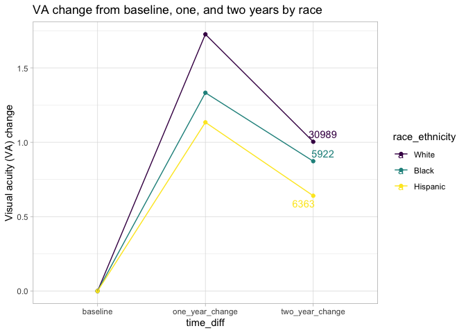<!-- -->

``` r
# plot change in visual acuity by race at one and two yeaars
severity_race_va %>% 
  filter(severity_score == 73) %>% 
  ggplot(aes(x = timepoint, y = va_plot, color = race_ethnicity)) +
  geom_point() +
  geom_line(aes(group = race_ethnicity)) +
  ggrepel::geom_text_repel(
    data = severity_race_va %>% filter(timepoint == "two_year_va", severity_score %in% c(73)),
    aes(label = count)
  ) +
  theme_light() + 
  labs(
    title = "VA at baseline, one, and two years by race at severity score 73",
    y = "Visual acuity"
  )
```

<!-- -->

Patients with starting severity score of 73, split by race, with visual
acuity measured over time. It appears that visual acuity changes seem to
follow similar trends (i.e., net change is quite similar), but White
people start with a visual acuity 1 letter higher than Black people and
two letters higher than Hispanic people.

``` r
severity_race_va %>% 
  filter(severity_score < 80) %>% 
  ggplot(aes(x = timepoint, y = va_plot, color = severity_score, linetype = race_ethnicity)) +
  geom_point() +
  geom_line(aes(group = interaction(severity_score, race_ethnicity))) +
  theme_light() + 
  ggrepel::geom_text_repel(
    data = severity_race_va %>% filter(timepoint == "two_year_va", severity_score < 80),
    aes(label = count)
  ) +
  scale_color_viridis_c() +
  labs(
    title = "VA at baseline, one, and two years by race and severity score"
  ) 
```

    ## Warning: ggrepel: 2 unlabeled data points (too many overlaps). Consider
    ## increasing max.overlaps

<!-- -->

``` r
# average two year visual acuity by starting severity and race

severity_race_va %>% 
  filter(timepoint == "two_year_va") %>% 
  # filtering out severity scores larger than 79, as there are less than 50 people in each category
  filter(severity_score < 80) %>% 
  ggplot(aes(x = severity_score, y = va_plot, color = race_ethnicity)) +
  geom_point() +
  geom_line(aes(group = race_ethnicity)) +
  ggrepel::geom_text_repel(
    data = severity_race_va %>% filter(timepoint == "two_year_va", severity_score %in% c(35, 78)),
    aes(label = count)
  ) +
  theme_light() + 
  labs(
    title = "VA at two years by race and severity score", 
    x = "Severity score", 
    y = "Two-year visual acuity"
  )
```

<!-- -->

This chart confirms our expectation that visual acuity two years after
index date typically is lower for patients with a higher starting
severity score.

#### Timeseries VA by insurance

``` r
# plot change in visual acuity by race at one and two yeaars

va_insurance <-
  timeseries_analysis %>% 
  group_by(insurance) %>%
  filter(!insurance %in% c("Unknown/Missing", "Military", "Govt")) %>% 
  summarize(
    baseline_va = mean(baseline_va_letter), 
    one_year_va = mean(one_year), 
    two_year_va = mean(two_year),
    baseline_sd = sd(baseline_va_letter),
    one_year_sd = sd(one_year),
    two_year_sd = sd(two_year),
    count = n()) %>% 
  gather(key = "timepoint", value = "va_plot", baseline_va, one_year_va, two_year_va) %>% 
  ungroup()
  
va_insurance %>% 
  ggplot(aes(x = timepoint, y = va_plot, color = insurance)) +
  geom_point() +
  geom_line(aes(group = insurance)) +
  ggrepel::geom_text_repel(
    data = va_insurance %>% filter(timepoint == "two_year_va"),
    aes(label = count)
  ) +
  theme_light() + 
  labs(
    title = "VA at baseline, one, and two years by insurance",
    y = "Visual acuity"
  )
```

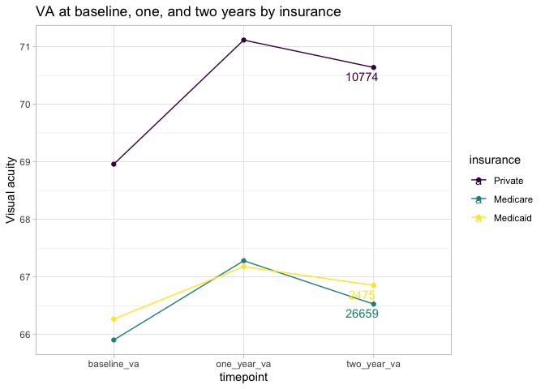<!-- -->

``` r
va_insurance_diff <-
  va_insurance %>% 
  spread(key = timepoint, value = va_plot) %>% 
  mutate(
    one_year_change = one_year_va - baseline_va,
    two_year_change = two_year_va - baseline_va,
    baseline = 0
  ) %>% 
  gather(key = "time_diff", value = "va_change", baseline, one_year_change, two_year_change) %>% 
  ungroup()

va_insurance_diff %>% 
  ggplot(aes(x = time_diff, y = va_change, color = insurance)) +
  geom_point() +
  geom_line(aes(group = insurance)) +
  ggrepel::geom_text_repel(
    data = va_insurance_diff %>% filter(time_diff == "two_year_change"),
    aes(label = count)
  ) +
  theme_light() + 
  labs(
    title = "VA change from baseline, one, and two years by insurance",
    y = "Visual acuity (VA) change"
  )
```

<!-- -->

#### Percentage with 15 letter loss by race

``` r
change_15 <- 
  timeseries_analysis %>% 
  mutate(
    one_year_change = one_year - baseline_va_letter,
    two_year_change = two_year - baseline_va_letter,
    baseline_change = 0
  ) %>% 
  mutate(
    one_year_15_pt_loss = if_else(one_year_change <= -15, 1, 0),
    two_year_15_pt_loss = if_else(two_year_change <= -15, 1, 0),
    one_year_15_pt_gain = if_else(one_year_change >= 15, 1, 0),
    two_year_15_pt_gain = if_else(two_year_change >= 15, 1, 0),
  ) %>% 
  #gather(key = "time_diff", value = "va_change", baseline_change, one_year_change, two_year_change) %>% 
  ungroup()


# z value for p = .05 
z = 1.96


loss_15_race <-
  change_15 %>% 
  group_by(race_ethnicity) %>% 
  summarize(
    one_year_loss = sum(one_year_15_pt_loss) / n(),
    two_year_loss = sum(two_year_15_pt_loss) / n(),
    one_year_sd = sqrt(one_year_loss * (1 - one_year_loss) / n()),
    two_year_sd = sqrt(two_year_loss * (1 - two_year_loss) / n())
  ) %>% 
  gather(key = "time_diff", value = "pct_15pt_loss", one_year_loss, two_year_loss) %>% 
  mutate(
    sd = if_else(str_detect(string = time_diff, pattern = "one_year"), one_year_sd, two_year_sd),
    upper_bound = pct_15pt_loss + z * sd,
    lower_bound = pct_15pt_loss - z * sd
  )
  
loss_15_race %>% 
  ggplot(aes(x = time_diff, y = pct_15pt_loss, fill = race_ethnicity)) +
  geom_col(position = "dodge") +
  geom_errorbar(aes(ymin = lower_bound, ymax = upper_bound), position = position_dodge(width = .9), width = .6) +
  theme_light() +
  labs(
    title = "Percentage of eyes that lost 15 or more pts of VA, by race"
  )
```

<!-- -->

``` r
gain_15_race <-
  change_15 %>% 
  group_by(race_ethnicity) %>% 
  summarize(
    one_year_gain = sum(one_year_15_pt_gain) / n(),
    two_year_gain = sum(two_year_15_pt_gain) / n(),
    one_year_sd = sqrt(one_year_gain * (1 - one_year_gain) / n()),
    two_year_sd = sqrt(two_year_gain * (1 - two_year_gain) / n())
  ) %>% 
  gather(key = "time_diff", value = "pct_15pt_gain", one_year_gain, two_year_gain) %>% 
  mutate(
    sd = if_else(str_detect(string = time_diff, pattern = "one_year"), one_year_sd, two_year_sd),
    upper_bound = pct_15pt_gain + z * sd,
    lower_bound = pct_15pt_gain - z * sd
  )

gain_15_race %>% 
  ggplot(aes(x = time_diff, y = pct_15pt_gain, fill = race_ethnicity)) +
  geom_col(position = "dodge") +
  geom_errorbar(aes(ymin = lower_bound, ymax = upper_bound), position = position_dodge(width = .9), width = .6) +
  theme_light() +
  labs(
    title = "Percentage of eyes that gained 15 or more pts of VA, by race"
  )
```

<!-- -->

#### Percentage with 15 letter loss by insurance

``` r
# z value for p = .05 
z = 1.96


loss_15_insurance <-
  change_15 %>% 
  group_by(insurance) %>%
  filter(!insurance %in% c("Unknown/Missing", "Military", "Govt")) %>% 
  summarize(
    one_year_loss = sum(one_year_15_pt_loss) / n(),
    two_year_loss = sum(two_year_15_pt_loss) / n(),
    one_year_sd = sqrt(one_year_loss * (1 - one_year_loss) / n()),
    two_year_sd = sqrt(two_year_loss * (1 - two_year_loss) / n())
  ) %>% 
  gather(key = "time_diff", value = "pct_15pt_loss", one_year_loss, two_year_loss) %>% 
  mutate(
    sd = if_else(str_detect(string = time_diff, pattern = "one_year"), one_year_sd, two_year_sd),
    upper_bound = pct_15pt_loss + z * sd,
    lower_bound = pct_15pt_loss - z * sd
  )
  
loss_15_insurance %>% 
  ggplot(aes(x = time_diff, y = pct_15pt_loss, fill = insurance)) +
  geom_col(position = "dodge") +
  geom_errorbar(aes(ymin = lower_bound, ymax = upper_bound), position = position_dodge(width = .9), width = .6) +
  theme_light() +
  labs(
    title = "Percentage of eyes that lost 15 or more pts of VA, by insurance"
  )
```

<!-- -->

``` r
gain_15_insurance <-
  change_15 %>% 
  group_by(insurance) %>% 
  filter(!insurance %in% c("Unknown/Missing", "Military", "Govt")) %>% 
  summarize(
    one_year_gain = sum(one_year_15_pt_gain) / n(),
    two_year_gain = sum(two_year_15_pt_gain) / n(),
    one_year_sd = sqrt(one_year_gain * (1 - one_year_gain) / n()),
    two_year_sd = sqrt(two_year_gain * (1 - two_year_gain) / n())
  ) %>% 
  gather(key = "time_diff", value = "pct_15pt_gain", one_year_gain, two_year_gain) %>% 
  mutate(
    sd = if_else(str_detect(string = time_diff, pattern = "one_year"), one_year_sd, two_year_sd),
    upper_bound = pct_15pt_gain + z * sd,
    lower_bound = pct_15pt_gain - z * sd
  )

gain_15_insurance %>% 
  ggplot(aes(x = time_diff, y = pct_15pt_gain, fill = insurance)) +
  geom_col(position = "dodge") +
  geom_errorbar(aes(ymin = lower_bound, ymax = upper_bound), position = position_dodge(width = .9), width = .6) +
  theme_light() +
  labs(
    title = "Percentage of eyes that gained 15 or more pts of VA, by insurance"
  )
```

<!-- -->

#### Timeseries VA by insurance and race

``` r
## NOTE - be sure to combine the two medicare datasets rather than eliminating one

# insurance_race_va %>% 
#   filter(!insurance %in% c("Unknown/Missing", "Military", "Govt")) %>% 
#   ggplot(aes(x = timepoint, y = va_plot, color = race_ethnicity, linetype = insurance)) +
#   geom_point() +
#   geom_line(aes(group = interaction(insurance, race_ethnicity))) +
#   ggrepel::geom_text_repel(
#     data = insurance_race_va %>% filter(timepoint == "two_year_va", insurance %in% c("Private", "Medicaid", "Medicare")), 
#     aes(label = count, hjust = -1)
#   ) +
#   theme_light() + 
#   labs(
#     title = "VA at baseline, one, and two years by race and insurance"
#   ) 
```

There are disparities in baseline VA that persist over time for Black
and Hispanic patients as compared to White patients. The type of
insurance appears to have strong correlation to the baseline VA, but
does not fully explain the difference in race.

``` r
# 
# va_insurance_race_diff_tbl <-
#   insurance_race_va %>% 
#   filter(!insurance %in% c("Unknown/Missing", "Military", "Govt")) %>% 
#   spread(key = timepoint, value = va_plot) %>% 
#   mutate(
#     one_year_change = one_year_va - baseline_va,
#     two_year_change = two_year_va - baseline_va,
#     baseline = 0
#   )
# 
# va_insurance_race_diff <-
#   insurance_race_va %>% 
#   filter(!insurance %in% c("Unknown/Missing", "Military", "Govt")) %>% 
#   spread(key = timepoint, value = va_plot) %>% 
#   mutate(
#     one_year_change = one_year_va - baseline_va,
#     two_year_change = two_year_va - baseline_va,
#     baseline = 0
#   ) %>% 
#   gather(key = "time_diff", value = "va_change", baseline, one_year_change, two_year_change) %>% 
#   ungroup()
# 
# va_insurance_race_diff_ci <-
#   timeseries_analysis %>% 
#   mutate(
#     one_year_change = one_year - baseline_va_letter,
#     two_year_change = two_year - baseline_va_letter,
#     baseline = 0
#   ) %>% 
#   group_by(race_ethnicity, insurance) %>% 
#   summarize(
#     mean_one_year_change = mean(one_year_change),
#     mean_two_year_change = mean(two_year_change),
#     sd_one_year_change = sd(one_year_change),
#     sd_two_year_change = sd(two_year_change)
#   )
# 
# va_insurance_race_diff %>% 
#   ggplot(aes(x = time_diff, y = va_change, color = race_ethnicity, linetype = insurance)) +
#   geom_point() +
#   geom_line(aes(group = interaction(insurance, race_ethnicity))) +
#   ggrepel::geom_text_repel(
#     data = va_insurance_race_diff %>% filter(time_diff == "two_year_change", insurance %in% c("Private", "Medicaid", "Medicare")), 
#     aes(label = count, hjust = -2)
#   ) +
#   facet_grid(insurance~.) +
#   theme_light() + 
#   labs(
#     title = "VA change from baseline, one, and two years by insurance and race",
#     y = "Visual acuity (VA) change"
#   )
```

#### Timeseries VA by smoking and race

``` r
smoking_race_va <-
  timeseries_analysis %>% 
  group_by(race_ethnicity, smoke_status) %>% 
  summarize(baseline_va = mean(baseline_va_letter), one_year_va = mean(one_year), two_year_va = mean(two_year), count = n()) %>% 
  gather(key = "timepoint", value = "va_plot", baseline_va, one_year_va, two_year_va)
```

    ## `summarise()` has grouped output by 'race_ethnicity'. You can override using
    ## the `.groups` argument.

``` r
## NOTE - be sure to combine the two medicare datasets rather than eliminating one

smoking_race_va %>% 
  #filter(!smoke_status %in% c("Unknown / Unclassified")) %>% 
  ggplot(aes(x = timepoint, y = va_plot, color = race_ethnicity, linetype = smoke_status)) +
  geom_point() +
  geom_line(aes(group = interaction(smoke_status, race_ethnicity))) +
  ggrepel::geom_text_repel(
    data = smoking_race_va %>% filter(timepoint == "two_year_va"), #!smoke_status %in% c("Unknown / Unclassified") 
    aes(label = count, hjust = -1)
  ) +
  theme_light() + 
  labs(
    title = "VA at baseline, one, and two years by race and smoking status"
  ) 
```

<!-- -->

#### Timeseries VA by gender and race

``` r
gender_race_va <-
  timeseries_analysis %>% 
  group_by(race_ethnicity, gender) %>% 
  summarize(baseline_va = mean(baseline_va_letter), one_year_va = mean(one_year), two_year_va = mean(two_year), count = n()) %>% 
  gather(key = "timepoint", value = "va_plot", baseline_va, one_year_va, two_year_va)
```

    ## `summarise()` has grouped output by 'race_ethnicity'. You can override using
    ## the `.groups` argument.

``` r
gender_race_va %>% 
  filter(gender %in% c("Male", "Female")) %>% 
  ggplot(aes(x = timepoint, y = va_plot, color = race_ethnicity, linetype = gender)) +
  geom_point() +
  geom_line(aes(group = interaction(gender, race_ethnicity))) +
  ggrepel::geom_text_repel(
    data = gender_race_va %>% filter(timepoint == "two_year_va", gender %in% c("Male", "Female")), 
    aes(label = count, hjust = -1)
  ) +
  theme_light() + 
  labs(
    title = "VA at baseline, one, and two years by race and gender"
  ) 
```

<!-- -->

Female patients appear to have lower baseline VA as compared to their
male counterparts of the same race. The raw gain or loss in VA over time
appears to be similar between genders within racial groups.

#### Race VA timeseries

``` r
va_race_tbl <-
  timeseries_analysis %>% 
  group_by(race_ethnicity) %>% 
  summarize(
    mean_baseline_va = mean(baseline_va_letter),
    mean_one_year = mean(one_year),
    mean_two_year = mean(two_year),
    count = n()
  )
```

``` r
race_va <-
  timeseries_analysis %>% 
  # round baseline data to nearest multiple of 5
  mutate(
    baseline_va_r = plyr::round_any(baseline_va_letter, 5)
  ) %>% 
  # group patients by race and same baseline va data
  group_by(baseline_va_r, race_ethnicity) %>% 
  summarize(baseline_va = mean(baseline_va_letter), one_year_va = mean(one_year), two_year_va = mean(two_year), count = n()) %>% 
  gather(key = "timepoint", value = "va_plot", baseline_va, one_year_va, two_year_va) %>% 
  ungroup()
```

    ## `summarise()` has grouped output by 'baseline_va_r'. You can override using the
    ## `.groups` argument.

``` r
race_va %>%
  filter(count > 25) %>% 
  ggplot(aes(x = timepoint, y = va_plot, color = baseline_va_r, linetype = race_ethnicity)) +
  geom_point() +
  geom_line(aes(group = interaction(baseline_va_r, race_ethnicity))) +
  theme_light() + 
  scale_color_viridis_c() +
  labs(
    title = "VA at baseline, one, and two years by race for people starting at the same baseline visual acuity"
  ) 
```

<!-- -->

This graph is hard to interpret, but is showing the differential
progression of va for people of different races that start at the same
level of baseline visual acuity. The next graphs dive into this daata
more closely.

This graph takes on an interesting shape. It indicates that people that
start with higher visual acuity are likely to experience a decline in
visual acuity, aand those starting at the lowest end of the spectrum of
visuala acuity are likely to make gains.

``` r
race_va %>%
  filter(count > 25) %>% 
  filter(baseline_va_r %in% c(65, 70, 75)) %>% 
  mutate(baseline_va_r = as.factor(baseline_va_r)) %>% 
  ggplot(aes(x = timepoint, y = va_plot, linetype = baseline_va_r, color = race_ethnicity)) +
  geom_point() +
  geom_line(aes(group = interaction(baseline_va_r, race_ethnicity))) +
  theme_light() + 
  ggrepel::geom_text_repel(
    data = race_va %>% filter(timepoint %in% c("two_year_va"), baseline_va_r %in% c(65, 70, 75)) %>% mutate(baseline_va_r = as.factor(baseline_va_r)), 
    aes(label = count, hjust = -1)
  ) +
  scale_y_continuous(breaks = seq(64, 78, 1)) +
  labs(
    title = "VA at baseline, one, and two years by race for people starting at ~65, ~70, ~75 baseline va",
    y = "visual acuity (letter)"
  ) 
```

<!-- -->

We observe that Hispanic patients experience starting with \~65 visual
acuity, they experiences much less gain in vision over two years as
compared to their White and Black counterprats. White people appear to
gain two letters, while Hispanic people gain less than hallf a letter.

Exemplifying the trends from above, we also se that those who start with
VA at \~75 all experience substantial decline, with those at other
starting points experiencing less severe declines or even making gains.

``` r
race_va %>%
  filter(count > 25) %>% 
  filter(baseline_va_r %in% c(50, 55, 60)) %>% 
  mutate(baseline_va_r = as.factor(baseline_va_r)) %>% 
  ggplot(aes(x = timepoint, y = va_plot, linetype = baseline_va_r, color = race_ethnicity)) +
  geom_point() +
  geom_line(aes(group = interaction(baseline_va_r, race_ethnicity))) +
  theme_light() + 
  ggrepel::geom_text_repel(
    data = race_va %>% filter(timepoint %in% c("two_year_va"), baseline_va_r %in% c(50, 55, 60)) %>% mutate(baseline_va_r = as.factor(baseline_va_r)), 
    aes(label = count, hjust = -1)
  ) +
  scale_y_continuous(breaks = seq(40, 65, 1)) +
  labs(
    title = "VA at baseline, one, and two years by race for people starting at ~50, ~55, ~60 baseline va",
    y = "visual acuity (letter)"
  ) 
```

<!-- -->

At this level, the dispairities in improvements are much more stark.
Whie people with baseline va of 50 are 3 additional points of VA gain as
compared to their Black and Hispanic counterparts. Similar, though not
as stark disparities are present for people with starting VA at 55 and
60.

Further analysis is required to control for the specific condition
associated that the patient is diagnosed with.

``` r
race_va %>%
  filter(count > 25) %>% 
  filter(baseline_va_r %in% c(35, 40, 45)) %>% 
  mutate(baseline_va_r = as.factor(baseline_va_r)) %>% 
  ggplot(aes(x = timepoint, y = va_plot, linetype = baseline_va_r, color = race_ethnicity)) +
  geom_point() +
  geom_line(aes(group = interaction(baseline_va_r, race_ethnicity))) +
  theme_light() + 
  ggrepel::geom_text_repel(
    data = race_va %>% filter(timepoint %in% c("two_year_va"), baseline_va_r %in% c(35, 40, 45)) %>% mutate(baseline_va_r = as.factor(baseline_va_r)), 
    aes(label = count, hjust = -1)
  ) +
  scale_y_continuous(breaks = seq(30, 60, 1)) +
  labs(
    title = "VA at baseline, one, and two years by race for people starting at ~35, ~40, ~45 baseline va",
    y = "visual acuity (letter)"
  ) 
```

<!-- -->

#### Race VA timeseries bucketed by 10

``` r
race_va_10 <-
  timeseries_analysis %>% 
  # group patients by race and same baseline va data
  group_by(baseline_va_r10, race_ethnicity) %>% 
  summarize(baseline_va = mean(baseline_va_letter), one_year_va = mean(one_year), two_year_va = mean(two_year), count = n()) %>% 
  gather(key = "timepoint", value = "va_plot", baseline_va, one_year_va, two_year_va) %>% 
  ungroup()
```

    ## `summarise()` has grouped output by 'baseline_va_r10'. You can override using
    ## the `.groups` argument.

``` r
## Same as above - split by ten 
race_va_10 %>%
  filter(count > 25) %>% 
  filter(baseline_va_r10 %in% c(50, 60, 70)) %>% 
  mutate(baseline_va_r10 = as.factor(baseline_va_r10)) %>% 
  ggplot(aes(x = timepoint, y = va_plot, linetype = baseline_va_r10, color = race_ethnicity)) +
  geom_point() +
  geom_line(aes(group = interaction(baseline_va_r10, race_ethnicity))) +
  theme_light() + 
  ggrepel::geom_text_repel(
    data = race_va_10 %>% filter(timepoint %in% c("two_year_va"), baseline_va_r10 %in% c(50, 60, 70)) %>% mutate(baseline_va_r10 = as.factor(baseline_va_r10)), 
    aes(label = count, hjust = -1)
  ) +
  labs(
    title = "VA at baseline, one, and two years by race for people starting at ~50, ~60, ~70 baseline va",
    y = "visual acuity (letter)"
  ) 
```

<!-- -->

``` r
severity_race_va_10 <-
  timeseries_analysis %>% 
  # group patients by race, severity, and same baseline va data
  group_by(baseline_va_r10, severity_score, race_ethnicity) %>% 
  summarize(baseline_va = mean(baseline_va_letter), one_year_va = mean(one_year), two_year_va = mean(two_year), count = n()) %>% 
  gather(key = "timepoint", value = "va_plot", baseline_va, one_year_va, two_year_va) %>% 
  ungroup()
```

    ## `summarise()` has grouped output by 'baseline_va_r10', 'severity_score'. You
    ## can override using the `.groups` argument.

``` r
severity_race_va_10_sd <-
  timeseries_analysis %>% 
  # group patients by race, severity, and same baseline va data
  group_by(baseline_va_r10, severity_score, race_ethnicity) %>% 
  summarize(baseline_va = sd(baseline_va_letter), one_year_va = sd(one_year), two_year_va = sd(two_year), count = n()) %>% 
  gather(key = "timepoint", value = "va_plot_sd", baseline_va, one_year_va, two_year_va) %>% 
  ungroup()
```

    ## `summarise()` has grouped output by 'baseline_va_r10', 'severity_score'. You
    ## can override using the `.groups` argument.

``` r
severity_race_va_10 %>% 
  arrange(desc(count))
```

    ## # A tibble: 666 × 6
    ##    baseline_va_r10 severity_score race_ethnicity count timepoint   va_plot
    ##              <dbl>          <dbl> <ord>          <int> <chr>         <dbl>
    ##  1              80             73 White           2853 baseline_va    79.3
    ##  2              80             73 White           2853 one_year_va    76.1
    ##  3              80             73 White           2853 two_year_va    74.7
    ##  4              60             73 White           2665 baseline_va    61.1
    ##  5              60             73 White           2665 one_year_va    64.1
    ##  6              60             73 White           2665 two_year_va    64.1
    ##  7              80             44 White           1709 baseline_va    78.9
    ##  8              80             44 White           1709 one_year_va    76.9
    ##  9              80             44 White           1709 two_year_va    75.4
    ## 10              70             73 White           1510 baseline_va    70.0
    ## # … with 656 more rows

``` r
severity_race_va_10 %>%
  filter(
    baseline_va_r10 %in% c(80),
    severity_score %in% c(73)
  ) %>% 
  left_join(severity_race_va_10_sd %>% select(-count), by = c("baseline_va_r10", "severity_score", "race_ethnicity", "timepoint")) %>% 
  mutate(severity_score = as.factor(severity_score)) %>% 
  ggplot(aes(x = timepoint, y = va_plot, linetype = severity_score, color = race_ethnicity)) +
  geom_point() +
  geom_line(aes(group = interaction(severity_score, race_ethnicity))) +
  theme_light() + 
  ggrepel::geom_text_repel(
    data = severity_race_va_10 %>% filter(timepoint %in% c("two_year_va"), baseline_va_r10 %in% c(80), severity_score %in% c(73)) %>% mutate(severity_score = as.factor(severity_score)), 
    aes(label = count, hjust = -1)
  ) +
  geom_errorbar(aes(ymin = va_plot - va_plot_sd, ymax = va_plot + va_plot_sd)) +
  labs(
    title = "VA at baseline, one, and two years by race for people starting at ~80 baseline VA",
    subtitle = "Grouped by starting severity score and race",
    y = "visual acuity (letter)"
  ) 
```

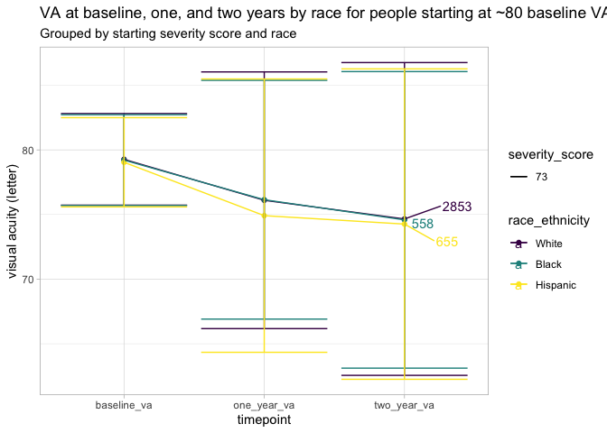<!-- -->

#### Severity race VA timeseries

``` r
severity_race_va <-
  timeseries_analysis %>% 
  # round baseline data to nearest multiple of 5
  mutate(
    baseline_va_r = plyr::round_any(baseline_va_letter, 5)
  ) %>% 
  # group patients by race, severity, and same baseline va data
  group_by(baseline_va_r, severity_score, race_ethnicity) %>% 
  summarize(baseline_va = mean(baseline_va_letter), one_year_va = mean(one_year), two_year_va = mean(two_year), count = n()) %>% 
  gather(key = "timepoint", value = "va_plot", baseline_va, one_year_va, two_year_va) %>% 
  ungroup()
```

    ## `summarise()` has grouped output by 'baseline_va_r', 'severity_score'. You can
    ## override using the `.groups` argument.

``` r
severity_race_va %>%
  filter(
    baseline_va_r %in% c(50),
    severity_score %in% c(73, 78)
  ) %>% 
  mutate(severity_score = as.factor(severity_score)) %>% 
  ggplot(aes(x = timepoint, y = va_plot, linetype = severity_score, color = race_ethnicity)) +
  geom_point() +
  geom_line(aes(group = interaction(severity_score, race_ethnicity))) +
  theme_light() + 
  ggrepel::geom_text_repel(
    data = severity_race_va %>% filter(timepoint %in% c("two_year_va"), baseline_va_r %in% c(50), severity_score %in% c(73, 78)) %>% mutate(severity_score = as.factor(severity_score)), 
    aes(label = count, hjust = -1)
  ) +
  scale_y_continuous(breaks = seq(40, 65, 1)) +
  labs(
    title = "VA at baseline, one, and two years by race for people starting at ~50 baseline VA",
    subtitle = "Grouped by starting severity score and race",
    y = "visual acuity (letter)"
  ) 
```

<!-- -->

For patients that start with a baseline visual acuity close to 50, the
change in visual acuity over one to two years is associated with race.
White patients with starting severity at 73 experience \~6pt gain in
visual acuity, as compared to \~5pt gain for Black and Hispanic
counterparts. After two years, white patients maintain that gain in
visual acuity; however, Black and Hispanic patients experiences a
moderate drop in visual acuity by .5pts (Hispanics) and 1.5pts (Black).

For those patients with starting severity at 78, gains in visual acuity
the first year are again similar across races, \~3 to 3.5 points.
However, in year two, white patients experience another substantial gain
in visual acuity (\~3pts), while Hispanic paitents experience no gain in
visual acuity and Black patients experience a small decline in visual
acuity (\~.5 pts).

This analysis suggests that there may be factors between the first and
second year of treatment that are creating disparate treatment outcomes
for Black and Hispanic patients as compared to white patients.

``` r
severity_race_va %>%
  filter(
    baseline_va_r %in% c(35),
    severity_score %in% c(73, 78)
  ) %>% 
  mutate(severity_score = as.factor(severity_score)) %>% 
  ggplot(aes(x = timepoint, y = va_plot, linetype = severity_score, color = race_ethnicity)) +
  geom_point() +
  geom_line(aes(group = interaction(severity_score, race_ethnicity))) +
  theme_light() + 
  theme(panel.grid.minor = element_blank()) +
  ggrepel::geom_text_repel(
    data = severity_race_va %>% filter(timepoint %in% c("two_year_va"), baseline_va_r %in% c(35), severity_score %in% c(73, 78)) %>% mutate(severity_score = as.factor(severity_score)), 
    aes(label = count, hjust = -1)
  ) +
  scale_y_continuous(breaks = seq(33, 55, 1)) +
  labs(
    title = "VA at baseline, one, and two years by race for people starting at ~35 baseline VA",
    subtitle = "Grouped by starting severity score and race",
    y = "visual acuity (letter)"
  ) 
```

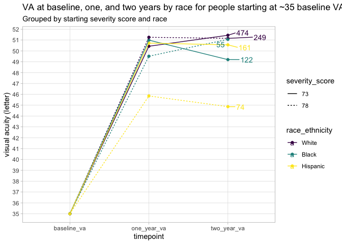<!-- -->

The trend identified for patients with a baseline VA of 50 (the prior
chart) partially holds for those patients with starting VA of 35. We see
that, for patients with starting severity of 73, gains in visual acuity
after one year are consistent by race. However, aafter two yers, Black
patients lost abaout 3pts of visual acutiy, while white patients gained
\~1pt in visual acuity and Hispanic patients did not experience any
change.

This trend does not hold for patients with starting severity of 78. We
see that in year one, white patients make substantially higher gains
(16pts) in VA as compared to Black patients (14 pts) and Hipanic
patients (11 pts). After two years, however, white patients experience a
drop in visual acuity (1 pts) while Black patients experience another
gain of three points.

``` r
severity_race_va %>%
  filter(
    baseline_va_r %in% c(70),
    severity_score %in% c(73, 78)
  ) %>% 
  mutate(severity_score = as.factor(severity_score)) %>% 
  ggplot(aes(x = timepoint, y = va_plot, linetype = severity_score, color = race_ethnicity)) +
  geom_point() +
  geom_line(aes(group = interaction(severity_score, race_ethnicity))) +
  theme_light() + 
  theme(panel.grid.minor = element_blank()) +
  ggrepel::geom_text_repel(
    data = severity_race_va %>% filter(timepoint %in% c("two_year_va"), baseline_va_r %in% c(70), severity_score %in% c(73, 78)) %>% mutate(severity_score = as.factor(severity_score)), 
    aes(label = count, hjust = -1)
  ) +
  labs(
    title = "VA at baseline, one, and two years by race for people starting at ~70 baseline VA",
    subtitle = "Grouped by starting severity score and race",
    y = "visual acuity (letter)"
  ) 
```

<!-- -->

#### Severity insurance race VA timeseries

``` r
severity_ins_race_va <-
  timeseries_analysis %>% 
  # round baseline data to nearest multiple of 5
  mutate(
    baseline_va_r = plyr::round_any(baseline_va_letter, 5)
  ) %>% 
  # group patients by race, severity, and same baseline va data
  group_by(baseline_va_r, severity_score, insurance, race_ethnicity) %>% 
  summarize(baseline_va = mean(baseline_va_letter), one_year_va = mean(one_year), two_year_va = mean(two_year), count = n()) %>% 
  gather(key = "timepoint", value = "va_plot", baseline_va, one_year_va, two_year_va) %>% 
  ungroup()
```

    ## `summarise()` has grouped output by 'baseline_va_r', 'severity_score',
    ## 'insurance'. You can override using the `.groups` argument.

``` r
severity_ins_race_va %>%
  filter(
    baseline_va_r %in% c(50),
    severity_score %in% c(78),
    insurance %in% c("Medicaid", "Medicare", "Private")
  ) %>% 
  mutate(severity_score = as.factor(severity_score)) %>% 
  ggplot(aes(x = timepoint, y = va_plot, linetype = insurance, color = race_ethnicity)) +
  geom_point() +
  geom_line(aes(group = interaction(insurance, race_ethnicity))) +
  theme_light() + 
  ggrepel::geom_text_repel(
    data = severity_ins_race_va %>% filter(timepoint %in% c("two_year_va"), baseline_va_r %in% c(50), severity_score %in% c(78), insurance %in% c("Medicaid", "Medicare", "Private")) %>% mutate(severity_score = as.factor(severity_score)), 
    aes(label = count, hjust = -1)
  ) +
  labs(
    title = "VA at baseline, one, and two years by race for people starting at ~50 baseline VA",
    subtitle = "Grouped by insuraance and race; starting severity = 78 ",
    y = "visual acuity (letter)"
  ) 
```

<!-- -->

## Injections by VA analysis

``` r
## calculate change in va over time for people in each severity group/race
inj_race_va <-
  timeseries_analysis %>% 
  group_by(race_ethnicity, inj_year_1) %>% 
  summarize(baseline_va = mean(baseline_va_letter), one_year_va = mean(one_year), two_year_va = mean(two_year), count = n()) %>% 
  gather(key = "timepoint", value = "va_plot", baseline_va, one_year_va, two_year_va) %>%
  filter(inj_year_1 < 13) %>% 
  mutate(inj_year_1 = as.factor(inj_year_1)) %>% 
  ungroup()


str(inj_race_va)
```

``` r
inj_race_va %>%
  filter(inj_year_1 %in% c(1, 8)) %>% 
  ggplot(aes(x = timepoint, y = va_plot, color = race_ethnicity, linetype = inj_year_1)) +
  geom_point() +
  geom_line(aes(group = interaction(inj_year_1, race_ethnicity))) +
  ggrepel::geom_text_repel(
    data = inj_race_va %>% filter(timepoint == "two_year_va", inj_year_1 %in% c(1, 8)),
    aes(label = count, hjust = -1)
  ) +
  theme_light() + 
  labs(
    title = "VA at baseline, one, and two years by race and number of injections"
  ) 
```

``` r
severity_race_inj_va_quart <-
  timeseries_analysis %>% 
  # group patients by race, severity, and same baseline va data
  group_by(baseline_va_quart, severity_score, race_ethnicity, inj_year_1) %>% 
  summarize(baseline_va = mean(baseline_va_letter), one_year_va = mean(one_year), two_year_va = mean(two_year), count = n()) %>% 
  gather(key = "timepoint", value = "va_plot", baseline_va, one_year_va, two_year_va) %>% 
  ungroup()


severity_race_inj_va_quart_sd <-
  timeseries_analysis %>% 
  # group patients by race, severity, and same baseline va data
  group_by(baseline_va_quart, severity_score, race_ethnicity, inj_year_1) %>% 
  summarize(baseline_va = sd(baseline_va_letter), one_year_va = sd(one_year), two_year_va = sd(two_year), count = n()) %>% 
  gather(key = "timepoint", value = "va_plot_sd", baseline_va, one_year_va, two_year_va) %>% 
  ungroup()


severity_race_inj_va_quart %>% 
  arrange(desc(count))
```

``` r
severity_race_inj_va_quart %>%
  filter(
    baseline_va_quart %in% c(4),
    severity_score %in% c(73),
    inj_year_1 %in% c(1)
  ) %>% 
  mutate(severity_score = as.factor(severity_score)) %>% 
  ggplot(aes(x = timepoint, y = va_plot, linetype = severity_score, color = race_ethnicity)) +
  geom_point() +
  geom_line(aes(group = interaction(severity_score, race_ethnicity))) +
  theme_light() + 
  ggrepel::geom_text_repel(
    data = 
      severity_race_inj_va_quart %>% 
      filter(
        timepoint %in% c("two_year_va"), 
        baseline_va_quart %in% c(4), 
        severity_score %in% c(73), 
        inj_year_1 %in% c(1)) %>% 
      mutate(severity_score = as.factor(severity_score)), 
    aes(label = count, hjust = -1)
  ) +
  labs(
    title = "VA at baseline, one, and two years by race for people at ~4th VA quart, 73 severity",
    subtitle = "Grouped by starting severity score, race, and number of injections = 1",
    y = "visual acuity (letter)"
  ) 
```

Hispanic patients with the same starting severity and baseline VA
quartile that receive the same number of injections in the first year (1
injection) do substantially worse than their white counterparts

## Baseline analysis

#### Severity by race

``` r
# Calculate severity by race
severity_race <-
  timeseries_analysis %>% 
  group_by(race_ethnicity) %>% 
  summarize(average = mean(severity_score), count = n()) %>% 
  arrange(desc(average))

# Output severity by race to a cleaner table
severity_race %>% kable()
```

| race_ethnicity |  average | count |
|:---------------|---------:|------:|
| Hispanic       | 62.34559 |  6363 |
| Black          | 58.60132 |  5922 |
| White          | 57.03485 | 30989 |

Hispanic people have the highest severity of all racial groups, nearaly
5 points higher than White people. Black, Asian, and Caucasian people
have similar severity at timme of diagnosis.

#### Severity by race and region

``` r
# Calculate severity by race and region
severity_race_reg <-
  timeseries_analysis %>% 
  group_by(race_ethnicity, region) %>% 
  summarize(average = mean(severity_score), count = n()) %>% 
  arrange(desc(average))
```

    ## `summarise()` has grouped output by 'race_ethnicity'. You can override using
    ## the `.groups` argument.

``` r
# Print severity by race and region table
severity_race_reg
```

    ## # A tibble: 15 × 4
    ## # Groups:   race_ethnicity [3]
    ##    race_ethnicity region    average count
    ##    <ord>          <chr>       <dbl> <int>
    ##  1 Hispanic       <NA>         67.6   101
    ##  2 Hispanic       Midwest      63.5   493
    ##  3 Hispanic       West         63.1  2265
    ##  4 Hispanic       South        62.2  2633
    ##  5 Hispanic       Northeast    59.6   871
    ##  6 Black          South        58.9  3405
    ##  7 Black          Northeast    58.5  1126
    ##  8 Black          Midwest      58.2   981
    ##  9 Black          West         57.9   342
    ## 10 White          South        57.8 10790
    ## 11 White          West         57.3  5055
    ## 12 Black          <NA>         57.1    68
    ## 13 White          Midwest      56.5  8657
    ## 14 White          Northeast    56.3  6152
    ## 15 White          <NA>         55.9   335

``` r
# graph severity by race and region

severity_race_reg %>% 
  filter(!race_ethnicity == "Unknown") %>% 
  ggplot(aes(x = region, y = average)) + 
  geom_col(aes(fill  = race_ethnicity), position = "dodge") +
  scale_fill_viridis_d() + 
  theme_light() +
  labs(
    title = "Severity by race and region"
  )
```

<!-- -->

While there is some regional variation, Hispanic people are most likely
among all racial groups to have higher severity at time of diagnosis as
compared to other racial groups.

#### Severity by race and age

``` r
#calculate severity by race and age

severity_race_age <-
  timeseries_analysis %>% 
  group_by(race_ethnicity, age_group) %>% 
  summarize(avg_severity = mean(severity_score), count = n()) %>% 
  arrange(desc(avg_severity))
```

    ## `summarise()` has grouped output by 'race_ethnicity'. You can override using
    ## the `.groups` argument.

``` r
severity_race_age %>% head(10) %>% kable()
```

| race_ethnicity | age_group | avg_severity | count |
|:---------------|----------:|-------------:|------:|
| Black          |        25 |     72.25926 |    27 |
| Hispanic       |        35 |     68.81290 |   155 |
| Hispanic       |        20 |     68.71429 |     7 |
| Hispanic       |        45 |     68.30575 |   435 |
| Hispanic       |        25 |     68.27273 |    33 |
| White          |        35 |     68.20490 |   571 |
| White          |        20 |     68.03030 |    33 |
| Hispanic       |        40 |     68.01792 |   279 |
| Black          |        20 |     68.00000 |     3 |
| White          |        25 |     67.81659 |   229 |

``` r
# graph severity by race and age group

severity_race_age %>%
  filter(race_ethnicity %in% c("Caucasian", "Black or African American", "Hispanic", "Asian")) %>% 
  ggplot(aes(age_group, avg_severity)) +
  geom_line(aes(color = race_ethnicity)) +
  geom_point(aes(color = race_ethnicity)) +
  theme_light() +
  labs(
    title = "Severity by race and age group"
  )
```

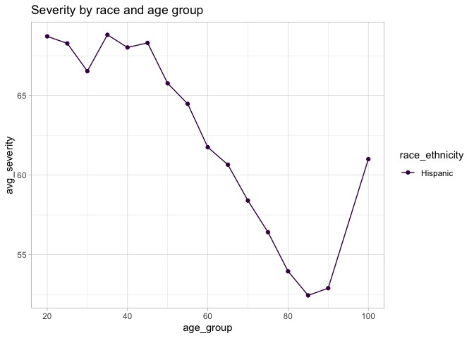<!-- -->

\[All data\] Analysis

\[New classification\] We see that at all age levels between 45 to 80,
Hispanic people have higher severity at time of diagnosis. Asian, Black,
and Caucasian people appear to have similar severity at time of
diagnosis, though a slight gap emerges at around age 75.

``` r
# close-up look at severity by race and age
severity_race_age %>%
  filter(race_ethnicity %in% c("Caucasian", "Black or African American", "Hispanic")) %>% 
  filter(age_group > 65, age_group < 95) %>% 
  ggplot(aes(age_group, avg_severity)) +
  geom_line(aes(color = race_ethnicity)) +
  geom_point(aes(color = race_ethnicity)) +
  theme_light() +
  theme(
    panel.grid.minor = element_blank()
  ) +
  scale_y_continuous(breaks = c(48, 50, 52, 54, 56)) + 
  labs(
    title = "Severity by race and age group, between 70 to 90 years old", 
    y = "Average severity score at time of diagnosis", 
    x = "Age group (nearest multiple of 5)"
  )
```

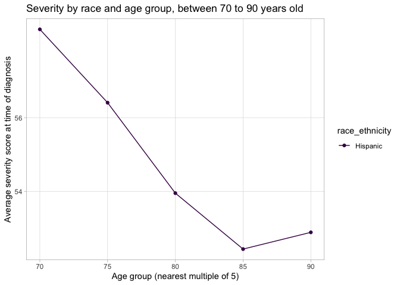<!-- -->

\[New classification\] Average severity at time of diagnosis is \~1.5-2
pts higher for Black people vs. Caucasian people, and \~3-4 pts higher
for Hispanic poeple as compared to Caucasian people

#### Severity by region

``` r
# severity by region

severity_reg <-
  timeseries_analysis %>% 
  group_by(region) %>% 
  summarize(average = mean(severity_score), n = n()) %>% 
  arrange(desc(average))

severity_reg %>% kable()
```

| region    |  average |     n |
|:----------|---------:|------:|
| West      | 59.01801 |  7662 |
| South     | 58.70680 | 16828 |
| NA        | 58.40873 |   504 |
| Midwest   | 56.99862 | 10131 |
| Northeast | 56.96282 |  8149 |

Severity in the West does appear to be a few points higher than in other
regions - perhaps due to a higher number of Hispanic people being from
the West.

#### Severity by race and insurance

``` r
# severity by race and insurace

severity_race_ins <-
  timeseries_analysis %>% 
  group_by(race_ethnicity, insurance) %>% 
  summarize(average = mean(severity_score), count = n()) %>% 
  arrange(desc(average))
```

    ## `summarise()` has grouped output by 'race_ethnicity'. You can override using
    ## the `.groups` argument.

``` r
severity_race_ins
```

    ## # A tibble: 18 × 4
    ## # Groups:   race_ethnicity [3]
    ##    race_ethnicity insurance       average count
    ##    <ord>          <ord>             <dbl> <int>
    ##  1 Hispanic       Govt               65.2   123
    ##  2 Hispanic       Unknown/Missing    63.4   640
    ##  3 Hispanic       Medicaid           63.0   712
    ##  4 Hispanic       Private            62.5  1553
    ##  5 White          Medicaid           61.9  1392
    ##  6 Hispanic       Medicare           61.9  3305
    ##  7 Black          Medicaid           61.6   371
    ##  8 Black          Unknown/Missing    60.6   229
    ##  9 White          Unknown/Missing    60.3   794
    ## 10 Hispanic       Military           59.3    30
    ## 11 White          Govt               59.1   862
    ## 12 Black          Private            59.0  1266
    ## 13 White          Private            58.9  7955
    ## 14 Black          Govt               58.5   180
    ## 15 Black          Medicare           58.1  3803
    ## 16 Black          Military           56.8    73
    ## 17 White          Military           56.0   435
    ## 18 White          Medicare           55.7 19551

``` r
# graph severity by race and insurance 

severity_race_ins %>% 
  filter(!race_ethnicity %in% c("Unknown", "Other")) %>% 
  ggplot(aes(x = insurance, y = average)) + 
  geom_col(aes(fill  = race_ethnicity), position = "dodge") +
  theme_light() +
  theme(
    axis.text.x = element_text(angle = 45, hjust = 1)
  ) +
  scale_fill_viridis_d() + 
  labs(
    title = "Severity by race and insurance",
    y = "Average severity at time of diagnosis",
    x = "Type of insurance"
  )
```

<!-- -->

We see large Hispanic/white gaps for those on Govt,Medicare FFS, Private
or with Unknown/Missing insurance information. Smaller Hispanic/white
gap for those on Medicaid or with Military insurance.

#### Severity by race and sex

``` r
# severity by race and sex

severity_race_sex <-
  timeseries_analysis %>% 
  group_by(race_ethnicity, gender) %>% 
  summarize(average = mean(severity_score), count = n()) %>% 
  arrange(desc(average))
```

    ## `summarise()` has grouped output by 'race_ethnicity'. You can override using
    ## the `.groups` argument.

``` r
severity_race_sex %>% head(5) %>% kable()
```

| race_ethnicity | gender  |  average | count |
|:---------------|:--------|---------:|------:|
| Hispanic       | Unknown | 64.45652 |    46 |
| Hispanic       | Male    | 63.18265 |  3389 |
| Hispanic       | Female  | 61.34358 |  2928 |
| White          | Unknown | 59.86842 |   114 |
| Black          | Male    | 59.71938 |  2441 |

``` r
# graphing severity by race and sex
severity_race_sex %>% 
  filter(!gender %in% c("Unknown")) %>% 
  ggplot(aes(x = race_ethnicity, y = average)) + 
  geom_point(aes(color = gender), size = 2) +
  theme_light() +
  theme(
    axis.text.x = element_text(angle = 45, hjust = 1)
  ) +
  scale_fill_viridis_d() + 
  labs(
    title = "Severity by race and sex"
  )
```

<!-- -->

Male patients have higher severity at the time of diagnosis than female
patients among all racial groups.

#### Severity by type of treatment

``` r
# severity by race and type of treatment

severity_race_first_treatment <-
  timeseries_analysis %>% 
  group_by(race_ethnicity, proc_group_28) %>% 
  summarize(average = mean(severity_score), count = n()) %>% 
  arrange(desc(average))
```

    ## `summarise()` has grouped output by 'race_ethnicity'. You can override using
    ## the `.groups` argument.

``` r
# severity_race_first_treatment
```

``` r
# graphing severity by race and type of treatment
severity_race_first_treatment %>% 
  ggplot(aes(x = race_ethnicity, y = average)) + 
  geom_point(aes(color = proc_group_28), size = 2) +
  theme_light() +
  theme(
    axis.text.x = element_text(angle = 45, hjust = 1)
  ) +
  scale_fill_viridis_d() + 
  labs(
    title = "Severity by race and first treatment type (28 days)"
  )
```

<!-- -->

Physicians are treating people with higher severity within their racial
group with antivegf or combo drugs for their first treatment, as
compared to laser or steroid.

``` r
# Likelihood of first treatment type by severity and race
treatment_sev_race <-
  timeseries_analysis %>% 
  count(severity_score, race_ethnicity, proc_group_28) %>% 
  group_by(severity_score, race_ethnicity) %>% 
  mutate(count_severity_race = sum(n)) %>% 
  mutate(prop = n / count_severity_race) %>% 
  ungroup() %>% 
  select(severity_score, race_ethnicity, proc_group_28, prop, count = n)

treatment_sev_race %>% 
  arrange(desc(severity_score))
```

    ## # A tibble: 33 × 5
    ##    severity_score race_ethnicity proc_group_28  prop count
    ##             <dbl> <ord>          <chr>         <dbl> <int>
    ##  1             85 White          antivegf          1    17
    ##  2             85 Black          antivegf          1    12
    ##  3             85 Hispanic       antivegf          1     9
    ##  4             81 White          antivegf          1    31
    ##  5             81 Black          antivegf          1    18
    ##  6             81 Hispanic       antivegf          1    11
    ##  7             78 White          antivegf          1  4074
    ##  8             78 Black          antivegf          1   853
    ##  9             78 Hispanic       antivegf          1  1273
    ## 10             73 White          antivegf          1  8277
    ## # … with 23 more rows

``` r
# Graphing likelihood of first treatment type by severity and race
treatment_sev_race %>% 
  filter(!race_ethnicity %in% c("Unknown", "Asian")) %>% 
  filter(severity_score > 50) %>% 
  ggplot(aes(x = severity_score, y = prop, color = race_ethnicity, shape = proc_group_28)) +
  geom_point() + 
  #facet_wrap("proc_group_28") +
  theme_bw() +
  #scale_y_continuous(labels = scales::percent, breaks = c(.70, .75, .8, .85, .9), limits = c(.7, .9)) +
  labs(
    title = "Likelihood of treatment at each severity score by race",
    y = "Percentage of people receiving this treatment"
  )
```

<!-- -->
\[New classification\] At this level, it is difficult to see how race
may be impacting treatment assigment. In the next graph, we look more
closely at the likelihood of receiving an anti-vegf treatment, based on
race.

``` r
# Graphing likelihood of antivegf as first treatment by severity and race
treatment_sev_race %>% 
  filter(!race_ethnicity %in% c("Unknown", "Asian")) %>% 
  filter(severity_score > 50) %>% 
  filter(proc_group_28 == "antivegf") %>% 
  ggplot(aes(x = severity_score, y = prop, color = race_ethnicity)) +
  geom_point() + 
  #facet_wrap("proc_group_28") +
  theme_bw() +
  scale_y_continuous(labels = scales::percent) +
  labs(
    title = "Likelihood of antivegf at each severity score by race",
    y = "Percentage of people receiving antivegf"
  )
```

<!-- -->

\[New classification\] Black people appear to be 2-5% points less likely
to receive antivegf treatment as compared to Caucasian people at several
severity scores (53, 58, 73, 78)

We can extend this analysis by looking at which antivegf drugs patients
of different races receive, at different severity levels.

#### Likelihood of drug received by severity score and race (given that patient recieved anti-vegf treatment)

``` r
# Calculate likelihood of drug by severity score and race (given that patient received antivegf treatment)
drug_sev_race <-
  timeseries_analysis %>% 
  filter(proc_group_365 == "antivegf") %>% 
  count(severity_score, race_ethnicity, vegf_group_365) %>% 
  group_by(severity_score, race_ethnicity) %>% 
  mutate(count_severity_race = sum(n)) %>% 
  mutate(prop = n / count_severity_race) %>% 
  ungroup() %>% 
  select(severity_score, race_ethnicity, vegf_group_365, prop, count = n)
```

``` r
# Graphing likelihood of first drug type by severity and race
drug_sev_race %>% 
  filter(!race_ethnicity %in% c("Unknown", "Asian", "Other")) %>% 
  ggplot(aes(x = severity_score, y = prop, color = race_ethnicity)) +
  geom_point() + 
  theme_bw() +
  facet_grid(~vegf_group_365) +
  #scale_y_continuous(labels = scales::percent, breaks = c(.70, .75, .8, .85, .9), limits = c(.7, .9)) +
  labs(
    title = "Likelihood of drug at each severity score by race",
    y = "Percentage of people receiving this drug"
  )
```

<!-- -->

``` r
# Graphing likelihood of Eylea as first treatment by severity and race
drug_sev_race %>% 
  filter(!race_ethnicity %in% c("Unknown", "Other")) %>% 
  filter(severity_score > 50) %>% 
  filter(vegf_group_365 == "Eylea") %>% 
  ggplot(aes(x = severity_score, y = prop, color = race_ethnicity)) +
  geom_point() + 
  theme_bw() +
  scale_y_continuous(labels = scales::percent) +
  labs(
    title = "Likelihood of receiving Eylea at higher severity score by race",
    y = "Percentage of people receiving Eylea"
  )
```

<!-- -->

Caucasian people are 5-10% more likely to receive Eylea treatment
(first) as compared to Hispanic people at the same level of severity,
and 2-5% more likely to receive Eylea treatment (first) as compared to
Black people at the same level of severity.

``` r
# Graphing likelihood of Bevacizumab as first treatment by severity and race
drug_sev_race %>% 
  filter(!race_ethnicity %in% c("Unknown", "Other")) %>% 
  filter(severity_score < 50) %>% 
  filter(vegf_group_365 == "Avastin") %>% 
  ggplot(aes(x = severity_score, y = prop, color = race_ethnicity)) +
  geom_point() + 
  geom_line() +
  theme_bw() +
  scale_y_continuous(labels = scales::percent) +
  labs(
    title = "Likelihood of receiving Bevacizumab at higher severity score by race",
    y = "Percentage of people receiving Bevacizumab"
  )
```

<!-- -->

At lower levels of severity, Hispanic people are far more likely
(15-25%) to receive Bevacizumab as compared to their Caucasian
counterparts with the same level of severity. Black and Asian people
seem somewhat more likely to receive Bevacizumab, but there is some
variation.

#### Likelihood of drug received by severity score CATEGORY and race (given that patient recieved anti-vegf treatment)

``` r
# Calculate likelihood of drug by severity score and race (given that patient received antivegf treatment)
drug_sev_cat_race <-
  timeseries_analysis %>% 
  filter(proc_group_365 == "antivegf") %>% 
  count(vision_category, race_ethnicity, vegf_group_365) %>% 
  group_by(vision_category, race_ethnicity) %>% 
  mutate(count_severity_race = sum(n)) %>% 
  mutate(prop = n / count_severity_race) %>% 
  ungroup() %>% 
  select(vision_category, race_ethnicity, vegf_group_365, prop, count = n)

drug_sev_cat_race %>% 
  arrange(desc(vision_category))
```

    ## # A tibble: 108 × 5
    ##    vision_category    race_ethnicity vegf_group_365   prop count
    ##    <chr>              <ord>          <chr>           <dbl> <int>
    ##  1 8 - PDR with edema White          Avastin        0.502   1830
    ##  2 8 - PDR with edema White          Eylea          0.207    755
    ##  3 8 - PDR with edema White          Lucentis       0.0945   345
    ##  4 8 - PDR with edema White          combo          0.197    719
    ##  5 8 - PDR with edema Black          Avastin        0.590    443
    ##  6 8 - PDR with edema Black          Eylea          0.142    107
    ##  7 8 - PDR with edema Black          Lucentis       0.0812    61
    ##  8 8 - PDR with edema Black          combo          0.186    140
    ##  9 8 - PDR with edema Hispanic       Avastin        0.684    735
    ## 10 8 - PDR with edema Hispanic       Eylea          0.108    116
    ## # … with 98 more rows

``` r
# Graphing likelihood of first drug type by severity and race
drug_sev_cat_race %>% 
  filter(!race_ethnicity %in% c("Unknown", "Asian", "Other"), !is.na(vision_category), !vision_category %in% c("NA")) %>% 
  mutate(prop_round = round(prop, 2)) %>% 
  ggplot(aes(x = vision_category, y = prop, fill = race_ethnicity)) +
  geom_col(position = "dodge") +
  theme_bw() +
  theme(axis.text.x = element_text(angle = 90, vjust = 0.5, hjust=1)) +
  facet_grid(vegf_group_365~.) +
  scale_y_continuous(limits = c(0, 1)) +
  geom_text(aes(label = prop_round), vjust = -0.5, position = position_dodge(width = .9)) +
  #scale_x_continuous()
  #scale_y_continuous(labels = scales::percent, breaks = c(.70, .75, .8, .85, .9), limits = c(.7, .9)) +
  labs(
    title = "Likelihood of drug at each severity score by race",
    y = "Percentage of people receiving this drug"
  )
```

<!-- -->

``` r
# Graphing likelihood of Eylea as first treatment by severity and race
drug_sev_cat_race %>% 
  filter(!is.na(vision_category)) %>% 
  filter(vegf_group_365 == "Eylea") %>% 
  ggplot(aes(x = vision_category, y = prop, color = race_ethnicity)) +
  geom_point() + 
  theme_bw() +
  scale_y_continuous(labels = scales::percent) +
  labs(
    title = "Likelihood of receiving Eylea at higher vision_category by race",
    y = "Percentage of people receiving Eylea"
  )
```

<!-- -->

``` r
# Graphing likelihood of Bevacizumab as first treatment by severity and race
drug_sev_cat_race %>% 
  filter(!is.na(vision_category)) %>% 
  filter(vegf_group_365 == "Avastin") %>% 
  ggplot(aes(x = vision_category, y = prop, color = race_ethnicity)) +
  geom_point() + 
  geom_line() +
  theme_bw() +
  scale_y_continuous(labels = scales::percent) +
  labs(
    title = "Likelihood of receiving Bevacizumab at higher vision_category by race",
    y = "Percentage of people receiving Bevacizumab"
  )
```

    ## `geom_line()`: Each group consists of only one observation.
    ## ℹ Do you need to adjust the group aesthetic?

<!-- -->

#### Likelihood of drug received by baseline VA and race (given that patient recieved anti-vegf treatment)

``` r
# Calculate likelihood of drug by severity score and race (given that patient received antivegf treatment)
drug_va_race <-
  timeseries_analysis %>% 
  filter(proc_group_365 == "antivegf") %>% 
  count(baseline_va_r10, race_ethnicity, vegf_group_365) %>% 
  group_by(baseline_va_r10, race_ethnicity) %>% 
  mutate(count_va_race = sum(n)) %>% 
  mutate(prop = n / count_va_race) %>% 
  ungroup() %>% 
  select(baseline_va_r10, race_ethnicity, vegf_group_365, prop, count = n)

drug_va_race %>% 
  arrange(desc(baseline_va_r10))
```

    ## # A tibble: 93 × 5
    ##    baseline_va_r10 race_ethnicity vegf_group_365  prop count
    ##              <dbl> <ord>          <chr>          <dbl> <int>
    ##  1             100 Black          Eylea          1         1
    ##  2             100 Hispanic       Avastin        1         1
    ##  3              90 White          Avastin        0.521    25
    ##  4              90 White          Eylea          0.188     9
    ##  5              90 White          Lucentis       0.188     9
    ##  6              90 White          combo          0.104     5
    ##  7              90 Black          Avastin        0.5       3
    ##  8              90 Black          Eylea          0.167     1
    ##  9              90 Black          Lucentis       0.167     1
    ## 10              90 Black          combo          0.167     1
    ## # … with 83 more rows

``` r
# Graphing likelihood of first drug type by severity and race
drug_va_race %>% 
  filter(baseline_va_r10 <= 80) %>% 
  ggplot(aes(x = baseline_va_r10, y = prop, color = race_ethnicity)) +
  geom_point() + 
  geom_line() +
  theme_bw() +
  facet_grid(vegf_group_365~.) +
  #scale_y_continuous(labels = scales::percent, breaks = c(.70, .75, .8, .85, .9), limits = c(.7, .9)) +
  labs(
    title = "Likelihood of drug at each baseline va (rounded) by race",
    y = "Percentage of people receiving this drug"
  )
```

<!-- -->

#### Likelihood of drug received by severity score CATEGORY and insurance (given that patient recieved anti-vegf treatment)

``` r
# Calculate likelihood of drug by severity score and insurance (given that patient received antivegf treatment)
drug_sev_cat_insurance <-
  timeseries_analysis %>%
  filter(proc_group_365 == "antivegf", insurance %in% c("Private", "Medicare", "Medicaid")) %>% 
  count(vision_category, insurance, vegf_group_365) %>% 
  group_by(vision_category, insurance) %>% 
  mutate(count_severity_race = sum(n)) %>% 
  mutate(prop = n / count_severity_race) %>% 
  ungroup() %>% 
  select(vision_category, insurance, vegf_group_365, prop, count = n)

drug_sev_cat_insurance %>% 
  arrange(desc(vision_category))
```

    ## # A tibble: 107 × 5
    ##    vision_category    insurance vegf_group_365   prop count
    ##    <chr>              <ord>     <chr>           <dbl> <int>
    ##  1 8 - PDR with edema Private   Avastin        0.530    819
    ##  2 8 - PDR with edema Private   Eylea          0.183    283
    ##  3 8 - PDR with edema Private   Lucentis       0.0920   142
    ##  4 8 - PDR with edema Private   combo          0.194    300
    ##  5 8 - PDR with edema Medicare  Avastin        0.530   1561
    ##  6 8 - PDR with edema Medicare  Eylea          0.192    565
    ##  7 8 - PDR with edema Medicare  Lucentis       0.0879   259
    ##  8 8 - PDR with edema Medicare  combo          0.190    561
    ##  9 8 - PDR with edema Medicaid  Avastin        0.683    330
    ## 10 8 - PDR with edema Medicaid  Eylea          0.126     61
    ## # … with 97 more rows

``` r
# Graphing likelihood of first drug type by severity and insurance
drug_sev_cat_insurance %>% 
  filter(!is.na(vision_category), !vision_category %in% c("NA")) %>% 
  mutate(prop_round = round(prop, 2)) %>% 
  ggplot(aes(x = vision_category, y = prop, fill = insurance)) +
  geom_col(position = "dodge") +
  theme_bw() +
  theme(axis.text.x = element_text(angle = 90, vjust = 0.5, hjust=1)) +
  facet_grid(vegf_group_365~.) +
  scale_y_continuous(limits = c(0, 1)) +
  #geom_text(aes(label = prop_round), vjust = -0.5, position = position_dodge(width = .9)) +
  #scale_x_continuous()
  #scale_y_continuous(labels = scales::percent, breaks = c(.70, .75, .8, .85, .9), limits = c(.7, .9)) +
  labs(
    title = "Likelihood of drug at each severity score by insurance",
    y = "Percentage of people receiving this drug"
  )
```

<!-- -->

``` r
# Graphing likelihood of Eylea as first treatment by severity and insurance
drug_sev_cat_insurance %>% 
  filter(!is.na(vision_category)) %>% 
  filter(vegf_group_365 == "Eylea") %>% 
  ggplot(aes(x = vision_category, y = prop, color = insurance)) +
  geom_point() + 
  theme_bw() +
  theme(axis.text.x = element_text(angle = 90, vjust = 0.5, hjust=1)) +
  scale_y_continuous(labels = scales::percent) +
  labs(
    title = "Likelihood of receiving Eylea at higher vision_category by race",
    y = "Percentage of people receiving Eylea"
  )
```

<!-- -->

``` r
# Graphing likelihood of Bevacizumab as first treatment by severity and insurance
drug_sev_cat_insurance %>% 
  filter(!is.na(vision_category)) %>% 
  filter(vegf_group_365 == "Avastin") %>% 
  ggplot(aes(x = vision_category, y = prop, color = insurance)) +
  geom_point() + 
  geom_line() +
  theme_bw() +
  theme(axis.text.x = element_text(angle = 90, vjust = 0.5, hjust=1)) +
  scale_y_continuous(labels = scales::percent) +
  labs(
    title = "Likelihood of receiving Bevacizumab at higher vision_category by race",
    y = "Percentage of people receiving Bevacizumab"
  )
```

    ## `geom_line()`: Each group consists of only one observation.
    ## ℹ Do you need to adjust the group aesthetic?

<!-- -->

#### Drug received by race and insurance

Part of the reason there may be variation by race in which treatment
drug is received is due to insurance. Medical providers may only choose
drugs covered by the patients insurance (e.g., Medicare does not cover
Eylea).

``` r
# Calculate likelihood of drug by severity score and race (given that patient received antivegf treatment)
drug_sev_race_ins <-
  timeseries_analysis %>% 
  filter(proc_group_28 == "antivegf") %>% 
  count(severity_score, race_ethnicity, vegf_group_28, insurance) %>% 
  group_by(severity_score, race_ethnicity, insurance) %>% 
  mutate(count_severity_race = sum(n)) %>% 
  mutate(prop = n / count_severity_race) %>% 
  ungroup() %>% 
  select(severity_score, race_ethnicity, insurance, vegf_group_28, prop, count = n)

drug_sev_race_ins %>% 
  arrange(desc(severity_score))
```

    ## # A tibble: 560 × 6
    ##    severity_score race_ethnicity insurance       vegf_group_28  prop count
    ##             <dbl> <ord>          <ord>           <chr>         <dbl> <int>
    ##  1             85 White          Private         Avastin       1         7
    ##  2             85 White          Medicare        Avastin       0.625     5
    ##  3             85 White          Medicaid        Avastin       1         1
    ##  4             85 White          Unknown/Missing Avastin       1         1
    ##  5             85 White          Medicare        Eylea         0.25      2
    ##  6             85 White          Medicare        Lucentis      0.125     1
    ##  7             85 Black          Private         Avastin       1         5
    ##  8             85 Black          Medicare        Avastin       1         6
    ##  9             85 Black          Medicaid        Lucentis      1         1
    ## 10             85 Hispanic       Private         Avastin       0.5       1
    ## # … with 550 more rows

``` r
# Graphing likelihood of Eylea as first treatment by severity, race, and Medicare FFS  insurance
drug_sev_race_ins %>% 
  filter(!race_ethnicity %in% c("Unknown", "Other", "Asian")) %>% 
  filter(severity_score > 50) %>% 
  filter(vegf_group_28 == "Eylea") %>% 
  filter(insurance == "Medicare") %>% 
  ggplot(aes(x = severity_score, y = prop, color = race_ethnicity)) +
  geom_point() + 
  geom_line() +
  theme_bw() +
  scale_y_continuous(labels = scales::percent) +
  labs(
    title = "Likelihood of receiving Eylea at higher severity score by race, with Medicare insurance",
    y = "Percentage of people receiving Eylea"
  )
```

<!-- -->

``` r
# Graphing likelihood of Eylea as first treatment by severity, race, and Medicaid insurance
drug_sev_race_ins %>% 
  # Asian filtered due to too small data size
  filter(!race_ethnicity %in% c("Unknown", "Other", "Asian")) %>% 
  filter(severity_score > 50) %>% 
  filter(vegf_group_28 == "Eylea") %>% 
  filter(insurance == "Medicaid") %>% 
  ggplot(aes(x = severity_score, y = prop, color = race_ethnicity)) +
  geom_point() + 
  geom_line() +
  theme_bw() +
  scale_y_continuous(labels = scales::percent) +
  labs(
    title = "Likelihood of receiving Eylea at higher severity score by race, with Medicaid insurance",
    y = "Percentage of people receiving Eylea"
  )
```

<!-- -->

``` r
# Graphing likelihood of Eylea as first treatment by severity, race, and private insurance
drug_sev_race_ins %>% 
  # Asian filtered due to too small data size
  filter(!race_ethnicity %in% c("Unknown", "Other", "Asian")) %>% 
  filter(severity_score > 50) %>% 
  filter(vegf_group_28 == "Eylea") %>% 
  filter(insurance == "Private") %>% 
  ggplot(aes(x = severity_score, y = prop, color = race_ethnicity)) +
  geom_point() + 
  geom_line() +
  theme_bw() +
  scale_y_continuous(labels = scales::percent) +
  labs(
    title = "Likelihood of receiving Eylea at higher severity score by race, with private insurance",
    y = "Percentage of people receiving Eylea"
  )
```

<!-- -->

``` r
# Calculate likelihood of drug by severity score, race, baseline va (given that patient received antivegf treatment)
drug_sev_race_va <-
  timeseries_analysis %>% 
  filter(proc_group_28 == "antivegf") %>% 
  count(severity_score, race_ethnicity, vegf_group_28,  baseline_va_r10) %>% 
  group_by(severity_score, race_ethnicity) %>% 
  mutate(count_severity_race_ins_va = sum(n)) %>% 
  mutate(prop = n / count_severity_race_ins_va) %>% 
  ungroup() %>% 
  select(severity_score, race_ethnicity, vegf_group_28, baseline_va_r10, prop, count = n)
```

``` r
# Graphing likelihood of Eylea as first treatment by severity, race, and private insurance
drug_sev_race_va %>% 
  # Asian filtered due to too small data size
  filter(!race_ethnicity %in% c("Unknown", "Other", "Asian")) %>% 
  filter(vegf_group_28 == "Eylea") %>% 
  filter(count > 25) %>%
  filter(baseline_va_r10 == 60) %>% 
  ggplot(aes(x = severity_score, y = prop, color = race_ethnicity)) +
  geom_point() + 
  geom_line() +
  theme_bw() +
  scale_y_continuous(labels = scales::percent) +
  labs(
    title = "Likelihood of receiving Eylea at higher severity score by race",
    y = "Percentage of people receiving Eylea"
  ) 
```

<!-- -->

#### Severity vs. vision

Do severity scores differ by race for people with the same vision score?

``` r
#calculate severity by race and age

severity_race_vision <-
  timeseries_analysis %>% 
  group_by(race_ethnicity, baseline_va_letter) %>%
  summarize(avg_severity = mean(severity_score), count = n()) %>% 
  filter(count > 100) %>% 
  arrange(desc(avg_severity))
```

    ## `summarise()` has grouped output by 'race_ethnicity'. You can override using
    ## the `.groups` argument.

``` r
severity_race_vision
```

    ## # A tibble: 36 × 4
    ## # Groups:   race_ethnicity [3]
    ##    race_ethnicity baseline_va_letter avg_severity count
    ##    <ord>                       <dbl>        <dbl> <int>
    ##  1 Hispanic                       40         65.3   133
    ##  2 Hispanic                       55         64.0   356
    ##  3 Hispanic                       35         64.0   388
    ##  4 Hispanic                       50         63.7   354
    ##  5 White                          45         63     167
    ##  6 Hispanic                       61         62.9   616
    ##  7 Hispanic                       65         62.7   838
    ##  8 Hispanic                       58         62.4   390
    ##  9 White                          26         62.4   137
    ## 10 Black                          35         62.1   325
    ## # … with 26 more rows

``` r
# graph severity by race and age group

severity_race_vision %>%
  filter(race_ethnicity %in% c("Caucasian", "Black or African American", "Hispanic", "Asian")) %>% 
  ggplot(aes(x = baseline_va_letter, y = avg_severity, color = race_ethnicity)) +
  geom_line() +
  geom_point() +
  theme_light() +
  labs(
    title = "Severity by race and baseline VA", 
    y = "Average severity score", 
    x = "Baseline VA"
  )
```

<!-- -->

Hispanic people are more likely to have a higher starting severity score
at all levels of baseline visual acuity, as compared to Black, Asian,
and Caucasian people.

``` r
#calculate severity by race and age

severity_race_vision_flip <-
  timeseries_analysis %>% 
  group_by(race_ethnicity, severity_score) %>%
  summarize(avg_va = mean(baseline_va_letter), count = n()) %>% 
  filter(count > 100) %>% 
  arrange(desc(avg_va))
```

    ## `summarise()` has grouped output by 'race_ethnicity'. You can override using
    ## the `.groups` argument.

``` r
severity_race_vision_flip %>%
  filter(race_ethnicity %in% c("Caucasian", "Black or African American", "Hispanic")) %>% 
  ggplot(aes(x = severity_score, y = avg_va, color = race_ethnicity)) +
  geom_line() +
  geom_point() +
  theme_light() +
  labs(
    title = "Severity by race and baseline VA", 
    x = "Severity score", 
    y = "Average Baseline VA"
  )
```

<!-- -->

## Regression

#### Linear regression

Start with a linear regression to see what variables are initially
predictive

``` r
# basic linear regression
# one_year_va_delta_1.lm <- 
#   lm(
#     one_year_va_delta ~ relevel(race_ethnicity, ref = "Caucasian") + insurance + gender + first_dr_age + smoke_status + baseline_va_letter, 
#     data = timeseries_analysis %>% mutate(race_ethnicity = factor(race_ethnicity))
#     )
# 
# summary(one_year_va_delta_1.lm)
```

``` r
# linear regression with insurance race interaction
# one_year_va_delta_2.lm <- 
#   lm(
#     one_year_va_delta ~ relevel(race_ethnicity, ref = "Caucasian") + insurance + relevel(race_ethnicity, ref = "Caucasian") * insurance + gender + first_dr_age + smoke_status + baseline_va_letter, 
#     data = timeseries_analysis %>% 
#       filter(insurance %in% c("Medicare", "Medicaid", "Private")) %>% 
#       mutate(race_ethnicity = factor(race_ethnicity))
#   )
# 
# summary(one_year_va_delta_2.lm)
```

``` r
# linear regression with severity score
# one_year_va_delta_3.lm <- 
#   lm(one_year_va_delta ~ race_ethnicity + insurance + gender + first_dr_age + smoke_status + baseline_va_letter + severity_score, 
#      data = timeseries_analysis)
# 
# summary(one_year_va_delta_3.lm)
```

``` r
# linear regression with race insurance interaction and severity score
# one_year_va_delta_4.lm <- 
#   lm(one_year_va_delta ~ race_ethnicity + insurance + race_ethnicity * insurance + gender + first_dr_age + smoke_status + baseline_va_letter + severity_score, 
#      data = timeseries_analysis %>% 
#        filter(insurance %in% c("Medicare", "Medicaid", "Private")) %>% 
#        mutate(
#          race_ethnicity = factor(race_ethnicity),
#          race_ethnicity = relevel(race_ethnicity, ref = "Caucasian"),
#          insurance = factor(insurance), 
#          insurance = relevel(insurance, ref = "Private")
#        )
#   ) 
# 
# summary(one_year_va_delta_4.lm)
```

#### Quantile regressionn
