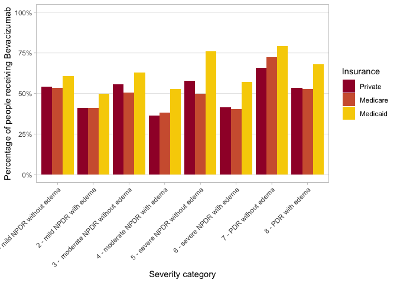
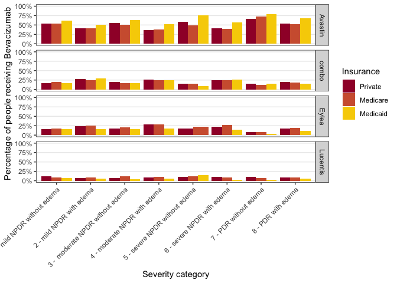
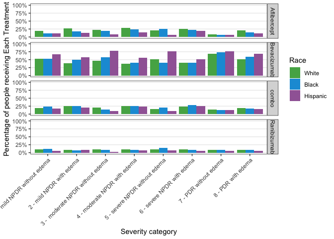
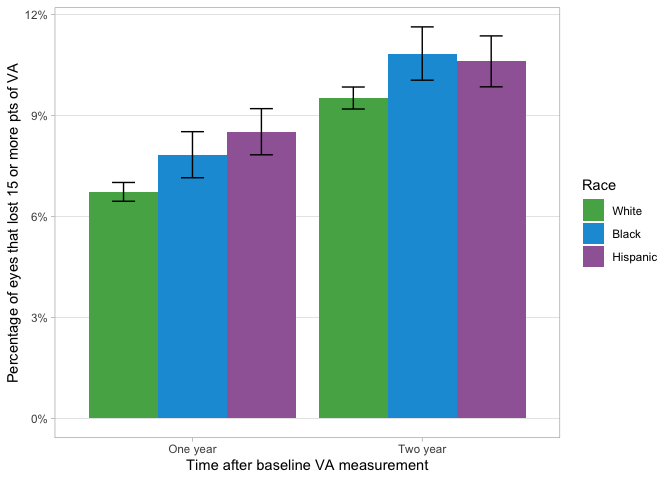
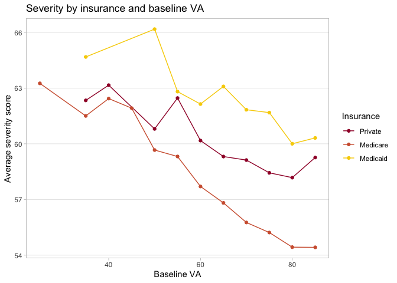
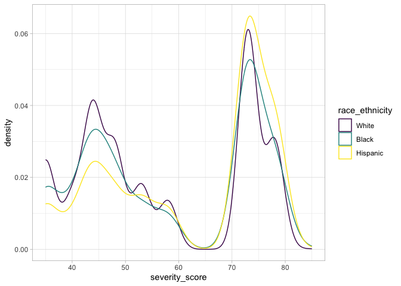
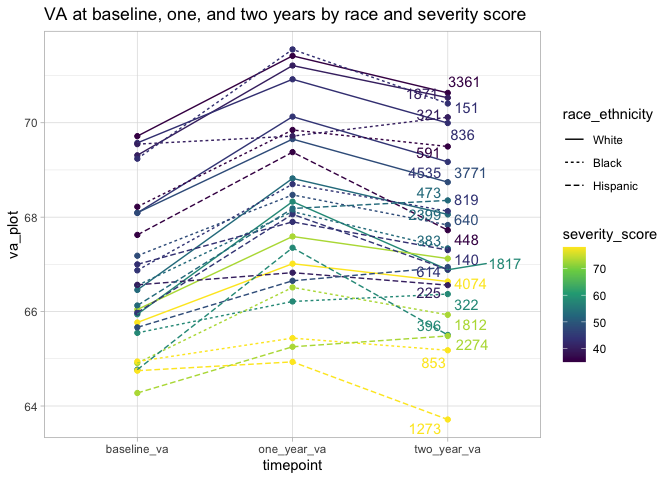
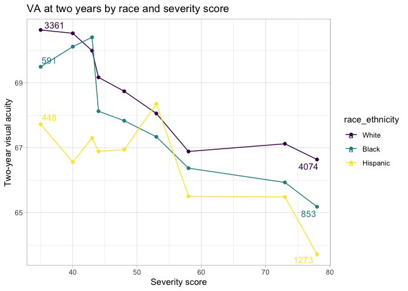
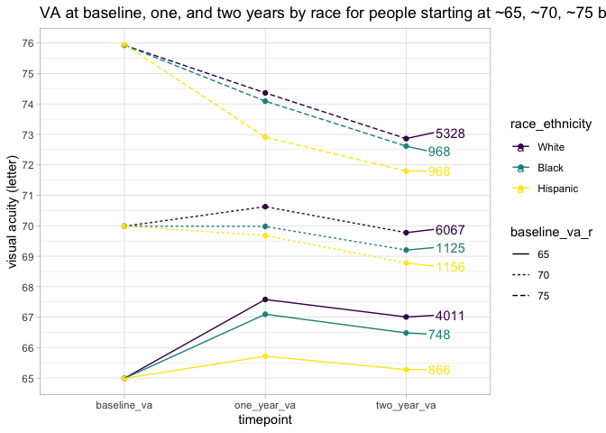

DR\_Analysis\_Main
================
Vikas Maturi
2021-07-07

## Libraries and parameters

``` r
# load libraries
library(tidyverse)
library(readxl)
library(lubridate)
library(knitr)

# Data files

# maturi universe file
universe_file <- "~/Documents/R_Projects/DR Analysis/dr_data/maturi_universe_ultimate.xlsx"

# severity scale file
severity_file <- "~/Documents/R_Projects/DR Analysis/dr_data/DR_severity_scale.xlsx"

# va file
va_file <- "~/Documents/R_Projects/DR Analysis/dr_data/maturi_va_combine_20210508.csv"

# va scale file
va_scale_file <- "~/Documents/R_Projects/DR Analysis/dr_data/visual_acuity_conversion.xlsx"

# injection file
injection_file <- "~/Documents/R_Projects/DR Analysis/dr_data/maturi_antivegf_table_20210508.csv"

# clean injection file 
injection_clean_file <- "~/Documents/R_Projects/DR Analysis/dr_data/injection_clean_file.csv"

# va_progression_file
va_progression_file <- "~/Documents/R_Projects/DR Analysis/dr_data/va_progression.csv"


# Data output files

# path for cleaned, joined data file (all data)
all_cleaned_path <- "~/Documents/R_Projects/DR Analysis/dr_data/maturi_all_cleaned.csv"

# path for cleaned, joined data file (top conditions)
top_conditions_cleaned_path <- "~/Documents/R_Projects/DR Analysis/dr_data/maturi_top_cleaned.csv"

# bottom conditions - to be coded
bottom_codes_path <- "~/Documents/R_Projects/DR Analysis/dr_data/bottom_codes.csv"

# va_basedate_by_pt 
va_basedate_path <- "~/Documents/R_Projects/DR Analysis/dr_data/va_basedate.csv"

# universe of data with timeseries added
clean_universe_path <- "~/Documents/R_Projects/DR Analysis/dr_data/clean_universe.csv" 

# va_progression
va_progression_path <- "~/Documents/R_Projects/DR Analysis/dr_data/va_progression.csv" 

# clean injection data path 
injection_clean_path <- "~/Documents/R_Projects/DR Analysis/dr_data/injection_clean_file.csv"
```

## Data import

``` r
# read in data

raw_universe <- read_excel(path = universe_file, sheet = 1, col_names = TRUE, .name_repair = "universal")

raw_severity <- read_excel(path = severity_file, sheet = 2, col_names = TRUE, .name_repair = "universal")

raw_va <- read_csv(file = va_file)

raw_va_scale <- read_excel(path = va_scale_file)

raw_injection <- read_csv(injection_file)
```

## Clean data

``` r
# Clean the raw data and save into new datasets
universe <-
  raw_universe %>% 
  rename(
    pt_code_name = Pt.code.name,
    eye = Eye.OD.1..OS.2,
    diagnosis_date = DR.diag.date
  ) %>% 
  mutate(
    diagnosis_date = ymd(diagnosis_date),
    index_date = ymd(index_date),
    baseline_va_letter = (1.7 - baseline_va)*50
  ) %>% 
  select(-FIND, -REPLACE, -...26, -...27, -...30, -...31)
  

severity <-
  raw_severity %>% 
  select(
    diabetes_diag = Diabetes.diagnosis,
    description = Description,
    ICD_10_equiv = ICD.10.equivalent,
    severity_score = Severity.Scale,
    new_class = New_Class,
    valid_class = Valid_Class
  ) %>% 
  mutate(
    severity_score = if_else(severity_score == "NA", as.integer(NA), as.integer(severity_score))
  )
```

    ## Warning in replace_with(out, !condition, false, fmt_args(~false),
    ## glue("length of {fmt_args(~condition)}")): NAs introduced by coercion

## Merge Data

``` r
# merge patient data with severity data
all <-
  universe %>% 
  left_join(severity, by = c("first_problem_code" = "diabetes_diag")) %>% 
  mutate(age_group = plyr::round_any(first_dr_age, 5))

# filter out data with less common conditions (~20k entries) if keeping all code types
# if fillter(code_type == New) is included, filter out data with less common conditions and classified under old system (~120k entries removed)
```

## Get VA data by time of visit for each patient/eye

``` r
va_basedate <-
  raw_va %>% 
  # add in the baseline date to the va data, by patient id and eye
  left_join(all %>% select(pt_code_name, eye, index_date), by = c("patient_guid" = "pt_code_name", "va_eye" = "eye")) %>% 
  # we find that half of the va data is not linked to the baseline patient/eye data that we have
  # filter entries where there is not linked baseline date
  filter(!is.na(index_date)) %>% 
  mutate(
    # change va to letter score
    va_letter = (1.7-va)*50,
    # determine if the va measurement is within 1 month +/- 3 weeks of the baseline date
    one_month = if_else(va_result_date > (index_date %m+% months(1) %m-% weeks(3)) & va_result_date < (index_date %m+% months(1) %m+% weeks(3)), 1, 0),
    # if the measurement is within 1 month +/- 3 weeks of the baseline date, then calculate the distance between the measurement date and 1 month past the index date
    one_mo_diff = if_else(one_month == 1, abs(index_date %m+% months(1) - va_result_date), make_difftime(NA)),
    six_month = if_else(va_result_date > (index_date %m+% months(6) %m-% weeks(8)) & va_result_date < (index_date %m+% months(6) %m+% weeks(8)), 1, 0),
    six_mo_diff = if_else(six_month == 1, abs(index_date %m+% months(6) - va_result_date), make_difftime(NA)),
    one_year = if_else(va_result_date > (index_date %m+% years(1) %m-% months(2)) & va_result_date < (index_date %m+% years(1) %m+% months(2)), 1, 0),
    one_yr_diff = if_else(one_year == 1, abs(index_date %m+% months(12) - va_result_date), make_difftime(NA)),
    two_year = if_else(va_result_date > (index_date %m+% years(2) %m-% months(4)) & va_result_date < (index_date %m+% years(2) %m+% months(4)), 1, 0),
    two_yr_diff = if_else(two_year == 1, abs(index_date %m+% months(24) - va_result_date), make_difftime(NA)),
  )

#write_csv(va_basedate, path = va_basedate_path)

index_date_results <-
  va_basedate %>% 
  summarize(
    sum_one_mo = sum(one_month),
    sum_six_mo = sum(six_month),
    sum_one_yr = sum(one_year),
    sum_two_yr = sum(two_year)
  )
```

It appears that using diagnosis date and index date result in a similar
amount of visits being identified, except for two-year later - ~100K
more visits are identified with diagnosis
data.

``` r
# create a cleaned dataset with each entry categorized as a one month, six month, one year, or two-year measurement, and the difference in days between the injection date and the "ideal' date (e.g., exactly one month after the index date for a one-month injection)

va_clean <-
  va_basedate %>% 
  mutate(
    # create consolidated column
    timeframe = case_when(
      one_month == 1 ~ "one_month",
      six_month == 1 ~ "six_month",
      one_year == 1 ~ "one_year",
      two_year == 1 ~ "two_year",
      TRUE ~ NA_character_
    )
  ) %>% 
  filter(!is.na(timeframe)) %>%
  rowwise() %>% 
  mutate(diff = sum(one_mo_diff, six_mo_diff, one_yr_diff, two_yr_diff, na.rm = TRUE)) %>% 
  ungroup()
```

``` r
# if there is more than one measurement within the timeframe, select the measurement closest to the ideal date (e.g., exactly one month, six months, etc. from the index date). If more than onne measurement at the same distance, select randomly.

va_to_join <-
  va_clean %>% 
  dplyr::select(-one_month, -one_mo_diff, -six_month, -six_mo_diff, -one_year, -one_yr_diff, -two_year, -two_yr_diff) %>% 
  group_by(patient_guid, va_eye, timeframe) %>% 
  top_n(n = -1, wt = diff) %>% 
  # for ties, select one of the rows at random
  sample_n(1) %>% 
  ungroup()

# completed va data
va_progression <- 
  va_to_join %>% 
  select(patient_guid, va_eye, index_date, va_letter, timeframe) %>% 
  spread(timeframe, va_letter) %>% 
  select(patient_guid, va_eye, index_date, one_month, six_month, one_year, two_year) 
```

``` r
# read in VA progression file from desktop
va_progression <- read_csv(va_progression_file)
```

    ## Parsed with column specification:
    ## cols(
    ##   patient_guid = col_character(),
    ##   va_eye = col_double(),
    ##   index_date = col_date(format = ""),
    ##   one_month = col_double(),
    ##   six_month = col_double(),
    ##   one_year = col_double(),
    ##   two_year = col_double()
    ## )

``` r
va_prog_test <-
  va_progression %>%
  mutate(
    all_four = if_else((!is.na(six_month) & !is.na(one_year) & !is.na(two_year)), 1, 0),
    six_and_oneyear = if_else((!is.na(six_month) & !is.na(one_year)), 1, 0),
    one_two_year = if_else((!is.na(one_year) & !is.na(two_year)), 1, 0)
  )

va_prog_test %>% 
  count(all_four) %>% 
  mutate(prop = n / sum(n))
```

    ## # A tibble: 2 x 3
    ##   all_four      n  prop
    ##      <dbl>  <int> <dbl>
    ## 1        0 126082 0.565
    ## 2        1  96967 0.435

``` r
va_prog_test %>% 
  count(six_and_oneyear) %>% 
  mutate(prop = n / sum(n))
```

    ## # A tibble: 2 x 3
    ##   six_and_oneyear      n  prop
    ##             <dbl>  <int> <dbl>
    ## 1               0  80375 0.360
    ## 2               1 142674 0.640

``` r
va_prog_test %>% 
  count(one_two_year) %>% 
  mutate(prop = n / sum(n))
```

    ## # A tibble: 2 x 3
    ##   one_two_year      n  prop
    ##          <dbl>  <int> <dbl>
    ## 1            0 112360 0.504
    ## 2            1 110689 0.496

#### Bring the data back together

``` r
all_va_prog <- 
  va_progression %>% 
  left_join(all %>% select(first_problem_code, severity_score, gender, race_ethnicity, first_dr_age, age_group, insurance, region, smoke_status, new_class, valid_class, pt_code_name, eye, index_date, baseline_va_letter, proc_group_28, proc_group_365, proc_group_any, vegf_group_28, vegf_group_365, vegf_group_any, retina_speciality, baseline_iop, pdr_group, cat_eyes), by = c("patient_guid" = "pt_code_name", "va_eye" = "eye", "index_date"))
```

## Timeseries aanalysis of visual acuity

``` r
# filter out the necesssary data to conduct time series analysis
timeseries_analysis <-
  all_va_prog %>% 
  filter(
    # only data classified under new ICD codes or codes starting of the format 36x.xxx
    valid_class == 1,
    #race is White, Black, or Hispanic, to ensure adequate numbers
    race_ethnicity %in% c("Caucasian", "Black or African American", "Hispanic"),
    #race and gender data available for the patient
    !is.na(race_ethnicity), 
    !is.na(gender),
    !is.na(severity_score),
    # only patients with one year and two year data available
    !is.na(one_year), 
    !is.na(two_year),
    # only patients getting antivegf treatment
    proc_group_28 == "antivegf",
    # no cat eyes
    !cat_eyes == 1
  ) %>% 
  # select only one eye per patient
  group_by(patient_guid) %>%
  sample_n(1) %>%
  ungroup() %>%
  # adjust insurance data to combine medicare FFS and medicare managed
  mutate(
    insurance = if_else(insurance %in% c("Medicare FFS", "Medicare Managed"), "Medicare", insurance)
  ) %>% 
  mutate(
    baseline_va_r10 = plyr::round_any(baseline_va_letter, 10)
  ) 

# timeseries_plotting <-
#   timeseries_analysis %>% 
#   gather(key = "timepoint", value = "va_plot", one_year, two_year)

# clean_universe <-
#   write_csv(timeseries_analysis, path = clean_universe_path)
```

#### Distribution of VA by race

``` r
timeseries_analysis %>% 
  ggplot(aes(x = baseline_va_letter)) +
  geom_histogram(binwidth = 10, aes(fill = race_ethnicity)) +
  theme_light() +
  scale_x_continuous(breaks = seq(0, 100, 10)) +
  labs(
    title = "Histogram of eye count by race"
  )
```

<!-- -->

``` r
# table of percentage distribution to baseline letter va by race
race_distribution <-
  timeseries_analysis %>% 
  group_by(race_ethnicity, baseline_va_r10) %>%   
  summarize(count = n()) %>% 
  ungroup() %>% 
  group_by(race_ethnicity) %>% 
  mutate(prop = count / sum(count)) %>% 
  ungroup()
```

``` r
race_distribution %>% 
  ggplot(aes(x = baseline_va_r10, y = prop, color = race_ethnicity)) + 
  geom_line() +
  geom_point() +
  theme_light() +
  scale_y_continuous() +
  labs(
    title = "Propotion of eyes in each group of baseline visual acuity, by race",
    y = "Proportion", 
    x = "Baseline VA, rounded to nearest multiple of 10"
  )
```

<!-- -->

#### Timeseries VA by race and severity

``` r
## calculate change in va over time for people in each severity group/race
severity_race_va <-
  timeseries_analysis %>% 
  group_by(race_ethnicity, severity_score) %>% 
  summarize(baseline_va = mean(baseline_va_letter), one_year_va = mean(one_year), two_year_va = mean(two_year), count = n()) %>% 
  gather(key = "timepoint", value = "va_plot", baseline_va, one_year_va, two_year_va)
```

``` r
## density chart of distribution of severity scores, by race
timeseries_analysis %>% 
  ggplot() +
  geom_density(aes(x = severity_score, group = race_ethnicity, color = race_ethnicity), alpha = .2) +
  theme_light()
```

<!-- -->

This chart shows the density of patients by severity score. There are
two peaks - first at around severity scores between 40-48, and a second
at severity scores betewen 73-78. These numbers are generally aligned to
categorizations of moderate NPDR (with and without edema), and PDR (with
and without edema).

``` r
# plot change in visual acuity by race at one and two yeaars
severity_race_va %>% 
  filter(severity_score == 73) %>% 
  ggplot(aes(x = timepoint, y = va_plot, color = race_ethnicity)) +
  geom_point() +
  geom_line(aes(group = race_ethnicity)) +
  ggrepel::geom_text_repel(
    data = severity_race_va %>% filter(timepoint == "two_year_va", severity_score %in% c(73)),
    aes(label = count)
  ) +
  theme_light() + 
  labs(
    title = "VA at baseline, one, and two years by race at severity score 73",
    y = "Visual acuity"
  )
```

<!-- -->

Patients with starting severity score of 73, split by race, with visual
acuity measured over time. It appears that visual acuity changes seem to
follow similar trends (i.e., net change is quite similar), but White
people start with a visual acuity 1 letter higher than Black people and
two letters higher than Hispanic people.

``` r
severity_race_va %>% 
  filter(severity_score < 80) %>% 
  ggplot(aes(x = timepoint, y = va_plot, color = severity_score, linetype = race_ethnicity)) +
  geom_point() +
  geom_line(aes(group = interaction(severity_score, race_ethnicity))) +
  theme_light() + 
  scale_color_viridis_c() +
  labs(
    title = "VA at baseline, one, and two years by race and severity score"
  ) 
```

<!-- -->

``` r
# average two year visual acuity by starting severity and race

severity_race_va %>% 
  filter(timepoint == "two_year_va") %>% 
  # filtering out severity scores larger than 79, as there are less than 50 people in each category
  filter(severity_score < 80) %>% 
  ggplot(aes(x = severity_score, y = va_plot, color = race_ethnicity)) +
  geom_point() +
  geom_line(aes(group = race_ethnicity)) +
  ggrepel::geom_text_repel(
    data = severity_race_va %>% filter(timepoint == "two_year_va", severity_score %in% c(35, 78)),
    aes(label = count)
  ) +
  theme_light() + 
  labs(
    title = "VA at two years by race and severity score", 
    x = "Severity score", 
    y = "Two-year visual acuity"
  )
```

<!-- -->

This chart confirms our expectation that visual acuity two years after
index date typically is lower for patients with a higher starting
severity score.

#### Timeseries VA by insurance and race

``` r
insurance_race_va <-
  timeseries_analysis %>% 
  group_by(race_ethnicity, insurance) %>% 
  summarize(baseline_va = mean(baseline_va_letter), one_year_va = mean(one_year), two_year_va = mean(two_year), count = n()) %>% 
  gather(key = "timepoint", value = "va_plot", baseline_va, one_year_va, two_year_va)
```

``` r
## NOTE - be sure to combine the two medicare datasets rather than eliminating one

insurance_race_va %>% 
  filter(!insurance %in% c("Unknown/Missing", "Military", "Govt")) %>% 
  ggplot(aes(x = timepoint, y = va_plot, color = race_ethnicity, linetype = insurance)) +
  geom_point() +
  geom_line(aes(group = interaction(insurance, race_ethnicity))) +
  ggrepel::geom_text_repel(
    data = insurance_race_va %>% filter(timepoint == "two_year_va", insurance %in% c("Private", "Medicaid", "Medicare")), 
    aes(label = count, hjust = -1)
  ) +
  theme_light() + 
  labs(
    title = "VA at baseline, one, and two years by race and insurance"
  ) 
```

<!-- -->

There are disparities in baseline VA that persist over time for Black
and Hispanic patients as compared to White patients. The type of
insurance appears to have strong correlation to the baseline VA, but
does not fully explain the difference in race.

#### Timeseries VA by gender and race

``` r
gender_race_va <-
  timeseries_analysis %>% 
  group_by(race_ethnicity, gender) %>% 
  summarize(baseline_va = mean(baseline_va_letter), one_year_va = mean(one_year), two_year_va = mean(two_year), count = n()) %>% 
  gather(key = "timepoint", value = "va_plot", baseline_va, one_year_va, two_year_va)
```

``` r
gender_race_va %>% 
  filter(gender %in% c("Male", "Female")) %>% 
  ggplot(aes(x = timepoint, y = va_plot, color = race_ethnicity, linetype = gender)) +
  geom_point() +
  geom_line(aes(group = interaction(gender, race_ethnicity))) +
  ggrepel::geom_text_repel(
    data = gender_race_va %>% filter(timepoint == "two_year_va", gender %in% c("Male", "Female")), 
    aes(label = count, hjust = -1)
  ) +
  theme_light() + 
  labs(
    title = "VA at baseline, one, and two years by race and gender"
  ) 
```

<!-- -->

Female patients appear to hvae lower baseline VA as compared to their
male counterparts of the same race. The raw gain or loss in VA over time
appears to be similar between genders within racial groups.

#### Race VA timeseries

``` r
race_va <-
  timeseries_analysis %>% 
  # round baseline data to nearest multiple of 5
  mutate(
    baseline_va_r = plyr::round_any(baseline_va_letter, 5)
  ) %>% 
  # group patients by race and same baseline va data
  group_by(baseline_va_r, race_ethnicity) %>% 
  summarize(baseline_va = mean(baseline_va_letter), one_year_va = mean(one_year), two_year_va = mean(two_year), count = n()) %>% 
  gather(key = "timepoint", value = "va_plot", baseline_va, one_year_va, two_year_va) %>% 
  ungroup()
```

``` r
race_va %>%
  filter(count > 25) %>% 
  ggplot(aes(x = timepoint, y = va_plot, color = baseline_va_r, linetype = race_ethnicity)) +
  geom_point() +
  geom_line(aes(group = interaction(baseline_va_r, race_ethnicity))) +
  theme_light() + 
  scale_color_viridis_c() +
  labs(
    title = "VA at baseline, one, and two years by race for people starting at the same baseline visual acuity"
  ) 
```

<!-- -->

This graph is hard to interpret, but is showing the differential
progression of va for people of different races that start at the same
level of baseline visual acuity. The next graphs dive into this daata
more closely.

This graph takes on an interesting shape. It indicates that people that
start with higher visual acuity are likely to experience a decline in
visual acuity, aand those starting at the lowest end of the spectrum of
visuala acuity are likely to make gains.

``` r
race_va %>%
  filter(count > 25) %>% 
  filter(baseline_va_r %in% c(65, 70, 75)) %>% 
  mutate(baseline_va_r = as.factor(baseline_va_r)) %>% 
  ggplot(aes(x = timepoint, y = va_plot, linetype = baseline_va_r, color = race_ethnicity)) +
  geom_point() +
  geom_line(aes(group = interaction(baseline_va_r, race_ethnicity))) +
  theme_light() + 
  ggrepel::geom_text_repel(
    data = race_va %>% filter(timepoint %in% c("two_year_va"), baseline_va_r %in% c(65, 70, 75)) %>% mutate(baseline_va_r = as.factor(baseline_va_r)), 
    aes(label = count, hjust = -1)
  ) +
  scale_y_continuous(breaks = seq(64, 78, 1)) +
  labs(
    title = "VA at baseline, one, and two years by race for people starting at ~65, ~70, ~75 baseline va",
    y = "visual acuity (letter)"
  ) 
```

<!-- -->

We observe that Hispanic patients experience starting with ~65 visual
acuity, they experiences much less gain in vision over two years as
compared to their White and Black counterprats. White people appear to
gain two letters, while Hispanic people gain less than hallf a letter.

Exemplifying the trends from above, we also se that those who start with
VA at ~75 all experience substantial decline, with those at other
starting points experiencing less severe declines or even making gains.

``` r
race_va %>%
  filter(count > 25) %>% 
  filter(baseline_va_r %in% c(50, 55, 60)) %>% 
  mutate(baseline_va_r = as.factor(baseline_va_r)) %>% 
  ggplot(aes(x = timepoint, y = va_plot, linetype = baseline_va_r, color = race_ethnicity)) +
  geom_point() +
  geom_line(aes(group = interaction(baseline_va_r, race_ethnicity))) +
  theme_light() + 
  ggrepel::geom_text_repel(
    data = race_va %>% filter(timepoint %in% c("two_year_va"), baseline_va_r %in% c(50, 55, 60)) %>% mutate(baseline_va_r = as.factor(baseline_va_r)), 
    aes(label = count, hjust = -1)
  ) +
  scale_y_continuous(breaks = seq(40, 65, 1)) +
  labs(
    title = "VA at baseline, one, and two years by race for people starting at ~50, ~55, ~60 baseline va",
    y = "visual acuity (letter)"
  ) 
```

<!-- -->

At this level, the dispairities in improvements are much more stark.
Whie people with baseline va of 50 are 3 additional points of VA gain as
compared to their Black and Hispanic counterparts. Similar, though not
as stark disparities are present for people with starting VA at 55 and
60.

Further analysis is required to control for the specific condition
associated that the patient is diagnosed with.

``` r
race_va %>%
  filter(count > 25) %>% 
  filter(baseline_va_r %in% c(35, 40, 45)) %>% 
  mutate(baseline_va_r = as.factor(baseline_va_r)) %>% 
  ggplot(aes(x = timepoint, y = va_plot, linetype = baseline_va_r, color = race_ethnicity)) +
  geom_point() +
  geom_line(aes(group = interaction(baseline_va_r, race_ethnicity))) +
  theme_light() + 
  ggrepel::geom_text_repel(
    data = race_va %>% filter(timepoint %in% c("two_year_va"), baseline_va_r %in% c(35, 40, 45)) %>% mutate(baseline_va_r = as.factor(baseline_va_r)), 
    aes(label = count, hjust = -1)
  ) +
  scale_y_continuous(breaks = seq(30, 60, 1)) +
  labs(
    title = "VA at baseline, one, and two years by race for people starting at ~35, ~40, ~45 baseline va",
    y = "visual acuity (letter)"
  ) 
```

<!-- -->

#### Race VA timeseries bucketed by 10

``` r
race_va_10 <-
  timeseries_analysis %>% 
  # group patients by race and same baseline va data
  group_by(baseline_va_r10, race_ethnicity) %>% 
  summarize(baseline_va = mean(baseline_va_letter), one_year_va = mean(one_year), two_year_va = mean(two_year), count = n()) %>% 
  gather(key = "timepoint", value = "va_plot", baseline_va, one_year_va, two_year_va) %>% 
  ungroup()


## Same as above - split by ten 
race_va_10 %>%
  filter(count > 25) %>% 
  filter(baseline_va_r10 %in% c(50, 60, 70)) %>% 
  mutate(baseline_va_r10 = as.factor(baseline_va_r10)) %>% 
  ggplot(aes(x = timepoint, y = va_plot, linetype = baseline_va_r10, color = race_ethnicity)) +
  geom_point() +
  geom_line(aes(group = interaction(baseline_va_r10, race_ethnicity))) +
  theme_light() + 
  ggrepel::geom_text_repel(
    data = race_va_10 %>% filter(timepoint %in% c("two_year_va"), baseline_va_r10 %in% c(50, 60, 70)) %>% mutate(baseline_va_r10 = as.factor(baseline_va_r10)), 
    aes(label = count, hjust = -1)
  ) +
  labs(
    title = "VA at baseline, one, and two years by race for people starting at ~50, ~60, ~70 baseline va",
    y = "visual acuity (letter)"
  ) 
```

<!-- -->

``` r
severity_race_va_10 <-
  timeseries_analysis %>% 
  # group patients by race, severity, and same baseline va data
  group_by(baseline_va_r10, severity_score, race_ethnicity) %>% 
  summarize(baseline_va = mean(baseline_va_letter), one_year_va = mean(one_year), two_year_va = mean(two_year), count = n()) %>% 
  gather(key = "timepoint", value = "va_plot", baseline_va, one_year_va, two_year_va) %>% 
  ungroup()


severity_race_va_10_sd <-
  timeseries_analysis %>% 
  # group patients by race, severity, and same baseline va data
  group_by(baseline_va_r10, severity_score, race_ethnicity) %>% 
  summarize(baseline_va = sd(baseline_va_letter), one_year_va = sd(one_year), two_year_va = sd(two_year), count = n()) %>% 
  gather(key = "timepoint", value = "va_plot_sd", baseline_va, one_year_va, two_year_va) %>% 
  ungroup()


test <-
  timeseries_analysis %>% 
  filter(baseline_va_r10 == 60, severity_score == 43) %>% 
  select(patient_guid, va_eye, index_date, baseline_va_letter, one_year, two_year, severity_score, everything()) %>% 
  arrange(two_year)

severity_race_va_10 %>% 
  arrange(desc(count))
```

    ## # A tibble: 672 x 6
    ##    baseline_va_r10 severity_score race_ethnicity count timepoint   va_plot
    ##              <dbl>          <int> <chr>          <int> <chr>         <dbl>
    ##  1              80             73 Caucasian       2858 baseline_va    79.3
    ##  2              80             73 Caucasian       2858 one_year_va    76.3
    ##  3              80             73 Caucasian       2858 two_year_va    74.9
    ##  4              60             73 Caucasian       2632 baseline_va    61.1
    ##  5              60             73 Caucasian       2632 one_year_va    64.0
    ##  6              60             73 Caucasian       2632 two_year_va    64.0
    ##  7              80             44 Caucasian       1713 baseline_va    78.9
    ##  8              80             44 Caucasian       1713 one_year_va    76.9
    ##  9              80             44 Caucasian       1713 two_year_va    75.3
    ## 10              70             73 Caucasian       1523 baseline_va    70.0
    ## # … with 662 more rows

``` r
severity_race_va_10 %>%
  filter(
    baseline_va_r10 %in% c(80),
    severity_score %in% c(73)
  ) %>% 
  left_join(severity_race_va_10_sd %>% select(-count), by = c("baseline_va_r10", "severity_score", "race_ethnicity", "timepoint")) %>% 
  mutate(severity_score = as.factor(severity_score)) %>% 
  ggplot(aes(x = timepoint, y = va_plot, linetype = severity_score, color = race_ethnicity)) +
  geom_point() +
  geom_line(aes(group = interaction(severity_score, race_ethnicity))) +
  theme_light() + 
  ggrepel::geom_text_repel(
    data = severity_race_va_10 %>% filter(timepoint %in% c("two_year_va"), baseline_va_r10 %in% c(80), severity_score %in% c(73)) %>% mutate(severity_score = as.factor(severity_score)), 
    aes(label = count, hjust = -1)
  ) +
  geom_errorbar(aes(ymin = va_plot - va_plot_sd, ymax = va_plot + va_plot_sd)) +
  labs(
    title = "VA at baseline, one, and two years by race for people starting at ~80 baseline VA",
    subtitle = "Grouped by starting severity score and race",
    y = "visual acuity (letter)"
  ) 
```

<!-- -->

#### Severity race VA timeseries

``` r
severity_race_va <-
  timeseries_analysis %>% 
  # round baseline data to nearest multiple of 5
  mutate(
    baseline_va_r = plyr::round_any(baseline_va_letter, 5)
  ) %>% 
  # group patients by race, severity, and same baseline va data
  group_by(baseline_va_r, severity_score, race_ethnicity) %>% 
  summarize(baseline_va = mean(baseline_va_letter), one_year_va = mean(one_year), two_year_va = mean(two_year), count = n()) %>% 
  gather(key = "timepoint", value = "va_plot", baseline_va, one_year_va, two_year_va) %>% 
  ungroup()
```

``` r
severity_race_va %>%
  filter(
    baseline_va_r %in% c(50),
    severity_score %in% c(73, 78)
  ) %>% 
  mutate(severity_score = as.factor(severity_score)) %>% 
  ggplot(aes(x = timepoint, y = va_plot, linetype = severity_score, color = race_ethnicity)) +
  geom_point() +
  geom_line(aes(group = interaction(severity_score, race_ethnicity))) +
  theme_light() + 
  ggrepel::geom_text_repel(
    data = severity_race_va %>% filter(timepoint %in% c("two_year_va"), baseline_va_r %in% c(50), severity_score %in% c(73, 78)) %>% mutate(severity_score = as.factor(severity_score)), 
    aes(label = count, hjust = -1)
  ) +
  scale_y_continuous(breaks = seq(40, 65, 1)) +
  labs(
    title = "VA at baseline, one, and two years by race for people starting at ~50 baseline VA",
    subtitle = "Grouped by starting severity score and race",
    y = "visual acuity (letter)"
  ) 
```

<!-- -->

For patients that start with a baseline visual acuity close to 50, the
change in visual acuity over one to two years is associated with race.
White patients with starting severity at 73 experience ~6pt gain in
visual acuity, as compared to ~5pt gain for Black and Hispanic
counterparts. After two years, white patients maintain that gain in
visual acuity; however, Black and Hispanic patients experiences a
moderate drop in visual acuity by .5pts (Hispanics) and 1.5pts (Black).

For those patients with starting severity at 78, gains in visual acuity
the first year are again similar across races, ~3 to 3.5 points.
However, in year two, white patients experience another substantial gain
in visual acuity (~3pts), while Hispanic paitents experience no gain in
visual acuity and Black patients experience a small decline in visual
acuity (~.5 pts).

This analysis suggests that there may be factors between the first and
second year of treatment that are creating disparate treatment outcomes
for Black and Hispanic patients as compared to white patients.

``` r
severity_race_va %>%
  filter(
    baseline_va_r %in% c(35),
    severity_score %in% c(73, 78)
  ) %>% 
  mutate(severity_score = as.factor(severity_score)) %>% 
  ggplot(aes(x = timepoint, y = va_plot, linetype = severity_score, color = race_ethnicity)) +
  geom_point() +
  geom_line(aes(group = interaction(severity_score, race_ethnicity))) +
  theme_light() + 
  theme(panel.grid.minor = element_blank()) +
  ggrepel::geom_text_repel(
    data = severity_race_va %>% filter(timepoint %in% c("two_year_va"), baseline_va_r %in% c(35), severity_score %in% c(73, 78)) %>% mutate(severity_score = as.factor(severity_score)), 
    aes(label = count, hjust = -1)
  ) +
  scale_y_continuous(breaks = seq(33, 55, 1)) +
  labs(
    title = "VA at baseline, one, and two years by race for people starting at ~35 baseline VA",
    subtitle = "Grouped by starting severity score and race",
    y = "visual acuity (letter)"
  ) 
```

<!-- -->

The trend identified for patients with a baseline VA of 50 (the prior
chart) partially holds for those patients with starting VA of 35. We see
that, for patients with starting severity of 73, gains in visual acuity
after one year are consistent by race. However, aafter two yers, Black
patients lost abaout 3pts of visual acutiy, while white patients gained
~1pt in visual acuity and Hispanic patients did not experience any
change.

This trend does not hold for patients with starting severity of 78. We
see that in year one, white patients make substantially higher gains
(16pts) in VA as compared to Black patients (14 pts) and Hipanic
patients (11 pts). After two years, however, white patients experience a
drop in visual acuity (1 pts) while Black patients experience another
gain of three points.

``` r
severity_race_va %>%
  filter(
    baseline_va_r %in% c(70),
    severity_score %in% c(73, 78)
  ) %>% 
  mutate(severity_score = as.factor(severity_score)) %>% 
  ggplot(aes(x = timepoint, y = va_plot, linetype = severity_score, color = race_ethnicity)) +
  geom_point() +
  geom_line(aes(group = interaction(severity_score, race_ethnicity))) +
  theme_light() + 
  theme(panel.grid.minor = element_blank()) +
  ggrepel::geom_text_repel(
    data = severity_race_va %>% filter(timepoint %in% c("two_year_va"), baseline_va_r %in% c(70), severity_score %in% c(73, 78)) %>% mutate(severity_score = as.factor(severity_score)), 
    aes(label = count, hjust = -1)
  ) +
  labs(
    title = "VA at baseline, one, and two years by race for people starting at ~70 baseline VA",
    subtitle = "Grouped by starting severity score and race",
    y = "visual acuity (letter)"
  ) 
```

<!-- -->

#### Severity insurance race VA timeseries

``` r
severity_ins_race_va <-
  timeseries_analysis %>% 
  # round baseline data to nearest multiple of 5
  mutate(
    baseline_va_r = plyr::round_any(baseline_va_letter, 5)
  ) %>% 
  # group patients by race, severity, and same baseline va data
  group_by(baseline_va_r, severity_score, insurance, race_ethnicity) %>% 
  summarize(baseline_va = mean(baseline_va_letter), one_year_va = mean(one_year), two_year_va = mean(two_year), count = n()) %>% 
  gather(key = "timepoint", value = "va_plot", baseline_va, one_year_va, two_year_va) %>% 
  ungroup()
```

``` r
severity_ins_race_va %>%
  filter(
    baseline_va_r %in% c(50),
    severity_score %in% c(78),
    insurance %in% c("Medicaid", "Medicare", "Private")
  ) %>% 
  mutate(severity_score = as.factor(severity_score)) %>% 
  ggplot(aes(x = timepoint, y = va_plot, linetype = insurance, color = race_ethnicity)) +
  geom_point() +
  geom_line(aes(group = interaction(insurance, race_ethnicity))) +
  theme_light() + 
  ggrepel::geom_text_repel(
    data = severity_ins_race_va %>% filter(timepoint %in% c("two_year_va"), baseline_va_r %in% c(50), severity_score %in% c(78), insurance %in% c("Medicaid", "Medicare", "Private")) %>% mutate(severity_score = as.factor(severity_score)), 
    aes(label = count, hjust = -1)
  ) +
  labs(
    title = "VA at baseline, one, and two years by race for people starting at ~50 baseline VA",
    subtitle = "Grouped by insuraance and race; starting severity = 78 ",
    y = "visual acuity (letter)"
  ) 
```

<!-- -->

## Injection data

``` r
# for testing - do not evaluation

raw_injection %>% 
  filter(patient_guid == "000bb3881e3a40e28324582e5c8bfe1d") %>% 
  arrange(desc(injection_date))

all %>%
  filter(pt_code_name == "0019c0027b5e409b94c5870ae902737c") %>% 
  arrange(desc(index_date))
```

``` r
# identify injections for patient/eye pairs in the study
in_study <-
  all %>% 
  mutate(
    eye1 = if_else(eye == 1, 1, 0),
    eye2 = if_else(eye == 2, 1, 0)
  )  %>%
  group_by(pt_code_name) %>% 
  summarize(eye1 = sum(eye1), eye2 = sum(eye2))

# for each patient/eye/injection date group, identify whether there is at least one injection entry marked in eye 1, eye 2, or eye 4 (not defined)
eye_match <-
  raw_injection %>% 
  select(patient_guid, eye, injection_date) %>%
  group_by(patient_guid, eye, injection_date) %>% 
  sample_n(1) %>% 
  group_by(patient_guid, injection_date) %>% 
  add_count(eye) %>% 
  ungroup() %>% 
  arrange(desc(n)) %>% 
  spread(eye, n) %>% 
  rename(
    "one" = `1`, 
    "two" = `2`,
    "four" = `4`
  )

# flag each patient/eye/injection date grouping based on the 1/2/4 eye specification AND which patient/eyes pairs are in the dataset, if any
injection_clean <-
  eye_match %>% 
  left_join(in_study, by = c("patient_guid" = "pt_code_name")) %>% 
  left_join(all %>% dplyr::select(pt_code_name, index_date), by = c("patient_guid" = "pt_code_name")) %>% 
  # calculate days past index date of injection
  mutate(
    days_past_first_injection = injection_date - index_date
  ) %>% 
  # only keep injection data in first year
  filter(days_past_first_injection > -1L, days_past_first_injection < 367) %>% 
  mutate(
    new_eye = case_when(
      (one == 1 & is.na(two) & is.na(four)) ~ 1, # keep entry
      (is.na(one) & two == 1 & is.na(four)) ~ 2,  # keep entry
      (is.na(one) & is.na(two) & four > 0 & eye1 == 1 & eye2 == 0) ~ 1, # reassign entry to eye 1
      (is.na(one) & is.na(two) & four > 0 & eye1 == 0 & eye2 == 1) ~ 2, # reassign entry to eye 2
      (is.na(one) & is.na(two) & four > 0 & eye1 == 1 & eye2 == 1) ~ 5, # remove pt. eye 1 and 2 from dataset
      (one == 1 & two == 1 & is.na(four)) ~ 3, # 3 means entries should be made for both eyes 
      (one == 1 & is.na(two) & four > 0 & eye1 == 1 & eye2 == 0) ~ 4, # keep entry (four will go away)
      (one == 1 & is.na(two) & four > 0 & eye1 == 0 & eye2 == 1) ~ 6, # keep entry (four will go away), remove pt. eye 2 data 
      (one == 1 & is.na(two) & four > 0 & eye1 == 1 & eye2 == 1) ~ 6, # keep entry (four will go away), remove pt. eye 2 data 
      (is.na(one) & two == 1 & four > 0 & eye1 == 0 & eye2 == 1) ~ 8, # keep entry (four will go away), remove pt. eye 1 data 
      (is.na(one) & two == 1 & four > 0 & eye1 == 1 & eye2 == 0) ~ 4, # keep entry (four will go away)
      (is.na(one) & two == 1 & four > 0 & eye1 == 1 & eye2 == 1) ~ 8, # keep entry (four will go away), remove pt. eye 1 data
      (one == 1 & two == 1 & four > 0 & eye1 == 1 & eye2 == 0) ~ 9, # keep entry (two and four will go away)
      (one == 1 & two == 1 & four > 0 & eye1 == 0 & eye2 == 1) ~ 9, # keep entry (one and four will go away)
      (one == 1 & two == 1 & four > 0 & eye1 == 1 & eye2 == 1) ~ 9, # keep entry (four will go away)
      TRUE ~ NA_real_
    )
  )


#write_csv(injection_clean, path = injection_clean_path)
```

``` r
injection_clean <- read_csv(injection_clean_file)
```

    ## Parsed with column specification:
    ## cols(
    ##   patient_guid = col_character(),
    ##   injection_date = col_date(format = ""),
    ##   one = col_double(),
    ##   two = col_double(),
    ##   four = col_double(),
    ##   eye1 = col_double(),
    ##   eye2 = col_double(),
    ##   index_date = col_date(format = ""),
    ##   days_past_first_injection = col_double(),
    ##   new_eye = col_double()
    ## )

``` r
# identify pateints to remove based on classification above
pts_to_remove <-
  injection_clean %>% 
  group_by(patient_guid) %>% 
  mutate(
    remove1 = ifelse(any(new_eye == 8), 1, 0),
    remove2 = ifelse(any(new_eye == 6), 1, 0),
    removeboth = ifelse(any(new_eye == 5), 1, 0),
  ) %>% 
  select(patient_guid, remove1, remove2, removeboth) %>% 
  sample_n(1)

# construct preliminary injection dataset
injections <-
  raw_injection %>%
  select(patient_guid, eye, injection_date) %>% 
  group_by(patient_guid, eye, injection_date) %>% 
  sample_n(1) %>% 
  ungroup() %>% 
  left_join(
    injection_clean %>% 
      select(patient_guid, injection_date, new_eye) %>% 
      group_by(patient_guid, injection_date, new_eye) %>% 
      sample_n(1), 
    by = c("patient_guid", "injection_date")) %>% 
  mutate(
    eye = ifelse(new_eye == 1 & eye == 4, 1, eye),
    eye = ifelse(new_eye == 2 & eye == 4, 2, eye),
  ) %>% 
  left_join(pts_to_remove, by = "patient_guid") %>% 
  filter(
    !(eye == 1 & remove1 == 1),
    !(eye == 2 & remove2 == 1), 
    !(removeboth == 1)
  )  %>% 
  left_join(all %>% dplyr::select(pt_code_name, index_date, eye), by = c("patient_guid" = "pt_code_name", "eye")) %>% 
  # calculate days past index date of injection
  mutate(
    days_past_first_injection = injection_date - index_date
  ) %>% 
  # only keep injection data in first year
  filter(days_past_first_injection > -1L, days_past_first_injection < 367)
  
# identify patients to remove that have injections too close together (implying incorrect data)
injections_remove <-
  injections %>% 
  group_by(patient_guid, eye) %>% 
  arrange(injection_date) %>% 
  mutate(prior_date = lag(injection_date)) %>% 
  mutate(
    too_close = ifelse(!is.na(prior_date), ifelse(injection_date - prior_date < 22, 1, 0), 0)
  ) %>% 
  mutate(remove_close = ifelse(any(too_close == 1), 1, 0)) %>% 
  ungroup() %>% 
  select(patient_guid, eye, remove_close) %>% 
  group_by(patient_guid, eye, remove_close) %>% 
  sample_n(1) %>% 
  ungroup()

# remove patients with injections too close together (identified above)
injections2 <-
  injections %>% 
  left_join(injections_remove, by = c("patient_guid", "eye")) %>% 
  filter(remove_close == 0)

# identify patients where the first injection is more than 60 days after the index date. 
inj_rem_date <-
  injections2 %>% 
  group_by(patient_guid, eye) %>%
  arrange(injection_date) %>% 
  mutate(first_entry = ifelse(row_number() == 1, 1, 0)) %>%
  ungroup() %>% 
  mutate(
    inj_index_diff = injection_date - index_date,
    gap = ifelse(inj_index_diff > 60, 1, 0),
    gap_first = ifelse(gap == 1 & first_entry == 1, 1, 0)
  ) %>% 
  group_by(patient_guid, eye) %>%
  mutate(remove_gap = if_else(any(gap_first == 1), 1, 0)) %>% 
  ungroup() %>% 
  select(patient_guid, eye, remove_gap) %>% 
  group_by(patient_guid, eye, remove_gap) %>% 
  sample_n(1) %>% 
  ungroup()

# remove patients where the first injection is more than 60 days after the index date
# when this is the case, it suggests that the index date might be wrong 
injections3 <-
  injections2 %>% 
  left_join(inj_rem_date, by = c("patient_guid", "eye")) %>% 
  filter(remove_gap == 0)
```

``` r
# for each patient, number of injections in first year
inj_per_patient3 <-
  all %>% 
  left_join(injections3 %>% select(patient_guid, eye, injection_date), by = c("pt_code_name" = "patient_guid", "eye")) %>% 
  count(pt_code_name, eye) %>% 
  arrange(desc(n))

# count of patients that had each number of injections in one year
inj_per_patient3 %>% 
  count(n)
```

    ## # A tibble: 14 x 2
    ##        n     nn
    ##    <int>  <int>
    ##  1     1 165538
    ##  2     2  13281
    ##  3     3  11981
    ##  4     4   9259
    ##  5     5   7820
    ##  6     6   7256
    ##  7     7   6178
    ##  8     8   5303
    ##  9     9   4401
    ## 10    10   3145
    ## 11    11   1949
    ## 12    12   1014
    ## 13    13    299
    ## 14    14      5

``` r
# plotting histogram of above data
inj_per_patient3 %>% 
  ggplot(aes(x = n)) +
  geom_histogram(binwidth = 1) +
  theme_light() + 
  labs(
    title = "Total number of patients that received the number of injections in one year", 
    x = "Number of injections within one year of index date", 
    y = "Count"
  )
```

<!-- -->

## Baseline analysis

#### Dataset for baseline analysis

``` r
# ensure that the same filters are applied to the top conditions dataset as in the timeseries analysis
# NOTE TO SELF - use the updated timeseries analysis here (save top_conditions as time_series analysis to avoid confusion, or go through and replace)
## AND MAKE SURE to set the seed here annd before!!
top_conditions <-
  all %>% 
  filter(
    # only data classified under new ICD codes or codes starting of the format 36x.xxx
    valid_class == 1,
    #race and gender data available for the patient
    !is.na(race_ethnicity), 
    !is.na(gender),
    !is.na(severity_score),
    # no cat eyes
    !cat_eyes == 1
  ) %>% 
  # select only one eye per patient
  group_by(pt_code_name) %>% 
  sample_n(1) %>% 
  ungroup() %>% 
  # adjust insurance data to combine medicare FFS and medicare managed
  mutate(
    insurance = if_else(insurance %in% c("Medicare FFS", "Medicare Managed"), "Medicare", insurance)
  ) %>% 
  mutate(
    baseline_va_r10 = plyr::round_any(baseline_va_letter, 10)
  ) 
```

#### Severity by race

``` r
# Calculate severity by race
severity_race <-
  top_conditions %>% 
  group_by(race_ethnicity) %>% 
  summarize(average = mean(severity_score), count = n()) %>% 
  arrange(desc(average))

# Output severity by race to a cleaner table
severity_race %>% kable()
```

| race\_ethnicity           |  average | count |
| :------------------------ | -------: | ----: |
| Hispanic                  | 60.65419 | 20537 |
| Other                     | 58.96791 |  3210 |
| Unknown                   | 58.07011 | 14021 |
| Black or African American | 57.30344 | 18218 |
| Asian                     | 56.78601 |  3860 |
| Caucasian                 | 55.94414 | 74042 |

Hispanic people have the highest severity of all racial groups, nearaly
5 points higher than White people. Black, Asian, and Caucasian people
have similar severity at timme of diagnosis.

#### Severity by race and region

``` r
# Calculate severity by race and region
severity_race_reg <-
  top_conditions %>% 
  group_by(race_ethnicity, region) %>% 
  summarize(average = mean(severity_score), count = n()) %>% 
  arrange(desc(average))

# Print severity by race and region table
severity_race_reg
```

    ## # A tibble: 30 x 4
    ## # Groups:   race_ethnicity [6]
    ##    race_ethnicity            region    average count
    ##    <chr>                     <chr>       <dbl> <int>
    ##  1 Hispanic                  West         62.1  7057
    ##  2 Hispanic                  Midwest      61.1  1456
    ##  3 Hispanic                  South        60.5  8695
    ##  4 Other                     West         60.4  1194
    ##  5 Unknown                   West         59.8  4700
    ##  6 Other                     Midwest      58.6   449
    ##  7 Other                     South        58.3  1098
    ##  8 Unknown                   South        58.2  4723
    ##  9 Hispanic                  Northeast    58.0  2631
    ## 10 Black or African American South        57.8 10625
    ## # … with 20 more rows

``` r
# graph severity by race and region

severity_race_reg %>% 
  filter(!race_ethnicity == "Unknown") %>% 
  ggplot(aes(x = region, y = average)) + 
  geom_col(aes(fill  = race_ethnicity), position = "dodge") +
  scale_fill_viridis_d() + 
  theme_light() +
  labs(
    title = "Severity by race and region"
  )
```

<!-- -->

While there is some regional variation, Hispanic people are most likely
among all racial groups to have higher severity at time of diagnosis as
compared to other racial groups.

#### Severity by race and age

``` r
#calculate severity by race and age

severity_race_age <-
  top_conditions %>% 
  group_by(race_ethnicity, age_group) %>% 
  summarize(avg_severity = mean(severity_score), count = n()) %>% 
  arrange(desc(avg_severity))

severity_race_age %>% head(10) %>% kable()
```

| race\_ethnicity           | age\_group | avg\_severity | count |
| :------------------------ | ---------: | ------------: | ----: |
| Other                     |         25 |      69.47368 |    19 |
| Asian                     |         25 |      69.40909 |    22 |
| Other                     |         35 |      68.88235 |    68 |
| Hispanic                  |         35 |      68.29295 |   454 |
| Other                     |         30 |      68.15217 |    46 |
| Hispanic                  |         30 |      68.13011 |   269 |
| Hispanic                  |         25 |      68.09910 |   111 |
| Unknown                   |         30 |      67.94298 |   228 |
| Black or African American |         25 |      67.71233 |    73 |
| Other                     |         40 |      66.91176 |   136 |

``` r
# graph severity by race and age group

severity_race_age %>%
  filter(race_ethnicity %in% c("Caucasian", "Black or African American", "Hispanic", "Asian")) %>% 
  ggplot(aes(age_group, avg_severity)) +
  geom_line(aes(color = race_ethnicity)) +
  geom_point(aes(color = race_ethnicity)) +
  theme_light() +
  labs(
    title = "Severity by race and age group"
  )
```

<!-- -->

\[All data\] Analysis

\[New classification\] We see that at all age levels between 45 to 80,
Hispanic people have higher severity at time of diagnosis. Asian, Black,
and Caucasian people appear to have similar severity at time of
diagnosis, though a slight gap emerges at around age 75.

``` r
# close-up look at severity by race and age
severity_race_age %>%
  filter(race_ethnicity %in% c("Caucasian", "Black or African American", "Hispanic")) %>% 
  filter(age_group > 65, age_group < 95) %>% 
  ggplot(aes(age_group, avg_severity)) +
  geom_line(aes(color = race_ethnicity)) +
  geom_point(aes(color = race_ethnicity)) +
  theme_light() +
  theme(
    panel.grid.minor = element_blank()
  ) +
  scale_y_continuous(breaks = c(48, 50, 52, 54, 56)) + 
  labs(
    title = "Severity by race and age group, between 70 to 90 years old", 
    y = "Average severity score at time of diagnosis", 
    x = "Age group (nearest multiple of 5)"
  )
```

<!-- -->

\[New classification\] Average severity at time of diagnosis is ~1.5-2
pts higher for Black people vs. Caucasian people, and ~3-4 pts higher
for Hispanic poeple as compared to Caucasian people

#### Severity by region

``` r
# severity by region

severity_reg <-
  top_conditions %>% 
  group_by(region) %>% 
  summarize(average = mean(severity_score), n = n()) %>% 
  arrange(desc(average))

severity_reg %>% kable()
```

| region    |  average |     n |
| :-------- | -------: | ----: |
| West      | 58.81935 | 27163 |
| South     | 57.61926 | 53086 |
| Midwest   | 56.05430 | 27461 |
| Northeast | 55.76899 | 23687 |
| NA        | 55.28462 |  2491 |

Severity in the West does appear to be a few points higher than in other
regions - perhaps due to a higher number of Hispanic people being from
the West.

#### Severity by race and insurance

``` r
# severity by race and insurace

severity_race_ins <-
  top_conditions %>% 
  group_by(race_ethnicity, insurance) %>% 
  summarize(average = mean(severity_score), count = n()) %>% 
  arrange(desc(average))

severity_race_ins
```

    ## # A tibble: 36 x 4
    ## # Groups:   race_ethnicity [6]
    ##    race_ethnicity insurance       average count
    ##    <chr>          <chr>             <dbl> <int>
    ##  1 Other          Medicaid           63.0   351
    ##  2 Other          Govt               62.7   104
    ##  3 Hispanic       Govt               62.6   379
    ##  4 Hispanic       Medicaid           61.7  2447
    ##  5 Hispanic       Unknown/Missing    61.5  2490
    ##  6 Unknown        Medicaid           60.9  1425
    ##  7 Hispanic       Private            60.6  4905
    ##  8 Caucasian      Medicaid           60.4  4016
    ##  9 Hispanic       Medicare           60.2 10200
    ## 10 Unknown        Govt               60.0   298
    ## # … with 26 more rows

``` r
# graph severity by race and insurance 

severity_race_ins %>% 
  filter(!race_ethnicity %in% c("Unknown", "Other")) %>% 
  ggplot(aes(x = insurance, y = average)) + 
  geom_col(aes(fill  = race_ethnicity), position = "dodge") +
  theme_light() +
  theme(
    axis.text.x = element_text(angle = 45, hjust = 1)
  ) +
  scale_fill_viridis_d() + 
  labs(
    title = "Severity by race and insurance",
    y = "Average severity at time of diagnosis",
    x = "Type of insurance"
  )
```

<!-- -->

We see large Hispanic/white gaps for those on Govt,Medicare FFS, Private
or with Unknown/Missing insurance information. Smaller Hispanic/white
gap for those on Medicaid or with Military insurance.

#### Severity by race and sex

``` r
# severity by race and sex

severity_race_sex <-
  top_conditions %>% 
  group_by(race_ethnicity, gender) %>% 
  summarize(average = mean(severity_score), count = n()) %>% 
  arrange(desc(average))

severity_race_sex %>% head(5) %>% kable()
```

| race\_ethnicity | gender  |  average | count |
| :-------------- | :------ | -------: | ----: |
| Hispanic        | Male    | 61.80531 | 10766 |
| Other           | Male    | 59.42538 |  1568 |
| Hispanic        | Female  | 59.40363 |  9640 |
| Unknown         | Unknown | 59.03846 |    52 |
| Other           | Female  | 58.58075 |  1610 |

``` r
# graphing severity by race and sex
severity_race_sex %>% 
  filter(!gender %in% c("Unknown")) %>% 
  ggplot(aes(x = race_ethnicity, y = average)) + 
  geom_point(aes(color = gender), size = 2) +
  theme_light() +
  theme(
    axis.text.x = element_text(angle = 45, hjust = 1)
  ) +
  scale_fill_viridis_d() + 
  labs(
    title = "Severity by race and sex"
  )
```

<!-- -->

Male patients have higher severity at the time of diagnosis than female
patients among all racial groups.

#### Severity by type of treatment

``` r
# severity by race and type of treatment

severity_race_first_treatment <-
  top_conditions %>% 
  group_by(race_ethnicity, proc_group_28) %>% 
  summarize(average = mean(severity_score), count = n()) %>% 
  arrange(desc(average))

# severity_race_first_treatment
```

``` r
# graphing severity by race and type of treatment
severity_race_first_treatment %>% 
  ggplot(aes(x = race_ethnicity, y = average)) + 
  geom_point(aes(color = proc_group_28), size = 2) +
  theme_light() +
  theme(
    axis.text.x = element_text(angle = 45, hjust = 1)
  ) +
  scale_fill_viridis_d() + 
  labs(
    title = "Severity by race and first treatment type (28 days)"
  )
```

<!-- -->

Physicians are treating people with higher severity within their racial
group with antivegf or combo drugs for their first treatment, as
compared to laser or steroid.

``` r
# Likelihood of first treatment type by severity and race
treatment_sev_race <-
  top_conditions %>% 
  count(severity_score, race_ethnicity, proc_group_28) %>% 
  group_by(severity_score, race_ethnicity) %>% 
  mutate(count_severity_race = sum(n)) %>% 
  mutate(prop = n / count_severity_race) %>% 
  ungroup() %>% 
  select(severity_score, race_ethnicity, proc_group_28, prop, count = n)

treatment_sev_race %>% 
  arrange(desc(severity_score, race_ethnicity))
```

    ## # A tibble: 245 x 5
    ##    severity_score race_ethnicity            proc_group_28   prop count
    ##             <int> <chr>                     <chr>          <dbl> <int>
    ##  1             85 Asian                     antivegf      0.75       3
    ##  2             85 Asian                     laser         0.25       1
    ##  3             85 Black or African American antivegf      0.84      42
    ##  4             85 Black or African American combo         0.02       1
    ##  5             85 Black or African American laser         0.12       6
    ##  6             85 Black or African American steroid       0.02       1
    ##  7             85 Caucasian                 antivegf      0.903     56
    ##  8             85 Caucasian                 laser         0.0968     6
    ##  9             85 Hispanic                  antivegf      0.96      24
    ## 10             85 Hispanic                  combo         0.04       1
    ## # … with 235 more rows

``` r
# Graphing likelihood of first treatment type by severity and race
treatment_sev_race %>% 
  filter(!race_ethnicity %in% c("Unknown", "Asian")) %>% 
  filter(severity_score > 50) %>% 
  ggplot(aes(x = severity_score, y = prop, color = race_ethnicity, shape = proc_group_28)) +
  geom_point() + 
  #facet_wrap("proc_group_28") +
  theme_bw() +
  #scale_y_continuous(labels = scales::percent, breaks = c(.70, .75, .8, .85, .9), limits = c(.7, .9)) +
  labs(
    title = "Likelihood of treatment at each severity score by race",
    y = "Percentage of people receiving this treatment"
  )
```

<!-- -->
\[New classification\] At this level, it is difficult to see how race
may be impacting treatment assigment. In the next graph, we look more
closely at the likelihood of receiving an anti-vegf treatment, based on
race.

``` r
# Graphing likelihood of antivegf as first treatment by severity and race
treatment_sev_race %>% 
  filter(!race_ethnicity %in% c("Unknown", "Asian")) %>% 
  filter(severity_score > 50) %>% 
  filter(proc_group_28 == "antivegf") %>% 
  ggplot(aes(x = severity_score, y = prop, color = race_ethnicity)) +
  geom_point() + 
  #facet_wrap("proc_group_28") +
  theme_bw() +
  scale_y_continuous(labels = scales::percent) +
  labs(
    title = "Likelihood of antivegf at each severity score by race",
    y = "Percentage of people receiving antivegf"
  )
```

<!-- -->

\[New classification\] Black people appear to be 2-5% points less likely
to receive antivegf treatment as compared to Caucasian people at several
severity scores (53, 58, 73, 78)

We can extend this analysis by looking at which antivegf drugs patients
of different races receive, at different severity
levels.

#### Likelihood of drug received by severity score and race (given that patient recieved anti-vegf treatment)

``` r
# Calculate likelihood of drug by severity score and race (given that patient received antivegf treatment)
drug_sev_race <-
  top_conditions %>% 
  filter(proc_group_28 == "antivegf") %>% 
  count(severity_score, race_ethnicity, vegf_group_28) %>% 
  group_by(severity_score, race_ethnicity) %>% 
  mutate(count_severity_race = sum(n)) %>% 
  mutate(prop = n / count_severity_race) %>% 
  ungroup() %>% 
  select(severity_score, race_ethnicity, vegf_group_28, prop, count = n)

drug_sev_race %>% 
  arrange(desc(severity_score, race_ethnicity))
```

    ## # A tibble: 241 x 5
    ##    severity_score race_ethnicity            vegf_group_28   prop count
    ##             <int> <chr>                     <chr>          <dbl> <int>
    ##  1             85 Asian                     Avastin       1          3
    ##  2             85 Black or African American Avastin       0.905     38
    ##  3             85 Black or African American Eylea         0.0714     3
    ##  4             85 Black or African American Lucentis      0.0238     1
    ##  5             85 Caucasian                 Avastin       0.786     44
    ##  6             85 Caucasian                 Eylea         0.125      7
    ##  7             85 Caucasian                 Lucentis      0.0893     5
    ##  8             85 Hispanic                  Avastin       0.833     20
    ##  9             85 Hispanic                  Eylea         0.125      3
    ## 10             85 Hispanic                  Lucentis      0.0417     1
    ## # … with 231 more rows

``` r
# Graphing likelihood of first drug type by severity and race
drug_sev_race %>% 
  filter(!race_ethnicity %in% c("Unknown", "Asian", "Other")) %>% 
  ggplot(aes(x = severity_score, y = prop, color = race_ethnicity, shape = vegf_group_28)) +
  geom_point() + 
  theme_bw() +
  #scale_y_continuous(labels = scales::percent, breaks = c(.70, .75, .8, .85, .9), limits = c(.7, .9)) +
  labs(
    title = "Likelihood of drug at each severity score by race",
    y = "Percentage of people receiving this drug"
  )
```

<!-- -->

``` r
# Graphing likelihood of Eylea as first treatment by severity and race
drug_sev_race %>% 
  filter(!race_ethnicity %in% c("Unknown", "Other")) %>% 
  filter(severity_score > 50) %>% 
  filter(vegf_group_28 == "Eylea") %>% 
  ggplot(aes(x = severity_score, y = prop, color = race_ethnicity)) +
  geom_point() + 
  theme_bw() +
  scale_y_continuous(labels = scales::percent) +
  labs(
    title = "Likelihood of receiving Eylea at higher severity score by race",
    y = "Percentage of people receiving Eylea"
  )
```

<!-- -->

Caucasian people are 5-10% more likely to receive Eylea treatment
(first) as compared to Hispanic people at the same level of severity,
and 2-5% more likely to receive Eylea treatment (first) as compared to
Black people at the same level of severity.

``` r
# Graphing likelihood of Avastin as first treatment by severity and race
drug_sev_race %>% 
  filter(!race_ethnicity %in% c("Unknown", "Other")) %>% 
  filter(severity_score < 50) %>% 
  filter(vegf_group_28 == "Avastin") %>% 
  ggplot(aes(x = severity_score, y = prop, color = race_ethnicity)) +
  geom_point() + 
  geom_line() +
  theme_bw() +
  scale_y_continuous(labels = scales::percent) +
  labs(
    title = "Likelihood of receiving Avastin at higher severity score by race",
    y = "Percentage of people receiving Avastin"
  )
```

<!-- -->

At lower levels of severity, Hispanic people are far more likely
(15-25%) to receive Avastin as compared to their Caucasian counterparts
with the same level of severity. Black and Asian people seem somewhat
more likely to receive Avastin, but there is some variation.

#### Drug received by race and insurance

Part of the reason there may be variation by race in which treatment
drug is received is due to insurance. Medical providers may only choose
drugs covered by the patients insurance (e.g., Medicare does not cover
Eylea).

``` r
# Calculate likelihood of drug by severity score and race (given that patient received antivegf treatment)
drug_sev_race_ins <-
  top_conditions %>% 
  filter(proc_group_28 == "antivegf") %>% 
  count(severity_score, race_ethnicity, vegf_group_28, insurance) %>% 
  group_by(severity_score, race_ethnicity, insurance) %>% 
  mutate(count_severity_race = sum(n)) %>% 
  mutate(prop = n / count_severity_race) %>% 
  ungroup() %>% 
  select(severity_score, race_ethnicity, insurance, vegf_group_28, prop, count = n)

drug_sev_race_ins %>% 
  arrange(desc(severity_score, race_ethnicity, insurance))
```

    ## # A tibble: 1,108 x 6
    ##    severity_score race_ethnicity     insurance   vegf_group_28   prop count
    ##             <int> <chr>              <chr>       <chr>          <dbl> <int>
    ##  1             85 Asian              Medicare    Avastin       1          1
    ##  2             85 Asian              Private     Avastin       1          1
    ##  3             85 Asian              Unknown/Mi… Avastin       1          1
    ##  4             85 Black or African … Medicaid    Avastin       1          3
    ##  5             85 Black or African … Medicare    Avastin       0.857     18
    ##  6             85 Black or African … Private     Avastin       0.941     16
    ##  7             85 Black or African … Unknown/Mi… Avastin       1          1
    ##  8             85 Black or African … Medicare    Eylea         0.143      3
    ##  9             85 Black or African … Private     Lucentis      0.0588     1
    ## 10             85 Caucasian          Govt        Avastin       1          2
    ## # … with 1,098 more rows

``` r
# Graphing likelihood of Eylea as first treatment by severity, race, and Medicare FFS  insurance
drug_sev_race_ins %>% 
  filter(!race_ethnicity %in% c("Unknown", "Other", "Asian")) %>% 
  filter(severity_score > 50) %>% 
  filter(vegf_group_28 == "Eylea") %>% 
  filter(insurance == "Medicare") %>% 
  ggplot(aes(x = severity_score, y = prop, color = race_ethnicity)) +
  geom_point() + 
  geom_line() +
  theme_bw() +
  scale_y_continuous(labels = scales::percent) +
  labs(
    title = "Likelihood of receiving Eylea at higher severity score by race, with Medicare insurance",
    y = "Percentage of people receiving Eylea"
  )
```

<!-- -->

``` r
# Graphing likelihood of Eylea as first treatment by severity, race, and Medicaid insurance
drug_sev_race_ins %>% 
  # Asian filtered due to too small data size
  filter(!race_ethnicity %in% c("Unknown", "Other", "Asian")) %>% 
  filter(severity_score > 50) %>% 
  filter(vegf_group_28 == "Eylea") %>% 
  filter(insurance == "Medicaid") %>% 
  ggplot(aes(x = severity_score, y = prop, color = race_ethnicity)) +
  geom_point() + 
  geom_line() +
  theme_bw() +
  scale_y_continuous(labels = scales::percent) +
  labs(
    title = "Likelihood of receiving Eylea at higher severity score by race, with Medicaid insurance",
    y = "Percentage of people receiving Eylea"
  )
```

<!-- -->

``` r
# Graphing likelihood of Eylea as first treatment by severity, race, and private insurance
drug_sev_race_ins %>% 
  # Asian filtered due to too small data size
  filter(!race_ethnicity %in% c("Unknown", "Other", "Asian")) %>% 
  filter(severity_score > 50) %>% 
  filter(vegf_group_28 == "Eylea") %>% 
  filter(insurance == "Private") %>% 
  ggplot(aes(x = severity_score, y = prop, color = race_ethnicity)) +
  geom_point() + 
  geom_line() +
  theme_bw() +
  scale_y_continuous(labels = scales::percent) +
  labs(
    title = "Likelihood of receiving Eylea at higher severity score by race, with private insurance",
    y = "Percentage of people receiving Eylea"
  )
```

<!-- -->

``` r
# Calculate likelihood of drug by severity score, race, baseline va (given that patient received antivegf treatment)
drug_sev_race_va <-
  top_conditions %>% 
  filter(proc_group_28 == "antivegf") %>% 
  count(severity_score, race_ethnicity, vegf_group_28,  baseline_va_r10) %>% 
  group_by(severity_score, race_ethnicity) %>% 
  mutate(count_severity_race_ins_va = sum(n)) %>% 
  mutate(prop = n / count_severity_race_ins_va) %>% 
  ungroup() %>% 
  select(severity_score, race_ethnicity, vegf_group_28, baseline_va_r10, prop, count = n)
```

``` r
# Graphing likelihood of Eylea as first treatment by severity, race, and private insurance
drug_sev_race_va %>% 
  # Asian filtered due to too small data size
  filter(!race_ethnicity %in% c("Unknown", "Other", "Asian")) %>% 
  filter(vegf_group_28 == "Eylea") %>% 
  filter(count > 25) %>%
  filter(baseline_va_r10 == 60) %>% 
  ggplot(aes(x = severity_score, y = prop, color = race_ethnicity)) +
  geom_point() + 
  geom_line() +
  theme_bw() +
  scale_y_continuous(labels = scales::percent) +
  labs(
    title = "Likelihood of receiving Eylea at higher severity score by race",
    y = "Percentage of people receiving Eylea"
  ) 
```

<!-- -->

#### Severity vs. vision

Do severity scores differ by race for people with the same vision score?

``` r
#calculate severity by race and age

severity_race_vision <-
  top_conditions %>% 
  group_by(race_ethnicity, baseline_va_letter) %>%
  summarize(avg_severity = mean(severity_score), count = n()) %>% 
  filter(count > 100) %>% 
  arrange(desc(avg_severity))

severity_race_vision
```

    ## # A tibble: 71 x 4
    ## # Groups:   race_ethnicity [6]
    ##    race_ethnicity            baseline_va_letter avg_severity count
    ##    <chr>                                  <dbl>        <dbl> <int>
    ##  1 Hispanic                                26           66.3   113
    ##  2 Hispanic                                35           65.0  1170
    ##  3 Hispanic                                40           64.8   444
    ##  4 Unknown                                 35           63.6   629
    ##  5 Hispanic                                50           63.4  1055
    ##  6 Caucasian                               26           63.3   327
    ##  7 Black or African American               35           62.8   875
    ##  8 Unknown                                 40           62.7   265
    ##  9 Caucasian                               45.0         62.7   355
    ## 10 Hispanic                                55.          62.6   991
    ## # … with 61 more rows

``` r
# graph severity by race and age group

severity_race_vision %>%
  filter(race_ethnicity %in% c("Caucasian", "Black or African American", "Hispanic", "Asian")) %>% 
  ggplot(aes(x = baseline_va_letter, y = avg_severity, color = race_ethnicity)) +
  geom_line() +
  geom_point() +
  theme_light() +
  labs(
    title = "Severity by race and baseline VA", 
    y = "Average severity score", 
    x = "Baseline VA"
  )
```

<!-- -->

Hispanic people are more likely to have a higher starting severity score
at all levels of baseline visual acuity, as compared to Black, Asian,
and Caucasian people.

``` r
#calculate severity by race and age

severity_race_vision_flip <-
  top_conditions %>% 
  group_by(race_ethnicity, severity_score) %>%
  summarize(avg_va = mean(baseline_va_letter), count = n()) %>% 
  filter(count > 100) %>% 
  arrange(desc(avg_va))


severity_race_vision_flip %>%
  filter(race_ethnicity %in% c("Caucasian", "Black or African American", "Hispanic")) %>% 
  ggplot(aes(x = severity_score, y = avg_va, color = race_ethnicity)) +
  geom_line() +
  geom_point() +
  theme_light() +
  labs(
    title = "Severity by race and baseline VA", 
    x = "Severity score", 
    y = "Average Baseline VA"
  )
```

<!-- -->
